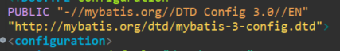
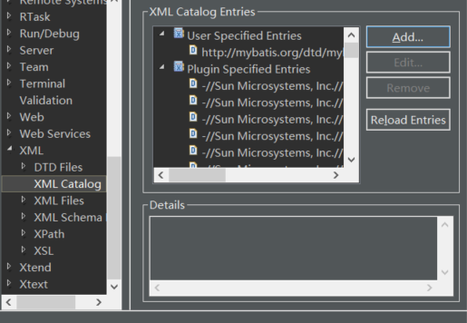
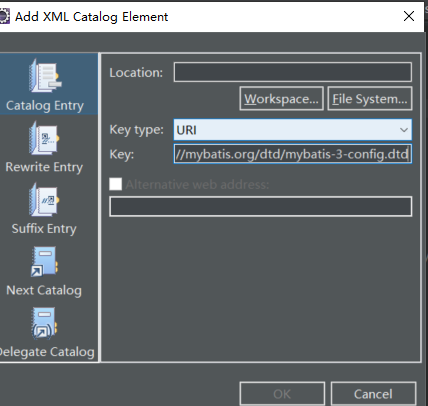
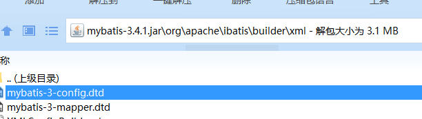
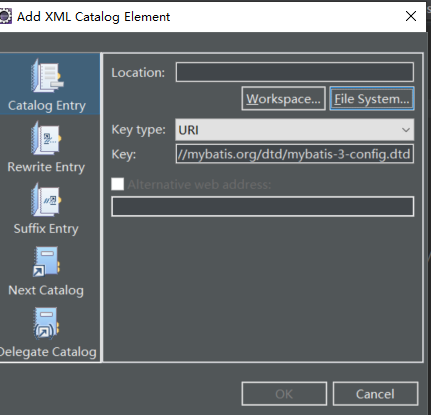
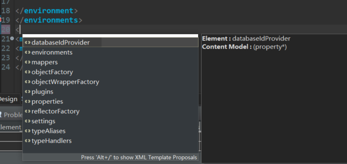

# 1、在mybatis-config.xml文件中复制这个地址“http://mybatis.org/dtd/mybatis-3-config.dtd”：

# 2、打开这个文件点击添加

# 3、keytype选择url；key中填入刚才复制的地址；

# 4、定位dtd文件的位置，路径如图所示，（用压缩软件打开jar包），然后复制这个文件到某个路径下；

# 5、选中文件系统或者工作空间，找到复制的dtd文件；然后OK；

# 6、关闭mybatis-config.xml文件，再从新打开，如图出现提示，配置完成；

