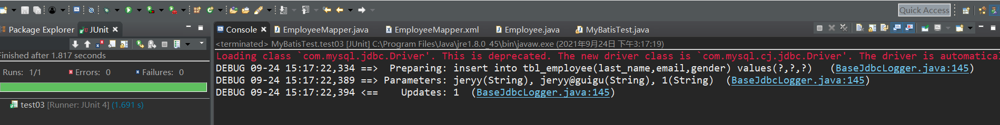

1、在相应的接口上，注册增删查改的方法：

```javascript
package com.atguigu.mybatis.dao;

import com.atguigu.mybatis.bean.Employee;


public interface EmployeeMapper {
	public Employee getEmpById(Integer id);    	//查询
	public void addEmp(Employee employee); 		//增加   	
 	public void updateEmp(Employee employee);	//修改
	public void deleteEmpById(Integer id);		//删除
  /*如果需要对数据库内容进行修改，比如增加和更新，需要借助一个与数据库字段相对应的
   * JavaBean进行映射（变量名称要和数据库字段名称相一致），上面使用的就是Employee类
   */
}

```

# 2、将接口注册到xxxMapper.xml配置文件中

```javascript
<mapper namespace="com.atguigu.mybatis.dao.EmployeeMapper">
<!-- 
namespace:名字空间；指定为接口的全类名；时

 -->
<select id="getEmpById" resultType="com.atguigu.mybatis.bean.Employee">
select id,last_name lastname,gender,email from tbl_employee where id = #{id}
</select>
//<select>主要用于查询操作，id指定的是接口内对应的方法；
<insert id="addEmp">
	insert into tbl_employee(last_name,email,gender) values(#{lastname},#{email},#{gender})
</insert>

<insert id="updateEmp">
	update tbl_employee set last_name=#{lastname},email=#{email},gender=#{gender}
	where id=#{id}
</insert>
<insert id="deleteEmpById">
 delete from tbl_employee where id=#{id}
</insert>
//<insert>用于除了查询以外的其他操作，id指定接口的方法；
</mapper>
```

3、编辑测试类文件

```javascript
import static org.junit.Assert.*;

import java.io.IOException;
import java.io.InputStream;

import org.apache.ibatis.io.Resources;
import org.apache.ibatis.session.SqlSession;
import org.apache.ibatis.session.SqlSessionFactory;
import org.apache.ibatis.session.SqlSessionFactoryBuilder;
import org.junit.Test;

import com.atguigu.mybatis.bean.Employee;
import com.atguigu.mybatis.dao.EmployeeMapper;
/*
	 * 测试增删改
	 * 1、mybatis允许增删改定义以下类型的返回值
	 * 		Integer,Long,Boolean,void
	 * 2、我们需要手动提交数据
	 * 		sqlSessionFactory.openSession();==>手动提交
	 * 		sqlSessionFactory.openSession(true);===>自动提交
	 */
	
 
public class MyBatisTest {

	public SqlSessionFactory  getSqlSessionFactory() throws IOException{
		String resource="mybatis-confing1.xml";
		InputStream inputStream = Resources.getResourceAsStream(resource);
		return new SqlSessionFactoryBuilder().build(inputStream);
	}
 
	
@Test
	public void test01() throws IOException { 
		//1、获取sqlSessionFactory对象
		SqlSessionFactory sqlSessionFactory=getSqlSessionFactory();
		//2、获取sqlSession 对象
		SqlSession openSession=sqlSessionFactory.openSession();
		try {
		//3、获取接口的实现类对象
		EmployeeMapper mapper=openSession.getMapper(EmployeeMapper.class);
		Employee employee =mapper.getEmpById(1);
		System.out.println(mapper.getClass()); 
		System.out.println(employee);
		}finally { 
			openSession.close(); 
		}
	}
	
	@Test
	public void test03() throws IOException {
		SqlSessionFactory sqlSessionFactory=getSqlSessionFactory();
		//1、获取到的SqlSession不会自动提交数据
		SqlSession openSession=sqlSessionFactory.openSession();
		try {
			EmployeeMapper mapper=  openSession.getMapper(EmployeeMapper.class);
			/*
			 * 测试添加
			Employee employee=new Employee(null,"jeryy","jeryy@guigu","1");
			mapper.addEmp(employee);
			*/
			/*
			 * 测试更新
			Employee employee=new Employee(1,"jeryy","jeryy@guigu","0");
			mapper.updateEmp(employee); 
			*/
			/*
			 * 测试删除
			 */
			mapper.deleteEmpById(2);
			openSession.commit();  //手动提交数据
		}finally {  
			openSession.close();
		} 
		
	}

}
```

运行测试：执行成功



