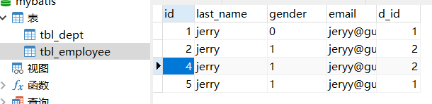
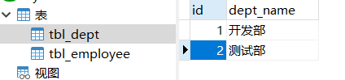
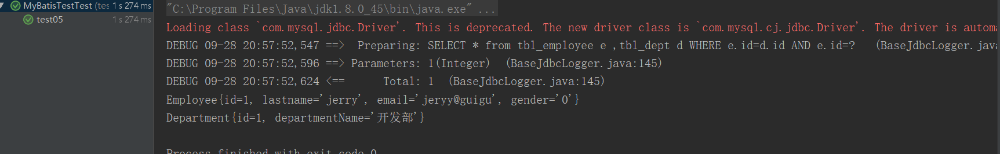
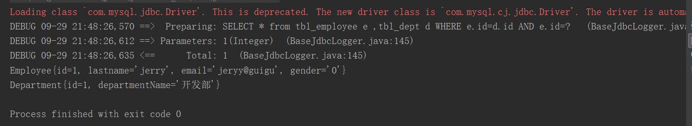
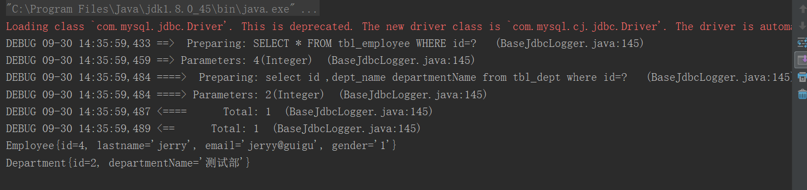
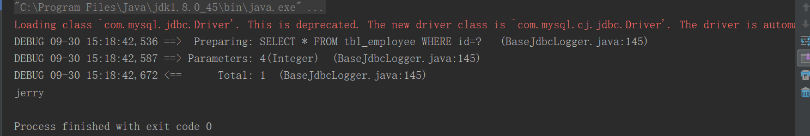
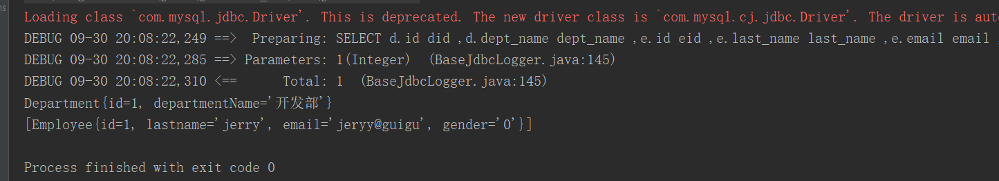
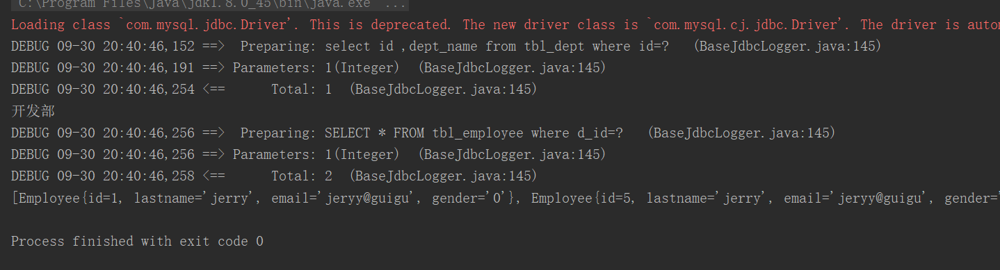
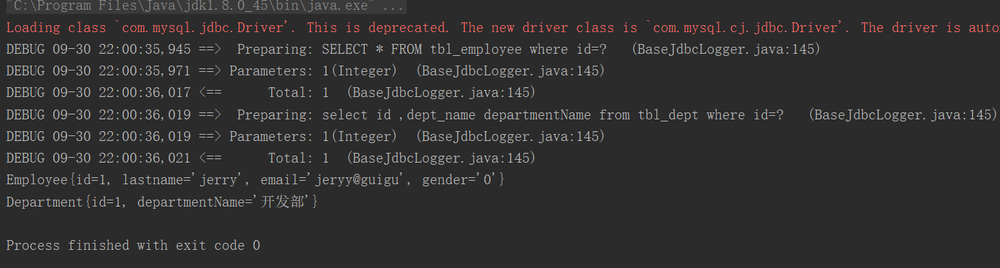
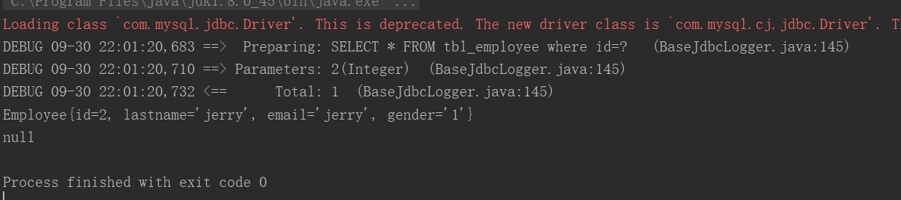

1、resultMap自定义结果集映射规则

在xxxMapper.xml中添加resultMap

Test.java测试类运行

2、联合查询，级联属性封装结果集

1）定义两个MYSQL数据库，并且这两个数据库相互关联

数据库1

数据库2

2）给两个数据库建立相应的javabean

3）xxxMapper.xml添加<resultMap>标签

3）Test.java运行测试

4）结果

3、association指定联合的javaBean对象（关联查询）

1）xxxMapper.xml

2）Test运行测试类

3）运行结果

4、使用association进行分步查询（关联查询）

1）xxxMapper.xml

2）DepartmentMapper.xml

3）Test测试运行

5、分步查询-延迟加载（基于association进行分步查询）

1）mybatis-config.xml

2）Test运行测试

6、resultMap_collection定义关联集合封装规则(关联查询）

1）javaBean.java

2) interface Depertment.java(接口）

3）DepartmenMapper.xml

4）Test运行测试

7、resultMap_collection分步查询

1)javaBean结构

2）DepartmentMapper(接口）主

3） EmployeeMapperPlus （接口）从

4） EmployeeMapperPlus .xml

5）DepartmentMapper.xml

6)test运行测试

# 1、resultMap自定义结果集映射规则


## 在xxxMapper.xml中添加resultMap

```javascript
<mapper namespace="Mapper.EmployeeMapperPlus">
    <!--
        自定义某个javaBean的封装规则
        type:自定义规则的Java类型
        id: 唯一id方便引用
    -->
    <!--resultMap自定义结果集映射规则-->

    <resultMap id="MySimplyEmp" type="mybatis.bean.Employee">
        <!--指定主键的封装规则
            id:定义主键会底层有优化；
            column:指定那一列
            property:指定对应的Javabean属性
        -->
        <id column="ID" property="id"/>
        <!--定义普通列封装规则-->
        <result column="LastName" property="last_name"/>
        <!--其他不指定的列会自动封装：我们推荐只要写resultMap就把全部的映射规则都写上。-->
        <result column="Email" property="email"/>
        <result column="Gender" property="gender"/>
    </resultMap>

<select id="getEmpById" resultMap="MySimplyEmp">
    select * from tbl_employee where  id=#{id}
</select>

/*
*因为返回结果已经指定了返回的Javabean，并且其Javabean的属性和数据库字段名称相一致，
*	所以<result column="">中的column的值对Javabean映射的数据库没有影响；
*/
```

## Test.java测试类运行

```javascript
@Test
public  void test05()throws IOException{
    SqlSessionFactory sqlSessionFactory=getSqlSessionFactory();
    SqlSession openSession=sqlSessionFactory.openSession();
    try{
        EmployeeMapperPlus mapper=openSession.getMapper(EmployeeMapperPlus.class);
        Employee employee=mapper.getEmpById(1);
        System.out.println(employee);
    }finally {
        openSession.close();
    }
}
```


---

# 2、联合查询，级联属性封装结果集


## 1）定义两个MYSQL数据库，并且这两个数据库相互关联


### 数据库1





### 数据库2

```javascript
/*
*定义第二个数据库，并设置关联第一个数据库
*/
CREATE TABLE tbl_dept(
	id INT(11) PRIMARY KEY ,
	dept_name VARCHAR(255)
)
	
	ALTER TABLE tbl_employee ADD COLUMN d_id int(11);
	
	ALTER TABLE tbl_employee ADD CONSTRAINT fk_emp_dept
	FOREIGN KEY(d_id) REFERENCES tbl_dept(id);
	
	SELECT * from tbl_employee e ,tbl_dept d WHERE e.id=d.id AND e.id=1
	SELECT * from tbl_dept
```





## 2）给两个数据库建立相应的javabean

一个是主Javabean：Employee.java

```javascript
/*
*主Javabean用于与数据库映射，所以它的属性名称必须和数据库字段名一样；
*	其中从Javabean的对象属性名随意；
*/
public class Employee {
   private Integer id;
   private String last_name;
   private String email;
   private String gender;
   private Department dept;    //这一行不是需要映射的内容，它是从Javabean的对象
   .....
   }
```

一个是从Javabean

```javascript
/*
*从javabean的属性名称可以随意
*/
public class Department {
    private Integer id;
    private String departmentName;
    。。。
    }
```

## 3）xxxMapper.xml添加<resultMap>标签

```javascript
<resultMap id="MyDifEmp" type="mybatis.bean.Employee">
    <id column="id" property="id"/>
    <result column="lastName" property="last_name"/>
    <result column="gender" property="gender"/>
     <!--
     -以下是用于关联从Javabean的属性，
            所以属性值property="从Javabean对象.属性"；
     -colum="" 指定的是数据库中的字段列名
    	因此reultMap中有两个属性，分别指定数据库字段的列名和Javabean的属性名，这样的话，
     	javaBean就可以不必一定要和数据库的字段名称相同了
       -->
    <result column="d_id" property="dept.id"/>  
    <result column="dept_name" property="dept.departmentName"/>
</resultMap>

<select id="getEmpAndDept" resultMap="MyDifEmp">
    SELECT * from tbl_employee e ,tbl_dept d WHERE e.id=d.id AND e.id=#{id}
</select>
```

## 3）Test.java运行测试

```javascript
public  void test05()throws IOException{
    SqlSessionFactory sqlSessionFactory=getSqlSessionFactory();
    SqlSession openSession=sqlSessionFactory.openSession();
    try{
        EmployeeMapperPlus mapper=openSession.getMapper(EmployeeMapperPlus.class);
        Employee employee=mapper.getEmpAndDept(1);
        System.out.println(employee);
        System.out.println(employee.getDept());
    }finally {
        openSession.close();
    }
}
```

## 4）结果





---

# 3、association指定联合的javaBean对象（关联查询）


## 1）xxxMapper.xml

```javascript
<!--type:指定需要映射的类-->
<resultMap id="MyDifEmp2" type="mybatis.bean.Employee">
    <id column="id" property="id"/>
    <result column="last_name" property="last_name"/>
    <result column="gender" property="gender"/>
    <result column="email" property="email"/>
    <!--association可以指定联合的javaBead对象
        property="dept"：指定哪个属性是联合的对象
        javaType:指定这个属性对象的封装规则
    -->
    <!--
    	通过<association>标签额外指定要映射的类；
    -->
    <association property="dept" javaType="mybatis.bean.Department">  
   	 <!-- javaType:指定属性的类型-->
        <id column="d_id" property="id"/>
        <result column="dept_name" property="departmentName"/>
    </association>
    <!--通过Sql语句查询到结果之后自动映射-->
</resultMap>

<select id="getEmpAndDept" resultMap="MyDifEmp2">
    SELECT * from tbl_employee e ,tbl_dept d WHERE e.id=d.id AND e.id=#{id}
</select>
```

## 2）Test运行测试类

```javascript
public  void test05()throws IOException{
    SqlSessionFactory sqlSessionFactory=getSqlSessionFactory();
    SqlSession openSession=sqlSessionFactory.openSession();
    try{
        EmployeeMapperPlus mapper=openSession.getMapper(EmployeeMapperPlus.class);
        Employee employee=mapper.getEmpAndDept(1);
        System.out.println(employee);
        System.out.println(employee.getDept());
    }finally {
        openSession.close();
    }
}
```

## 3）运行结果




---

# 4、使用association进行分步查询（关联查询）


## 1）xxxMapper.xml

```javascript
<resultMap id="MyEmpByStep" type="mybatis.bean.Employee">
    <id column="id" property="id"/>
    <result column="last_name" property="last_name"/>
    <result column="email" property="email"/>
    <result column="gender" property="gender"/>
    <!--定义association定义关联对象的封装规则
        select:表明当前属性是调用select指定的方法查询的结果
        column:指定哪一列的值传给这个方法当做参数；

        流程：使用select指定的方法（传入column指定的这列参数值）查出对象，
                并封装给property指定的属性
    -->
    <association property="dept" 
    select="Mapper.DepartmentMapper.getDeptById" column="d_id">
    </association>
    <!--tbl_employee中的d_id会传给getDeptById()这个方法
    	使用这个方法必须保证，DepartmentMapper也有自己独立的
     	DepartmentMapper.xml文件，里面必须写有相应的sql语句
    -->
</resultMap>

<select id="getEmpByIdStep" resultMap="MyEmpByStep">
    SELECT * FROM tbl_employee WHERE id=#{id}
</select>
```

## 2）DepartmentMapper.xml

```javascript
<?xml version="1.0" encoding="UTF-8"?>

<!DOCTYPE mapper
        PUBLIC "-//mybatis.org//DTD Mapper 3.0//EN"
        "http://mybatis.org/dtd/mybatis-3-mapper.dtd">
<mapper namespace="Mapper.DepartmentMapper">
    <select id="getDeptById" resultType="mybatis.bean.Department">
        select id ,dept_name departmentName from tbl_dept where id=#{id}
    </select>
</mapper>
```

## 3）Test测试运行

```javascript
@Test
public  void test05()throws IOException{
    SqlSessionFactory sqlSessionFactory=getSqlSessionFactory();
    SqlSession openSession=sqlSessionFactory.openSession();
    try{
        EmployeeMapperPlus mapper=openSession.getMapper(EmployeeMapperPlus.class);
        Employee employee=mapper.getEmpByIdStep(4);
        System.out.println(employee);
        System.out.println(employee.getDept());
    }finally {
        openSession.close();
    }
}
```





---

# 5、分步查询-延迟加载（基于association进行分步查询）

```javascript
<!--可以使用延迟加载；
    Employee==>Dept
        我们每次查询Employee对象的时候，都将一起查询出来。
        但是我们想，等部门信息在我们使用的时候再去查询，
        分步查询的基础上加上两个配置即可
-->
```

## 1）mybatis-config.xml

```javascript
<settings>
    <!--显示的指定每个我们需要更改的配置的值，即是是默认的。防止版本更新带来的问题-->
    <setting name="lazyLoadingEnabled" value="true"/>  //开启懒加载
    <setting name="aggressiveLazyLoading" value="false"/>
</settings>
```

## 2）Test运行测试

```javascript
@Test
public  void test05()throws IOException{
    SqlSessionFactory sqlSessionFactory=getSqlSessionFactory();
    SqlSession openSession=sqlSessionFactory.openSession();
    try{
        EmployeeMapperPlus mapper=openSession.getMapper(EmployeeMapperPlus.class);
        System.out.println(department);
        System.out.println(department);*/
        Employee employee=mapper.getEmpByIdStep(4);
        System.out.println(employee.getLastname());  
        //只要求查员工的名字，而没有设计部门的信息
    }finally {
        openSession.close();
    }
}
```




如上，系统只发了一条请求


---

# 6、resultMap_collection定义关联集合封装规则(关联查询）


## 1）javaBean.java

```javascript
public class Department {
    private Integer id;
    private String departmentName;
    private List<Employee> emps;     //属性是一个Employee对象的集合
    }
    
  public class Employee {
   private Integer id;
   private String last_name;
   private String email;
   private String gender;
   private Department dept;
   }  
```

## 2) interface Depertment.java(接口）

```javascript
public interface DepartmentMapper {
    Department getDeptByIdPlus(Integer id);
}
```


## 3）DepartmenMapper.xml

```javascript
<resultMap id="MyDept" type="mybatis.bean.Department">
    <id column="did" property="id"/>
    <result column="dept_name" property="departmentName"/>
    
    <!--collection定义关联集合类型的属性的封装规则-->
    <collection property="emps" ofType="mybatis.bean.Employee">
        <!--ofType定义集合中元素的封装规则-->
        <id column="eid" property="id"/>
        <result column="last_name" property="last_name"/>
        <result column="email" property="email"/>
        <result column="gender" property="gender"/>
    </collection>
</resultMap>

<!-- Department getDeptByIdPlus(Integer id);-->
<select id="getDeptByIdPlus" resultMap="MyDept">
  SELECT d.id  did ,d.dept_name dept_name ,e.id eid ,e.last_name last_name ,e.email email ,e.gender gender
   FROM tbl_dept d LEFT JOIN tbl_employee e on d.id=e.id WHERE d.id=#{id}
</select>
```

## 4）Test运行测试

```javascript
@Test
public  void test06()throws IOException{
    SqlSessionFactory sqlSessionFactory=getSqlSessionFactory();
    SqlSession openSession=sqlSessionFactory.openSession();
    try{
        DepartmentMapper mapper=openSession.getMapper(DepartmentMapper.class);
        Department department=mapper.getDeptByIdPlus(1);
        System.out.println(department);
        System.out.println(department.getEmps());
    }finally {
        openSession.close();
    }
}
```





---

# 7、resultMap_collection分步查询


## 1)javaBean结构

```javascript
public class Department {
    private Integer id;
    private String departmentName;
    private List<Employee> emps;
}

public class Employee {
   private Integer id;
   private String last_name;
   private String email;
   private String gender;
   private Department dept;
}
```

## 2）DepartmentMapper(接口）主

```javascript
public interface DepartmentMapper {
    Department getDptByIdStep(Integer id);
}
```

## 3） EmployeeMapperPlus （接口）从

```javascript
public interface EmployeeMapperPlus {
      Employee getEmpByIdStep(Integer id);
}

```

## 4） EmployeeMapperPlus .xml

```javascript
<select id="getEmpsByDeptId" resultType="mybatis.bean.Employee">
    SELECT * FROM tbl_employee where d_id=#{deptId}
</select>
```

## 5）DepartmentMapper.xml

```javascript

<resultMap id="MyDeptStep" type="mybatis.bean.Department">
    <id column="id" property="id"/>
    <result column="dept_name" property="departmentName"/>
    <collection property="emps"
                select="Mapper.EmployeeMapperPlus.getEmpsByDeptId"
                column="id"/>
</resultMap>

<!-- Department getDptByIdStep(Integer id);-->
<select id="getDptByIdStep" resultMap="MyDeptStep">
    select id ,dept_name  from tbl_dept where id=#{id}
</select>

```

## 6)test运行测试

```javascript
@Test
public  void test06()throws IOException{
    SqlSessionFactory sqlSessionFactory=getSqlSessionFactory();
    SqlSession openSession=sqlSessionFactory.openSession();
    try{
        DepartmentMapper mapper=openSession.getMapper(DepartmentMapper.class);
        Department department=mapper.getDptByIdStep(1);
        System.out.println(department.getDepartmentName());
        System.out.println(department.getEmps());
    }finally {
        openSession.close();
    }
}
```





# 扩展：分步查询，参数传递多个值

```javascript
<!--
    扩展：多列的值传递过去
    将多列的值封装map传递：
    column="{key1=column1,key2=column2}"
    fetchType="lazy":表示延迟加载
           -lazy:延迟
           -eager:立即
-->
```


---

# 8、resultMap_discriminator鉴别器


## 1）EmployeeMapperPlus.xml

```javascript
 <!--
    <discriminator javaType="">
        <case value=""></case>
    </discriminator>
    鉴别器：mybatis可以使用<discriminator>判断某列的值，
    然后根据某列的值改变封装行为

    封装Employee:
         如果查出来的是女生：就把部门信息查询出来，否则不查询；
         如果是男生，把last_name这一列的值赋给email；
-->
 <resultMap id="MyEmpDis" type="mybatis.bean.Employee">
     <id column="id" property="id"/>
     <result column="last_name" property="last_name"/>
     <result column="email" property="email"/>
     <result column="gender" property="gender"/>
     <!--column:指定判断的列名
         javaType:列值对应的java类型
     -->
     <discriminator javaType="String" column="gender">
         <!--女生resultType:指定封装的结果类型-->
         <case value="0" resultType="mybatis.bean.Employee">
             <association property="dept" select="Mapper.DepartmentMapper.getDeptById"
             column="d_id">

             </association>
         </case>

         <case value="1" resultType="mybatis.bean.Employee">
             <id column="id" property="id"/>
             <result column="last_name" property="last_name"/>
             <result column="last_name" property="email"/>
             <result column="gender" property="gender"/>
         </case>
     </discriminator>
 </resultMap>
 <select id="getEmpByIdStep" resultMap="MyEmpDis">
    SELECT * FROM tbl_employee where id=#{Id}
 </select>
```

2)运行测试


女生：

```javascript
@Test
public  void test06()throws IOException{
    SqlSessionFactory sqlSessionFactory=getSqlSessionFactory();
    SqlSession openSession=sqlSessionFactory.openSession();
    try{
        EmployeeMapperPlus mapper=openSession.getMapper(EmployeeMapperPlus.class);
        Employee employee=mapper.getEmpByIdStep(1);
        System.out.println(employee);
         System.out.println(employee.getDept());
    }finally {
        openSession.close();
    }
}
```





男生：

```javascript
Employee employee=mapper.getEmpByIdStep(2);
```





