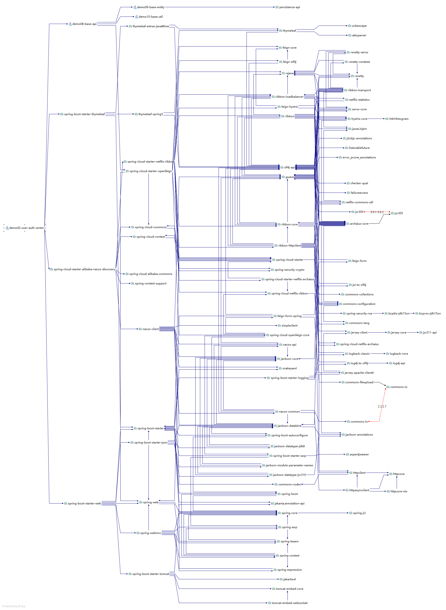

## 1、Maven 作为依赖管理工具

随着我们使用越来越多的框架，或者框架封装程度越来越高，项目中使用的jar包也越来越多。项目中，一个模块里面用到上百个jar包是非常正常的。

比如下面的例子，我们只用到 SpringBoot、SpringCloud 框架中的三个功能：

- Nacos 服务注册发现

- Web 框架环境

- 图模板技术 Thymeleaf

最终却导入了 106 个 jar 包：

> org.springframework.security:spring-security-rsa:jar:1.0.9.RELEASE:compilecom.netflix.ribbon: ribbon:jar:2.3.0:compileorg.springframework.boot:spring-boot-starter-thymeleaf:jar:2.3.6.RELEASE:compilecommons-configuration:commons-configuration:jar:1.8:compileorg.apache.logging.log4j:log4j-api:jar:2.13.3:compileorg.springframework:spring-beans:jar:5.2.11.RELEASE:compileorg.springframework.cloud:spring-cloud-starter-netflix-ribbon:jar:2.2.6.RELEASE:compileorg.apache.tomcat.embed:tomcat-embed-websocket:jar:9.0.39:compilecom.alibaba.cloud:spring-cloud-alibaba-commons:jar:2.2.6.RELEASE:compileorg.bouncycastle:bcprov-jdk15on:jar:1.64:compileorg.springframework.security:spring-security-crypto:jar:5.3.5.RELEASE:compileorg.apache.httpcomponents:httpasyncclient:jar:4.1.4:compilecom.google.j2objc:j2objc-annotations:jar:1.3:compilecom.fasterxml.jackson.core:jackson-databind:jar:2.11.3:compileio.reactivex:rxjava:jar:1.3.8:compilech.qos.logback:logback-classic:jar:1.2.3:compileorg.springframework:spring-web:jar:5.2.11.RELEASE:compileio.reactivex:rxnetty-servo:jar:0.4.9:runtimeorg.springframework:spring-core:jar:5.2.11.RELEASE:compileio.github.openfeign.form:feign-form-spring:jar:3.8.0:compileio.github.openfeign.form:feign-form:jar:3.8.0:compilecom.netflix.ribbon:ribbon-loadbalancer:jar:2.3.0:compileorg.apache.httpcomponents:httpcore:jar:4.4.13:compileorg.thymeleaf.extras:thymeleaf-extras-java8time:jar:3.0.4.RELEASE:compileorg.slf4j:jul-to-slf4j:jar:1.7.30:compilecom.atguigu.demo:demo09-base-entity:jar:1.0-SNAPSHOT:compileorg.yaml:snakeyaml:jar:1.26:compileorg.springframework.boot:spring-boot-starter-logging:jar:2.3.6.RELEASE:compileio.reactivex:rxnetty-contexts:jar:0.4.9:runtimeorg.apache.httpcomponents:httpclient:jar:4.5.13:compileio.github.openfeign:feign-core:jar:10.10.1:compileorg.springframework.boot:spring-boot-starter-aop:jar:2.3.6.RELEASE:compileorg.hdrhistogram:HdrHistogram:jar:2.1.9:compileorg.springframework:spring-context:jar:5.2.11.RELEASE:compilecommons-lang:commons-lang:jar:2.6:compileio.prometheus:simpleclient:jar:0.5.0:compilech.qos.logback:logback-core:jar:1.2.3:compileorg.springframework:spring-webmvc:jar:5.2.11.RELEASE:compilecom.sun.jersey:jersey-core:jar:1.19.1:runtimejavax.ws.rs:jsr311-api:jar:1.1.1:runtimejavax.inject:javax.inject:jar:1:runtimeorg.springframework.cloud:spring-cloud-openfeign-core:jar:2.2.6.RELEASE:compilecom.netflix.ribbon:ribbon-core:jar:2.3.0:compilecom.netflix.hystrix:hystrix-core:jar:1.5.18:compilecom.netflix.ribbon:ribbon-transport:jar:2.3.0:runtimeorg.springframework.boot:spring-boot-starter-json:jar:2.3.6.RELEASE:compileorg.springframework.cloud:spring-cloud-starter-openfeign:jar:2.2.6.RELEASE:compilecom.fasterxml.jackson.module:jackson-module-parameter-names:jar:2.11.3:compilecom.sun.jersey.contribs:jersey-apache-client4:jar:1.19.1:runtimeio.github.openfeign:feign-hystrix:jar:10.10.1:compileio.github.openfeign:feign-slf4j:jar:10.10.1:compilecom.alibaba.nacos:nacos-client:jar:1.4.2:compileorg.apache.httpcomponents:httpcore-nio:jar:4.4.13:compilecom.sun.jersey:jersey-client:jar:1.19.1:runtimeorg.springframework.cloud:spring-cloud-context:jar:2.2.6.RELEASE:compileorg.glassfish:jakarta.el:jar:3.0.3:compileorg.apache.logging.log4j:log4j-to-slf4j:jar:2.13.3:compilecom.fasterxml.jackson.datatype:jackson-datatype-jsr310:jar:2.11.3:compileorg.springframework.cloud:spring-cloud-commons:jar:2.2.6.RELEASE:compileorg.aspectj:aspectjweaver:jar:1.9.6:compilecom.alibaba.cloud:spring-cloud-starter-alibaba-nacos-discovery:jar:2.2.6.RELEASE:compilecom.google.guava:listenablefuture:jar:9999.0-empty-to-avoid-conflict-with-guava:compilecom.alibaba.spring:spring-context-support:jar:1.0.10:compilejakarta.annotation:jakarta.annotation-api:jar:1.3.5:compileorg.bouncycastle:bcpkix-jdk15on:jar:1.64:compilecom.netflix.netflix-commons:netflix-commons-util:jar:0.3.0:runtimecom.fasterxml.jackson.core:jackson-annotations:jar:2.11.3:compilecom.google.guava:guava:jar:29.0-jre:compilecom.google.guava:failureaccess:jar:1.0.1:compileorg.springframework.boot:spring-boot:jar:2.3.6.RELEASE:compilecom.fasterxml.jackson.datatype:jackson-datatype-jdk8:jar:2.11.3:compilecom.atguigu.demo:demo08-base-api:jar:1.0-SNAPSHOT:compileorg.springframework.cloud:spring-cloud-starter-netflix-archaius:jar:2.2.6.RELEASE:compileorg.springframework.boot:spring-boot-autoconfigure:jar:2.3.6.RELEASE:compileorg.slf4j:slf4j-api:jar:1.7.30:compilecommons-io:commons-io:jar:2.7:compileorg.springframework.cloud:spring-cloud-starter:jar:2.2.6.RELEASE:compileorg.apache.tomcat.embed:tomcat-embed-core:jar:9.0.39:compileio.reactivex:rxnetty:jar:0.4.9:runtimecom.fasterxml.jackson.core:jackson-core:jar:2.11.3:compilecom.google.code.findbugs:jsr305:jar:3.0.2:compilecom.netflix.archaius:archaius-core:jar:0.7.6:compileorg.springframework.boot:spring-boot-starter-web:jar:2.3.6.RELEASE:compilecommons-codec:commons-codec:jar:1.14:compilecom.netflix.servo:servo-core:jar:0.12.21:runtimecom.google.errorprone:error_prone_annotations:jar:2.3.4:compileorg.attoparser:attoparser:jar:2.0.5.RELEASE:compilecom.atguigu.demo:demo10-base-util:jar:1.0-SNAPSHOT:compileorg.checkerframework:checker-qual:jar:2.11.1:compileorg.thymeleaf:thymeleaf-spring5:jar:3.0.11.RELEASE:compilecommons-fileupload:commons-fileupload:jar:1.4:compilecom.netflix.ribbon:ribbon-httpclient:jar:2.3.0:compilecom.netflix.netflix-commons:netflix-statistics:jar:0.1.1:runtimeorg.unbescape:unbescape:jar:1.1.6.RELEASE:compileorg.springframework:spring-jcl:jar:5.2.11.RELEASE:compilecom.alibaba.nacos:nacos-common:jar:1.4.2:compilecommons-collections:commons-collections:jar:3.2.2:runtimejavax.persistence:persistence-api:jar:1.0:compilecom.alibaba.nacos:nacos-api:jar:1.4.2:compileorg.thymeleaf:thymeleaf:jar:3.0.11.RELEASE:compileorg.springframework:spring-aop:jar:5.2.11.RELEASE:compileorg.springframework.boot:spring-boot-starter:jar:2.3.6.RELEASE:compileorg.springframework.boot:spring-boot-starter-tomcat:jar:2.3.6.RELEASE:compileorg.springframework.cloud:spring-cloud-netflix-ribbon:jar:2.2.6.RELEASE:compileorg.springframework:spring-expression:jar:5.2.11.RELEASE:compileorg.springframework.cloud:spring-cloud-netflix-archaius:jar:2.2.6.RELEASE:compile


而如果使用 Maven 来引入这些 jar 包只需要配置三个『

```xml
    <!-- Nacos 服务注册发现启动器 -->
    <dependency>
        <groupId>com.alibaba.cloud</groupId>
        <artifactId>spring-cloud-starter-alibaba-nacos-discovery</artifactId>
    </dependency>
    <!-- web启动器依赖 -->
    <dependency>
        <groupId>org.springframework.boot</groupId>
        <artifactId>spring-boot-starter-web</artifactId>
    </dependency>
    <!-- 视图模板技术 thymeleaf -->
    <dependency>
        <groupId>org.springframework.boot</groupId>
        <artifactId>spring-boot-starter-thymeleaf</artifactId>
    </dependency>
```

- 这个jar包所属技术的官网。官网通常是英文界面，网站的结构又不尽相同，甚至找到下载链接还发现需要通过特殊的工具下载。

- 第三方网站提供下载。问题是不规范，在使用过程中会出现各种问题。

- jar包的名称

- jar包的版本

- jar包内的具体细节

- 而使用 Maven 后，依赖对应的 jar 包能够

**自动下载**

框架中使用的 jar 包，不仅数量庞大，而且彼此之间存在错综复杂的依赖关系。依赖关系的复杂程度，已经上升到了完全不能靠人力手动解决的程度。另外，jar 包之间有可能产生冲突。进一步增加了我们在 jar 包使用过程中的难度。

下面是前面例子中 jar 包之间的依赖关系：



而实际上 jar 包之间的依赖关系是普遍存在的，如果要由程序员手动梳理无疑会增加极高的学习成本，而这些工作又对实现业务功能毫无帮助。

而使用 Maven 则几乎不需要管理这些关系，极个别的地方调整一下即可，极大的减轻了我们的工作量。

你可以不使用 Maven，但是构建必须要做。当我们使用 IDEA 进行开发时，构建是 IDEA 替我们做的。


- 管理规模庞大的 jar 包，需要**专门****工具。**

- 脱离 IDE 环境执行构建操作，需要**专门****工具。**

## 4、Maven 的工作机制

