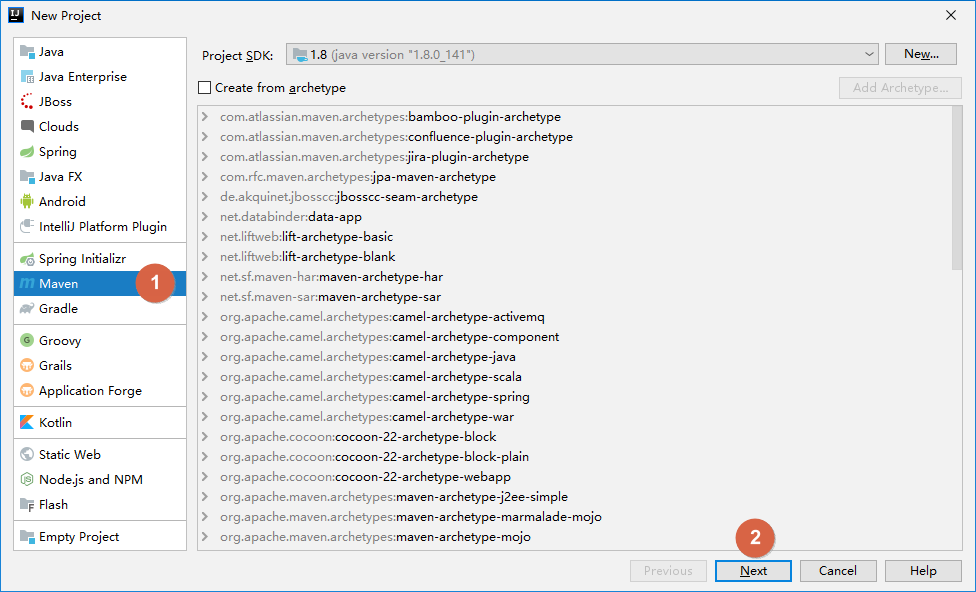
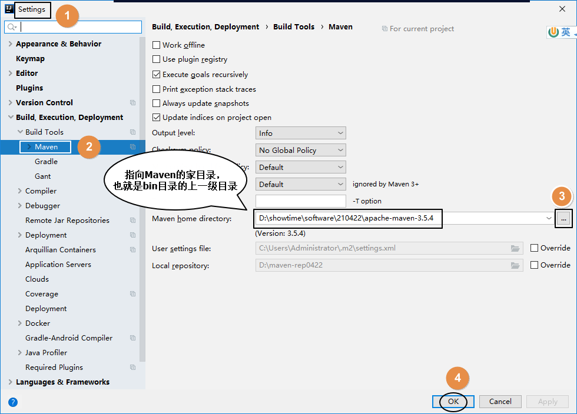
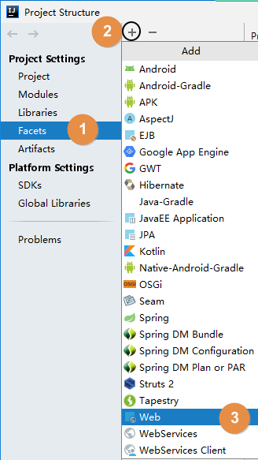
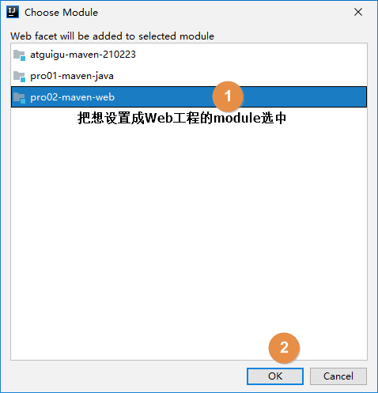
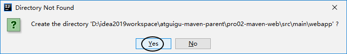
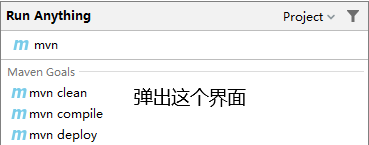
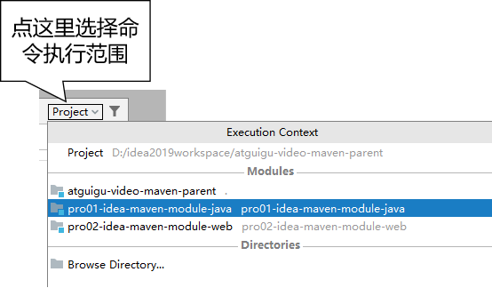
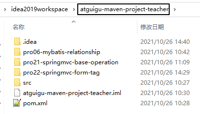
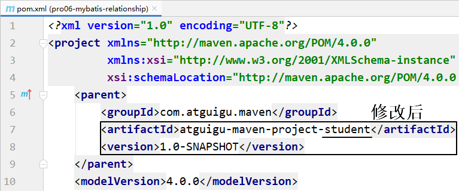

# 第一节 创建父工程





创建 Project 后，IDEA 会自动弹出下面提示，我们选择


这个自动导入

另外也可以通过 IDEA 的 Settings 设置来开启：


# 第二节 配置Maven信息

每次创建 Project 后都需要设置 Maven 家目录位置，否则 IDEA 将使用内置的 Maven 核心程序（不稳定）并使用默认的本地仓库位置。这样一来，我们在命令行操作过程中已下载好的 jar 包就白下载了，默认的本地仓库通常在 C 盘，还影响系统运行。

配置之后，IDEA 会根据我们在这里指定的 Maven 家目录自动识别到我们在 settings.xml 配置文件中指定的本地仓库。



# 第三节 创建Java模块工程


# 第四节 创建Web模块工程

按照前面的同样操作创建模块，

Web 模块将来打包当然应该是 

```
<packaging>war</packaging>
```

1

首先打开项目结构菜单：


然后到 Facets 下查看 IDEA 是否已经帮我们自动生成了 Web 设定。正常来说只要我们确实设置了打包方式为 war，那么 IDEA 2019 版就会自动生成 Web 设定。


另外，对于 IDEA 2018 诸版本没有自动生成 Web 设定，那么请参照下面两图，我们自己创建：






结合 Maven 的目录结构，Web 资源的根目录需要设置为 src/main/webapp 目录。




# 第五节 其他操作







如果有需要，还可以给命令后面附加参数：


```
 -D 表示后面要附加命令的参数，字母 D 和后面的参数是紧挨着的，中间没有任何其它字符
 maven.test.skip=true 表示在执行命令的过程中跳过测试
mvn clean install -Dmaven.test.skip=true
```

1

2

3


Maven工程除了自己创建的，还有很多情况是别人创建的。而为了参与开发或者是参考学习，我们都需要导入到 IDEA 中。下面我们分几种不同情况来说明：

目前我们通常使用的都是 Git（本地库） + 码云（远程库）的版本控制系统，结合 IDEA 的相关操作方式请点[**这里** (opens new window)](http://heavy_code_industry.gitee.io/code_heavy_industry/pro008-Git/lecture/chapter05/verse03.html)查看

直接使用 IDEA 打开工程目录即可。下面咱们举个例子：

假设别人发给我们一个 Maven 工程的 zip 压缩包：maven-rest-demo.zip。从码云或GitHub上也可以以 ZIP 压缩格式对项目代码打包下载。

如果你的所有 IDEA 工程有一个专门的目录来存放，而不是散落各处，那么首先我们就把 ZIP 包解压到这个指定目录中。


只要我们确认在解压目录下可以直接看到 pom.xml，那就能证明这个解压目录就是我们的工程目录。那么接下来让 IDEA 打开这个目录就可以了。


打开一个新的 Maven 工程，和新创建一个 Maven 工程是一样的，此时 IDEA 的 settings 配置中关于 Maven 仍然是默认值：


所以我们还是需要像新建 Maven 工程那样，指定一下 Maven 核心程序位置：


在实际开发中，通常会忽略模块（也就是module）所在的项目（也就是project）仅仅导入某一个模块本身。这么做很可能是类似这样的情况：比如基于 Maven 学习 SSM 的时候，做练习需要导入老师发给我们的代码参考。





这个工程（project）是我们事先在 IDEA 中创建好的。


刚刚导入的 module 的父工程坐标还是以前的，需要改成我们自己的 project。





其它操作和上面演示的都一样，只是多一步：删除多余的、不正确的 web.xml 设置。如下图所示：

