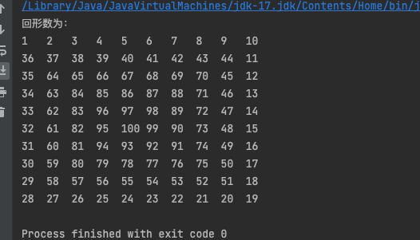

# 1、创建回形数

```java
public class main {
    public static String right = "right";
    public static String left = "left";
    public static String up = "up";
    public static String down = "down";
    public static String end = "end";
    public static void main(String[] args) {
        int max_num = 10;
        int current_num = 1;
        int[][] content = new int[max_num][max_num];
        content[0][0] = current_num;
        String current_direction = getDirection(content, 0, 0, "right");
        int[] current_position = new int[]{0, 0};
        //递归的方式实现
        createMatrix(content, current_position, current_direction, current_num);
        //while 循环的方式实现
//        while (!current_direction.equals(end)) {
//            current_position = getPositions(current_position[0], current_position[1], current_direction);
//            int row = current_position[0];
//            int col = current_position[1];
//            content[row][col] = ++current_num;
//            current_direction = getDirection(content, row, col, current_direction);
//        }
        System.out.println("回形数为：");
        for (int i = 0; i < content.length; i++) {
            for (int j = 0; j < content[i].length; j++) {
                System.out.print(content[i][j] + "\t");
            }
            System.out.println();
        }
    }
    public static String getDirection(int[][] arrary, int row, int col, String direction) {
        //return {0,0} 表示结束
        int row_length = arrary.length;
        int col_length = arrary[0].length;
        switch (direction) {
            case "right":
                if (col + 1 < col_length && arrary[row][col + 1] == 0) {
                    return right;
                } else if (row + 1 < row_length && arrary[row + 1][col] == 0) {
                    return down;
                }
            case "down":
                if (row + 1 < row_length && arrary[row + 1][col] == 0) {
                    return down;
                } else if (col - 1 > 0 && arrary[row][col - 1] == 0) {
                    return left;
                }
            case "left":
                if (col - 1 >= 0 && arrary[row][col - 1] == 0) {
                    return left;
                } else if (row - 1 >= 0 && arrary[row - 1][col] == 0) {
                    return up;
                }
            case "up":
                if (row - 1 >= 0 && arrary[row - 1][col] == 0) {
                    return up;
                } else if (col + 1 < col_length && arrary[row][col + 1] == 0) {
                    return right;
                }
        }
        return end;
    }
    public static int[] getPositions(int row, int col, String direction) {
        switch (direction) {
            case "right":
                return new int[]{row, col + 1};
            case "down":
                return new int[]{row + 1, col};
            case "left":
                return new int[]{row, col - 1};
            case "up":
                return new int[]{row - 1, col};
        }
        throw new RuntimeException("direction error");
    }
    /*\
      while (!current_direction.equals(end)) {
            current_position = getPositions(current_position[0], current_position[1], current_direction);
            int row = current_position[0];
            int col = current_position[1];
            content[row][col] = ++current_num;
            current_direction = getDirection(content, row, col, current_direction);
        }
    */
    public static void createMatrix(int[][] arrary, int[] current_position, String direction, int current_num) {
        if (direction.equals(end)) return;
        current_position = getPositions(current_position[0], current_position[1], direction);
        int row = current_position[0];
        int col = current_position[1];
        arrary[row][col] = ++current_num;
        direction = getDirection(arrary, row, col, direction);
        createMatrix(arrary, current_position, direction, current_num);
    }
}
```

