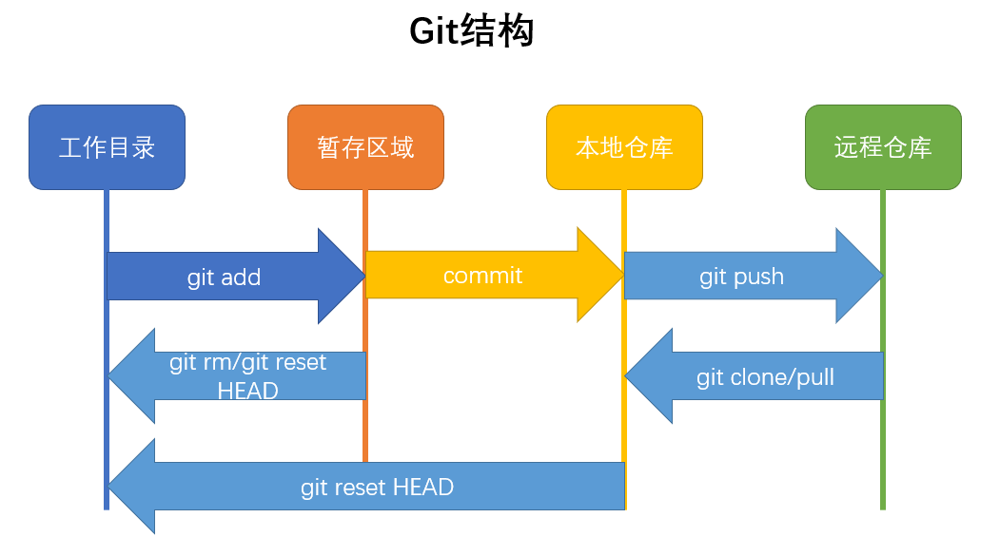

# 1、常见版本控制器

## 1)集中式版本控制器

- CSV/SVN

- 速度慢，必须联⽹

- 只有⼀个中央数据仓库，如果中央数据仓库挂了或者⽆法访问，所有的使⽤者⽆法使⽤SVN，⽆法 进⾏提交或备份操作

## 2)分布式版本控制器

- Git

- ⽆中央服务器，每个⼈的电脑都是⼀个完整的版本库

- 安全性能更⾼

- 通常有⼀台充当“中央服务器”的电脑，仅仅作为⽅便“交换”⼤家的修改

# 2、安装使用

- yum 安装

```
[root@server1 ~]# yum install git -y 
```

- 配置本地用户信息

```
[root@server1 my_git]# git config --global user.name "zj"
[root@server1 my_git]# git config --global user.email "zj@qq.com"
[root@server1 my_git]# git config --global color.ui true
[root@server1 my_git]# git config --list
user.name=zj
user.email=zj@qq.com
color.ui=true
```

- 创建并初始化版本库

```
[root@server1 my_git]# pwd
/my_git
[root@server1 my_git]# git init
初始化空的 Git 版本库于 /my_git/.git/
[root@server1 my_git]# ls -a
. .. .git
[root@server1 my_git]# ls .git/
branches config description HEAD hooks info objects refs
[root@server1 my_git]#
```

# 3、概念介绍



- 工作区

- 当前所在目录就是工作区

- 暂存区

- .git不算⼯作区，只是git的版本库 版本库中只有暂存区和⾃动创建的master分⽀及指向master的⼀个指针HEAD

- git跟踪的是每次修改⽽不是⽂件，如果不将修改添加到暂存区是⽆法进⾏提交的

## 1）git隐藏⽬录中⽂件介绍

```
branches # 分支目录
config # 定义项目特有的配置选项
description # 仅供git web程序使用
HEAD # 指示当前的分支
hooks # 包含git钩子文件
info # 包含一个全局排除文件
objects # 本地仓库，存放所有的数据内容，有info和pack两个文件夹
refs # 存放指向数据（分支）的提交对象的指针
index # 保存暂存信息，在执行git init的时候，这个文件还没有
```

- 远程仓库

- 最常见的远程仓库就是github