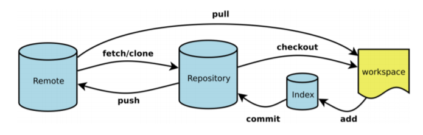

**常规使用**

⼀般来说，⽇常使⽤只需要记住下图6个命令。但是熟练使⽤，恐怕要记住60-100个命令。



## 1）把文件加到仓库中

```
[root@server1 my_git]# echo "hello world" > README.txt
[root@server1 my_git]# git add README.txt
[root@server1 my_git]# git commit -m "write a README.txt file"
[master（根提交） 854d889] write a README.txt file
1 file changed, 1 insertion(+)
create mode 100644 README.txt
[root@server1 my_git]#
```

## 2）修改文件内容，查询状态并提交

```
[root@server1 my_git]# echo "hello eagleslab" >> README.txt
[root@server1 my_git]# git status
# 位于分支 master
# 尚未暂存以备提交的变更：
#  （使用 "git add <file>..." 更新要提交的内容）
#  （使用 "git checkout -- <file>..." 丢弃工作区的改动）
#
# 修改：   README.txt
#
修改尚未加入提交（使用 "git add" 和/或 "git commit -a"）
[root@server1 my_git]# git add README.txt
[root@server1 my_git]# git status
# 位于分支 master
# 要提交的变更：
#  （使用 "git reset HEAD <file>..." 撤出暂存区）
#
# 修改：   README.txt
#
[root@server1 my_git]# git commit -m "append hello eagleslab to README.txt"
[master 176a262] append hello eagleslab to README.txt
1 file changed, 1 insertion(+)
[root@server1 my_git]# git status
# 位于分支 master
无文件要提交，干净的工作区
```

## 3）查询文件内容的变动情况

```
[root@server1 my_git]# echo "hello linux" >> README.txt
[root@server1 my_git]# git diff README.txt
diff --git a/README.txt b/README.txt
index c97f01c..b09e4cc 100644
--- a/README.txt
+++ b/README.txt
@@ -1,2 +1,3 @@
hello world
hello eagleslab
+hello linux
[root@server1 my_git]# git commit -a -m "append hello linux to README.txt"
[master ca3e26c] append hello linux to README.txt
1 file changed, 1 insertion(+)
[root@server1 my_git]# git status
# 位于分支 master
无文件要提交，干净的工作区
```

## 4）查询历史记录并退回

```
[root@server1 my_git]# git log
commit ca3e26c8f13e11f487c569b3b099d27b7661d067
Author: zj <zj@qq.com>
Date:  Tue Apr 20 20:36:01 2021 +0800
 append hello linux to README.txt
commit 176a26251d17eee0ad37cefd35eeb945539cacb3
Author: zj <zj@qq.com>
Date:  Tue Apr 20 20:33:05 2021 +0800
 append hello eagleslab to README.txt
commit 854d889c17ce2aa90101a2f6d40a7be511e6b4b5
Author: zj <zj@qq.com>
Date:  Tue Apr 20 20:29:49 2021 +0800
  write a README.txt file
[root@server1 my_git]# git log --oneline
ca3e26c append hello linux to README.txt
176a262 append hello eagleslab to README.txt
854d889 write a README.txt file
[root@server1 my_git]# git reset --hard 176a262
HEAD 现在位于 176a262 append hello eagleslab to README.txt
[root@server1 my_git]# cat README.txt
hello world
hello eagleslab
```

## 5）查看所有历史记录

```
[root@server1 my_git]# git log
commit 176a26251d17eee0ad37cefd35eeb945539cacb3
Author: zj <zj@qq.com>
Date:  Tue Apr 20 20:33:05 2021 +0800
 append hello eagleslab to README.txt
commit 854d889c17ce2aa90101a2f6d40a7be511e6b4b5
Author: zj <zj@qq.com>
Date:  Tue Apr 20 20:29:49 2021 +0800
  write a README.txt file
[root@server1 my_git]# git reflog
176a262 HEAD@{0}: reset: moving to 176a262
ca3e26c HEAD@{1}: commit: append hello linux to README.txt
176a262 HEAD@{2}: commit: append hello eagleslab to README.txt
854d889 HEAD@{3}: commit (initial): write a README.txt file
```

## 6）修改文件名称

```
方式一
[root@server1 my_git]# mv README.txt readme.txt
[root@server1 my_git]# git add readme.txt
[root@server1 my_git]# git commit -m "rename README.txt to readme.txt"
[master bc08fbb] rename README.txt to readme.txt
1 file changed, 2 insertions(+)
create mode 100644 readme.txt
[root@server1 my_git]# git status
# 位于分支 master
无文件要提交，干净的工作区
方式二
[root@server1 my_git]# git mv readme.txt README.txt
[root@server1 my_git]# git commit -a -m "rename readme.txt to README.txt"
[master 6599d6c] rename readme.txt to README.txt
1 file changed, 0 insertions(+), 0 deletions(-)
rename readme.txt => README.txt (100%)
[root@server1 my_git]# git status
# 位于分支 master
无文件要提交，干净的工作区
[root@server1 my_git]# ls
README.txt
[root@server1 my_git]#
```

## 7)删除文件

```
[root@server1 my_git]# git rm README.txt
rm 'README.txt'
[root@server1 my_git]# git commit -m "delete README.txt"
[master 84b4a87] delete README.txt
1 file changed, 2 deletions(-)
delete mode 100644 README.txt
[root@server1 my_git]# git status
# 位于分支 master
无文件要提交，干净的工作区
[root@server1 my_git]# ls
```

## 8)停止跟踪文件

```
[root@server1 my_git]# git log --oneline
84b4a87 delete README.txt
6599d6c rename readme.txt to README.txt
bc08fbb rename README.txt to readme.txt
8df8928 rename README.txt to readme.txt
176a262 append hello eagleslab to README.txt
854d889 write a README.txt file
[root@server1 my_git]# git reset --hard 6599d6c
HEAD 现在位于 6599d6c rename readme.txt to README.txt
[root@server1 my_git]# ls
README.txt
[root@server1 my_git]# git rm README.txt --cached
rm 'README.txt'
[root@server1 my_git]# ls
README.txt
[root@server1 my_git]# git commit -m "delete README.txt cached"
[master 4e3d233] delete README.txt cached
1 file changed, 2 deletions(-)
delete mode 100644 README.txt
[root@server1 my_git]# ls
README.txt
[root@server1 my_git]#
```