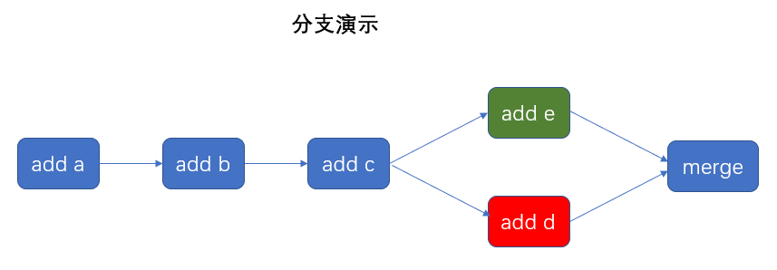

**分支**

分支就是平行空间，假设你在某个手机系统研发拍照功能，代码已经完成了80%，但 如果将这不

完整的代码直接提交到git仓库中，又有可能影响到其他人的工作，此时我们便可以在该软件的项

目之上创建一个名叫拍照的分支，这种分支只会属于你自己，而其他人看不到，等代码编写完成后

再与原来的项目主分支合并即可，这样既能保证代码不丢失，又不影响其他人工作。

一般在实际的项目开发中，尽量保持master分支是非常稳定的，仅用于发布新版本，平时不要随

便直接修改里面的数据文件，而工作的时候则可以新建不同的工作分支，等到工作完成后再合并到

master分支上面，所以团队的合作分支看起来会像很多树枝一样。



```
# 列出所有本地分⽀
$ git branch
# 列出所有远程分⽀
$ git branch -r
# 列出所有本地分⽀和远程分⽀
$ git branch -a
# 新建⼀个分⽀，但依然停留在当前分⽀
$ git branch [branch-name]
# 新建⼀个分⽀，并切换到该分⽀
$ git checkout -b [branch]
# 新建⼀个分⽀，指向指定commit
$ git branch [branch] [commit]
# 新建⼀个分⽀，与指定的远程分⽀建⽴追踪关系
$ git branch --track [branch] [remote-branch]
# 切换到指定分⽀，并更新⼯作区
$ git checkout [branch-name]
# 切换到上⼀个分⽀
$ git checkout -
# 建⽴追踪关系，在现有分⽀与指定的远程分⽀之间
$ git branch --set-upstream [branch] [remote-branch]
# 合并指定分⽀到当前分⽀
$ git merge [branch]
# 选择⼀个commit，合并进当前分⽀
$ git cherry-pick [commit]
# 删除分⽀
$ git branch -d [branch-name]
# 删除远程分⽀
$ git push origin --delete [branch-name]
$ git branch -dr [remote/branch]
# 检出版本v2.0
$ git checkout v2.0
# 从远程分⽀develop创建新本地分⽀devel并检出
$ git checkout -b devel origin/develop
# 检出head版本的README⽂件（可⽤于修改错误回退）
git checkout -- README
```