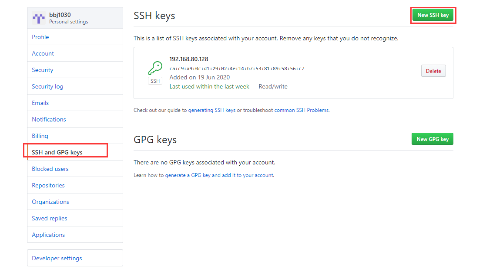
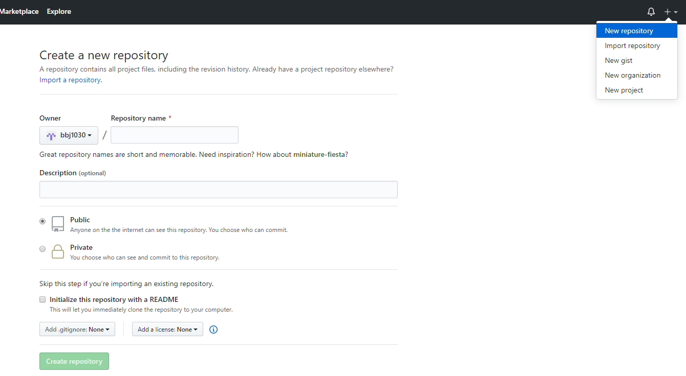

**Github使用**

GitHub故名思义是一个git版本库的托管服务，是目前全球最大的软件仓库，拥有成千上百万的开发者用

户，也是软件开发和寻找资源的最佳途径，GitHub不仅可以托管各种git版本库，还拥有更美观的web界

面，你的代码可以被任何人克隆，使得开发者为开源贡献代码变得更加容易，当然也可以付费购买私有

库，这样高性价比的私有库真的是帮助到了很多企业。

1. 注册用户

1. 配置ssh-key



1. 



1. 添加远程仓库

```
git remote add origin git@github.com:bbj1030/testing.git
```

1. 推送新代码到GitHub

```
git push -u origin master
```

1. 克隆项目到本地

```
git clone git@github.com:bbj1030/testing.git
```