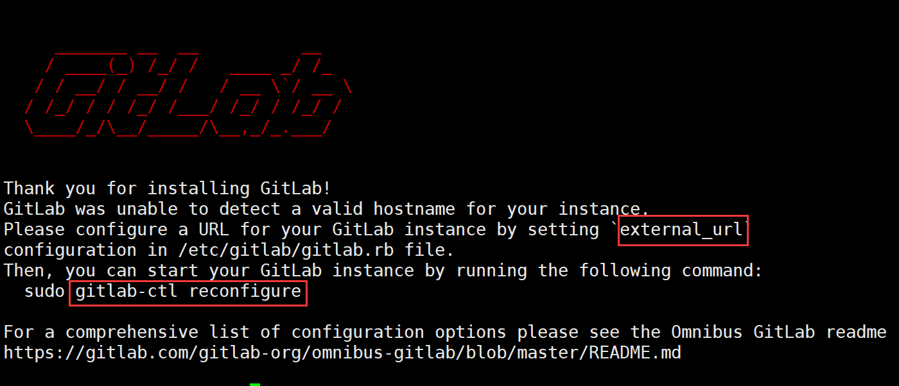

**Gitlab使用**

参考网址：[https://my.oschina.net/u/4325773/blog/3339131](https://my.oschina.net/u/4325773/blog/3339131)

- 安装依赖关系

```
# 安装依赖
sudo yum install -y curl policycoreutils-python openssh-server postfix
# 启动SSH和postfix
sudo systemctl enable sshd
sudo systemctl start sshd
sudo systemctl enable postfix
sudo systemctl start postfix
```

- yum安装

```
curl https://packages.gitlab.com/install/repositories/gitlab/gitlab-
ce/script.rpm.sh | sudo bash
sudo yum install -y gitlab-ce
```

- 修改配置文件并启动gitlab



- 日常管理命令

```
gitlab-ctl start
gitlab-ctl stop
gitlab-ctl status
gitlab-ctl restart
gitlab-ctl reconfigure
```

- 简单使用

- root登录gitlab

- 创建test组

- 创建test项目

- 添加ssh密钥

- 添加新用户

- 将新用户添加到组里

- 新用户登录就可以拥有项目代码