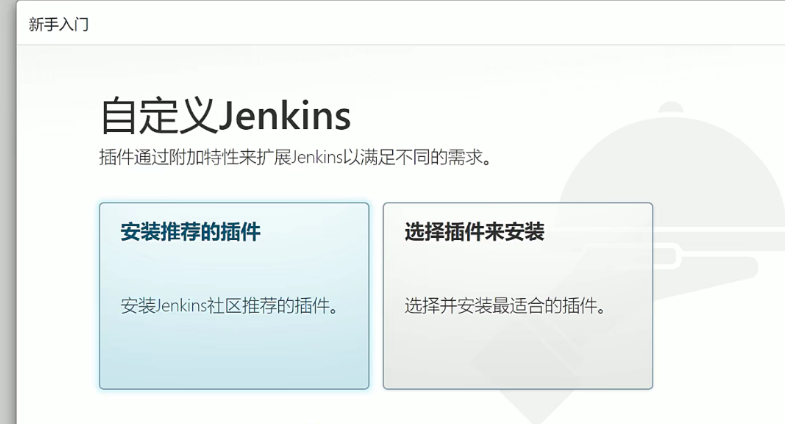
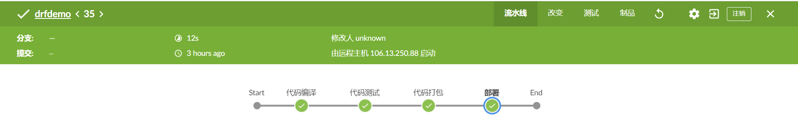

**自动化的构建和软件发布流程的工具：Jenkins**

# 1、简介

Jenkins 是一款Java语言编写的自动化构建和软件发布流程的工具。

- 所以使用Jenkins需要配置Java环境

- 但是我们一般使用docker容器启动，这样更为方便

- Jenkins 官方推荐的镜像：

- docker 镜像 

- 这是docker 官方使用的Jenkins镜像，它没有安装blueocean插件的，得自己装。

- Jenkins运行时，会将所有的数据文件都存放在：

- /var/jenkins_home/ 目录下，我们也称此目录为Jenkins的家目录。

- 运行容器时，一般需要将此目录挂载到宿主机中，以便于之后的操作：

- **-v jenkins-data : /var/jenkins_home**

- **所以如果我们要保存或者备份Jenkins中的所有数据，那么直接将这个目录打包即可：**

- **备份：**

- tar -cvf jenkins_data.tar /var/lib/docker/volumes/jenkins-data/_data/

- 恢复备份：

- tar -xvf jenkins_data.tar /var/lib/docker/volumes/jenkins-data/_data/


官方地址：[https://www.jenkins.io/zh/](https://www.jenkins.io/zh/)

# 2、Jenkins 安装（docker 安装）

参考文档：[https://www.jenkins.io/zh/doc/book/installing/](https://www.jenkins.io/zh/doc/book/installing/)

- 配置完docker 环境之后，执行以下命令

```
docker run \
 -u root \
 -d \
 -p 8080:8080 \
 -p 50000:50000 \
 -v jenkins-data:/var/jenkins_home \
 -v /etc/localtime:/etc/localtime:ro \
 -v /var/run/docker.sock:/var/run/docker.sock \
 --restart=always \
jenkinsci/blueocean
####
 -v jenkins-data:/var/jenkins_home # 将Jenkins容器的数据目录，挂载到宿主机中，便于操作。
#自己构建镜像 RUN的时候就把时区设置好
 #如果是别人的镜像，docker hub，UTC； 容器运行时 ， 
 -v
 /etc/localtime:/etc/localtime:ro        # 使容器内的时间与宿主机的时间保存一致
 -v /var/run/docker.sock:/var/run/docker.sock #表示Docker守护程序通过其监听的基于Unix的套接字。 该映射允许
    #jenkinsci/blueocean 容器与Docker守护进程通信， 如果 jenkinsci/blueocean 容器需要实例化
    #其他Docker容器，则该守护进程是必需的。 如果运行声明式管道，其语法包含agent部分用 docker；例如， agent { docker { ... } } 此选项是必需的。
    #如果不进行此挂载，那么Jenkins容器内，将无法使用docker 命令
```

- 运行完jenkins容器之后，打开浏览器访问即可。


- 复制管理员密码


- 选择安装推荐的插件



- 等待安装


# 3、Pipeline 创建流水线

> **创建好的流水线任务会被Jenkins保存在/var/jenkins_home/workspace 目录中。**


> 上面的drfdemo就是创建的流水线任务的原始目录，
> 


- 创建新建任务


- 选择流水线


- 配置远程代码仓库

- SCM 选择GIT


- 分支，选择/master ,当然如果是其他分支，就选择其他分支

- 脚本路径选择 "**Jenkinsfile**"	

- 你也可以写其他的名称，但是你的代码库里面必须要和这个名称保持一致。


- 然后点击保存

# 4、触发远程构建

##  4.1 配置Jenkins

- 首先选择需要为哪一个流水线，配置远程触发器


- 选择配置


- 勾选“触发远程构建

> 1、远程触发的原理就是，把将这个Jenkins的访问地址，提交给代码仓库，
>        然后在代码仓库中，配置当代码有新的提交时，就自动访问这个地址。
>      地址示例： 
> 上面的TOKEN_NAME 要换成自定义的身份令牌 ，比如hack
> 所以就是：  


- 以下是配置流水线，如果已经配置好了，就不用再配置了。


## **4.2 创建用户**

- 

- 系统管理，选择用户管理，然后创建用户


- 然后退出，用新创建的用户重新登录。

- 然后进入到此用户的配置界面，选择创建token。

- 创建好token之后，立马复制保存。

- 这个token是用于，使用这个用户来访问Jenkins时，然后用于验证权限的令牌。

- token一般是一个较长的字符串，比如：“**110824868aba7be48286dec88685093415**”


## 4.2 配置gitee(GitHub)

- 选择代码库中的，配置，然后选择 "WebHooks"


- 选择添加webHook


- 配置Jenkins 远程构建命令地址

- Jenkins 的远程构建命令地址，原本是：

- 

- 但是如果直接使用这个地址，将没有权限向Jenkins 发送指令。

- 因为没有加上指定的用户以及用户的token，所以需要改写为：

- ** **

- hack:**10824868aba7be48286dec88685093415 # 这个前缀，就是指定的用户的token**

- **所以格式为http://用户:TOKEN@访问地址**

- **注意了上面的token=hack ，后面的hack只是随便定义的，和前面的**


- 然后点击保存，即可。


> **这样每当gitee上的代码库更新之后，就会自动触发流水线了。**


# 5、Jenkinsfile 流水线基础语法

## 5.1 基础格式

```
/写流水线项目（声明式、脚本式）
pipeline{
    //全部的CICD流程都需要在这里定义
    //任何一个代理可用就可以执行
    agent any
    //定义一些环境信息
    environment{
        hello="hello"
        world="world"
        test="测试"
    }
    //定义流水线的加工流程
    stages{
        //流水线的所有阶段
        //1、编译
        stage('代码编译'){
            steps {
                sh "printenv"
                echo "hello django"
                sh "pwd && ls -l"
            }
        }
        //2、测试
        stage("代码测试"){
            steps {
                echo "测试"
            }
        }
        //3、打包
        stage("代码打包"){
           steps {
                echo "打包"
                echo "$version"
                //检查jenkins的Docker命令是否能运行
                sh "echo $version"
            }
        }
        //4、部署
        stage("部署"){
            steps {
                echo "部署"
            }
        }
    }
}
```

> **Jenkinsfile中，每写一个stage() ,Blue Ocean 中的start 到end 中就会出现多少个节点。**




## 5.2 下载Docker Pipeline

在 Jenkinsfile 中使用 docker 代理，需要下载Docker Pipeline 插件，选择 install without restart（安装不重启）

- 查看的安装有三种方式，

- 1、在web 页面选择可用插件，然后选择对应的插件，选择  install without restart（安装不重启）

- 2、使用命令行安装，但是命令需要进入到容器中执行，完成后需要重启Jenkins。

```
docker exec  -it /bin/bash   Jenkins
    > jenkins-plugin-cli --plugins docker-workflow:563.vd5d2e5c4007f
    .....
    Done    #看到此提示证明安装成功，重启Jenkins即可。
```

- 3、手动下载插件，然后在web页面中的插件管理中，选择高级，然后上传本地插件即可。

