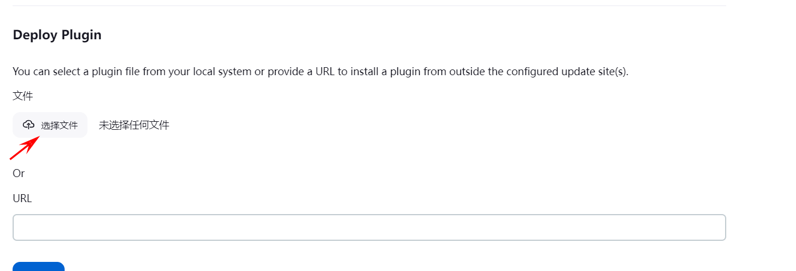
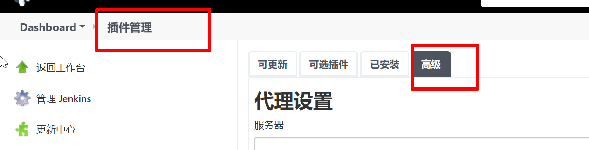
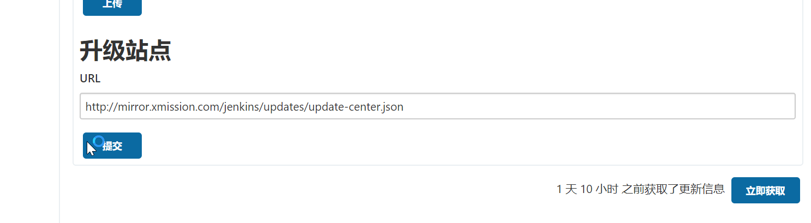

# 1、安装Jenkin插件的几种方式：

- 1、在web 页面选择可用插件，然后选择对应的插件，选择  install without restart（安装不重启）

- 2、使用命令行安装，但是命令需要进入到容器中执行，完成后需要重启Jenkins。

```
docker exec  -it /bin/bash   Jenkins
    > jenkins-plugin-cli --plugins docker-workflow:563.vd5d2e5c4007f
    .....
    Done    #看到此提示证明安装成功，重启Jenkins即可。
```

- 3、手动下载插件，然后在web页面中的插件管理中，选择高级，然后上传本地插件即可。



# 2、修改Jenkins插件源 （也可以不修改）

```
http://mirror.xmission.com/jenkins/updates/update-center.json 
```

jenkins插件中心的插件：





# 3、推荐安装的插件

- Docker Pipeline && Docker

- 安装Docker Pipeline会自动安装docker相关的

- 这个允许我们自定义agent使用docker环境

- Git Parameter

- 解析git参数，允许我们选择分支进行构建

- Active Choices

- 可以做到参数的级联选择	

- Generic Webhook Trigger

- 通用的webhook触发器，构建更强大的webhook功能

- Role-based Authorization Strategy

- RBAC权限指定，给一个用户精确指定权限

- List Git Branches Parameter

- 列出分支参数

- Build With Parameters

- 基于自定义参数构建