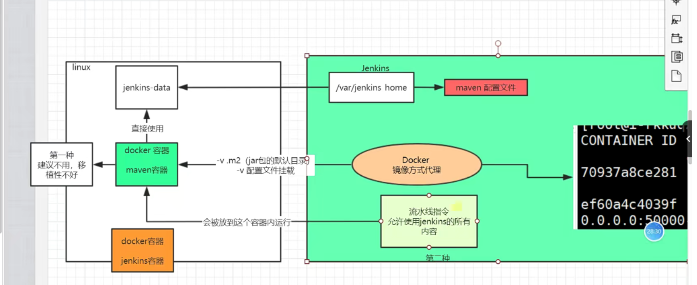
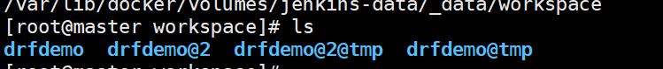

**在dockerfile 中使用docker 代理时的关键点：**

> **在dockerfile 中使用docker 代理时，有两个重要的关键点：**
> **1、使用docker 代理时，Jenkins是直接在宿主机中使用docker run 命令，在宿主机中启动了一个容器，而不是在Jenkins这个容器中，启动的。**
> **2、但是，虽然代理环境（容器），是在宿主机中运行的，不过经过Jenkins的某种处理，这个容器可以直接使用和修改Jenkins容器中/var/Jenkins_home/目录下的文件。**
> **有因为，我们需要处理的流水线文件，就存在于Jenkins容器的/var/Jenkins_home/目录中，所以，我们可以直接使用这个代理环境，去操作我们的项目文件，非常方便。**
> 
> **所以如果我们想修改或者配置代理，有两种方案：**
> **1、将代理环境的配置文件，放在liunx宿主机中，然后在Jenkinsfile中，配置docker 代理时，使用**
> **args " -v /xxx/xxx.config.d/:/xxx/"**** 命令**
> **将外部配置文件挂载到代理环境的容器内。**
> **但是****不推荐使用****这样的方式，因为移植性不好。如果更换了linux宿主机环境，很可能导致Jenkinsfile执行出错。**
> **2、如果可以，将配置文件存放在Jenkins容器中的/var/Jenkins_home/目录下（一定要记得挂载这个目录到宿主机中），然后使用代理环境容器中，自带的命令环境命令，指定配置文件的位置，而这个位置却是在Jenkins容器中的位置，比如：**
> **sh "mvn clean package -s /var/jenkins_home/appconfig/maven/settings.xml" -Dmaven.test.skip=true"**
> **以上这个就是在容器中使用mvn(环境自带的命令)  去指定配置文件， /var/jenkins_home/appconfig/maven/settings.xml  这个文件路径，对应的就是Jenkins中的文件路径。**
> **这样就算linux宿主机环境发生了改变，但只要Jenkins容器不变，那么这个代理环境就可以正常运行，不用再做配置。**
> **推荐使用，移植性较好****。**
> 
> **补充：**
> **如果在代理环境中，需要下载一些额外资源，但是不想每一次自动部署的时候，都重复下载。**
> **那么可以将下载的目标目录，同样挂载到宿主机中，这样再次下载时，由于检测到已经存在，就可以避免重复下载了。**
> 

在Jenkinsfile中，使用docker 代理后，那么这个stage的默认的工作目录，就会切换到临时目录中。这个临时目录中，的文件和原始的工作目录中的文件，是一致的。

当这个stage执行完成之后，下一个stage，就会切换到原始的工作目录中。

如上图中的[drfdemo@2](http://drfdemo@2) 就是临时目录。而drfdemo 就是原始的工作目录。

如何获取原始的工作目录？

- 在Jenkins容器中，内置几个环境变量，其中就包括工作目录，可以通过

- printenv 这个命令获取，在Jenkinsfile中的写法就是sh "printenv"

- 内置的环境变量中WORKSAPCE 代表的就是原始的工作目录，可以通过获取它的值，在进行某些操作。

- 但是如果使用了docker 代理，那么WORKSPACE，的值也会随之发生改变。

- 所以应该在environment 中，就获取它的值，以免后面发生改变：

- environment {

- WC="${WORKSPACE}"			//获取原始工作目录的值

- }

注意：

在steps中执行的每一行命令，它的默认的工作目录都是，当前的stage所指定的工作目录，如果这是一个临时换进，那么每一行执行的目录，也是在临时环境中执行的。所以如果想在临时目录中，执行的命令是在原始工作目录中执行的话，就要先切换目录在执行：

- sh "cd  $WC && commands ......"     //WC是在environment 中就定义好的值，WC=$WORKSPACE,

- 但是这里不能直接写sh "cd $WORKSPACE"因为此时的WORKSPACE已经发生了改变，与原来的值不一样了。