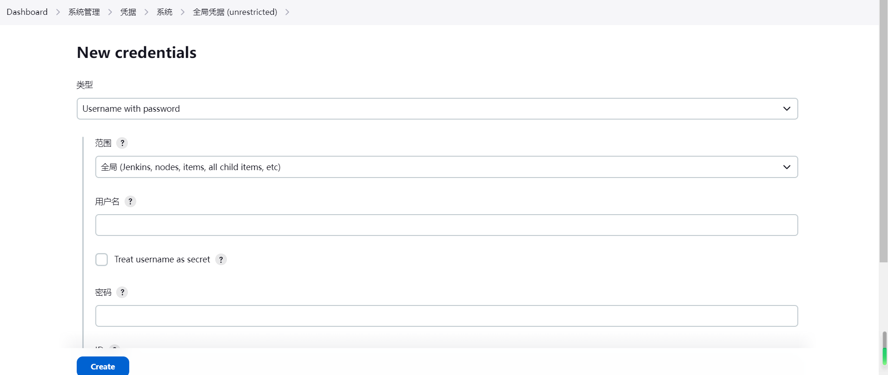
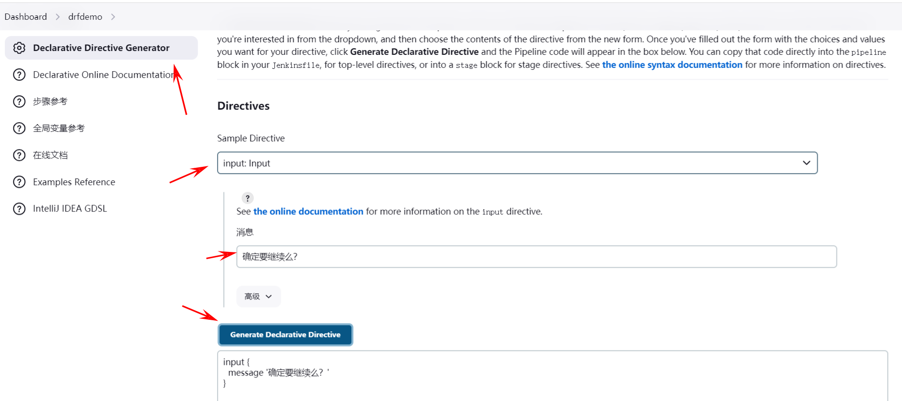
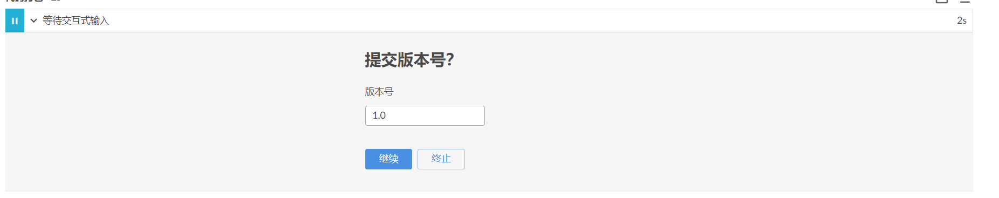
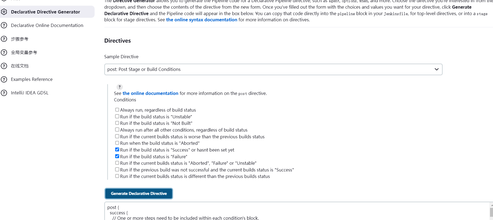

# 配置全局凭据



# input 指令（实现交互）

Jenkinsfile中实现人机交互的一种方式。

- input 有两种写法：

- 写在steps的外面（推荐），这里面定义的参数，是可以被访问到的

- 写在steps的里面（不推荐）

```
stage {
    input {            #声明式写法
      message '提交版本号？'
      parameters {
        string defaultValue: '1.0', description: '版本号', name: 'version'
      }
    }
    
    steps {
        // 片段生成器生成
         input id: 'APP', message: '确定继续么？', ok: '需要', submitter: 'admin', submitterParameter: 'app-version'    
    }
}
```

- 可以通过web页面中的流水线语法，自动生成。



-  效果



选择继续，就会继续执行，选择终止，就会终止CICD流程。

**script 指令**

script 中可以写Groovy 代码，也是一种编程语言，(并且在Jenkins中，Groovy中可以直接嵌入流水线代码)，所以使用script结合input，就可以通过人机交互获取到不同的结果后，自动执行不同的操作。

```
     input {
                 message "需要推送远程镜像吗?"
                 ok "需要"
                 parameters {
                     string(name: 'APP_VER', defaultValue: 'v1.0', description: '生产环境需要部署的版本')
                     choice choices: ['bj-01', 'sh-02', 'wuhan-01'], description: '部署的大区', name: 'DEPLOY_WHERE'
                 }
             }
             steps {
                //false就直接结束
                echo "$APP_VER"
                //脚本方式进行判断，和具体逻辑
                // 远程触发，自动分析是哪个分支，如果是master就部署生产，dev就集成测试等
                // gulimall
                //    mall-order
                //    mall-user
                //    xx 100个微服务
                //  哪一个微服务代码提交了部署哪一个微服务，不用手工干预，只需要一个jenkinsfile
                //Generic Webhook Trigger 远程触发jenkins，jenkins获取当前提交的分支，和所有分支
                // gitee会告诉我们这次 add了哪些，modify了哪些，delete了哪些，
                // add了哪些，modify了哪些，delete了哪些， 自己判断这些修改的文件在哪个模块下
                //对这个模块进行持续集成
                //Generic Webhook Trigger + script脚本 + 其他已讲过的内容 + 其他自己看看官网 = 搞定
                //别人提交一个issue，jenkins触发 自动把issue做成 fix分支，让程序员自己去修改
                //所有东西都是模板
                script {
                   //groovy
                   def  where = "${DEPLOY_WHERE}"
                   if (where == "bj-01"){
                    sh "echo 我帮你部署到 bj-01 区了"
                   }else if(where == "sh-02"){
                   sh "echo 我帮你部署到 sh-02 区了"
                   }else{
                        sh "echo 没人要的，我帮你部署到 wuhan-01 区了"
//                    sh "docker push registry.cn-hangzhou.aliyuncs.com/lfy/java-devops-demo:${APP_VER}"
                        withCredentials([usernamePassword(credentialsId: 'aliyun-docker-repo', passwordVariable: 'ali_pwd', usernameVariable: 'ali_user')]) {
                            // some block
                             sh "docker login -u ${ali_user} -p ${ali_pwd}   registry.cn-hangzhou.aliyuncs.com"
//                              sh "docker tag java-devops-demo registry.cn-hangzhou.aliyuncs.com/lfy/java-devops-demo:${APP_VER}"
                      }
```

# post 指令

post 在执行某个阶段后，再对上一个阶段的执行结果，做出不同的响应,比较常用的就是failure 和success 。

- success 就是指上一个阶段入股成功，就执行此指令。

- failure 就是指上一个阶段如果失败，就执行此指令。

```
post {
  success {
    // One or more steps need to be included within each condition's block.
  }
  failure {
    // One or more steps need to be included within each condition's block.
  }
}
```

-  其他更多用法，可以自己尝试一下

