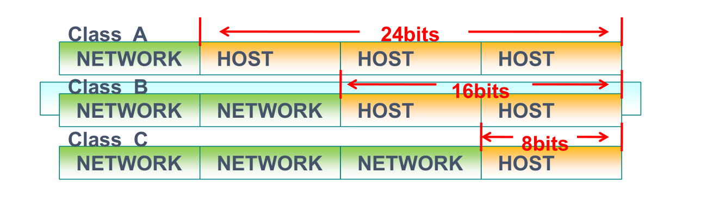
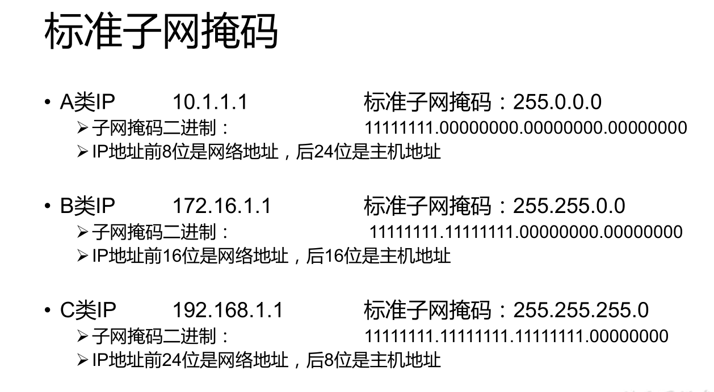
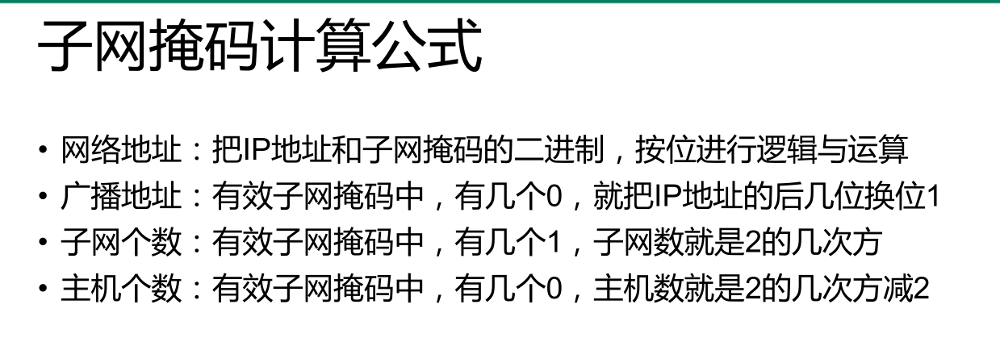
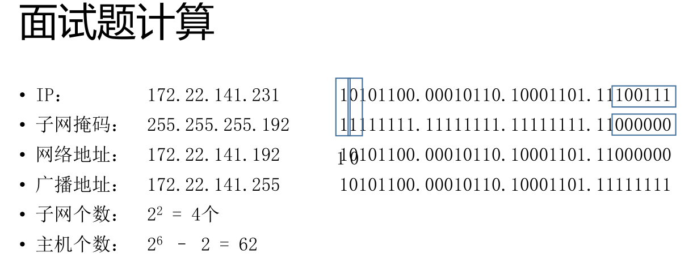
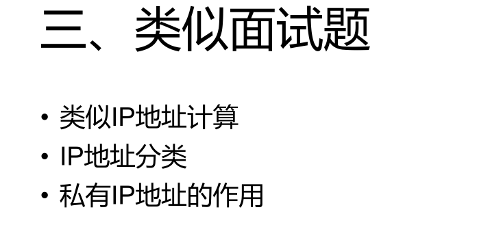
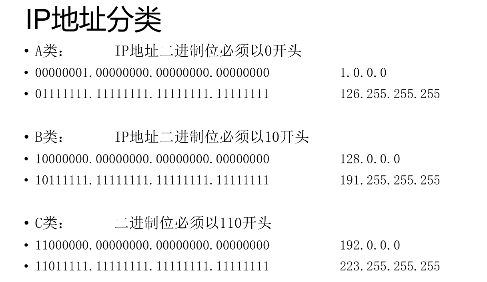
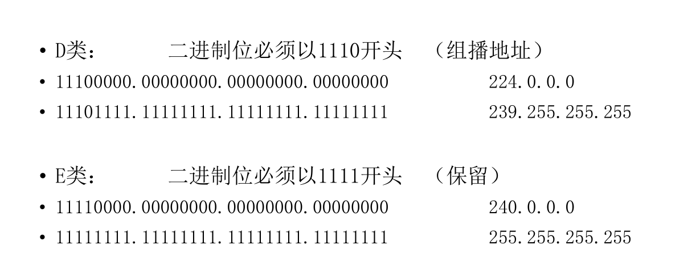
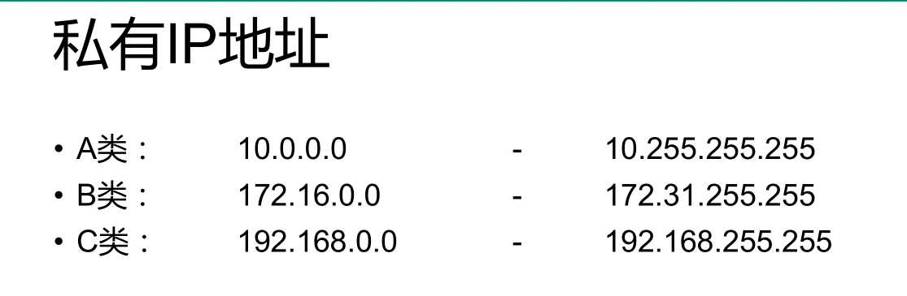

# 1、面试原题

• 172.22.141.231/26，该IP位于哪个网段？该网段拥有多少可用IP地址？广

播地址是什么？

# 2、子网掩码的作用

• 子网掩码必须和IP地址成对出现，否则没有意义

• 子网掩码是用于给IP地址划分网络地址与主机地址的

• 和子网掩码1对应的IP地址，代表网络位；和子网掩码0对应的IP地址，代表主机位

• 子网中只要1是连续的，就是合理子网掩码

# 3、网络地址与主机地址

A、B、C三类IP地址的组成

网络部分（NETWORK）

主机部分（HOST）

# 4、标准子网掩码

