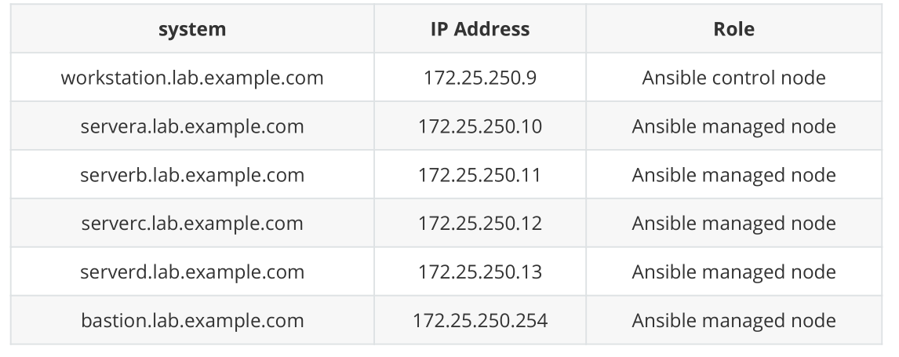

RHCE模拟练习题目，请使用教室环境RH294：

在练习期间，您将操作下列虚拟系统：



这些系统的 IP 地址采用静态设置，主机名称解析已配置为解析上方列出的主机名。 请勿更改这些设置。

- 帐户信息

f0主机的root密码为Asimov，f0上其他用户的密码均为redhat

f0里面所有虚拟系统的 root 密码是 redhat，请勿更改 root 密码。所有系统上已预装了 SSH 密钥，

允许在不输入密码的前提下通过 SSH 进行 root 访问。请勿对系统上的 root SSH 配置文件进行任何修改。

Ansible 控制节点上已创建了用户 student。此帐户预装了 SSH密钥，允许在 Ansible 控制节点和各个

Ansible 受管节点之间进行SSH 登录。请勿对系统上的 student SSH 配置文件进行任何修改。

Ansible 被管理节点上已创建了用户devops。用于控制节点连接使用，考试时ssh免密和sudo提权已

经全部配置好，请勿修改。

- 初始化环境

```
[root@foundation0 ~]# rht-vmctl fullreset classroom
[root@foundation0 ~]# rht-vmctl fullreset all
```

- 开启虚拟机：

```
[root@foundation0 ~]# rht-vmctl start all 
```

说明：考试需要通过图形界面对虚拟机进行开机(start)，关机(poweroff)，重启(reboot)和重置(rebuilt)

操作，重置虚拟机后，虚拟机所有的配置将会清空。

# 一、安装和配置Ansible

按照下方所述，在控制节点workstation.lab.example.com 上安装和配置 Ansible：

1. 安装所需的软件包

1. 创建名为/home/student/ansible/inventory的静态清单文件, 以满足以下需求:

- servera是dev主机组的成员

- serverb是test主机组的成员

- serverc和serverd是prod主机组的成员

- bastion是balancers主机组的成员

- prod组是webservers主机组的成员

1. 创建名为/home/student/ansible/ansible.cfg的配置文件, 以满足以下要求:

- 主机清单文件为/home/student/ansible/inventory

- playbook中使用的角色的位置包括/home/student/ansible/roles

```
# 准备工作，由于教室环境中bastion虚拟机的用户devops未创建，需要创建，并设置sudo提权，和
免密登陆，考试已经做好了。
[kiosk@foundation0 ~]$ ssh root@workstation
[root@workstation ~]# for i in server{a..d} bastion; do ssh root@$i "useradd devops; echo redhat | passwd --stdin devops" ; done
[root@workstation ~]# for i in server{a..d} bastion; do ssh root@$i "echo 'devops ALL=(ALL) NOPASSWD: ALL' > /etc/sudoers.d/devops" ; done
[student@workstation ~]$ ssh devops@bastion  #免密登陆成功
# 实际操作
[root@workstation ~]# yum -y install ansible #若考试已经安装好了，则不需要安装了
[root@workstation ~]# su - student #考试要求所有的配置都用一个普通用户进行配置
[student@workstation ~]$ mkdir ansible
[student@workstation ~]$ cd ansible/
[student@workstation ansible]$ vim inventory
[dev]
servera
[test]
serverb
[prod]
serverc
serverd
[balancers]
bastion
[webservers:children]
prod
[student@workstation ansible]$ cp /etc/ansible/ansible.cfg .
[student@workstation ansible]$ vim ansible.cfg
[defaults]
inventory = /home/student/ansible/inventory
remote_user = devops
roles_path = /home/student/ansible/roles
[privilege_escalation]
become=True
become_method=sudo
become_user=root
become_ask_pass=False
```

# 二、创建和运行Ansible临时命令

请按照下方所述, 创建一个名为/home/student/ansible/adhoc.sh的shell脚本, 该脚本将使用Ansible临

时命令在各个受管节点上安装yum存储库:

存储库1:

- 存储库的名称为 rh294_BASEde

- 描述为 rh294 base software

- 基础URL为 

- GPG签名检查为启用状态

- GPG密钥URL为 

- 存储库为开启状态

存储库2:

- 存储库的名称为 rh294_STREAM

- 描述为 rh294 stream software

- 基础URL为 

- 签名检查为启用状态

- GPG密钥URL为 

- 存储库为开启状态

## 方法一：

```
# 因为虚拟机自带yum源, 需要先删除, 考试时不需要操作
[student@workstation ansible]$ for i in server{a..d} bastion; do ssh root@$i
"rm -rf /etc/yum.repos.d/*"; done
[student@workstation ansible]$ vim adhoc.sh
#!/bin/bash
ansible all -m yum_repository -a \        #等于号后面不能有空格，否则报错
        "name=rh294_BASE 
        description='rh294 basesoftware' 
        file=rhel_dvd
        baseurl=http://content.example.com/rhel8.4/x86_64/dvd/BaseOS 
        gpgcheck=yes
        gpgkey=http://content.example.com/rhel8.4/x86_64/dvd/RPM-GPG-KEY-redhatrelease 
        enabled=yes"

ansible all -m yum_repository -a \
        "name=rh294_STREAM 
        description='rh294 stream software' 
        file=rhel_dvd
        baseurl=http://content.example.com/rhel8.4/x86_64/dvd/AppStream
        gpgcheck=yes 
        gpgkey=http://content.example.com/rhel8.4/x86_64/dvd/RPM-GPGKEY-redhat-release 
        enabled=yes"

[student@workstation ansible]$ chmod a+x adhoc.sh
[student@workstation ansible]$ ./adhoc.sh
```

## 方法二：

```
#!/bin/bash
  
touch /home/student/ansible/reh.repo
path=/home/student/ansible/reh.repo
echo "[rh294_BASE]" >  /home/student/ansible/reh.repo
echo "name=rh294 base software" >> /home/student/ansible/reh.repo
echo "baseurl=http://content.example.com/rhel8.4/x86_64/dvd/BaseOS" >> \
        /home/student/ansible/reh.repo
echo "enabled=1" >> $path
echo "pgpcheck=1" >> /home/student/ansible/reh.repo
echo "gpgkey=http://content.example.com/rhel8.4/x86_64/dvd/RPM-GPG-KEY-redhat-release" >> /home/student/ansible/reh.repo

echo " " >> /home/student/ansible/reh.repo
echo "[rh294_STREAM]" >>  /home/student/ansible/reh.repo
echo "name=rh294 stream software" >> /home/student/ansible/reh.repo
echo "baseurl=http://content.example.com/rhel8.4/x86_64/dvd/AppStream" >> \
        /home/student/ansible/reh.repo
echo "enabled=1" >> $path
echo "pgpcheck=1" >> /home/student/ansible/reh.repo
echo "gpgkey=http://content.example.com/rhel8.4/x86_64/dvd/RPM-GPG-KEY-redhat-release" >> /home/student/ansible/reh.repo

ansible all -m copy -a  "src=/home/student/ansible/reh.repo  dest=/etc/yum.repos.d/ "
```

# 三、安装软件包

创建一个名为 /home/student/ansible/packages.yml的 playbook：

1. 将 php 和 mariadb 软件包安装到 dev、test 和 prod 主机组中的主机上

1. 将 Development Tools 软件包组安装到 dev 主机组中的主机上

1. 将 dev 主机组中主机上的所有软件包更新为最新版本

```
[student@workstation ansible]$ vim packages.yml 

- name: install pkgs
  hosts: dev,test,prod

  tasks:
    - name: install mariadb php
      yum:
        name: "{{ item }}"
        state: present
      loop:
        - php
        - mariadb
- name: install group pkgs
  hosts: dev

  tasks:
    - name: install Developmenty Tools
      yum:
        name: "@Development Tools"
        state: present
- name: updates pkgs
  hosts: dev
  tasks:
    - name: update pkgs
      yum:
        name: "*"
        state: latest

```

# 四、使用RHEL系统角色

安装 RHEL 系统角色软件包，并创建符合以下条件的playbook

/home/student/ansible/timesync.yml：

1. 在所有受管节点上运行

1. 使用 timesync 角色

1. 配置该角色，以使用当前有效的 NTP 提供

1. 配置该角色，以使用时间服务器 classroom.example.com

```
[root@workstation ~]# yum -y install rhel-system-roles
[root@workstation ~]# su - student
[student@workstation ~]$ cd ansible/
[student@workstation ansible]$ mkdir roles
[student@workstation ansible]$ cp -r  \ 
 /usr/share/ansible/roles/rhel-system-
roles.timesync/  \
 /home/student/ansible/roles/timesync
[student@workstation ansible]$ vim timesync.yml 

- hosts: all
  vars:
    timesync_ntp_servers:
      - hostname: classroom.example.com
        iburst: yes
  roles:
    - timesync


[student@workstation ansible]$ ansible-playbook timesync.yml
[student@workstation ansible]$ ansible all -m shell -a "chronyc sources"      
#这一步是检验操作，也可以随便上一台机子手动检验一下
```

# 四、使用RHEL系统角色 （更新）

安装RHEL角色，并使用SeLinux角色，要求在所有节点运行，将SELINUX设置为强制模式

```
[student@workstation ansible]$ sudo yum -y install rhel-system-roles
[sudo] password for student: student
[student@workstation ansible]$ mkdir roles
[student@workstation ansible]$ cd roles/
[student@workstation ansible]$ cp -r \ 
/usr/share/ansible/roles/rhel-system-
roles.selinux/  roles/
[student@workstation ansible]$ vim roles/rhel-system-roles.selinux/README.md
 #参考配置
```yaml
vars:
[ see below ]
roles:
 - role: rhel-system-roles.selinux
 become: true
```
```yaml
selinux_policy: targeted
selinux_state: enforcing
```
[student@workstation ansible]$ vim selinux.yml   #看题目要求的文件名是什么
- hosts: all
  vars:
    selinux_policy: targeted
    selinux_state: enforcing
  roles:
    - role: rhel-system-roles.selinux
      become: true
[student@workstation ansible]$ ansible-playbook selinux.yml
```

# 五、使用Ansible Galaxy安装角色

使用 Ansible Galaxy 和要求文件 /home/student/ansible/roles/requirements.yml，从以下 URL 下载

```
ansible-galaxy install -r
 roles/requirements.yml  -p roles/
选项：
    install #安装某个角色，默认是从Galaxy网站上下载角色
        -r  :#可以根据r,requirements.yml文件下载多个角色
        -p   :#postion ,指定安装位置
Requirements.yml 文件格式：
- name:xxx  #指定角色名称
  src: xxx  #指定下载位置
```

角色并安装到 /home/student/ansible/roles：

- 

- 

```
# 准备工作：将haproxy.tar.gz和phpinfo.tar.gz下载下来放入foundation0下面的/content目
录下。
# 实际操作
[student@workstation ansible]$ vim roles/requirements.yml
- name: balancer
  src: http://classroom.example.com/content/haproxy.tar.gz
- name: phpinfo
  src: http://classroom.example.com/content/phpinfo.tar.gz
[student@workstation ansible]$ ansible-galaxy install -r \
roles/requirements.yml  -p roles/
```

# 六、创建和使用角色

根据下列要求，在 /home/student/ansible/roles中创建名为 apache 的角色：

1. httpd软件包已安装，设为在系统启动时启用

1. 防火墙已启用并正在运行，并使用允许访问 Web** **服务器的规则

1. 模板文件 index.html.j2 已存在，用于创建具有以下输出的文件 /var/www/html/index.html：

- Welcome to HOSTNAME on IPADDRESS

- 其中，HOSTNAME 是受管节点的完**全限定域名(****Fully qualified domain name)**，IPADDRESS 则是受管节点的 IP 地址。

1. 按照下方所述，创建一个使用此角色的 playbook /home/student/ansible/newrole.yml：

该 playbook 在 webservers 主机组中的主机上运行

```
[student@workstation ansible]$ cd roles/
[student@workstation roles]$ ansible-galaxy init apache
[student@workstation roles]$ vim apache/tasks/main.yml
---
# tasks file for apache
- name: install http
yum:
 name: httpd
 state: present
- name: config system service
service:                        #这步如果使用循环出错，建议写两遍，不要使用循环
 name: "{{ item }}"
 state: started
 enabled: yes
loop:
 - httpd
 - firewalld
- name: firewalld service
firewalld:
 zone: public
 service: http   #注意这里是http没有d
 permanent: yes
 immediate: yes
 state: enabled
- name: user templates
template:
 src: index.html.j2
 dest: /var/www/html/index.html
[student@workstation roles]$ vim apache/templates/index.html.j2
Welcome to {{ ansible_fqdn }} on {{ ansible_default_ipv4.address }}
[student@workstation roles]$ cd ..
[student@workstation ansible]$
[student@workstation ansible]$ vim newrole.yml
- name: use apache role
  hosts: webservers
  roles:
    - apache
[student@workstation ansible]$ ansible-playbook newrole.yml
[student@workstation ansible]$ curl serverc
Welcome to serverc.lab.example.com on 172.25.250.12
[student@workstation ansible]$ curl serverd
Welcome to serverd.lab.example.com on 172.25.250.13
```

# 七、从Ansible Galaxy使用角色

根据下列要求，创建一个名为 /home/student/ansible/roles.yml 的 playbook：

1. playbook 中包含一个 play，该 play 在 balancers 主机组中的主机上运行并将使用 balancer 角色。

- 此角色配置一项服务，以在 webservers 主机组中的主机之间平衡 Web 服务器请求的负载。

- 浏览到 balancers 主机组中的主机（例如

- Welcome to serverc.example.com on 172.25.250.12

- 重新加载浏览器将从另一 Web 服务器生成输出：

- Welcome to serverd.example.com on 172.25.250.13

1. playbook 中包含一个 play，该 play 在 webservers主机组中的主机上运行并将使用 phpinfo 角色。

- 通过 URL /hello.php 浏览到 webservers 主机组中的主机将生成以下输出：

- Hello PHP World from FQDN

- 其中，FQDN是主机的完全限定名称。

- 例如，浏览到 

- Hello PHP World from serverc.lab.example.com

- 另外还有 PHP 配置的各种详细信息，如安装的PHP 版本等。

- 同样，浏览到 

- Hello PHP World from serverd.lab.example.com

- 另外还有 PHP 配置的各种详细信息，如安装的PHP 版本等。

```
# 准备工作，关闭bastion主机上的httpd服务，以免冲突，考试不需要做
[student@workstation ansible]$ ssh root@bastion 'systemctl stop httpd &
 systemctl disable httpd'
# 实际操作
[student@workstation ansible]$ vim roles.yml
- name: gather fact
  hosts: webservers
  tasks:
- name: config balancer
  hosts: balancers
  roles:
    - balancer
- name: config php webserver
  hosts: webservers
  roles:
    - phpinfo
 
[student@workstation ansible]$ ansible-playbook roles.yml
# 验证
[student@workstation ansible]$ curl http://bastion.lab.example.com/
Welcome to serverc.lab.example.com on 172.25.250.12
[student@workstation ansible]$ curl http://bastion.lab.example.com/
Welcome to serverd.lab.example.com on 172.25.250.13
[student@workstation ansible]$ curl http://serverc.lab.example.com/hello.php
Hello PHP World form serverc.lab.example.com
[student@workstation ansible]$ curl http://serverd.lab.example.com/hello.php
Hello PHP World form serverd.lab.example.com
```

# 八、创建和使用逻辑卷

创建一个名为/home/student/ansible/lv.yml 的playbook，它将在所有受管节点上运行以执行下列任务

1. 创建符合以下要求的逻辑卷：

- 逻辑卷创建在 research 卷组中

- 逻辑卷名称为 data

- 逻辑卷大小为 600MiB

1. 使用 ext4 文件系统格式化逻辑卷

1. 如果无法创建请求的逻辑卷大小，应显示错误消息

- could not create logical volume of that 

- 并size且改为400M

1. 如果卷组research 不存在 ，应显示错误消息

- Volume group does not exist。

1. 不要以任何方式挂载逻辑卷。

- 创建逻辑卷的固定格式：                                                                        

```
# 准备工作，5台虚拟机均没有对应的卷组和逻辑卷, 因此先准备分区和卷组(考试不需要)，其中设置
#server[a:b]卷组为800M,server[c:d]卷组为500M, bastion没有卷组
[student@workstation ansible]$ vi lvm_pre.yml 

  hosts: dev,test
  tasks:
    - name: Create partion for LVM
      parted:
        device: /dev/vdb
        number: 1
        flags: [lvm]
        state: present
        part_start: 1MiB
        part_end: 800MiB
    - name: create research vg
      lvg:
        vg: research
        pvs: /dev/vdb1

- name: create volume group
  hosts: prod
  tasks:
    - name: Create partition for LVM
      parted:
        device: /dev/vdb
        number: 1
        flags: [lvm]
        state: present
        part_start: 1MiB
        part_end: 600MiB
    - name: create research vg
      lvg:
        vg: research
        pvs: /dev/vdb1


[student@workstation ansible]$ ansible-playbook lvm_pre.yml
[student@workstation ansible]$ for i in server{a..d}; do ssh root@$i 'vgs';
 done
# 实际操作，考试只需要做以下步骤即可
[student@workstation ansible]$ vim lv.yml 

- name: create lvm
  hosts: all
  tasks:
    - name: create logical volume
      block:
        - name: create lvm 600m
          lvol:
            vg: research
            lv: data
            size: 600m
      rescue:
        - name: output fail msg
          debug:
            msg: Could not create logical volume of that size
        - name: create lvm 400m
          lvol:
            vg: research
            lv: data
            size: 400m
      always:
        - name: format lvm
          filesystem:
            fstype: ext4
            dev: /dev/research/data
      when: " 'research' in ansible_lvm.vgs"

    - name: research not exists
      debug:
        msg: Volume group does not exist
      when: " 'research' not in ansible_lvm.vgs "

[student@workstation ansible]$ ansible-playbook lv.yml 
# 验证
[student@workstation ansible]$ for i in server{a..d}; do ssh root@$i 'lvs';
 done
LV VG Attr LSize Pool Origin Data% Meta% Move Log Cpy%Sync Convert
data research -wi-a----- 600.00m                     
   
LV VG Attr LSize Pool Origin Data% Meta% Move Log Cpy%Sync Convert
data research -wi-a----- 600.00m                     
  
LV VG Attr LSize Pool Origin Data% Meta% Move Log Cpy%Sync Convert
data research -wi-a----- 400.00m                     
 
LV VG Attr LSize Pool Origin Data% Meta% Move Log Cpy%Sync Convert
data research -wi-a----- 400.00m 
```

# 八、创建分区

说明：由于只有一块可用磁盘，与上一道题冲突，需要重置磁盘后再做

创建一个名为/home/student/ansible/parted.yml 的playbook，它将在dev主机组上运行下列任务

1. 如果磁盘/dev/vdd存在，则创建1500m分区

1. 如果无法创建请求的分区大小，应显示错误消息

- Could not create partition of that size，并且应改为使用大小 800m。

1. 如果磁盘/dev/vdd不存在 ，应显示错误消息

- disk /dev/vdd does not exist。

1. 如果磁盘/dev/vdb存在，则创建1500m分区

1. 如果无法创建请求的分区大小，应显示错误消息

- Could not create partition of that size，并且应改为使用大小 800m。

1. 最后分区都要格式化为ext4文件系统，并挂载在/mnt/fs01上

```
[student@workstation ansible]$ vim parted.yml 
- hosts: dev
tasks:
    - name: create partition
  block:
   - name: create 1500m
    parted:
     device: /dev/vdd
     number: 1
     state: present     #absent 表示删除
     part_start: 1MiB    #默认是从起始位置，可以省略
     part_end: 1501MiB
  rescue:
   - name: output fail msg
    debug:
     msg: Could not create partition of that size
   - name: create 800MiB
    parted:
     device: /dev/vdd
     number: 1
     state: present
     part_end: 801MiB
  always:
   - name: format partition
    filesystem:
     fstype: ext4
     dev: /dev/vdd1
   - name: mount device
    mount:
      path: /mnt/fs01
      src: /dev/vdd1
      fstype: ext4
      opts: defaults
      state: mounted      
  when: "'vdd' in ansible_devices"
  
 - name: vdb not exists
  debug:
   msg: disk /dev/vdd does not exist
  when: "'vdd' not in ansible_devices"
  
 - name: create partition
  block:
   - name: create 1500MiB
    parted:
     device: /dev/vdb
     number: 1
     state: present
     part_end: 1501MiB
  rescue:
   - name: output fail msg
    debug:
     msg: Could not create partition of that size
   - name: create 800MiB
    parted:
     device: /dev/vdb
     number: 1
     state: present
     part_end: 801MiB
  always:
   - name: format partition
    filesystem:
        fstype: ext4
     dev: /dev/vdb1
   - name: mount device
    mount:
      path: /mnt/fs01
      src: /dev/vdb1
      fstype: ext4
      opts: defaults
      state: mounted      
  when: "'vdb' in ansible_devices and 'vdd' not in ansible_devices"
 - name: vdb not exists
  debug:
   msg: disk /dev/vdb does not exist
  when: "'vdb' not in ansible_devices and 'vdd' not in ansible_devices"
  
 
[student@workstation ansible]$ ansible-playbook parted.yml 
```

# 九、生成主机文件

1. 编写模板文件/home/student/ansible/hosts.j2 ，针对每个清单主机包含一行内容，其格式与/etc/hosts 相同。

1. 创建名为 /home/student/ansible/hosts.yml 的playbook，它将使用此模板在 dev 主机组中的主机上生成文件 /etc/myhosts。

1. 该 playbook 运行后，dev 主机组中主机上的文件/etc/myhosts 应针对每个受管主机包含一行内容。

```
127.0.0.1 localhost localhost.localdomain localhost4 localhost4.localdomain4
::1 localhost localhost.localdomain localhost6 localhost6.localdomain6
172.25.254.10 servera.lab.example.com servera
172.25.254.11 serverb.lab.example.com serverb
172.25.254.12 serverc.lab.example.com serverc
172.25.254.13 serverd.lab.example.com serverd
172.25.250.254 bastion.lab.example.com bastion
```

注：清单主机名称的显示顺序不重要。

```
# 实际操作
[student@workstation ansible]$ vim hosts.j2
127.0.0.1 localhost localhost.localdomain localhost4 localhost4.localdomain4
::1 localhost localhost.localdomain localhost6 localhost6.localdomain6

{{ hostvars[host].ansible_enp1s0.ipv4.address }} 
{{
hostvars[host].ansible_fqdn }} {{ hostvars[host].ansible_hostname }}

 
[student@workstation ansible]$ vim hosts.yml
- name: gather facts
hosts: all
- name: config myhosts
hosts: dev
tasks:
    - name: copy hosts.j2 to dev
  template:
    src: hosts.j2
    dest: /etc/myhosts
    
[student@workstation ansible]$  ansible-playbook hosts.yml   
[student@workstation ansible]$ ssh root@servera 'cat /etc/myhosts'
# 验证
[student@workstation ansible]$ ssh root@servera 'cat /etc/myhosts'
127.0.0.1 localhost localhost.localdomain localhost4 localhost4.localdomain4
::1 localhost localhost.localdomain localhost6 localhost6.localdomain6
172.25.250.10 servera.lab.example.com servera
172.25.250.11 serverb.lab.example.com serverb
172.25.250.254 bastion.lab.example.com bastion
172.25.250.12 serverc.lab.example.com serverc
172.25.250.13 serverd.lab.example.com serverd
# 注：清单主机名称的显示顺序不重要。
```

# 十、修改文件内容

按照下方所述，创建一个名为 /home/student/ansible/issue.yml 的 playbook：

1. 该 playbook 将在所有清单主机上运行

1. 该 playbook 会将 /etc/issue 的内容替换为下方所示的一行文本：

- 在 dev 主机组中的主机上，这行文本显示为：Development

- 在 test 主机组中的主机上，这行文本显示为：Test

- 在 prod 主机组中的主机上，这行文本显示为：Production

```
第一种方法：
[student@workstation ansible]$ vim issue.yml
- name: modify issue file
hosts: all
tasks:
  - name: write Development to dev
   copy:
    content: "Development\n"
    dest: /etc/issue
   when: "'dev' in group_names"
  - name: write Test to test
   copy:
    content: "Test\n"
    dest: /etc/issue
   when: "'test' in group_names"
  - name: write Production to prod
   copy:
    content: "Production\n"
    dest: /etc/issue
   when: "'prod' in group_names"
第二种方法：
[student@workstation ansible]$ vim issue.yml
- name: modify issue file
hosts: all
tasks:
  - name: write something to /etc/issue
   copy:
    content: |
    
      Development
      
      Test
      
      Production
      
    dest: /etc/issue
    
# 验证
[student@workstation ansible]$ for i in server{a..d} bastion ; do ssh
root@$i "cat /etc/issue" ; done
Development
Test
Production
Production
```

# 十一、创建Web内容目录

按照下方所述，创建一个名为 /home/student/ansible/webcontent.yml 的 playbook：

1. 该 playbook 在 dev 主机组中的受管节点上运行

1. 创建符合下列要求的目录 /webdev：

- 拥有组为 devops 组

- 具有常规权限：owner=read+write+execute，group=read+write+execute，other=read+execute

- 具有特殊权限: set group ID

1. 用符号链接将 /var/www/html/webdev 链接到 /webdev

1. 创建文件 /webdev/index.html，其中包含如下所示的单行文本：Development

1. 在 dev 主机组中主机上浏览此目录（例如 

- Development

```
[student@workstation ansible]$ vim webcontent.yml
- name: Create web directory
hosts: dev
tasks:
  - name: install httpd
   yum:
    name: httpd
    state: present
  - name: enable httpd
   service:
    name: httpd
    enabled: yes
    state: started
  - name: enable 80/tcp
   firewalld:
    zone: public
    service: http
    immediate: yes
    permanent: yes
    state: enabled
    - name: Create webdev directory
   file:
    path: /webdev
    state: directory
    owner: root
    group: devops
    mode: '2775'
    setype: httpd_sys_content_t
  - name: Create file
   copy:
    content: "Devlopment\n"
    dest: /webdev/index.html
    setype: httpd_sys_content_t
  - name: Create soft link
   file:
    src: /webdev
    dest: /var/www/html/webdev
    state: link
# 验证
[student@workstation ansible]$ curl http://servera.lab.example.com/webdev/
Devlopment
```

# 十二、生成硬件报告

创建一个名为 /home/student/ansible/hwreport.yml的 playbook，它将在所有受管节点上生成含有以

- 下信息的输出文件 /root/hwreport.txt：

- 清单主机名称

- 以 MB 表示的总内存大小

- BIOS 版本

- 磁盘设备 vda 的大小

- 磁盘设备 vdb 的大小

- 输出文件中的每一行含有一个 key=value 对。

您的 playbook 应当：

1. 从 

1. 使用正确的值修改 /root/hwreport.txt

1. 如果硬件项不存在，相关的值应设为 NONE

```
# 准备工作，在f0的/content目录下面创建以下文件，考试不需要
[root@foundation0 ~]# cd /content/
[root@foundation0 content]# vim hwreport.empty
hostname = inventoryhostname
memory = memory_in_MB
bios_version = BIOS_version
vda_size = disk_vda_size
vdb_size = disk_vdb_size
# 实际操作
[student@workstation ansible]$ vim hwreport.yml
- name: Get hwreport info
hosts: all
tasks:
 - name: Create report file
  get_url:
   url: http://172.25.254.254/content/hwreport.empty
   dest: /root/hwreport.txt
 - name: Get inventory_hostname
  replace:
   path: /root/hwreport.txt
   regexp: 'inventoryhostname'
   replace: '{{ inventory_hostname }}'
 - name: Get memory total size
  replace:
   path: /root/hwreport.txt
   regexp: 'memory_in_MB'
   replace: "{{ ansible_memtotal_mb | string}}"
 - name: Get bios version
  replace:
   path: /root/hwreport.txt
   regexp: 'BIOS_version'
   replace: "{{ ansible_bios_version }}"
 - name: Get disk vda size
  replace:
   path: /root/hwreport.txt
   regexp: 'disk_vda_size'
   replace: "{{ ansible_devices.vda.size | default('NONE') }}"
 - name: Get disk vdb size
  replace:
   path: /root/hwreport.txt
   regexp: 'disk_vdb_size'
   replace: "{{ ansible_devices.vdb.size | default('NONE') }}"
[student@workstation ansible]$ ansible-playbook hwreport.yml
# 验证
[student@workstation ansible]$ for i in server{a..d} bastion ;do ssh root@$i
'cat /root/hwreport.txt'; done
```

# 十三、创建密码库

按照下方所述，创建一个 Ansible 库来存储用户密码：

1. 库名称为 /home/student/ansible/locker.yml

1. 库中含有两个变量，名称如下：

- pw_developer，值为 Imadev

- pw_manager，值为 Imamgr

1. 用于加密和解密该库的密码为whenyouwishuponastar

1. 密码存储在文件 /home/student/ansible/secret.txt中

```
[student@workstation ansible]$ vim locker.yml
pw_developer: Imadev
pw_manager: Imamgr
[student@workstation ansible]$ echo whenyouwishuponastar > secret.txt
[student@workstation ansible]$ ansible-vault encrypt \
--vault-password-
file=secret.txt  locker.yml
# 验证
[student@workstation ansible]$ ansible-vault view locker.yml
Vault password: # 输入密码
pw_developer: Imadev
pw_manager: Imamgr
```

# 十四、创建用户账户

1. 从 

到 /home/student/ansible，用户密码来自于/home/student/ansible/locker.yml文件。

1. 创建名为/home/student/ansible/users.yml 的playbook，从而按以下所述创建用户帐户：

- 职位描述为 developer 的用户应当：

- 在 dev 和 test 主机组中的受管节点上创建

- 从 pw_developer 变量分配密码

- 是附加组 student 的成员

- 职位描述为 manager 的用户应当：

- 在 prod 主机组中的受管节点上创建

- ZZ从 pw_manager 变量分配密码

- 是附加组 opsmgr 的成员

1. 密码应采用 SHA512 哈希格式。

1. 您的 playbook 应能够在本次考试中使用在其他位置创建的库密码文件

/home/student/ansible/secret.txt 正常运行。

```
# 准备工作，在f0的/content目录下面创建以下文件，考试不需要
[root@foundation0 ~]# cd /content/
[root@foundation0 content]# vim user_list.yml
users:
- name: bob
 job: developer
 uid: 1101
- name: sally
 job: manager
 uid: 1102
- name: fred
 job: developer
 uid: 1103
# 实际操作
[student@workstation ansible]$ wget
http://172.25.254.254/content/user_list.yml
[student@workstation ansible]$ vim users.yml
- name: Create developer user
hosts: dev, test
vars_files:
 - locker.yml
 - user_list.yml
tasks:
 - name: Ensure group "student" exists
  group:
   name: student
   state: present
 - name: Create user in developer
  user:
   name: "{{ item.name }}"
   uid: "{{ item.uid }}"
   groups: student
   password: "{{ pw_developer | password_hash('sha512') }}"
  loop: "{{ users }}"
  when: item.job == "developer"
- name: Create manager user
hosts: prod
vars_files:
 - locker.yml
 - user_list.yml
tasks:
 - name: Ensure group "opsmgr" exists
  group:
   name: opsmgr
   state: present
 - name: Create user in manager
  user:
   name: "{{ item.name }}"
   uid: "{{ item.uid }}"
   groups: opsmgr
   password: "{{ pw_manager | password_hash('sha512') }}"
  loop: "{{ users }}"
  when: item.job == "manager"
[student@workstation ansible]$ ansible-playbook --vault-password-
file=secret.txt users.yml
```

# 十五、更新Ansible库的密钥

按照下方所述，更新现有 Ansible 库的密钥：

1. 从 

1. 当前的库密码为 insecure4sure

1. 新的库密码为 bbe2de98389b

1. 库使用新密码保持加密状态

```
# 准备工作，创建一个被加密的文件salaries.yml，并上传到f0的/content目录里面，考试不需要
做，只需要wget下面即可。
[student@workstation ansible]$ ansible-vault create salaries.yml
New Vault password: # 输入密码insecure4sure
Confirm New Vault password: # 输入密码insecure4sure
this is a test file # 内容任意
# 实际操作
[student@workstation ansible]$ wget
http://172.25.254.254/content/salaries.yml
[student@workstation ansible]$ ansible-vault rekey salaries.yml
Vault password: # 输入旧密码insecure4sure
New Vault password: # 输入新密码bbe2de98389b
Confirm New Vault password: # 输入新密码bbe2de98389b
Rekey successful
```

# 十六、创建计划任务 (新增)

为natasha创建一个计划任务，要求每隔2分钟执行一次echo hello，playbook文件名为cron.yml，该

playbook再dev主机组上运行

```
minute :分钟
hour:     小时
day :    天
month：    月
weekday：  周几
```

```
[student@workstation ansible]$ vim cron.yml
- hosts: dev
tasks:
  - name: create natasha  #该用户如果已经创建，此任务可以忽略
   user:
     name: natasha
     state: present
  - name: create cron tasks
   cron:
    name: "exec tasks every 2 minute"
    minute: "*/2"
    user: natasha
    job: "echo hello"  #复制题目给的任务即可
#验证
[root@servera ~]# crontab -l -u natasha
#Ansible: exec tasks every 2 minute
*/2 * * * * echo hello
```