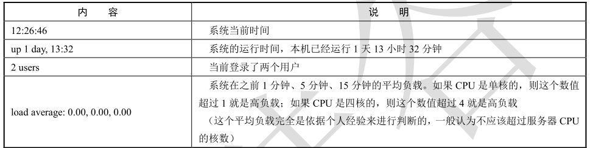
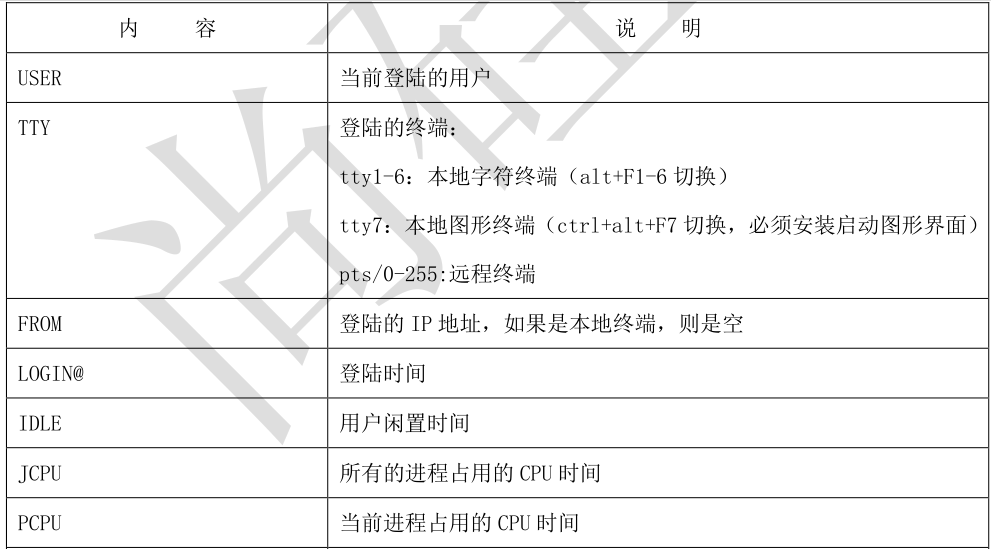

系统中有一些重要的痕迹日志文件，如/var/log/wtmp、/var/run/utmp、/var/log/btmp、
/var/log/lastlog 等日志文件，如果你用 vim 打开这些文件，你会发现这些文件是二进制乱码。这是由
于这些日志中保存的是系统的重要登录痕迹，包括某个用户何时登录了系统，何时退出了系统，错误
登录等重要的系统信息。这些信息要是可以通过 vim 打开，就能编辑，这样痕迹信息就不准确，所以
这些重要的痕迹日志，只能通过对应的命令来进行查看。

# **1 ．w 命令
**

w 命令是显示系统中正在登陆的用户信息的命令，这个命令查看的痕迹日志是/var/run/utmp。这
个命令的基本信息如下：

```javascript
 命令名称：w
 英文原意：Show who is logged on and what they are doing.

 所在路径：/usr/bin/w
 执行权限：所有用户。
 功能描述：显示灯用户，和他正在做什么。
```

例如：

```javascript
[root@localhost ~]# w
00:06:11 up 5:47, 2 users, load average: 0.00, 0.01, 0.05
  #系统时间 持续开机时间 登陆用户 系统在 1 分钟，5 分钟，15 分钟前的平均负载
USER TTY FROM LOGIN@ IDLE JCPU PCPU WHAT
root tty1 23:59 7:07 0.08s 0.08s -bash
root pts/2 192.168.252.1 23:42 3.00s 0.44s 0.06s w
```

第一行信息，内容如下：



第二行信息，内容：




# **2 ．who 命令
**

who 命令和 w 命令类似，用于查看正在登陆的用户，但是显示的内容更加简单，也是查看

/var/run/utmp 日志。

```javascript
[root@localhost ~]# who
root tty1 2018-11-12 23:59
root pts/2 2018-11-12 23:42 (192.168.252.1)
#用户名 登陆终端 登陆时间（来源 IP）
```

# **3 ．last 命令
**

last 命令是查看系统所有登陆过的用户信息的，包括正在登陆的用户和之前登陆的用户。这个命

令查看的是/var/log/wtmp 痕迹日志文件。

```javascript
[root@localhost ~]# last
root tty1 Mon Nov 12 23:59 still logged in
root pts/2 192.168.252.1 Mon Nov 12 23:42 still logged in
root pts/1 192.168.252.1 Mon Nov 12 23:37 - 23:59 (00:22)
root tty1 Mon Nov 12 19:17 - 23:58 (04:41)
root pts/0 192.168.252.1 Mon Nov 12 18:20 - 23:52 (05:32)
reboot system boot 3.10.0-862.el7.x Mon Nov 12 18:18 - 00:22 (06:03)
#系统重启信息记录
root pts/1 192.168.252.1 Mon Nov 12 08:48 - down (01:29)
root pts/1 192.168.252.1 Thu Nov 8 21:04 - 22:29 (01:25)
#用户名 终端号 来源 IP 地址 登陆时间 - 退出时间
```

# **4 ．lastlog 命令
**

lastlog 命令是查看系统中所有用户最后一次的登陆时间的命令，他查看的日志是/var/log/lastlog

文件。

```javascript
[root@localhost ~]# lastlog
Username Port From Latest
root tty1 Mon Nov 12 23:59:03 +0800 2018
bin **Never logged in**
daemon **Never logged in**
adm **Never logged in**
lp **Never logged in**
sync **Never logged in**
…省略部分内容…
#用户名 终端 来源 IP 登陆时间
```



# **5 ．lastb 命令
**

lastb 命令是查看错误登陆的信息的，查看的是/var/log/btmp 痕迹日志：

```javascript
[root@localhost ~]# lastb
(unknown tty1 Mon Nov 12 23:58 - 23:58 (00:00)
root tty1 Mon Nov 12 23:58 - 23:58 (00:00)
#错误登陆用户 终端 尝试登陆的时间
```