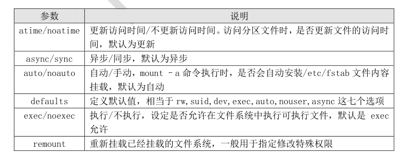
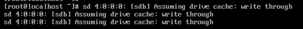
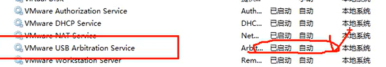

# **1 ．  mount 命令基本格式
**

linux 所有存储设备都必须挂载使用，包括硬盘

```javascript
命令名称：mount
命令所在路径：/bin/mount
执行权限：所有用户
```

说了这么多，命令的具体格式如下：

```javascript
[root@localhost ~]# mount [-l]
#查询系统中已经挂载的设备，-l 会显示卷标名称
[root@localhost ~]# mount –a
#依据配置文件/etc/fstab 的内容，自动挂载
 [root@server1 ~]# vim /etc/fstab 


# /etc/fstab
# Created by anaconda on Wed Jan 12 14:57:26 2022
#
# Accessible filesystems, by reference, are maintained under '/dev/disk'
# See man pages fstab(5), findfs(8), mount(8) and/or blkid(8) for more info
#
/dev/mapper/centos-root /                       xfs     defaults        0 0
UUID=a5759451-244e-4d8b-a7cf-715e3a022245 /boot                   xfs     defaults        0 0
/dev/mapper/centos-swap swap                    swap    defaults        0 0
~                                                                                                                                                            
                                                                                
[root@localhost ~]# mount [-t 文件系统] [-L 卷标名] [-o 特殊选项] \
设备文件名 挂载点
#\代表这一行没有写完，换行
选项：
    -t 文件系统： 加入文件系统类型来指定挂载的类型，可以 ext3、ext4、iso9660
等文件系统。具体可以参考表 9-1
    -L 卷标名： 挂载指定卷标的分区，而不是安装设备文件名挂载
    -o 特殊选项： 可以指定挂载的额外选项，比如读写权限、同步异步等，如果不指定则默认值生效
```

具体的特殊选项，见表 9-4：





举例

## **例 1：
**

```javascript
[root@localhost ~]# mount
#查看系统中已经挂载的文件系统，注意有虚拟文件系统
/dev/sda3 on / type ext4 (rw)
proc on /proc type proc (rw)
sysfs on /sys type sysfs (rw)
devpts on /dev/pts type devpts (rw,gid=5,mode=620)
tmpfs on /dev/shm type tmpfs (rw)
/dev/sda1 on /boot type ext4 (rw)
none on /proc/sys/fs/binfmt_misc type binfmt_misc (rw)
sunrpc on /var/lib/nfs/rpc_pipefs type rpc_pipefs (rw)
#命令结果是代表：/dev/sda3 分区挂载到/目录，文件系统是 ext4，权限是读写
```

## **例 2：修改特殊权限
**

```javascript
[root@localhost ~]# mount
#我们查看到/boot 分区已经被挂载，而且采用的 defaults 选项，那么我们重新挂载分区，并采用 noexec
#权限禁止执行文件执行，看看会出现什么情况（注意不要用/分区做试验，#不然系统命令也不能执行了）。
…省略部分输出…
/dev/sda1 on /boot type ext4 (rw)
…省略部分输出…
[root@localhost ~]# mount -o remount,noexec /boot
#重新挂载/boot 分区，并使用 noexec 权限
[root@localhost sh]# cd /boot/
[root@localhost boot]# vi hello.sh
#写个 shell 吧
#!/bin/bash
echo "hello!!"
[root@localhost boot]# chmod 755 hello.sh
[root@localhost boot]# ./hello.sh
-bash: ./hello.sh: 权限不够
#虽然赋予了 hello.sh 执行权限，但是任然无法执行
[root@localhost boot]# mount -o remount,exec /boot
#记得改回来啊，要不会影响系统启动的
```

如果我们做试验修改了特殊选项，一定要记得住，而且确定需要修改，否则非常容易出现系统问
题，而且还找不到哪里出现了问题。

## **例 3：挂载分区
**

```javascript
[root@localhost ~]# mkdir /mnt/disk1
#建立挂载点目录
[root@localhost ~]# mount /dev/sdb1 /mnt/disk1
#挂载分区
```

# **2. 光盘挂载
**

光盘挂载的前提依然是指定光盘的设备文件名，不同版本的 Linux，设备文件名并不相同：

```javascript
 CentOS 5.x 以前的系统，光盘设备文件名是/dev/hdc
 CentOS 6.x 以后的系统，光盘设备文件名是/dev/sr0
```

**不论哪个系统都有软连接/dev/cdrom，与可以作为光盘的设备文件名**

```javascript
[root@localhost ~]# mount -t iso9660 /dev/sr0  /mnt/cdrom/
# 挂载光盘	#t,target,目标
```

**用完之后记得卸载：**

```javascript
[root@localhost ~]# umount /dev/sr0
[root@localhost ~]# umount /mnt/cdrom
#因为设备文件名和挂载点已经连接到一起，卸载哪一个都可以
注意：卸载的时候需要退出光盘目录，才能正常卸载
```

# **3. 挂载 U 盘**

虚拟机挂载U盘时，鼠标需要先点入虚拟机，然后插入U盘，否则会被真实机识别，

识别成功后会有如下提示：


# **
**

同时打开电脑管理/服务时,系统会有这些服务：



U 盘会和硬盘共用设备文件名，所以 U 盘的设备文件名不是固定的，需要手工查询，查询命令：

```javascript
[root@localhost ~]# fdisk -l
#查询硬盘
```

然后就是挂载了，挂载命令如下：

```javascript
[root@localhost ~]# mount -t vfat /dev/sdb1 /mnt/usb/
# 挂载 U 盘。因为是 Windows 分区，所以是 vfat 文件系统格式
```

如果 U 盘中有中文，会发现中文是乱码。Linux 要想正常显示中文，需要两个条件：

** 安装了中文编码和中文字体**

** 操作终端需要支持中文显示（纯字符终端，是不支持中文编码的）**

而我们当前系统是安装了中文编码和字体，而 xshell 远程终端是 Windows 下的程序，当然是支持

中文显示的。那之所以挂载 U 盘还出现乱码，是需要在挂载的时候，手工指定中文编码，例如：

```javascript
[root@localhost ~]# mount -t vfat -o iocharset=utf8 /dev/sdb1 /mnt/usb/
# 挂载 U 盘，指定中文编码格式为 UTF-8
```

**如果需要卸载，可以执行以下命令：**

```javascript
[root@localhost ~]# umount /mnt/usb/
```

# **4 、挂载 NTFS 分区**

linux默认不识别NTFS分区，如果强制挂载成功，一般也只是只读状态

# **
**

# **4.1 Linux 的驱动加载 顺序：
**



```javascript
 驱动直接放入系统内核之中。这种驱动主要是系统启动加载必须的驱动，数量较少。
 驱 动 以 模 块 的 形 式 放 入 硬 盘 。 大 多 数 驱 动 都 已 这 种 方 式 保 存 ， 保 存 位 置 在
/lib/modules/3.10.0-862.el7.x86_64/kernel/中。
 驱动可以被 Linux 识别，但是系统认为这种驱动一般不常用，默认不加载。如果需要加载这
种驱动，需要重新编译内核，而 NTFS 文件系统的驱动就属于这种情况。
 硬件不能被 Linux 内核识别，需要手工安装驱动。当然前提是厂商提供了该硬件针对 Linux
的驱动，否则就需要自己开发驱动了。
```

## **4.2 使用 NTFS- -G 3G 安装 S NTFS 文件系统模块
**

** 下载 NTFS-3G 插件**

我们从网站 [http://www.tuxera.com/community/ntfs-3g-download/](http://www.tuxera.com/community/ntfs-3g-download/)下载 NTFS-3G 插件到 Linux
服务器上。

** 安装 NTFS-3G 插件**

在编译安装 NTFS-3G 插件之前，要保证 gcc 编译器已经安装。具体安装命令如下：

```javascript
[root@localhost ~]# tar -zxvf ntfs-3g_ntfsprogs-2013.1.13.tgz
#解压
[root@localhost ~]# cd ntfs-3g_ntfsprogs-2013.1.13
#进入解压目录
[root@localhost ntfs-3g_ntfsprogs-2013.1.13]# ./configure
#编译器准备。没有指定安装目录，安装到默认位置中
[root@localhost ntfs-3g_ntfsprogs-2013.1.13]# make
#编译
[root@localhost ntfs-3g_ntfsprogs-2013.1.13]# make install
#编译安装
```

安装就完成了，已经可以挂载和使用 Windows 的 NTFS 分区了。不过需要注意挂载分区时的文件
系统不是 ntfs，而是 ntfs-3g。挂载命令如下：

```javascript
[root@localhost ~]# mount -t ntfs-3g 分区设备文件名 挂载点
例如：
[root@localhost ~]# mount –t ntfs-3g /dev/sdb1 /mnt/win
```

# **5、linux——umount时目标忙的解决办法**

方法一：退出挂载的目录，然后在进行umount

方法二：可以通过fuser查看设备被哪个进程占用，只有杀死进程，在进行umount

## **1）查看umount后的提示信息**

```javascript
# umount /var/lib/ceph/osd/ceph-1
umount: /var/lib/ceph/osd/ceph-1：目标忙。
        (有些情况下通过 lsof(8) 或 fuser(1) 可以
         找到有关使用该设备的进程的有用信息)
```

## **2）yum 安装fuser**

```javascript
# yum install -y psmisc
```

## **3)查看挂载进程号**

```javascript
# fuser -mv  /var/lib/ceph/osd/ceph-1
                     用户     进程号 权限   命令
/var/lib/ceph/osd/ceph-1:
                     root     kernel mount /var/lib/ceph/osd/ceph-1
                     ceph       5979 F.... ceph-osd
```

## **4）杀死进程**

```javascript
# kill -9 5979
# fuser -mv  /var/lib/ceph/osd/ceph-1
                     用户     进程号 权限   命令
/var/lib/ceph/osd/ceph-1:
                     root     kernel mount /var/lib/ceph/osd/ceph-1
```

## **5）umount**

```javascript
# umount /var/lib/ceph/osd/ceph-1
```