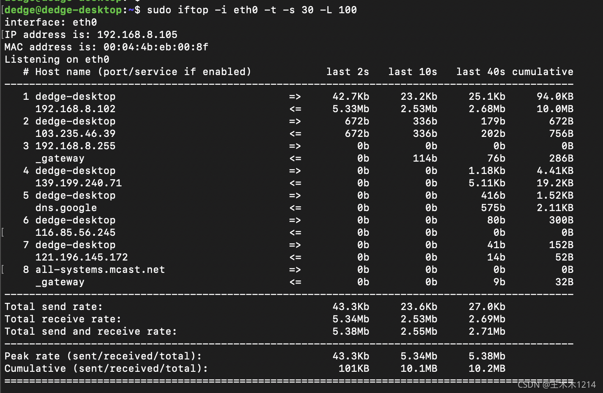
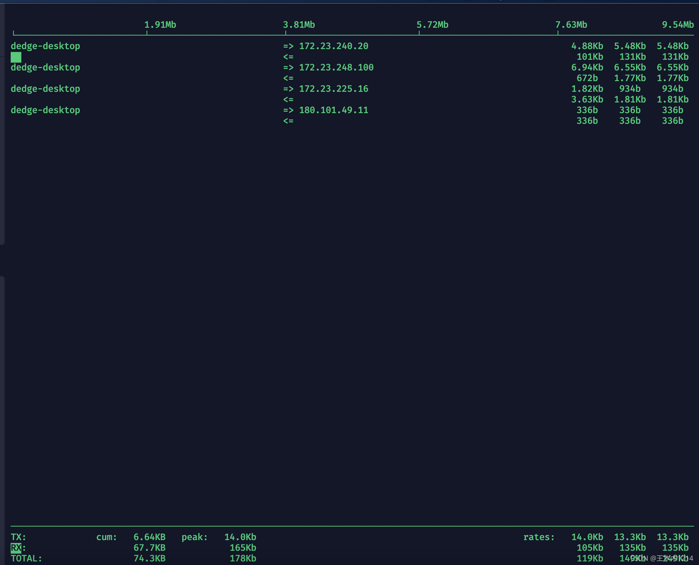
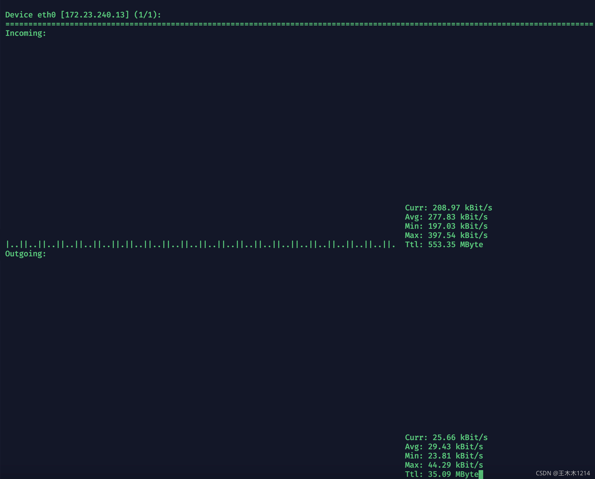
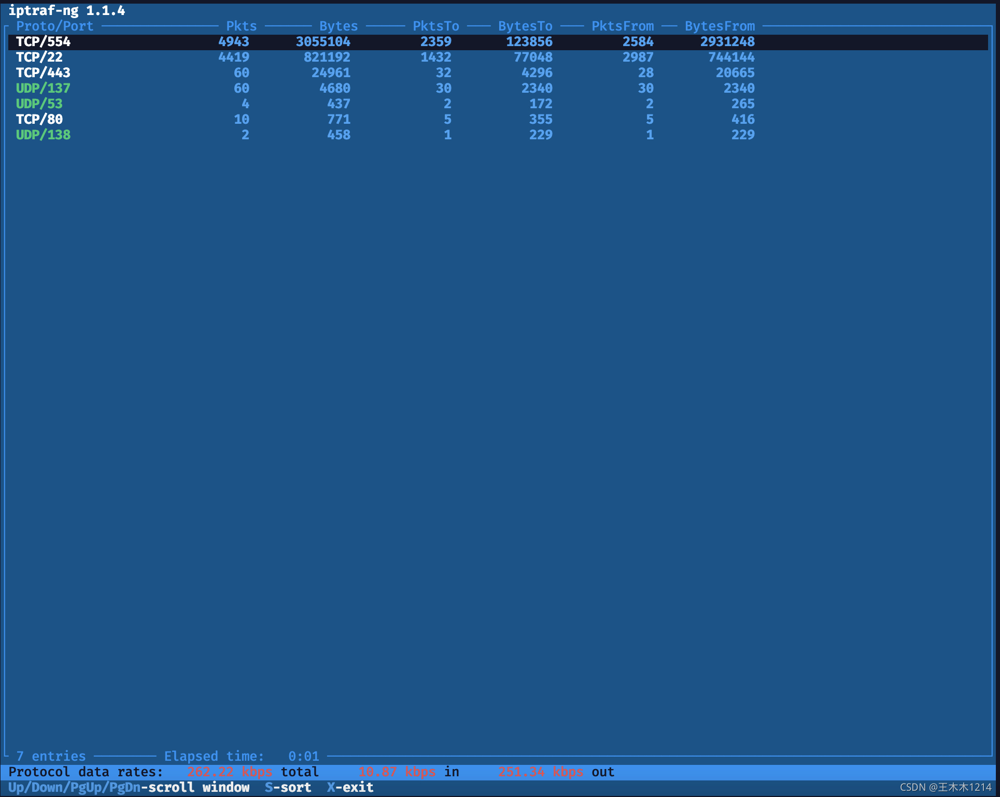
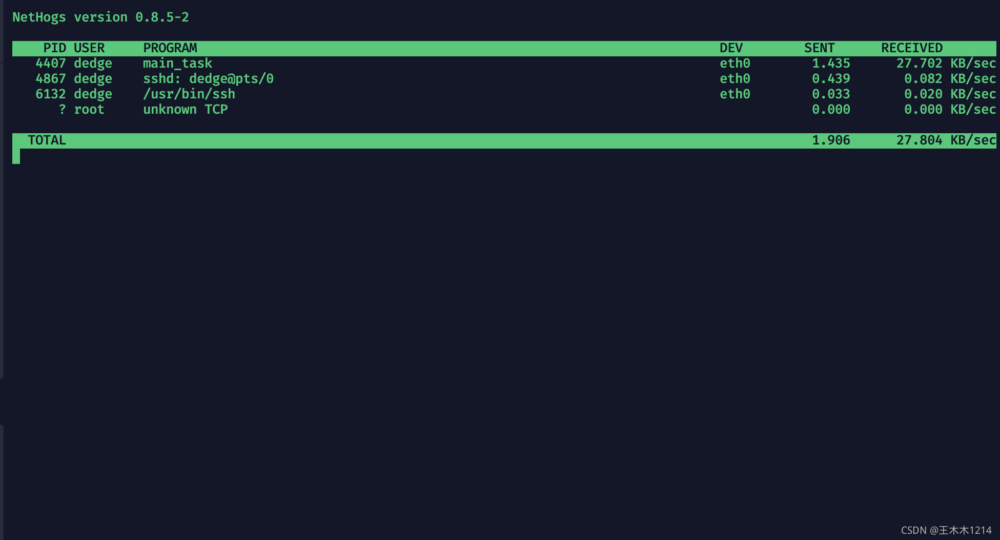

**Linux 查看或统计网卡流量的几种方式**

# 1、sar

sar命令包含在sysstat工具包中，提供了基于网络接口的数据统计，也可以查看设备上每秒收发包的个数和流量。

```
sar -n DEV 1 2
```

上面命令的含义是：向网卡(默认eth0)每秒读取1次值，共读取2次，然后显示出来：


详细使用教程参考博客：[18、sar — Linux 上最为全面的系统性能分析工具之一](note://WEBa92e5f6eb8fac7eeeaab012d775fab54)

# 2、cat /proc/net/dev

Linux 内核提供了一种通过 /proc 文件系统，在运行时访问内核内部数据结构、改变内核设置的机制。proc文件系统是一个伪文件系统，它只存在内存当中，而不占用外存空间。它以文件系统的方式为访问系统内核数据的操作提供接口。用户和应用程序可以通过proc得到系统的信息，并可以改变内核的某些参数。由于系统的信息，如进程，是动态改变的，所以用户或应用程序读取proc文件时，proc文件系统是动态从系统内核读出所需信息并提交的。

/proc文件系统中包含了很多目录，其中/proc/net/dev就是提供给用户读取或更改网络适配器及统计信息的途径。

注意：因为proc是伪文件系统，只存在内存中，所以这里统计的数据的时间起止时间是：系统启动到命令执行，如果此时系统发生重启，数据将会清零。


参数说明：

```
bytes: 接口发送或接收的数据的总字节数
packets: 接口发送或接收的数据包总数
errs: 由设备驱动程序检测到的发送或接收错误的总数
drop: 设备驱动程序丢弃的数据包总数
fifo: FIFO缓冲区错误的数量
frame: 分组帧错误的数量
colls: 接口上检测到的冲突数
compressed: 设备驱动程序发送或接收的压缩数据包数
carrier: 由设备驱动程序检测到的载波损耗的数量
multicast: 设备驱动程序发送或接收的多播帧数
```

其实，我们平时经常用的很多查看网卡实时流量的命令，都是通过读取该目录下的实时流量，并通过简单计算得到的。

# 3、ifstat

ifstat是一个统计网络接口活动状态的工具。

- （1）安装

```
sudo apt-get update
sudo apt-get install ifstat
```

- （2）命令选项

```
-l 监测环路网络接口（lo）。缺省情况下，ifstat监测活动的所有非环路网络接口。经使用发现，加上-l参数能监测所有的网络接口的信息，
        而不是只监测 lo的接口信息，也就是说，加上-l参数比不加-l参数会多一个lo接口的状态信息。
-a 监测能检测到的所有网络接口的状态信息。使用发现，比加上-l参数还多一个plip0的接口信息，搜索一下
        发现这是并口（网络设备中有一 个叫PLIP (Parallel Line Internet Protocol). 它提供了并口...）
-z 隐藏流量是无的接口，例如那些接口虽然启动了但是未用的
-i 指定要监测的接口,后面跟网络接口名
-s 等于加-d snmp:[comm@][#]host[/nn]] 参数，通过SNMP查询一个远程主机
-h 显示简短的帮助信息
-n 关闭显示周期性出现的头部信息（也就是说，不加-n参数运行ifstat时最顶部会出现网络接口的名称，当一屏显示不下时，
    会再一次出现接口的名称，提示我们显示的流量信息具体是哪个网络接口的。加上-n参数把周期性的显示接口名称关闭，只显示一次）
-t 在每一行的开头加一个时间 戳（能告诉我们具体的时间）
-T 报告所有监测接口的全部带宽（最后一列有个total，显示所有的接口的in流量和所有接口的out流量，简单的把所有接口的in流量相加,out流量相 加）
-w  用指定的列宽，而不是为了适应接口名称的长度而去自动放大列宽
-W 如果内容比终端窗口的宽度还要宽就自动换行
-S 在同一行保持状态更新（不滚动不换行）注：如果不喜欢屏幕滚动则此项非常方便，与bmon的显示方式类似
-b 用kbits/s显示带宽而不是kbytes/s
-q 安静模式，警告信息不出现
-v 显示版本信息
-d 指定一个驱动来收集状态信息
```

- （3）使用示例：

```
ifstat -tT
```


参数说明：

```
in:网卡接收的总字节数
out:网卡发送的总字节数
```

# 4、iftop

iftop是一款实时流量监控工具,监控TCP/IP连接等,缺点就是无报表功能。必须以root身份才能运行。

- （1）安装

```
sudo apt-get update
sudo apt-get install iftop
```

- （2）命令选项

```
iftop -h | [-npblNBP] [-i interface] [-f filter code] [-F net/mask] [-G net6/mask6]
详细参数说明：
-i ：指定需要监测的网卡
-n：将输出的主机信息都通过IP显示，不进行DNS反向解析
-B：将输出以bytes为单位显示网卡流量，默认是bits
-p：以混杂模式运行iftop，此时iftop可以作为网络嗅探器使用
-N：只显示连接端口号，不显示端口对应的服务名称
-P：显示主机以及端口信息，这个参数非常有用
-F：显示特定网段的网卡进出流量，例如：iftop –F 192.168.12.0/24
-m：设置iftop输出界面中最上面的流量刻度最大值，流量刻度分五个大段显示
-t :  使用文本方式显示结果，而非交互界面
-L :  指定结果显示的行数
-s sec:  sec秒后输出结果,然后自动退出
```

- （3）使用示例：

```
1、sudo iftop -i eth0 -t -s 30 -L 100
```



注意，如果时间较长，各ip地址的cumulative累计和可能并不等于最终的Cumulative,此时可以每40s统计一次结果，然后将结果累加。

```
2、sudo iftop -i eth0
```



iftop的输出从整体上可以分为三大部分：

1. iftop输出中最上面的一行，此行信息是流量刻度，用于显示网卡带宽流量。

1. iftop输出中最大的一个部分，此部分又分为左、中、右三列，左列和中列记录了哪些IP或主机正在和本机的网络进行连接。其中，中列的“=>”代表发送数据，“<=”代表接收数据，通过这个指示箭头可以很清晰地知道两个IP之间的通信情况。最右列又分为三小列，这些实时参数分别表示外部IP连接到本机2秒内、10秒内和40秒内的平均流量值。另外，这个部分还有一个流量图形条，流量图形条是对流量大小的动态展示，以第一部分中的流量刻度为基准。通过这个流量图形条可以很方便地看出哪个IP的流量最大，进而迅速定位网络中可能出现的流量问题。

1. 第三部分位于iftop输出的最下面，可以分为三行，其中，“TX”表示发送数据，“RX”表示接收数据，“TOTAL”表示发送和接收全部流量。与这三行对应的有三列，其中“cum”列表示从运行iftop到目前的发送、接收和总数据流量。“peak”列表示发送、接收以及总的流量峰值。“rates”列表示过去2s、10s、40s的平均流量值。

在进入iftop界面后，点击以下按键可以对内容调节控制：

```
h：显示帮助开关
n: 显示主机名/主机ip开关
s：显示本机host开关
d：显示远端主机host开关
t：切换显示格式为2行/1行/只显示发送流量/只显示接收流量
N：显示端口号或端口服务名称开关
S：显示本机的端口信息开关
D：显示远端目标主机的端口信息开关
p：显示端口信息开关
P：切换暂停/继续显示
b：显示平均流量图形条开关，以界面第一行带宽为标尺，上图中的白条状图即是
B：切换计算2秒或10秒或40秒内的平均流量
T：显示每个连接的总流量开关
l：打开屏幕过滤功能，输入要过滤的字符，比如ip, 按回车后，屏幕就只显示这个IP相关的流量信息
L：切换显示画面上边的刻度; 刻度不同，流量图形条会有变化
j或k：可以向上或向下滚动屏幕显示的连接记录
1或2或3：可以根据右侧显示的三列流量数据进行排序
<：根据左边的本机名或IP排序
>：根据远端目标主机的主机名或IP排序
o：切换是否固定只显示当前的连接
f：可以编辑过滤代码
!: 可以使用shell命令
q: 退出
```

# 5、nload  

nload是一个实时监控网络流量和带宽使用的控制台应用程序，使用两个图表可视化地展示接收和发送的流量，并提供诸如数据交换总量、最小/最大网络带宽使用量等附加信息。

（1）工具安装

```
sudo apt-get update
sudo apt-get install nload
```

（2）命令选项

```
选项说明：nload [options] [devices]
-a：设置计算平均网速的时间周期，单位是秒，默认是300.
-i：进入网卡的流量图的显示比例最大值设置，默认10240 kBit/s.
-m：不显示流量图，只显示统计数据。
-o：出去网卡的流量图的显示比例最大值设置，默认10240 kBit/s.
-t：显示数据的刷新时间间隔，单位是毫秒，默认500。
-u：设置右边Curr、Avg、Min、Max的数据单位，默认是自动变的.注意大小写单位不同！
h|b|k|m|g h: auto, b: Bit/s, k: kBit/s, m: MBit/s etc.
H|B|K|M|G H: auto, B: Byte/s, K: kByte/s, M: MByte/s etc.
-U：设置右边Ttl的数据单位，默认是自动变的，注意大小写单位不同（与-u相同）！
Devices：自定义监控的网卡，默认是全部监控的，使用左右键切换。
```

（3）使用示例：

```
nload eth0
```





# 6、iptraf-ng

iptraf-ng 是观察网络流速的强力工具，它可以让你的观察逐步深入，从硬件层（网卡），到网络层（IPv4，IPv6），到传输层（TCP，UDP etc.），一直到每一对socket pair。

（1）工具安装

```
sudo apt-get update
sudo apt-get install iptraf-ng
```

（2）命令选项

```
参数说明：  iptraf-ng [options]:
-h, --help  :show this help message
-i <iface>  :start the IP traffic monitor (use '-i all' for all interfaces)
-d <iface>  :start the detailed statistics facility on an interface
-s <iface>  :start the TCP and UDP monitor on an interface
-z <iface>  :shows the packet size counts on an interface
-l <iface>  :start the LAN station monitor (use '-l all' for all LAN interfaces)
-g           :start the general interface statistics
-B           :run in background (use only with one of the above parameters
-f           :clear all locks and counters
-t <n>       :run only for the specified <n> number of minutes
-L <logfile> :specifies an alternate log file
```

（3）使用示例

```
sudo iptraf-ng -s eth0 用于统计各port的流量 ：
```



# 7、nethogs

nethogs 的设计用途主要是为了查看单独进程流量情况而被创造出来的。nethogs 是一个小型的 net top 工具，不和大多数工具那样按照每个协议或者子网的速度，而是按照进程进行带宽分组。 nethogs 不需要依赖某个特殊的内核模块，如果发生了网络阻塞，你可以启动 nethogs 立即看到哪个 PID 造成的，这样就可以轻松的找到占用带宽的程序，然后进行相应的内容控制。

（1）工具安装

```
sudo apt-get update
sudo apt-get install nethogs
```

（2）工具选项

```
用法:
nethogs [-V] [-h] [-b] [-d seconds] [-v mode] [-c count] [-t] [-p] [-s] [device [device [device ...]]]
-V : 打印版本。
-h : 打印此帮助。
-b : bughunt模式 - 暗示tracemode。
-d : 延迟更新刷新率（以秒为单位）。 默认值为1。
-v : 视图模式（0 = KB / s，1 =总KB，2 =总B，3 =总MB）。 默认值为0。
-c : 更新次数。 默认为0（无限制）。
-t : tracemode.
-p : 煽动混乱模式（不推荐）。
-s : 按发送列排序输出。
-a : 监控所有设备，甚至环回/停止。
device : 要监控的设备。 默认是所有接口启动和运行，不包括环回
当nethogs运行时，按：
q：退出
s：按SENT流量排序
r：按RECEIVE流量排序
m：在总（KB，B，MB）和KB / s模式之间切换
```

（3）使用示例

```
sudo nethogs eth0
```



# 8、扩展

除了上面说到的工具外，linux还提供了一些其他流量监控工具，如：

- ip：		查看网卡上的总流量

- stat：	用来替换vmstat、iostat、netstat、nfsstat和ifstat的全能系统信息统计工具，支持数据实时刷新，输出直观易懂

- ss 和 netstat：查看活动链接/监听端口的常用命令。ss 是 netstat 的替代，性能更好，建议使用

- nethogs：	查看单个进程流量而设计的工具，按照进程进行带宽分组