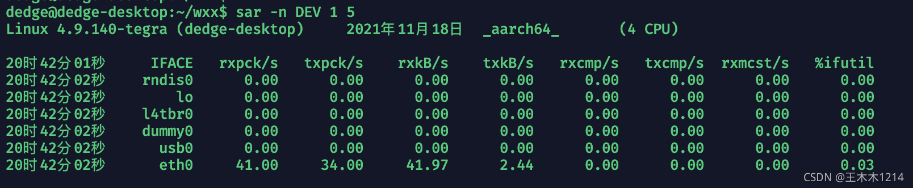
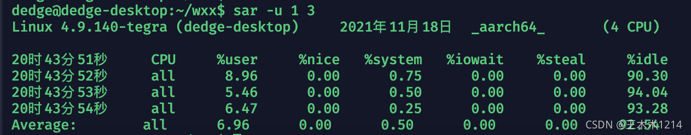
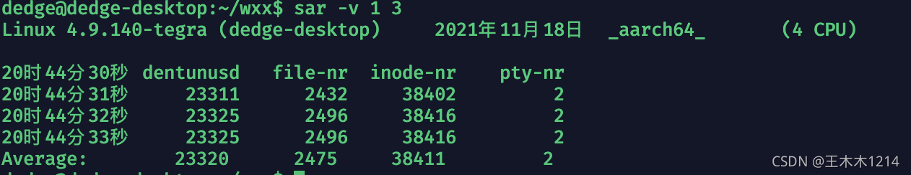
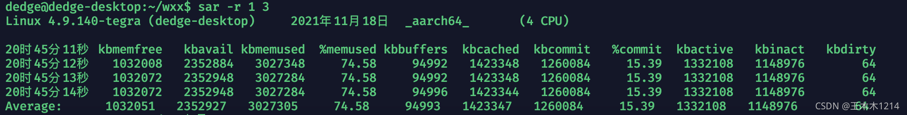
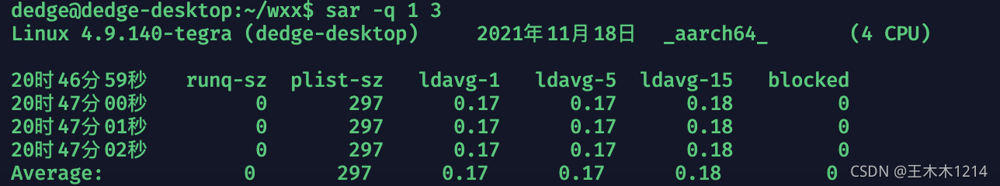
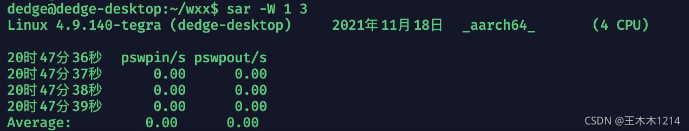
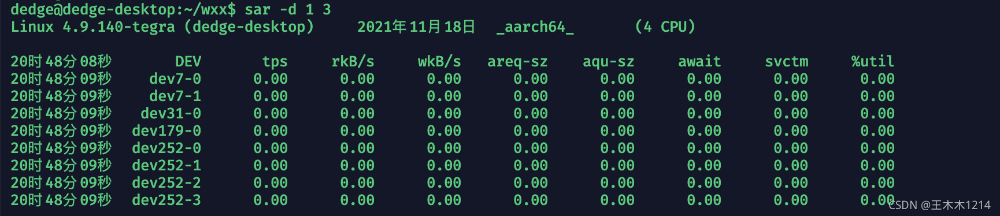
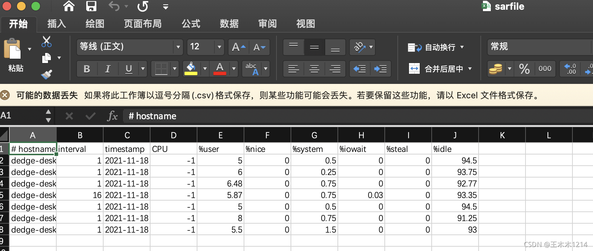
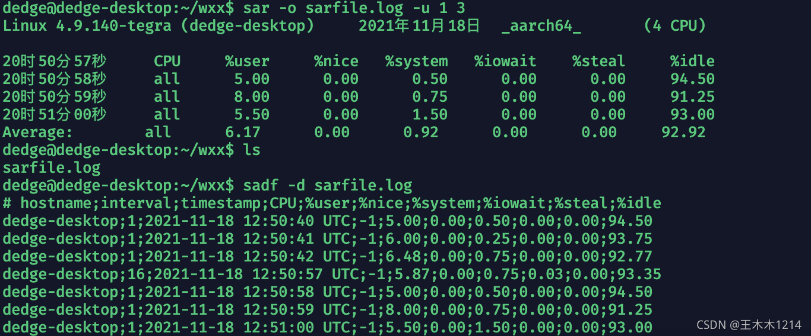
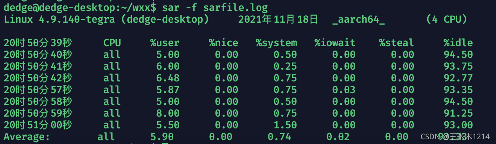

**sar — Linux 上最为全面的系统性能分析工具之一**

# 一、sar简介

sar（System Activity Reporter 系统活动情况报告）是目前 Linux 上最为全面的系统性能分析工具之一，可以从多方面对系统的活动进行报告，包括：文件的读写情况、系统调用的使用情况、磁盘 I/O、CPU 效率、内存使用状况、进程活动及 IPC 有关的活动等。

我们可以使用sar命令来获得整个系统性能的报告。这有助于我们定位系统性能的瓶颈，并且有助于我们找出这些烦人的性能问题的解决方法。

Linux 内核维护着一些内部计数器，这些计数器包含了所有的请求及其完成时间和 I/O 块数等信息，sar命令从所有的这些信息中计算出请求的利用率和比例，以便找出瓶颈所在。

sar命令主要的用途是生成某段时间内所有活动的报告，因此必需确保sar命令在适当的时间进行数据采集（而不是在午餐时间或者周末）

# 二、sar用法

```
用法: sar [ 选项 ] [ <时间间隔> [ <次数> ] ]
主选项和报告：
    -b	I/O 和传输速率信息状况
    -B	分页状况
    -d	块设备状况
    -I { <中断> | SUM | ALL | XALL }  中断信息状况
    -m	电源管理信息状况
    -n { <关键词> [,...] | ALL }  网络统计信息
        关键词可以是：
        DEV	     网卡信息统计
        EDEV	 网卡的错误统计
        NFS	     NFS客户端
        NFSD	 NFS服务器
        SOCK	 Sockets (IPV4套接字）
        IP	     IP流(IPV4)
        EIP	     IP流的错误统计(IPV4)
        ICMP	 ICMP流(IPV4)
        EICMP	 ICMP流的错误统计(IPV4)
        TCP	     TCP流(IPV4)
        ETCP	 TCP流的错误统计(IPV4)
        UDP	     UDP流(IPV4)
        SOCK6	 Sockets(IPV6套接字)
        IP6	     IP流(IPV6)
        EIP6	 IP流的错误统计(IPV6)
        ICMP6	 ICMP流(IPV6)
        EICMP6   ICMP流的错误统计 (IPV6)
        UDP6	 UDP流(IPV6)
    -q	队列长度和平均负载
    -r	内存利用率
    -R	内存状况
    -S	交换空间利用率
    -u [ ALL ]
        CPU 利用率
    -v	Kernel table 状况
    -w	任务创建与系统转换统计信息
    -W	交换信息
    -y	TTY 设备状况
    -o {<文件路径>}
    将命令结果以二进制格式存放在指定文件中
```

# 三、sar安装

sar命令来自于sysstat工具包，如果提示sar命令不存在，需先安装sysstat。

- 1）直接安装

```
apt-get install sysstat  或者
yum -y install sysstat
```

- 2）源码安装

```
git clone git://github.com/sysstat/sysstat
cd sysstat
./configure
make
make install
```

# 四、用法示例

## 1、网络统计信息

```
sar -n DEV [ <时间间隔> [ <次数> ] ]
```



参数说明：

```
IFACE：LAN接口
rxpck/s：每秒钟接收的数据包
txpck/s：每秒钟发送的数据包
rxbyt/s：每秒钟接收的字节数
txbyt/s：每秒钟发送的字节数
rxcmp/s：每秒钟接收的压缩数据包
txcmp/s：每秒钟发送的压缩数据包
rxmcst/s：每秒钟接收的多播数据包
rxerr/s：每秒钟接收的坏数据包
txerr/s：每秒钟发送的坏数据包
coll/s：每秒冲突数
rxdrop/s：因为缓冲充满，每秒钟丢弃的已接收数据包数
txdrop/s：因为缓冲充满，每秒钟丢弃的已发送数据包数
txcarr/s：发送数据包时，每秒载波错误数
rxfram/s：每秒接收数据包的帧对齐错误数
rxfifo/s：接收的数据包每秒FIFO过速的错误数
txfifo/s：发送的数据包每秒FIFO过速的错误数
```

## 2、CPU 利用率

```
sar -u [ <时间间隔> [ <次数> ] ]
```



参数说明：

```
CPU：all 表示统计信息为所有 CPU 的平均值。
%user：显示在用户级别(application)运行使用 CPU 总时间的百分比
%nice：显示在用户级别，用于nice操作，所占用 CPU 总时间的百分比
%system：在核心级别(kernel)运行所使用 CPU 总时间的百分比
%iowait：显示用于等待I/O操作占用 CPU 总时间的百分比
%steal：管理程序(hypervisor)为另一个虚拟进程提供服务而等待虚拟 CPU 的百分比
%idle：显示 CPU 空闲时间占用 CPU 总时间的百分比
    1. 若 %iowait 的值过高，表示硬盘存在I/O瓶颈
    2. 若 %idle 的值高但系统响应慢时，有可能是 CPU 等待分配内存，此时应加大内存容量
    3. 若 %idle 的值持续低于1，则系统的 CPU 处理能力相对较低，表明系统中最需要解决的资源是 CPU
```

## 3、索引节点，文件和其他内核表的状态

```
sar -v [ <时间间隔> [ <次数> ] ]
```



参数说明：

```
dentunusd：目录高速缓存中未被使用的条目数量
file-nr：文件句柄（file handle）的使用数量
inode-nr：索引节点句柄（inode handle）的使用数量
pty-nr：使用的 pty 数量
```

## 4、内存利用率

sar -r [ <时间间隔> [ <次数> ] ]



参数说明：

```
kbmemfree：这个值和 free 命令中的 free 值基本一致，所以它不包括 buffer 和 cache 的空间
kbmemused：这个值和 free 命令中的 used 值基本一致,所以它包括 buffer 和 cache 的空间 %memused：
            这个值是 kbmemused 和内存总量(不包括 swap)的一个百分比
kbbuffers 和 kbcached：这两个值就是 free 命令中的 buffer 和 cache
kbcommit：保证当前系统所需要的内存，即为了确保不溢出而需要的内存(RAM + swap) %commit：这个值是 kbcommit 
        与内存总量(包括 swap)的一个百分比
```

## 5、内存分页情况

```
sar -B [ <时间间隔> [ <次数> ] ]
```

参数说明：

```
pgpgin/s：表示每秒从磁盘或SWAP置换到内存的字节数(KB)
pgpgout/s：表示每秒从内存置换到磁盘或SWAP的字节数(KB)
fault/s：每秒钟系统产生的缺页数，即主缺页与次缺页之和(major + minor)
majflt/s：每秒钟产生的主缺页数
pgfree/s：每秒被放入空闲队列中的页个数
pgscank/s：每秒被 kswapd 扫描的页个数
pgscand/s：每秒直接被扫描的页个数
pgsteal/s：每秒钟从 cache 中被清除来满足内存需要的页个数
%vmeff：每秒清除的页(pgsteal)占总扫描页(pgscank + pgscand)的百分比
```

## 6、I/O 和传输速率信息状况

```
sar -b [ <时间间隔> [ <次数> ] ]
```

参数说明：

```
tps：每秒钟物理设备的 I/O 传输总量
rtps：每秒钟从物理设备读入的数据总量
wtps：每秒钟向物理设备写入的数据总量
bread/s：每秒钟从物理设备读入的数据量，单位为：块/s
bwrtn/s：每秒钟向物理设备写入的数据量，单位为：块/s
```

## 7、队列长度和平均负载

```
sar -q [ <时间间隔> [ <次数> ] ]
```



参数说明：

```
runq-sz：运行队列的长度（等待运行的进程数）
plist-sz：进程列表中进程（processes）和线程（threads）的数量
ldavg-1：最后1分钟的系统平均负载（System load average）
ldavg-5：过去5分钟的系统平均负载
ldavg-15：过去15分钟的系统平均负载
```

## 8、系统交换信息

```
sar -W [ <时间间隔> [ <次数> ] ]
```



参数说明：

```
pswpin/s：每秒系统换入的交换页面（swap page）数量
pswpout/s：每秒系统换出的交换页面（swap page）数量
```

## 9、块设备状况

```
sar -d [ <时间间隔> [ <次数> ] ]
```



参数说明：

```
tps: 每秒从物理磁盘 I/O 的次数。多个逻辑请求会被合并为一个 I/O 磁盘请求，一次传输的大小是不确定的
rd_sec/s: 每秒读扇区的次数
wr_sec/s: 每秒写扇区的次数
avgrq-sz: 平均每次设备 I/O 操作的数据大小(扇区)
avgqu-sz: 磁盘请求队列的平均长度
await: 从请求磁盘操作到系统完成处理，每次请求的平均消耗时间，包括请求队列等待时间，单位是毫秒(1秒=1000毫秒)
svctm: 系统处理每次请求的平均时间,不包括在请求队列中消耗的时间.
%util: I/O请求占CPU的百分比，比率越大，说明越饱和：
    1. avgqu-sz 的值较低时，设备的利用率较高
    2. 当%util的值接近 1% 时，表示设备带宽已经占满
```

## 10、输出统计的数据信息

### **1、将输出保存为文件**

```
sar -o path_file [选项] [ <时间间隔> [ <次数> ] ]
```

```
sar -o sarfile.log -u 1 3
上述示例命令会将sar -u 1 3采集到的数据以二进制的格式存放到文件sarfile.log中。
```

**注意：二进制文件无法直接阅读，需要通过特定命令进行阅读。**

```
sadf -d sarfile.log | sed 's/;/,/g' > sarfile.csv
上述示例命令会将刚刚保存的log文件转换为csv 文档 ，此时就可以在window或mac上进行查看啦，结果如下：
```



### 2、加载二进制信息文件

通过命令sadf -d sarfile.log将二进制数据文件转换成数据库可读的格式，如下：



### 3、读取二进制文件

```
sar -f <文件路径>
```

将之前存储在二进制文件中的数据给读取并展示出来。

