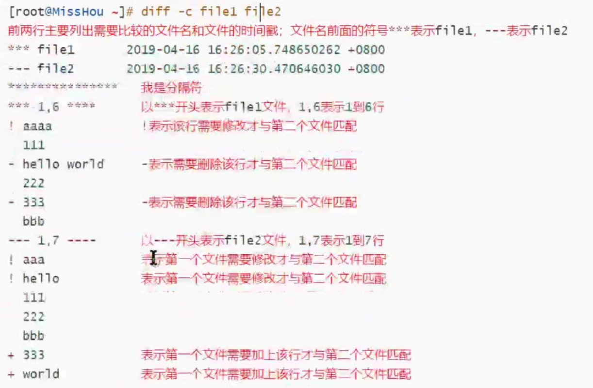
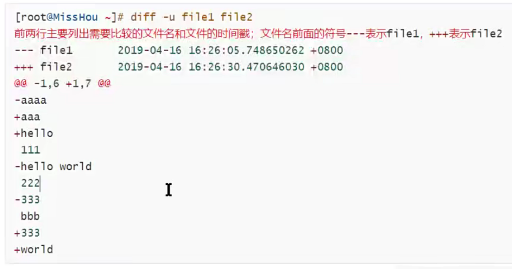
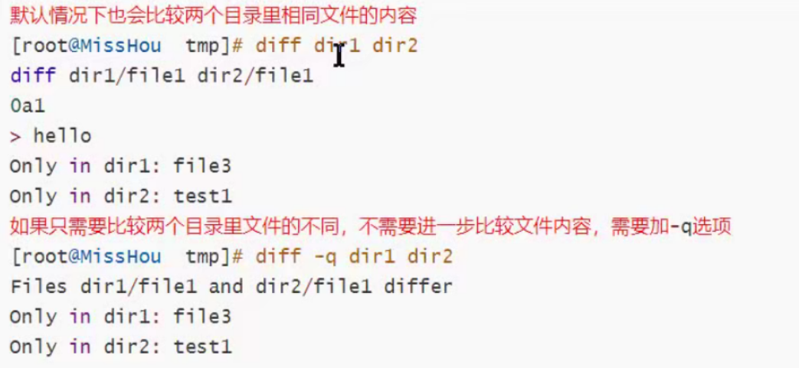

# 1、dd

复制文件并对原文件的内容进行转换和格式化处理

## 补充说明

**dd命令**

建议在有需要的时候使用dd 对物理磁盘操作，如果是文件系统的话还是使用tar backup cpio等其他命令更加方便。另外，使用dd对磁盘操作时，最好使用块设备文件。

### 语法

```bash
dd(选项)
```

### 选项

```bash
[root@server1 ~]# ddif=/dev/zero of=文件名称bs=1 M count=1    
选项说明：
    if代表输入文件
    of代表输出文件
    bs代表字节为单位的块大小。
    count代表被复制的块。
    其中/dev/zero是一个字符设备，会不断返回0值字节。
bs=<字节数>：将ibs（输入）与obs（输出）设成指定的字节数；
cbs=<字节数>：转换时，每次只转换指定的字节数；
conv=<关键字>：指定文件转换的方式；
count=<区块数>：仅读取指定的区块数；
ibs=<字节数>：每次读取的字节数；
obs=<字节数>：每次输出的字节数；
of=<文件>：输出到文件；
seek=<区块数>：一开始输出时，跳过指定的区块数；
skip=<区块数>：一开始读取时，跳过指定的区块数；
--help：帮助；
--version：显示版本信息。
```

### 实例

```bash
[root@localhost text]# dd if=/dev/zero of=sun.txt bs=1M count=1
1+0 records in
1+0 records out
1048576 bytes (1.0 MB) copied, 0.006107 seconds, 172 MB/s
[root@localhost text]# du -sh sun.txt 
1.1M    sun.txt
```

该命令创建了一个1M大小的文件sun.txt，其中参数解释：

- if 代表输入文件。如果不指定if，默认就会从stdin中读取输入。

- of 代表输出文件。如果不指定of，默认就会将stdout作为默认输出。

- bs 代表字节为单位的块大小。

- count 代表被复制的块数。

- /dev/zero 是一个字符设备，会不断返回0值字节（\0）。

块大小可以使用的计量单位表

| 单元大小 | 代码 | 
| -- | -- |
| 字节（1B） | c | 
| 字节（2B） | w | 
| 块（512B） | b | 
| 千字节（1024B） | k | 
| 兆字节（1024KB） | M | 
| 吉字节（1024MB） | G | 


以上命令可以看出dd命令来测试内存操作速度：

```bash
1048576 bytes (1.0 MB) copied, 0.006107 seconds, 172 MB/s
```

**生成随机字符串**

我们甚至可以使用 /dev/urandom 设备配合 dd 命令 来获取随机字符串。

```bash
[root@localhost ~]# dd if=/dev/urandom bs=1 count=15|base64 -w 0
15+0 records in
15+0 records out
15 bytes (15 B) copied, 0.000111993 s, 134 kB/s
wFRAnlkXeBXmWs1MyGEs
```

# 2、watch

可以将命令的输出结果输出到标准输出设备，多用于周期性执行命令/定时执行命令

## 补充说明

**watch命令**

### 语法

```bash
watch(选项)(参数)
```

### 选项

```bash
-n # 或--interval  watch缺省每2秒运行一下程序，可以用-n或-interval来指定间隔的时间。
-d # 或--differences  用-d或--differences 选项watch 会高亮显示变化的区域。 而-d=cumulative选项会把变动过的地方(不管最近的那次有没有变动)都高亮显示出来。
-t # 或-no-title  会关闭watch命令在顶部的时间间隔,命令，当前时间的输出。
-h, --help # 查看帮助文档
```

### 参数

指令：需要周期性执行的指令。

### 实例

```bash
watch -n 1 -d netstat -ant       # 命令：每隔一秒高亮显示网络链接数的变化情况
watch -n 1 -d 'pstree|grep http' # 每隔一秒高亮显示http链接数的变化情况。 后面接的命令若带有管道符，需要加''将命令区域归整。
watch 'netstat -an | grep:21 | \ grep<模拟攻击客户机的IP>| wc -l' # 实时查看模拟攻击客户机建立起来的连接数
watch -d 'ls -l|grep scf'       # 监测当前目录中 scf' 的文件的变化
watch -n 10 'cat /proc/loadavg' # 10秒一次输出系统的平均负载
watch uptime
watch -t uptime
watch -d -n 1 netstat -ntlp
watch -d 'ls -l | fgrep goface'     # 监测goface的文件
watch -t -differences=cumulative uptime
watch -n 60 from            # 监控mail
watch -n 1 "df -i;df"       # 监测磁盘inode和block数目变化情况
```

FreeBSD和Linux下watch命令的不同，在Linux下，watch是周期性的执行下个程序，并全屏显示执行结果，如：

# 3、tee

把数据重定向到给定文件和屏幕上

## 补充说明

**tee命令**

存在缓存机制，每1024个字节将输出一次。若从管道接收输入数据，应该是缓冲区满，才将数据转存到指定的文件中。若文件内容不到1024个字节，则接收完从标准输入设备读入的数据后，将刷新一次缓冲区，并转存数据到指定文件。

### 语法

```bash
tee(选项)(参数)
```

### 选项

```bash
-a：向文件中重定向时使用追加模式；
-i：忽略中断（interrupt）信号。
```

### 参数

文件：指定输出重定向的文件。

在终端打印stdout同时重定向到文件中：

```bash
ls | tee out.txt
1.sh
1.txt
2.txt
eee.tst
EEE.tst
one
out.txt
string2
www.pdf
WWW.pdf
WWW.pef
```

```bash
[root@localhost text]# ls | tee out.txt | cat -n
     1  1.sh
     2  1.txt
     3  2.txt
     4  eee.tst
     5  EEE.tst
     6  one
     7  out.txt
     8  string2
     9  www.pdf
    10  WWW.pdf
    11  WWW.pef
```

# 4、diff

比较给定的两个文件的不同

## 补充说明

**diff命令**

### 语法

```bash
diff [选项] 文件1  文件2
```

### 选项

```shell
常用选项：
-b或--ignore-space-change：不检查空格字符的不同；
-B或--ignore-blank-lines：不检查空白行；
-i或--ignore-case：不检查大小写的不同；
-w或--ignore-all-space：忽略全部的空格字符；
-c：显示全部内容，并标出不同之处；
-u，-U<列数>或--unified=<列数>：以合并的方式来显示文件内容的不同；
-<行数>：指定要显示多少行的文本。此参数必须与-c或-u参数一并使用；
-a或——text：diff预设只会逐行比较文本文件；
-b或--ignore-space-change：不检查空格字符的不同；
-B或--ignore-blank-lines：不检查空白行；
-c：显示全部内容，并标出不同之处；
-C<行数>或--context<行数>：与执行“-c-<行数>”指令相同；
-d或——minimal：使用不同的演算法，以小的单位来做比较；
-D<巨集名称>或ifdef<巨集名称>：此参数的输出格式可用于前置处理器巨集；
-e或——ed：此参数的输出格式可用于ed的script文件；
-f或-forward-ed：输出的格式类似ed的script文件，但按照原来文件的顺序来显示不同处；
-H或--speed-large-files：比较大文件时，可加快速度；
-l<字符或字符串>或--ignore-matching-lines<字符或字符串>：若两个文件在某几行有所不同，而之际航同时都包含了选项中指定的字符或字符串，则不显示这两个文件的差异；
-i或--ignore-case：不检查大小写的不同；
-l或——paginate：将结果交由pr程序来分页；
-n或——rcs：将比较结果以RCS的格式来显示；
-N或--new-file：在比较目录时，若文件A仅出现在某个目录中，预设会显示：Only in目录，文件A 若使用-N参数，则diff会将文件A 与一个空白的文件比较；
-p：若比较的文件为C语言的程序码文件时，显示差异所在的函数名称；
-P或--unidirectional-new-file：与-N类似，但只有当第二个目录包含了第一个目录所没有的文件时，才会将这个文件与空白的文件做比较；
-q或--brief：仅显示有无差异，不显示详细的信息；
-r或——recursive：比较子目录中的文件；
-s或--report-identical-files：若没有发现任何差异，仍然显示信息；
-S<文件>或--starting-file<文件>：在比较目录时，从指定的文件开始比较；
-t或--expand-tabs：在输出时，将tab字符展开；
-T或--initial-tab：在每行前面加上tab字符以便对齐；
-u，-U<列数>或--unified=<列数>：以合并的方式来显示文件内容的不同；
-v或——version：显示版本信息；
-w或--ignore-all-space：忽略全部的空格字符；
-W<宽度>或--width<宽度>：在使用-y参数时，指定栏宽；
-x<文件名或目录>或--exclude<文件名或目录>：不比较选项中所指定的文件或目录；
-X<文件>或--exclude-from<文件>；您可以将文件或目录类型存成文本文件，然后在=<文件>中指定此文本文件；
-y或--side-by-side：以并列的方式显示文件的异同之处；
--help：显示帮助；
--left-column：在使用-y参数时，若两个文件某一行内容相同，则仅在左侧的栏位显示该行内容；
--suppress-common-lines：在使用-y参数时，仅显示不同之处。
```

### 参数

- 文件1：指定要比较的第一个文件；

- 文件2：指定要比较的第二个文件。

### 实例

将目录

```bash
diff /usr/li test.txt     #使用diff指令对文件进行比较
```

上面的命令执行后，会将比较后的不同之处以指定的形式列出，如下所示：

```bash
n1 a n3,n4  
n1,n2 d n3  
n1,n2 c n3,n4 
```

其中，字母“a”、“d”、“c”分别表示添加、删除及修改操作。而“n1”、“n2”表示在文件1中的行号，“n3”、“n4”表示在文件2中的行号。

注意：以上说明指定了两个文件中不同处的行号及其相应的操作。在输出形式中，每一行后面将跟随受到影响的若干行。其中，以<开始的行属于文件1，以>开始的行属于文件2。

- 1)正常显示

```shell
diff目的：fi1e1如何改变才能和fi1e2匹配
[root@MissHou]#diff filel file2
1c1,2    第一个文件的第1行需要改变(c=change)才能和第二个文件的第1到2行匹配
< aaaa    小于号"<"表示左边文件(f1e1)文件内容
---      一一表示分隔符
> aaa    大于号">"表示右边文件（仟i1e2)文件内容
> hello
3d3    第一个文件的第3行删除(d=de1ete)后才能和第二个文件的第3行匹配
< hello world
5d4    第一个文件的第5行删除后才能和第二个文件的第4行匹配
<3 33
6a6,7 第一个文件的第6行增加(a=àdd)内容后才能和第二个文件的第6到7行少配
> 233 需要增加的内容在第二个文件国是333和w0r1d
> world
```

- 2)上下文显示



- 3)合并格式



- 比较两个目录不同



- 其他小技巧：

有时候我们需要以一个文件为标准，去修改其他文件，并且修改的地方较多时，我们可以通过打补丁的方式完成。

```shell
1)先找出文件不同，然后输出到一个文件
[root@MissHou~]#diff -uN filel file2 file.patch
-u:合并模式
-N:将不存在的文件当作空文件
2)将不同内容打补丁到文件
[root@MissHou~]#patch filel file.patch
patching file filel
3)测试验证
```

# 5、paste

将多个文件按列队列合并

## 补充说明

**paste命令**

### 语法

```bash
paste(选项)(参数)
```

### 选项

```bash
-d<间隔字符>或--delimiters=<间隔字符>：用指定的间隔字符取代跳格字符；
-s或——serial串列进行而非平行处理。
```

### 参数

文件列表：指定需要合并的文件列表。

# 6、tr

将字符进行替换压缩和删除

## 补充说明

**tr命令**

### 语法

```bash
tr(选项)(参数)
```

### 选项

```bash
-c或——complerment：取代所有不属于第一字符集的字符；
-d或——delete：删除所有属于第一字符集的字符；
-s或--squeeze-repeats：把连续重复的字符以单独一个字符表示；
-t或--truncate-set1：先删除第一字符集较第二字符集多出的字符。
```

### 参数

- 字符集1：指定要转换或删除的原字符集。当执行转换操作时，必须使用参数“字符集2”指定转换的目标字符集。但执行删除操作时，不需要参数“字符集2”；

- 字符集2：指定要转换成的目标字符集。

### 实例

将输入字符由大写转换为小写：

```bash
echo "HELLO WORLD" | tr 'A-Z' 'a-z'
hello world
```

‘A-Z’ 和 ‘a-z’都是集合，集合是可以自己制定的，例如：’ABD-}’、‘bB.,’、‘a-de-h’、‘a-c0-9’都属于集合，集合里可以使用’‘、’，可以可以使用其他ASCII字符。

使用tr删除字符：

```bash
echo "hello 123 world 456" | tr -d '0-9'
hello  world 
```

将制表符转换为空格：

```bash
cat text | tr '\t' ' '
```

字符集补集，从输入文本中将不在补集中的所有字符删除：

```bash
echo aa.,a 1 b#$bb 2 c*/cc 3 ddd 4 | tr -d -c '0-9 \n'
 1  2  3  4
```

此例中，补集中包含了数字0~9、空格和换行符，所以没有被删除，其他字符全部被删除了。

用tr压缩字符，可以压缩输入中重复的字符：

```bash
echo "thissss is      a text linnnnnnne." | tr -s ' sn'
this is a text line.
```

巧妙使用tr做数字相加操作：

```bash
echo 1 2 3 4 5 6 7 8 9 | xargs -n1 | echo $[ $(tr '\n' '+') 0 ]
```

删除Windows文件“造成”的’^M’字符：

```bash
cat file | tr -s "\r" "\n" > new_file
或
cat file | tr -d "\r" > new_file
```

**tr可以使用的字符类：**

```bash
[:alnum:]：字母和数字
[:alpha:]：字母
[:cntrl:]：控制（非打印）字符
[:digit:]：数字
[:graph:]：图形字符
[:lower:]：小写字母
[:print:]：可打印字符
[:punct:]：标点符号
[:space:]：空白字符
[:upper:]：大写字母
[:xdigit:]：十六进制字符  
```

使用方式：

```bash
tr '[:lower:]' '[:upper:]'
```