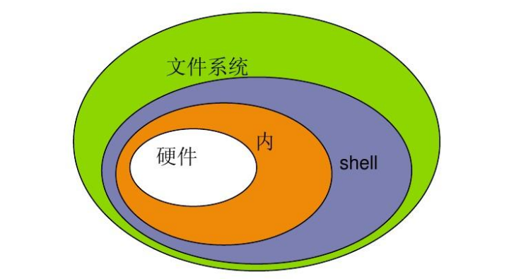

# 1、什么是shell？

shell是一个命令解释器，位于内核之外，主要服务于内核。

它将用户的指令解释（翻译）为内核能够直接识别的指令。以便于内核的执行。

类似于，与很多其他语言类似，比如就java，Python都拥有解释器。

在编程中，也有类似的做法，比如多态，版本更新，指令变更，但是内核执行的语言可能并没有改变。


shell的种类有很多种，常见的有bash和sh。




# 2、

```javascript
echo	输出
data	日期
whoami	查看当前用户
ls		展示文件夹
    -命令后面可以跟参数，有长参数和短参数的区分
    -a（all,所有):查看当前文件下的隐藏文件
    -d（dir,目录）:查看目录
    -l（long,长）:将文件的详细信息以长格式展开，ls -l 可以写成ll
    -h（human,人性化）:将文件的大小以单位显示，通常与-l联合使用
    -t（time，时间）:将文件以时间顺序逆序排序
    -r（reverse,逆序）:默认情况下是以文件名顺序排序，-r可以让文件名进行逆序排序
    -i（iNode）:打印每一个文件的iNode编号
touch test1：创建文件


```

