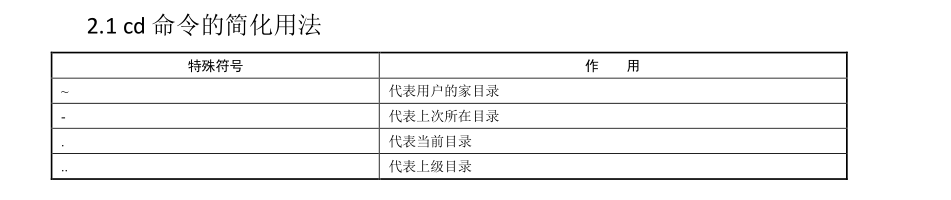

# **1 ．ls 命令
**

```javascript
ls		展示文件夹
    -命令后面可以跟参数，有长参数和短参数的区分
    -a（all,所有):查看当前文件下的隐藏文件
    -d（dir,目录）:查看目录
    -l（long,长）:将文件的详细信息以长格式展开，ls -l 可以写成ll
    -h（human,人性化）:将文件的大小以单位显示，通常与-l联合使用
    -t（time，时间）:将文件以时间顺序逆序排序
    -r（reverse,逆序）:默认情况下是以文件名顺序排序，-r可以让文件名进行逆序排序
    -i（iNode）:打印每一个文件的iNode编号
```

# **2. cd 命令
**

cd 是切换所在目录的命令，这个命令的基本信息如下。

```javascript
 命令名称：cd。
 英文原意：change directory。
 所在路径：Shell 内置命令。
 执行权限：所有用户。
```

功能描述：切换所在目录。



## **2.2 绝对路径和相对路径
**

```javascript
绝对路径：以跟目录为参照物，从根目录开始，一级一级进入目录
相对路径：以当前目录作为参照物，进行目录查找
```

# **3 ．pwd 命令
**

pwd 命令是查询所在目录的命令，基本信息如下：

```javascript
 命令名称：pwd
 英文原意：print name of current/working directory
 所在路径：/bin/pwd
 执行权限：所有用户。
 功能描述：查询所在的工作目录。
```

# **4 ．mkdir 命令
**

```javascript
mkdir 是创建目录的命令，其基本信息如下。
 命令名称：mkdir。
 英文原意：make directories。
 所在路径：/bin/mkdir。
 执行权限：所有用户。
 功能描述：创建空目录。
```

命令格式

```javascript
[root@localhost ~]# mkdir [选项] 目录名
选项：
-p: 递归建立所需目录，如果你要在一个还没有创建的目录中，创建一个目录，意思就是父目录一起创建，用这个选项
-v:可视化，显示操作的信息
```



```javascript
root@xwz ~]# mkdir dir1
[root@xwz ~]# mkdir /home/dir2 /home/dir3
[root@xwz ~]# mkdir /home/{dir4,dir5}
[root@xwz ~]# mkdir -v /home/{dir6,dir7} # 显示操作的消息
[root@xwz ~]# mkdir -v /home/dir8/111/22
[root@xwz ~]# mkdir -pv /home/dir8/111/22 # 创建目录和其所有父层目录
[root@xwz ~]# mkdir -pv /home/{abc/{dir1,111},efg}
```

# **5 ．rmdir 命令
**

既然有建立目录的命令，就一定会有删除目录的命令 rmdir，其基本信息如下。

```javascript
 命令名称：rmdir。
 英文原意：remove empty directories。
 所在路径：/bin/rmdir。
 执行权限：所有用户。
 功能描述：删除空目录。
```



命令格式

```javascript
[root@localhost ~]# rmdir [选项] 目录名
选项：
-p： 递归删除目录
```

rmdir 命令的作用十分有限，因为只能删除空目录，所以一旦目录中有内容，就会报错。

这个命令比较“笨”，所以我们不太常用。后续我们不论删除的是文件还是目录，都会使用 rm

命令