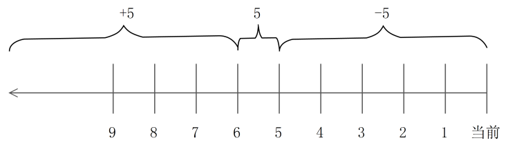

# **1、whereis命令（用于搜索Linux命令，不能用于搜索文件）**

**所在路径： /usr/bin/whereis**

**功能描述：命令的位置，以及相应帮助文档的位置**

```javascript
[root@bogon ~]# whereis ls
ls: /usr/bin/ls     /usr/share/man/man1/ls.1.gz
```

# **2、which命令（也是用于搜索Linux命令）**

**功能描述：显示命令路径，以及该命令是否有别名；**

```javascript
[root@bogon ~]# which ls
alias ls='ls --color=auto'
	/usr/bin/ls
```

# **3、locate 命令****（yum -y install mlocate)**

## **基本用法**

- **locate 命令是搜索文件的命令；**

- **优点：速度快，按照数据库进行搜索，消耗资源少；数据库位置/var/lib/mlocate/mlocate.db;updatedb 更新数据库；**

- **缺点：只能按照文件名搜索；**

```javascript
[root@bogon ~]# locate test.txt
/root/test/test.txt
```

```javascript
[root@localhost ~]# yum -y install mlocate # 安装locate
[root@localhost ~]# updatedb # 更新数据库
[root@localhost ~]# locate hosts # 查找hosts文件名的文件
[root@localhost ~]# locate /etc/sh # 查找/etc目录下所有以
```

## **默认情况下，locate数据库中会忽略某些文件夹，可以在配置文件中修改**

## **配置文件**

```javascript
[root@localhost ~]# vi /etc/updatedb.conf
PRUNE_BIND_MOUNTS = "yes"
# 开启搜索限制，也就是让这个配置文件生效
PRUNEFS = "……"
# 在 locate 执行搜索时，禁止搜索这些文件系统类型
PRUNENAMES = "……"
# 在 locate 执行搜索时，禁止搜索带有这些扩展名的文件
PRUNEPATHS = "……"
# 在 locate 执行搜索时，禁止搜索这些系统目录
```

```javascript
[root@localhost ~]# cat /etc/updatedb.conf
PRUNE_BIND_MOUNTS = "yes"
PRUNEFS = "9p afs anon_inodefs auto autofs bdev binfmt_misc cgroup cifs coda
configfs cpuset debugfs devpts ecryptfs exofs fuse fuse.sshfs fusectl gfs
gfs2 gpfs hugetlbfs inotifyfs iso9660 jffs2 lustre mqueue ncpfs nfs nfs4 nfsd
pipefs proc ramfs rootfs rpc_pipefs securityfs selinuxfs sfs sockfs sysfs
tmpfs ubifs udf usbfs ceph fuse.ceph"
PRUNENAMES = ".git .hg .svn .bzr .arch-ids {arch} CVS"
PRUNEPATHS = "/afs /media /mnt /net /sfs /tmp /udev /var/cache/ccache
/var/lib/yum/yumdb /var/lib/dnf/yumdb /var/spool/cups /var/spool/squid
/var/tmp /var/lib/ceph"
```

# **4、find命令 （****精准搜索****）**

## **1）按照文件名称搜索（如果省略参数，则搜索包含关键字的所有内容）**

```javascript
[root@localhost ~]# find 搜索路径 [选项] 搜索内容
选项：
    -name： 按照文件名搜索
    -iname： （ignore，忽略）按照文件名搜索，不区分文件名大小写
    -inum： （indoe,num)按照 inode 号搜索
```

## **2）按照文件大小搜索**

```javascript
按[root@localhost ~]# find 搜索路径 [选项] 搜索内容
选项：
    -size [+|-]大小： 按照指定大小搜索文件
                    这里的“+”的意思是搜索比指定大小还要大的文件，“-”的意思是搜索比指定大小还要小的文件。照文件大小搜索
                    #k要小写，M要大写
```

### **find命令 的单位**

```javascript
[root@localhost ~]# man find
-size n[cwbkMG]
File uses n units of space. The following suffixes can be used:
'b' for 512-byte blocks (this is the default if no suffix is used)   # 这是默认单位，如果单位为 b 或不写单位，则按照 512 Byte 搜索
'c' for bytes                                  # 搜索单位是 c ，按照字节搜索
'w' for two-byte words                         # 搜索单位是 w ，按照双字节（中文）搜索
'k' for Kilobytes (units of 1024 bytes)        # 按照 KB 单位搜索，必须是小写的 k
'M' for Megabytes (units of 1048576 bytes)     # 按照 MB 单位搜索，必须是大写的 M
'G' for Gigabytes (units of 1073741824 bytes)  # 按照 GB 单位搜索，必须是大写的 G
```

## **3）按照修改时间搜索**

```javascript
[root@localhost ~]# find 搜索路径 [选项] 搜索内容
选项：
    -atime [+|-]时间： 按照文件访问时间搜索 Access Time :访问时间
    -mtime [+|-]时间： 按照文件数据修改时间搜索 Modify time :修改时间
    -ctime [+|-]时间： 按照文件状态修改时间搜索 condition time ：状态时间
```

这三个时间的区别我们在 stat 命令中已经解释过了，这里用 mtime 数据修改时间来举例，重点说


说“[+-]”时间的含义。


```
 -5：    代表 5 天内修改的文件。

 5：     代表前 5～6 天那一天修改的文件。

 +5：    代表 6 天前修改的文件。

```

我们画一个时间轴，来解释一下，如图 4-6 所示。



## **4） 按照权限搜索****（permissions,权限）****
**

## **命令格式。
**

```javascript
[root@localhost ~]# find 搜索路径 [选项] 搜索内容
选项：
    -perm 权限模式： 查找文件权限刚好等于“权限模式”的文件
    -perm -权限模式： 查找文件权限全部包含“权限模式”的文件
    -perm +权限模式： 查找文件权限包含“权限模式”的任意一个权限的文件  #注意这个选项在Centos7 中是 -perm /权限模式
[root@server1 ~]# find . -perm  600  #搜索此目录下权限为600的文件
```

## **5） 按照所有者和所属组搜索
**

```javascript
[root@localhost ~]# find 搜索路径 [选项] 搜索内容
选项：
    -uid 用户 ID： 按照用户 ID 查找所有者是指定 ID 的文件
    -gid 组 ID： 按照用户组 ID 查找所属组是指定 ID 的文件
    -user 用户名： 按照用户名查找所有者是指定用户的文件
    -group 组名： 按照组名查找所属组是指定用户组的文件
    -nouser： 查找没有所有者的文件
```

**按照所有者和所属组搜索时，“-nouser”选项比较常用，主要用于查找垃圾文件。
**

**只有一种情况例外，那就是外来文件。比如光盘和 U 盘中的文件如果是由 Windows 复制的，在
**

**Linux 中查看就是没有所有者的文件；再比如手工源码包安装的文件，也有可能没有所有者**

## **6）按照文件类型搜索**

```javascript
[root@localhost ~]# find 搜索路径 [选项] 搜索内容
选项：
    -type d： 查找目录 dir
    -type f： 查找普通文件 file
    -type l： 查找软链接文件 link
```

## **7）逻辑运算符**

```javascript
[root@localhost ~]# find 搜索路径 [选项] 搜索内容
选项：
    -a： and 逻辑与
    -o： or 逻辑或
    -not： not 逻辑非
```

- **1）-a：and 逻辑与**


find 命令也支持逻辑运算符选项，其中-a 代表逻辑与运算，也就是-a 的两个条件都成立，find 搜


索的结果才成立。举个例子：


```
[root@localhost ~]# find . -size +2k -a -type f

# 在当前目录下搜索大于 2KB ，并且文件类型是普通文件的文件

```

- **2）-o：or 逻辑或**


-o 选项代表逻辑或运算，也就是-o 的两个条件只要其中一个成立，find 命令就可以找到结果。例


如：


```
[root@localhost ~]# find . -name cangls -o -name bols

./cangls

./bols

# 在当前目录下搜索文件名要么是 cangls 的文件，要么是 bols 的文件

```

- **3）-not（！）：not 逻辑非**


-not 是逻辑非，也就是取反的意思。举个例子：


```
[root@localhost ~]# find . -not -name cangls

# 在当前目录下搜索文件名不是 cangls 的文件
```

## **8）其他选项
**

1）-exec 选项


这里我们主要讲解两个选项“-exec”和“-ok”，这两个选项的基本作用非常相似。我们先来看


看“-exec”选项的格式。


```javascript
[root@localhost ~]# find 搜索路径 [选项] 搜索内容 -exec 命令 2 {} \;
 
  
```

其次，这个选项的作用其实是把 find 命令的结果交给由“-exec”调用的命令 2 来处理。“{}”就


代表 find 命令的查找结果。


2）-ok 选项


“-ok”选项和“-exec”选项的作用基本一致，区别在于：“-exec”的命令 2 会直接处理，而不询


问；“-ok”的命令 2 在处理前会先询问用户是否这样处理，在得到确认命令后，才会执行。

# **总结：**

搜索命令包含两大类搜索命令，分别是：

- 1、搜索Linux命令的命令：

- whereis  命令:搜索的结果是该命令的储存路径以及相对应的帮助文档的储存路径；

- which  	  命令：搜索的结果是该命令的储存路径，以及判断该命令是否是某个命令的别名，如果是显示原命令，否则不作显示；

- 2、搜索文件的命令：

- locate  文件名：搜索的结果是文件的路径；如果无结果，则不进行任何显示；

- 缺点：只能以文件名进行搜索；

- 优点：搜索的速度非常快，因为它不是在磁盘中进行搜索，而是在数据库中进行搜索，然而在磁盘中某些特定的文件并没有录入数据库（系统认为这些目录下的文件没有必要进行搜索）以至于是哪些文件，详情可以查看配置文件（见目录）；

- 注：如果第一次使用时显示"未找到此命令，需要添加软件包（yum -y install mlocate)即可；

- find：功能强大，可以根据文件的属性进行搜索，例如：文件名（-name)、文件的修改时间(-mtime)、文件的权限(-perm)、文件的所有者（所属组）(-uid)、文件的大小(-size)以及文件的类型(-type)进行搜索；

- 与之相对应的有两个语句：逻辑运算（-a、-o、-not)以及-exec语句，可以加强find命令的功能；