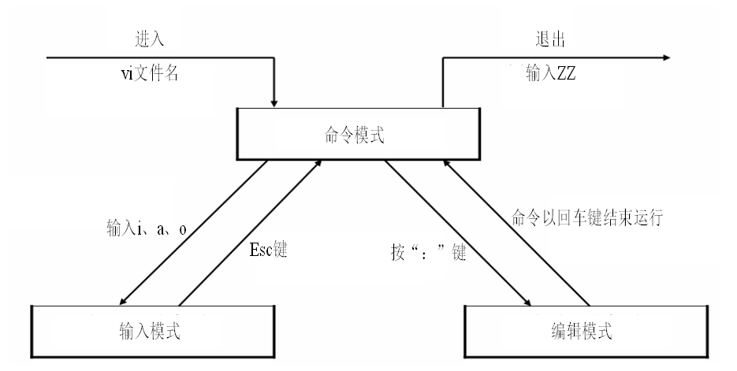
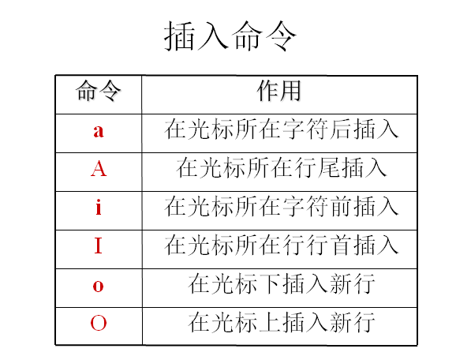

## 1 vim的工作 模式


vim 工作在三种模式之下：





## 命令模式 ：

是主要使用快捷键的模式，是我们后面学习的重点。命令模式想要进入输入模式，可


以使用以下的方式：





## 输入模式 ：

主要用于文本编辑，和记事本类似，输入数据就好。


## 末行模式 （编辑模式）(ctrl+c快速进入行末模式) ：


```javascript
:w 			#保存不退出
    ：w 【新文件名】 	# 把文件另存为新文件
:q 			#不保存退出
:wq 			#保存退出
:! 			#强制
:q! 			#强制不保存退出，用于修改文件之后，不保存数据退出。
:wq! 			#强制保存退出，当文件的所有者或者 root 用户，对文件没有写权限的时候，强制写入数据使用
```

