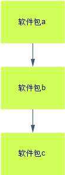

# 1、软件包分类

- 源码包；

- 二进制包；

## 1）源码包：

```javascript
以下例[root@localhost ~]# vim hello.c
#include <stdio.h>
int main (void)
{
printf ("hello world\n");
}子就可以作为一个源码包
```


```javascript
[root@localhost ~]# rpm -ivh /mnt/cdrom/Packages/gcc-4.4.6-4.el6.i686.rpm
.......
[root@localhost ~]# gcc -c hello.c
#-c 生成“.o”头文件。这里会生成 hello.o 头文件，但是不会生成执行文件
[root@localhost ~]# gcc -o hello hello.o
#-o 生成执行文件，并制定执行文件名。这里生成的 hello 就是可执行文件
[root@localhost ~]# ./hello
hello world
#执行 hello 文件
```

## 2) 源码包特点


源码包的优点是：


 开源，如果有足够的能力，可以修改源代码


 可以自由选择所需的功能


 软件是编译安装，所以更加适合自己的系统，更加稳定也效率更高


 卸载方便


缺点:


 安装过程步骤较多，尤其安装较大的软件集合时（如 LAMP 环境搭建），容易出现拼写


错误


 编译过程时间较长，安装比二进制安装时间长


 因为是编译安装，安装过程中一旦报错新手很难解决


# 2、二进制包（dpkg,rpm,srpm包）


## 1 二进制包 分类


 DPKG 包：是由 Debian Linux 所开发出来的包管理机制，通过 DPKG 包，Debian Linux


就可以进行软件包管理。主要应用在 Debian 和 unbuntu 中。


 RPM 包：是由 Red Hat 公司所开发的包管理系统。功能强大，安装、升级、查询和卸载


都非常简单和方便。目前很多 Linux 都在使用这种包管理方式，包括 Fedora、CentOS、


SuSE 等。我们学习的是 CentOS 6.3，所以我们将要学习 RPM 包管理系统


## 2 特点


RPM 包的优点：


 包管理系统简单，只通过几个命令就可以实现包的安装、升级、查询和卸载


 安装速度比源码包安装快的多


RPM 包的缺点:


 经过编译，不再可以看到源代码


 功能选择不如源码包灵活


 依赖性。有时我们会发现需要安装软件包 a 时需要先安装 b 和 c，而安装 b 时需要安装


d 和 e。这是需要先安装 d 和 e，再安装 b 和 c，最后才能安装 a 包。比如说，我买了个


漂亮的灯具，打算安装到我们家客厅，可是在安装灯具之前我们家客厅总要有顶棚吧，


顶棚总要是做好了防水和刷好油漆了吧，这个装修和安装软件其实类似总要有一定的顺


序的。可是有时依赖性会非常繁琐


## 3 RPM 包依赖




## 


1）树形依赖 a---->b---->c


2）环形依赖 a---->b---->c---->a


3）函数库依赖（www.rpmfind.net)可以通过这个网站查找所依赖的包名；


# 3、什么是SRPM包？

1、说白了，srpm就是rpm还没有编译成二进制包之前的源代码。

2、但是srpm包中已经存在了相应的configure和makefile，以及所需要的

依懒性软件说明，和rpm包所提供的的数据。

意思就是rpm包里面有的，srpm包里基本都有（除了编译之后的二进制文件），而且还多了

源码。


