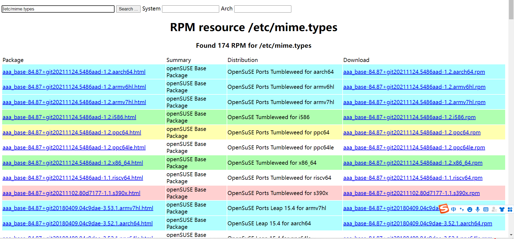
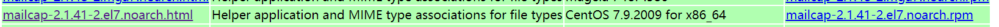

# **1 、rpm包命名规则**

```javascript
httpd-2.2.15-15.el6.centos.1.i686.rpm
```

- httpd 软件包名


- 2.2.15 软件版本


- 15 软件发布的次数


- el6 软件发行商。el6 是 RedHat 公司发布，适合 RHEL6.x （Red Hat Enterprise Linux）和 CentOS6.x


下使用


- i686 适合的硬件平台。RPM 包可以在不同的硬件平台安装，选择适合不同 CPU 的软件版本，可以


最大化的发挥 CPU 性能，所以出现了所谓的 i386（386 以上计算机都可以安装）、i586（586


以上的计算机都可以安装）、i686（奔腾 II 以上计算机都可以安装，目前所有的 CPU 都是


奔腾 II 以上，所以这个软件版本居多）、x86_64（64 位 CPU 可以安装）和 noarch（没有硬


件限制）等文件名了。


- rpm rpm 包的扩展名。我们说过 Linux 下文件不是靠扩展名区分文件类型，也就是 Linux 中扩展


名没有任何含义。可是这里怎么又出现了扩展名呢？原因很简单，如果我不把 RPM 的扩展名


叫做“.rpm”，管理员很难知道这是一个 RPM 包，当然也就无法正确安装了。也就是说如果


RPM 包不用“.rpm”作为扩展名，系统可以正确识别没有问题，可是管理员很难识别这是个
什么样的软件。


**包全名：如果操作的是**

**包名：如果操作的是已经安装的软件包，则使用包名即可，系统会生产 RPM 包的数据库**

**        （/var/lib/rpm/），而且可以在任意路径下操作**

## **2、安装位置**

| RPM包默认安装位置 | 
| -- | -- |
| /etc/ | 配置文件安装目录 | 
| /usr/bin/ | 可执行的命令的安装目录 | 
| /usr/lib/ | 程序所使用的函数库的保存位置 | 
| /user/share/doc/ | 基本的软件的使用手册保存位置 | 
| /usr/share/man/ | 帮助文档保存位置 | 


# **3.  RPM 包安装
**

1)安装命令


```javascript
rpm –ivh 包全名  选项
#注意一定是包全名。如果跟包全名的命令要注意路径，因为软件包在光盘当中
选项：
-i install 安装（install）
-v 显示更详细的信息（verbose）
-h 打印#显示安装进度（hash）
```

```javascript
 --nodeps 不检测依赖性安装。软件时会检测依赖性，确定所需的底层软件是否安装。

    	如果没有安装则会报错。如果我不管依赖性，想强行安装，可以使用这个选项。注意：

   	 这样不检测依赖性安装的软件基本是不能使用的，所以不建议这样做

 --replacefiles 替换文件安装。如果安装软件包，可是包中部分文件已经存在，那么

   	 正常安装时候，会报错“某个文件已经存在”从而导致软件无法安装，使用这个选项可

   	 以忽视这个报错，而覆盖安装

 --replacepkgs 替换软件包安装。如果软件包已经安装，此选项可以把软件包重复安装一遍。

 --force 强制安装。不管是否已经安装，都重新安装。就是—replacefiles 和—replacepkgs 的综合。

 --test 测试安装。不会实际安装，只是检测一下依赖性。

 --prefix 指定安装路径。为安装软件指定安装路径，而不使用默认安装路径。注意：

    	如果指定了安装路径，软件没有安装到系统默认路径中的话，系统会找不到这些安装的

  	  	软件，需要进行手工配置才能被系统识别。所以 rpm 包我们一般都采用默认路径安装。

```

## **2）服务启动
**

```javascript
[root@localhost ~]# service 服务名 start|stop|restart|status
（centos7 的命令是：systemctl start httpd)
参数：
start： 启动服务
stop： 停止服务
restart： 重启服务
status： 查看服务状态
[root@localhost ~]# systemctl restart httpd
#这个命令也行
```

**备注：如果启动后无法打开本地网页需要**

*service*

service firewalld start

或

systemctl start firewalld

# 启动

service firewalld stop

或

systemctl stop firewalld

# 停止

service firewalld restart

或

systemctl restart firewalld

# 重启

网页位置：

/var/www/html/

配置文件：

/etc/http/conf/httpd.conf;

# **4、实践手动安装httpd服务**

## **1）下载httpd-2.4.6-97.el7.centos.4.x86_64.rpm包****(yum install -y wget)**

```javascript
[root@server1 ~]# wget http://mirror.centos.org/centos/7/updates/x86_64/Packages/httpd-2.4.6-97.el7.centos.4.x86_64.rpm
```

## **2)安装rpm -ivh httpd-2.4.6-97.el7.centos.4.x86_64.rpm**

```javascript
[root@server1 ~]# rpm -ivh httpd-2.4.6-97.el7.centos.4.x86_64.rpm 
错误：依赖检测失败：
	/etc/mime.types 被 httpd-2.4.6-97.el7.centos.4.x86_64 需要
	httpd-tools = 2.4.6-97.el7.centos.4 被 httpd-2.4.6-97.el7.centos.4.x86_64 需要
	libapr-1.so.0()(64bit) 被 httpd-2.4.6-97.el7.centos.4.x86_64 需要
	libaprutil-1.so.0()(64bit) 被 httpd-2.4.6-97.el7.centos.4.x86_64 需要
#需要手动解决依赖
```

**方法一：**

**A**

```javascript
[root@server1 ~]# yum deplist httpd
已加载插件：fastestmirror
Loading mirror speeds from cached hostfile
 * base: mirrors.ustc.edu.cn
 * epel: mirrors.ustc.edu.cn
 * extras: mirrors.cn99.com
 * updates: mirrors.cn99.com
软件包：httpd.x86_64 2.4.6-97.el7.centos.4
   依赖：/bin/sh
   
   provider: bash.x86_64 4.2.46-35.el7_9
   依赖：/etc/mime.types
   provider: mailcap.noarch 2.1.41-2.el7			#提供者为这个rpm包
   
   依赖：/usr/sbin/groupadd
   provider: shadow-utils.x86_64 2:4.6-5.el7
   依赖：/usr/sbin/useradd
。。。。。。。
```

从上面可以看到/etc/mine.types的提供者为mailcap.noarch ...这个包

**B：直接通过yum install -y mailcap 安装这个包**

```javascript
[root@server1 ~]# yum install -y mailcap.noarch 
```

**C：再次手动安装httpd，rpm**

```javascript
[root@server1 ~]# rpm -ivh httpd-2.4.6-97.el7.centos.4.x86_64.rpm 
错误：依赖检测失败：
	httpd-tools = 2.4.6-97.el7.centos.4 被 httpd-2.4.6-97.el7.centos.4.x86_64 需要
	libapr-1.so.0()(64bit) 被 httpd-2.4.6-97.el7.centos.4.x86_64 需要
	libaprutil-1.so.0()(64bit) 被 httpd-2.4.6-97.el7.centos.4.x86_64 需要
```

**发现刚才的依赖已经解决。**

**后面按照这个方法依次解决即可。**

**通过yum 安装剩下的所有依赖**

```javascript
[root@server1 ~]# yum install httpd-tools.x86_64 apr.x86_64 apr-util.x86_64 -y
。。。。。。。
Running transaction
  正在安装    : apr-1.4.8-7.el7.x86_64                                                 1/3 
  正在安装    : apr-util-1.5.2-6.el7.x86_64                                            2/3 
  正在安装    : httpd-tools-2.4.6-97.el7.centos.4.x86_64                               3/3 
  验证中      : httpd-tools-2.4.6-97.el7.centos.4.x86_64                               1/3 
  验证中      : apr-1.4.8-7.el7.x86_64                                                 2/3 
  验证中      : apr-util-1.5.2-6.el7.x86_64                                            3/3 

已安装:
  apr.x86_64 0:1.4.8-7.el7                           apr-util.x86_64 0:1.5.2-6.el7        
  httpd-tools.x86_64 0:2.4.6-97.el7.centos.4        

完毕！
```

**再次手动安装**

```javascript
[root@server1 ~]# rpm -ivh httpd-2.4.6-97.el7.centos.4.x86_64.rpm 
准备中...                          ################################# [100%]
正在升级/安装...
   1:httpd-2.4.6-97.el7.centos.4      ################################# [100%]
```

**成功安装！！！**

**方法二**

**通过**[**www.rpmfind.net**](http://www.rpmfind.net)**这个网站去寻找所需要的依赖的提供者，然后下载相应的rpm包，进行手动安装。**

**这个方法比较复杂，是用于在Centos无法联网的情况下进行。**

**A:查询**



        



图2

**如上图2，已经找到，只需要点击右侧下载即可。**

**然后倒入linux系统，安装即可。**