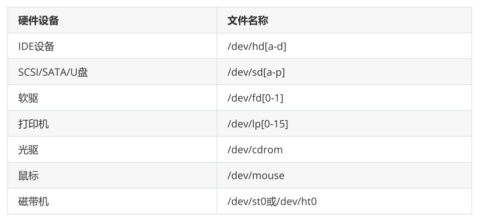

# 1、硬盘主要接口

SATA（Serial ATA）

SAS（Serial Attached SCSI）

# 2、硬盘设备命名

# 3、分区方式

**MBR:**

**GPT:**

**注意：从MBR转到GPT，或从GPT转换到MBR会导致数据全部丢失**

# **4、存储结构与磁盘划分**

Linux系统中常见的目录名称以及相应内容

**表示路径的方式：**

- 绝对路径指的是从根目录（/）开始写起的文件或目录名称

- 相对路径则指的是相对于当前路径的写法

# 5、物理设备的命名规则

常见的硬件设备及其文件名称

**设备文件名称：**

# 6、文件系统与数据资料

文件系统的作用是合理规划硬盘，以保证用户正常的使用需求。Linux系统支持数十种的文件系统，而最

常见的文件系统如下所示。

**格式化后会发生如下事情**

计算机系统在发展过程中产生了众多的文件系统，为了使用户在读取或写入文件时不用关心底层的硬盘

结构，Linux内核中的软件层为用户程序提供了一个VFS（Virtual File System，虚拟文件系统）接口，

这样用户实际上在操作文件时就是统一对这个虚拟文件系统进行操作了。

