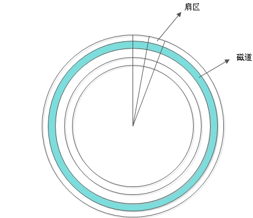
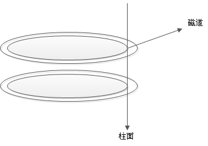

# 一、硬盘结构（机械）

## 1、硬盘的逻辑结构

每个扇区的大小事固定的，为 512Byte。扇区也是磁盘的最小存贮单位。

硬盘的大小是使用“磁头数×柱面数×扇区数×每个扇区的大小”这样的公式来计算的。其中磁

头数（Heads）表示硬盘总共有几个磁头，也可以理解成为硬盘有几个盘面，然后乘以二；柱面数

（Cylinders）表示硬盘每一面盘片有几条磁道；扇区数（Sectors）表示每条磁道上有几个扇区；每

个扇区的大小一般是 512Byte。

## 2、硬盘接口

-  IDE 硬盘接口（Integrated Drive Electronics，并口，即电子集成驱动器）也称作“ATA 硬盘”

或“PATA 硬盘”，是早期机械硬盘的主要接口，ATA133 硬盘的理论速度可以达到 133MB/s

（此速度为理论平均值），IDE 硬盘接口

-  SATA 接口（Serial ATA，串口）是速度更高的硬盘标准，具备了更高的传输速度，并具备了

更强的纠错能力。目前已经是 SATA 三代，理论传输速度达到 600MB/s（此速度为理论平均

值）

-  SCSI 接口（Small Computer System Interface，小型计算机系统接口）广泛应用在服务器上，

具有应用范围广、多任务、带宽大、CPU 占用率低及支持热插拔等优点，理论传输速度达到

320MB/s

