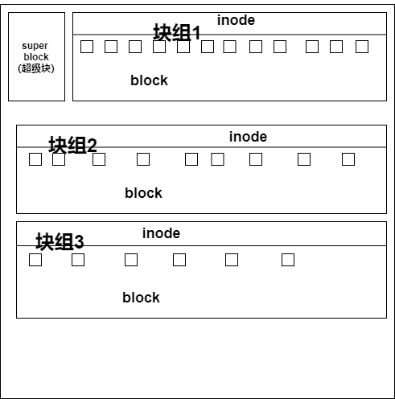

# **1.  Linux 文件系统的特性：
**

-  super block（超级块）：记录整个文件系统的信息，包括 block 与 inode 的总量，已经使


用的 inode 和 block 的数量，未使用的 inode 和 block 的数量，block 与 inode 的大小，文


件系统的挂载时间，最近一次的写入时间，最近一次的磁盘检验时间等。


-  date block（数据块，也称作 block）：用来实际保存数据的（柜子的隔断），block 的大


小（1KB、2KB 或 4KB）和数量在格式化后就已经决定，不能改变，除非重新格式化（制作柜


子的时候，隔断大小就已经决定，不能更改，除非重新制作柜子）。每个 blcok 只能保存一


个文件的数据，要是文件数据小于一个 block 块，那么这个 block 的剩余空间不能被其他文


件是要；要是文件数据大于一个 block 块，则占用多个 block 块。Windows 中磁盘碎片整理


工具的原理就是把一个文件占用的多个 block 块尽量整理到一起，这样可以加快读写速度。


-  inode（i 节点，柜子门上的标签）：用来记录文件的权限（r、w、x），文件的所有者和属


组，文件的大小，文件的状态改变时间（ctime），文件的最近一次读取时间（atime），文


件的最近一次修改时间（mtime），文件的数据真正保存的 block 编号。每个文件需要占用


一个 inode。



# **2.  Linux 常见文件系统
**


- ext

```javascript
 Linux 中最早的文件系统，由于在性能和兼容性上具有很多缺陷，现在已经很少使用

```

- ext2

```javascript

 是 ext 文件系统的升级版本，Red Hat Linux 7.2 版本以前的系统默认都是 ext2 文件

系 统 。 于 1993 年 发 布 ， 支 持 最 大 16TB 的 分 区 和 最 大 2TB 的 文 件

（1TB=1024GB=1024×1024KB）

```

- ext3


```javascript
 是 ext2 文件系统的升级版本，最大的区别就是带日志功能，以便在系统突然停止时

提高文件系统的可靠性。支持最大 16TB 的分区和最大 2TB 的文件

```

- ext4


```javascript
是 ext3 文件系统的升级版。ext4 在性能、伸缩性和可靠性方面进行了大量改进。
ext4 的变化可以说是翻天覆地的，比如向下兼容 ext3、最大 1EB 文件系统和 16TB 文件、无

限数量子目录、Extents 连续数据块概念、多块分配、延迟分配、持久预分配、快速 FSCK、

日志校验、无日志模式、在线碎片整理、inode 增强、默认启用 barrier 等。它是 CentOS6.x 的默认文件系统

```

- xfs


```javascript
XFS 最早针对 IRIX 操作系统开发，是一个高性能的日志型文件系统，能够在断电以及

操作系统崩溃的情况下保证文件系统数据的一致性。它是一个 64 位的文件系统，后来

进行开源并且移植到了 Linux 操作系统中，目前 CentOS 7.x 将 XFS+LVM 作为默认的文

件系统。据官方所称，XFS 对于大文件的读写性能较好。

```


- swap


```javascript
swap 是 Linux 中用于交换分区的文件系统（类似于 Windows 中的虚拟内存），当内存

不够用时，使用交换分区暂时替代内存。一般大小为内存的 2 倍，但是不要超过 2GB。

它是 Linux 的必需分区

```

- NFS


```javascript
NFS 是网络文件系统（Network File System）的缩写，是用来实现不同主机之间文件

共享的一种网络服务，本地主机可以通过挂载的方式使用远程共享的资源

```

- iso9660 

```javascript
光盘的标准文件系统。Linux 要想使用光盘，必须支持 iso9660 文件系统

```

- fat 

```javascript
就是 Windows 下的 fat16 文件系统，在 Linux 中识别为 fat

```

- vfat


```javascript
就是 Windows 下的 fat32 文件系统，在 Linux 中识别为 vfat。支持最大 32GB 的分区

和最大 4GB 的文件

```

- NTFS


```javascript
就是 Windows 下的 NTFS 文件系统，不过 Linux 默认是不能识别 NTFS 文件系统的，如

果需要识别，则需要重新编译内核才能支持。它比 fat32 文件系统更加安全，速度更快，

支持最大 2TB 的分区和最大 64GB 的文件

```

- ufs

```javascript
 Sun 公司的操作系统 Solaris 和 SunOS 所采用的文件系统

```

- proc 

```javascript
Linux 中基于内存的虚拟文件系统，用来管理内存存储目录/proc

```

- sysfs

```javascript
 和 proc 一样，也是基于内存的虚拟文件系统，用来管理内存存储目录/sysfs

```

- tmpfs 

```javascript
也是一种基于内存的虚拟文件系统，不过也可以使用 swap 交换分区
```

# **3、常用的硬盘管理命令**

## **1）df 命令   （统计硬盘空间的使用情况，包括垃圾文件，临时文件，以及没有被释放掉的空间的大小）**

**Linux df（英文全拼：**

```javascript
 alhost ~]# df –ahT
#-a （all,所有）显示特殊文件系统，这些文件系统几乎都是保存在内存中的。如/proc，因为是挂载在内存中，所以占用量都是 0
#-h 单位不再只用 KB，而是换算成习惯单位  #human,人性化
#-T 多出了文件系统类型一列	#type,类型
[root@bogon ~]# df -h
文件系统                 容量  已用  可用 已用% 挂载点
devtmpfs                 898M     0  898M    0% /dev
tmpfs                    910M     0  910M    0% /dev/shm
tmpfs                    910M  9.6M  901M    2% /run
tmpfs                    910M     0  910M    0% /sys/fs/cgroup
/dev/mapper/centos-root   17G  2.0G   16G   12% /
/dev/sda1               1014M  151M  864M   15% /boot
tmpfs                    182M     0  182M    0% /run/user/0
```

## **2）du 命令 （统计文件的总大小）**

**Linux du（英文全拼：disk usage，usage:用量），用于显示文件或者目录的大小，不包括临时文件和垃圾文件**

## **备注：ls -l 只能统计文件的大小，而不能统计目录的大小(它统计的目录名所占的大小)****
**

```javascript
[root@localhost ~]# du [选项] [目录或文件名]
选项：
-a 显示每个子文件的磁盘占用量。默认只统计子目录的磁盘占用量
-h 使用习惯单位显示磁盘占用量，如 KB，MB 或 GB 等
-s 统计总占用量，而不列出子目录和子文件的占用量		#sum,总合
 [root@bogon ~]# du -sh /usr/
1.4G	/usr/
```

**du 与 df 的区别：du 是用于统计文件大小的，统计的文件大小是准确的；df 是用于统计空间大小的，统计的剩余空是准确的
**

**lsof | grep deleted**

# **3、fsck 文件系统修复命令**

**Linux fsck（英文全拼：file system check）命令用于检查与修复 Linux 档案系统，可以同时检查一个或多个 Linux 档案系统。**

```javascript
3、fsck 文件系统修复命令
[root@localhost ~]# fsck –y /dev/sdb1
#自动修复
[root@bogon ~]# fsck -y /dev/sda1
fsck，来自 util-linux 2.23.2
/sbin/fsck.xfs: XFS file system.
[root@bogon ~]# 
```

# **4、显示磁盘状态 dumpe2fs（cenos6）
**

```javascript
[root@localhost ~]# dumpe2fs /dev/sda3
dumpe2fs 1.41.12 (17-May-2010)
Filesystem volume name: <none> 卷标名
Last mounted on: / 挂载点
Filesystem UUID: c2ca6f57-b15c-43ea-bca0-f239083d8bd2 UUID
Filesystem magic number: 0xEF53
Filesystem revision #: 1 (dynamic)
Filesystem features: has_journal ext_attr resize_inode dir_index filetype
needs_recovery extent flex_bg spars
e_super large_file huge_file uninit_bg dir_nlink extra_isize
Filesystem flags: signed_directory_hash
Default mount options: user_xattr acl 挂载参数
Filesystem state: clean 文件系统状态，正常
Errors behavior: Continue
Filesystem OS type: Linux
Inode count: 1826816 inode 总数
Block count: 7300864 块总素
Reserved block count: 365043
Free blocks: 6634637
Free inodes: 1753533
First block: 0
Block size: 4096 块大小
Fragment size: 4096
Reserved GDT blocks: 1022
Blocks per group: 32768
Fragments per group: 32768
Inodes per group: 8192
Inode blocks per group: 512
Flex block group size: 16
Filesystem created: Mon Nov 12 22:30:41 2012
Last mount time: Tue Apr 9 23:53:29 2013
Last write time: Mon Nov 12 22:45:55 2012
Mount count: 3
Maximum mount count: -1
Last checked: Mon Nov 12 22:30:41 2012
Check interval: 0 (<none>)
Lifetime writes: 3199 MB
Reserved blocks uid: 0 (user root)
Reserved blocks gid: 0 (group root)
First inode: 11
Inode size: 256 inode 的大小
…省略部分输出…
Group 0: (Blocks 0-32767) [ITABLE_ZEROED] 第一个数据组的内容
校验和 0xcb85,8179 个未使用的 inode
主 superblock at 0, Group descriptors at 1-2
保留的 GDT 块位于 3-1024
Block bitmap at 1025 (+1025), Inode bitmap at 1041 (+1041)
Inode 表位于 1057-1568 (+1057)
23513 free blocks, 8179 free inodes, 2 directories, 8179 个未使用的 inodes
可用块数: 9255-32767
可用 inode 数: 14-8192
…省略部分输出…
```

## **Centos7 使用 xfs_info或者sfx_growfs**

```javascript
[root@bogon ~]# xfs_info /dev/sda1
meta-data=/dev/sda1              isize=512    agcount=4, agsize=65536 blks
         =                       sectsz=512   attr=2, projid32bit=1
         =                       crc=1        finobt=0 spinodes=0
data     =                       bsize=4096   blocks=262144, imaxpct=25
         =                       sunit=0      swidth=0 blks
naming   =version 2              bsize=4096   ascii-ci=0 ftype=1
log      =internal               bsize=4096   blocks=2560, version=2
         =                       sectsz=512   sunit=0 blks, lazy-count=1
realtime =none                   extsz=4096   blocks=0, rtextents=0
   
[root@bogon ~]# xfs_growfs /dev/sda1
meta-data=/dev/sda1              isize=512    agcount=4, agsize=65536 blks
         =                       sectsz=512   attr=2, projid32bit=1
         =                       crc=1        finobt=0 spinodes=0
data     =                       bsize=4096   blocks=262144, imaxpct=25
         =                       sunit=0      swidth=0 blks
naming   =version 2              bsize=4096   ascii-ci=0 ftype=1
log      =internal               bsize=4096   blocks=2560, version=2
         =                       sectsz=512   sunit=0 blks, lazy-count=1
realtime =none                   extsz=4096   blocks=0, rtextents=0
```

# **5、查看文件的详细信息**

**stat 文件名 查看文件的详细时间**

例如

```javascript
[root@localhost ~]# stat test.sh
File: `test.sh'
#文件名
Size: 427 Blocks: 8 IO Block: 4096 regular file
#文件大小 占用块 系统分区块大小
Device: fd00h/64768d Inode: 23724038 Links: 1
#存放文件的设备 inode 号 硬链接数
Access: (0755/-rwxr-xr-x) Uid: ( 0/ root) Gid: ( 0/ root)
权限 属主 属组
Access: 2011-10-29 22:27:45.000000000 +0800
Modify: 2011-09-14 18:02:00.000000000 +0800
Change: 2011-10-25 22:21:44.000000000 +0800
access 访问时间
modify 数据修改时间
change 状态修改时间
```

# **6、判断类型**

## **file 文件名 判断文件类型**

```javascript
[root@bogon ~]# file test1
test1: ASCII text            //普通文件
[root@bogon ~]# file httpd-2.4.48
httpd-2.4.48: directory
[root@bogon ~]# file .bash_history 
.bash_history: UTF-8 Unicode text
```

## **
**

## **type 命令名 判断命令类型**

```javascript
[root@bogon ~]# type ls
ls 是 `ls --color=auto' 的别名
[root@bogon ~]# type mkdir
mkdir 是 /usr/bin/mkdir
[root@bogon ~]# 
[root@bogon ~]# type cd
cd 是 shell 内嵌
```

# **7、lsblk 命令，列出块设备信息**

补充说明

**lsblk命令**

### **选项**

```javascript
-a, --all            显示所有设备。
-b, --bytes          以bytes方式显示设备大小。
-d, --nodeps         不显示 slaves 或 holders。
-D, --discard        print discard capabilities。
-e, --exclude <list> 排除设备 (default: RAM disks)。
-f, --fs             显示文件系统信息。
-h, --help           显示帮助信息。
-i, --ascii          use ascii characters only。
-m, --perms          显示权限信息。
-l, --list           使用列表格式显示。
-n, --noheadings     不显示标题。
-o, --output <list>  输出列。
-P, --pairs          使用key="value"格式显示。
-r, --raw            使用原始格式显示。
-t, --topology       显示拓扑结构信息。
```

### **实例**

lsblk命令默认情况下将以树状列出所有块设备。打开终端，并输入以下命令：

```javascript
lsblk
NAME   MAJ:MIN rm   SIZE RO type mountpoint
sda      8:0    0 232.9G  0 disk 
├─sda1   8:1    0  46.6G  0 part /
├─sda2   8:2    0     1K  0 part 
├─sda5   8:5    0   190M  0 part /boot
├─sda6   8:6    0   3.7G  0 part [SWAP]
├─sda7   8:7    0  93.1G  0 part /data
└─sda8   8:8    0  89.2G  0 part /personal
sr0     11:0    1  1024M  0 rom
```

7个栏目名称如下：

```javascript
NAME ：这是块设备名。
MAJ:MIN ：本栏显示主要和次要设备号。
RM ：本栏显示设备是否可移动设备。注意，在本例中设备sdb和sr0的RM值等于1，这说明他们是可移动设备。
SIZE ：本栏列出设备的容量大小信息。例如298.1G表明该设备大小为298.1GB，而1K表明该设备大小为1KB。
RO ：该项表明设备是否为只读。在本案例中，所有设备的RO值为0，表明他们不是只读的。
TYPE ：本栏显示块设备是否是磁盘或磁盘上的一个分区。在本例中，sda和sdb是磁盘，而sr0是只读存储（rom）。
MOUNTPOINT ：本栏指出设备挂载的挂载点。
```

默认选项不会列出所有空设备。要查看这些空设备，请使用以下命令：

```javascript
lsblk -a
```

lsblk命令也可以用于列出一个特定设备的拥有关系，同时也可以列出组和模式。可以通过以下命令来获取这些信息：

```javascript
lsblk -m
```

该命令也可以只获取指定设备的信息。这可以通过在提供给lsblk命令的选项后指定设备名来实现。例如，你可能对了解以字节显示你的磁盘驱动器大小比较感兴趣，那么你可以通过运行以下命令来实现：

```javascript
lsblk -b /dev/sda
等价于
lsblk --bytes /dev/sda
```

你也可以组合几个选项来获取指定的输出。例如，你也许想要以列表格式列出设备，而不是默认的树状格式。你可能也对移除不同栏目名称的标题感兴趣。可以将两个不同的选项组合，以获得期望的输出，命令如下：

```javascript
lsblk -nl
```

要获取SCSI设备的列表，你只能使用-S选项。该选项是大写字母S，不能和-s选项混淆，该选项是用来以颠倒的顺序打印依赖的。

```javascript
lsblk -S
```

lsblk列出SCSI设备，而-s是逆序选项（将设备和分区的组织关系逆转过来显示），其将给出如下输出。输入命令：

```javascript
lsblk -s
```