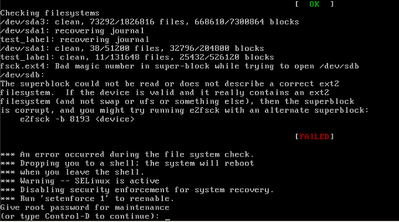
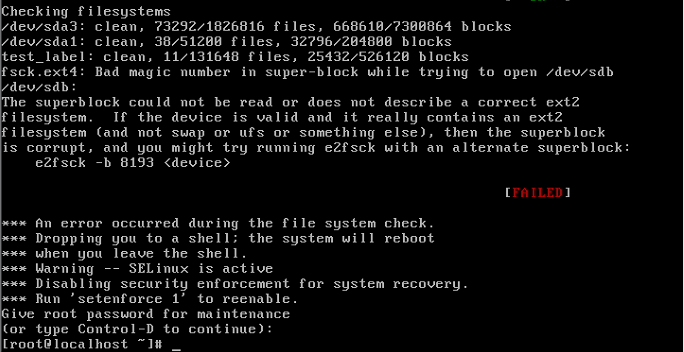
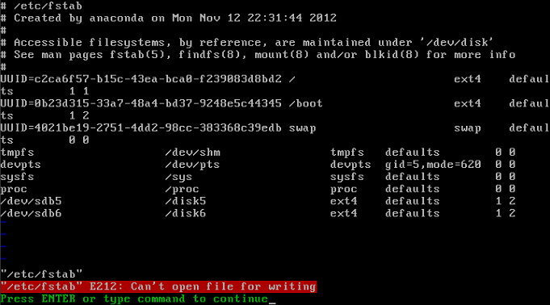

# **为硬盘分区的目的就是，就是在为硬盘进行格式化之前做好准备，等硬盘格式化完成之后，电脑才可以使用这块硬盘（分区，就是和windows中，把硬盘分成C盘，D盘是一个道理）**

# **1、fdisk命令手工分区**

## **1） fdisk  -l    查看系统所有硬盘及分区(fdisk,file disk)(-l,look,查看）**

```javascript
[root@bogon ~]# fdisk -l
磁盘 /dev/sdb：21.5 GB, 21474836480 字节，41943040 个扇区
Units = 扇区 of 1 * 512 = 512 bytes
扇区大小(逻辑/物理)：512 字节 / 512 字节
I/O 大小(最小/最佳)：512 字节 / 512 字节
磁盘标签类型：dos
磁盘标识符：0x9343e0d9
   设备 Boot      Start         End      Blocks   Id  System
/dev/sdb1            2048     4196351     2097152   83  Linux
/dev/sdb2         4196352    41943039    18873344    5  Extended
/dev/sdb5         4198400     8392703     2097152   83  Linux
磁盘 /dev/sda：21.5 GB, 21474836480 字节，41943040 个扇区
Units = 扇区 of 1 * 512 = 512 bytes
扇区大小(逻辑/物理)：512 字节 / 512 字节
I/O 大小(最小/最佳)：512 字节 / 512 字节
磁盘标签类型：dos
磁盘标识符：0x000e1578
   设备 Boot      Start         End      Blocks   Id  System
/dev/sda1   *        2048     2099199     1048576   83  Linux
/dev/sda2         2099200    41943039    19921920   8e  Linux LVM
磁盘 /dev/mapper/centos-root：18.2 GB, 18249416704 字节，35643392 个扇区
Units = 扇区 of 1 * 512 = 512 bytes
扇区大小(逻辑/物理)：512 字节 / 512 字节
I/O 大小(最小/最佳)：512 字节 / 512 字节
磁盘 /dev/mapper/centos-swap：2147 MB, 2147483648 字节，4194304 个扇区
Units = 扇区 of 1 * 512 = 512 bytes
扇区大小(逻辑/物理)：512 字节 / 512 字节
I/O 大小(最小/最佳)：512 字节 / 512 字节
```


## **2） fdisk  /dev/sdb    进行磁盘分区（分区没有分区号）**

**在分区之前，要关闭虚拟机，手动添加一块磁盘**

### **然后使用fdisk -l 就可以看到，新加入的磁盘(sdb,仅仅只是设备的名称）**

```javascript
[root@server1 ~]# fdisk -l

磁盘 /dev/sdb：21.5 GB, 21474836480 字节，41943040 个扇区		#新加入的磁盘，还没有进行分区
Units = 扇区 of 1 * 512 = 512 bytes
扇区大小(逻辑/物理)：512 字节 / 512 字节
I/O 大小(最小/最佳)：512 字节 / 512 字节
```

### **使用fdisk进行分区**

**注意的是，**

**1、主分区加上扩展分区最多只能有4个，然后扩展分区里面，只能用来分逻辑分区，不可以写入数据。所以逻辑分区的分区号，默认初始值为5，5就表示第一个逻辑分区；**

**2、分区完毕之后，需要写入文件系统，也就是格式化；**

**3、对磁盘的每个分区格式化之后，需要对分区进行挂载，系统才可以使用磁盘，扩展分区不需要进行挂载；挂载前，需要建立好与之对应的空目录；**

### **fdisk 交互指令说明**

| fdisk 交互指令说明 | 
| -- | -- |
| 命令 | 说明 | 
| a | 设置可引导标记 | 
| b | 编辑bsd磁盘标签 | 
| c | 设置DOS操作系统兼容标记 | 
| d | 删除一个分区 | 
| l | 显示已知的文件系统类型。82位Linux swap分区，83位Linux分区 | 
| m | 显示帮助菜单   #menu,菜单 | 
| n | 新建分区     #new，新建 | 
| o | 建立空白DOS分区 | 
| p | 显示分区列表   #print，打印 | 
| q | 不保存退出       #quit,退出 | 
| s | 新建空白SUN磁盘标签 | 
| t | 更改一个分区的系统ID | 
| u | 更改显示纪录单位 | 
| v | 验证分区表 | 
| w | 保存退出     #write,写入，保存 | 
| x | 附加功能（仅专家） | 


n---p 主----1 分区号----1 起始柱面-----分区大小+100M-----w


n---e 扩展---2 分区号---124 起始柱面----1024 柱面（所有剩余空间都分配给扩展分区）


n---l 逻辑---不用指定分区号---124 起始柱面----+100M(指定大小)-----w

**分主分区：**

```javascript
[root@server1 ~]# fdisk /dev/sdb
欢迎使用 fdisk (util-linux 2.23.2)。

更改将停留在内存中，直到您决定将更改写入磁盘。
使用写入命令前请三思。

Device does not contain a recognized partition table
使用磁盘标识符 0xb31a25fa 创建新的 DOS 磁盘标签。

命令(输入 m 获取帮助)：n			#n,新建分区
Partition type:
   p   primary (0 primary, 0 extended, 4 free)
   e   extended
Select (default p): p		#p,选择主分区
分区号 (1-4，默认 1)：1		#默认，直接回车
起始 扇区 (2048-41943039，默认为 2048)：
将使用默认值 2048
Last 扇区, +扇区 or +size{K,M,G} (2048-41943039，默认为 41943039)：+2G     #选择分区的大小
分区 1 已设置为 Linux 类型，大小设为 2 GiB

命令(输入 m 获取帮助)：p

磁盘 /dev/sdb：21.5 GB, 21474836480 字节，41943040 个扇区
Units = 扇区 of 1 * 512 = 512 bytes
扇区大小(逻辑/物理)：512 字节 / 512 字节
I/O 大小(最小/最佳)：512 字节 / 512 字节
磁盘标签类型：dos
磁盘标识符：0xb31a25fa

   设备 Boot      Start         End      Blocks   Id  System
/dev/sdb1            2048     4196351     2097152   83  Linux
命令(输入 m 获取帮助)：w
The partition table has been altered!

Calling ioctl() to re-read partition table.
```

## **把剩下的空间全部分给扩展分区：**

```javascript
[root@server1 ~]# fdisk /dev/sdb
欢迎使用 fdisk (util-linux 2.23.2)。

更改将停留在内存中，直到您决定将更改写入磁盘。
使用写入命令前请三思。


命令(输入 m 获取帮助)：n        
Partition type:
   p   primary (1 primary, 0 extended, 3 free)
   e   extended
Select (default p): e
分区号 (2-4，默认 2)：
起始 扇区 (4196352-41943039，默认为 4196352)：
将使用默认值 4196352
Last 扇区, +扇区 or +size{K,M,G} (4196352-41943039，默认为 41943039)：      
将使用默认值 41943039
分区 2 已设置为 Extended 类型，大小设为 18 GiB

命令(输入 m 获取帮助)：p

磁盘 /dev/sdb：21.5 GB, 21474836480 字节，41943040 个扇区
Units = 扇区 of 1 * 512 = 512 bytes
扇区大小(逻辑/物理)：512 字节 / 512 字节
I/O 大小(最小/最佳)：512 字节 / 512 字节
磁盘标签类型：dos
磁盘标识符：0xb31a25fa

   设备 Boot      Start         End      Blocks   Id  System
/dev/sdb1            2048     4196351     2097152   83  Linux
/dev/sdb2         4196352    41943039    18873344    5  Extended

命令(输入 m 获取帮助)：w     
The partition table has been altered!

Calling ioctl() to re-read partition table.
正在同步磁盘。
```

## **在扩展分区内，分逻辑分区：**

```javascript
[root@server1 ~]# fdisk /dev/sdb
欢迎使用 fdisk (util-linux 2.23.2)。

更改将停留在内存中，直到您决定将更改写入磁盘。
使用写入命令前请三思。


命令(输入 m 获取帮助)：n
Partition type:
   p   primary (1 primary, 1 extended, 2 free)
   l   logical (numbered from 5)
Select (default p): l
添加逻辑分区 5
起始 扇区 (4198400-41943039，默认为 4198400)：
将使用默认值 4198400
Last 扇区, +扇区 or +size{K,M,G} (4198400-41943039，默认为 41943039)：+2G
分区 5 已设置为 Linux 类型，大小设为 2 GiB

命令(输入 m 获取帮助)：n
Partition type:
   p   primary (1 primary, 1 extended, 2 free)
   l   logical (numbered from 5)
Select (default p): l
添加逻辑分区 6
起始 扇区 (8394752-41943039，默认为 8394752)：+2G       
值超出范围。
起始 扇区 (8394752-41943039，默认为 8394752)：
将使用默认值 8394752
Last 扇区, +扇区 or +size{K,M,G} (8394752-41943039，默认为 41943039)：+2G
分区 6 已设置为 Linux 类型，大小设为 2 GiB

命令(输入 m 获取帮助)：p

磁盘 /dev/sdb：21.5 GB, 21474836480 字节，41943040 个扇区
Units = 扇区 of 1 * 512 = 512 bytes
扇区大小(逻辑/物理)：512 字节 / 512 字节
I/O 大小(最小/最佳)：512 字节 / 512 字节
磁盘标签类型：dos
磁盘标识符：0xb31a25fa

   设备 Boot      Start         End      Blocks   Id  System
/dev/sdb1            2048     4196351     2097152   83  Linux
/dev/sdb2         4196352    41943039    18873344    5  Extended
/dev/sdb5         4198400     8392703     2097152   83  Linux
/dev/sdb6         8394752    12589055     2097152   83  Linux

命令(输入 m 获取帮助)：w4^H
The partition table has been altered!

Calling ioctl() to re-read partition table.
正在同步磁盘。
```

## **fdisk -l查看分区情况：**

```javascript
[root@server1 ~]# fdisk -l

磁盘 /dev/sdb：21.5 GB, 21474836480 字节，41943040 个扇区
Units = 扇区 of 1 * 512 = 512 bytes
扇区大小(逻辑/物理)：512 字节 / 512 字节
I/O 大小(最小/最佳)：512 字节 / 512 字节
磁盘标签类型：dos
磁盘标识符：0xb31a25fa

   设备 Boot      Start         End      Blocks   Id  System
/dev/sdb1            2048     4196351     2097152   83  Linux		#主分区
/dev/sdb2         4196352    41943039    18873344    5  Extended	#扩展分区
/dev/sdb5         4198400     8392703     2097152   83  Linux		#第一个逻辑分区
/dev/sdb6         8394752    12589055     2097152   83  Linux		#第二个逻辑分区
```

## **3)有时因为系统的分区表 正忙，则需要 重新启动系统之后才能使新的****分区表生效。或者使用partprobe命令。****
**

```javascript
Command (m for help): w 保存退出
The partition table has been altered!
Calling ioctl() to re-read partition table.
WARNING: Re-reading the partition table failed with error 16:
Device or resource busy.
The kernel still uses the old table.
The new table will be used at the next reboot.  //要求重启动，才能格式化
Syncing disks.
```

**补充：partprobe命令：（partprobe-Part-Probe:分区探索）**

使用fdisk工具只是将分区信息写入到磁盘，如果需要使用mkfs格式化并使用分区，则需要重新启动系统。partprobe是一个可以修改kernel中分区表的工具，可以使kernel重新读取分区表而不用重启系统。

```javascript
[root@server1 ~]# partprobe
Warning: 无法以读写方式打开 /dev/sr0 (只读文件系统)。/dev/sr0 已按照只读方式打开。
```

## **4) 格式化   建立文件系统      ext2是Linux默认的文件系统**

**（mkfs,make file system :创建文件系统）**

**mkfs  -t  ext4  /dev/sdb1  (主分区）**

**mkfs -t   ext4  /dev/sdb5  **

**如果是centos7使用这个命令：**

**mkfs.xfs  /dev/sdb1 ;#如果修改ext4为xfs,需要加-f强制执行；**

mkfs 命令非常简单易用，不过是不能调整分区的默认参数的（比如块大小是 4096），这些默认


参数除非特殊情况，否则不需要调整；

**Centos 6:**

```javascript
[root@bogon ~]# mkfs -t ext4 /dev/sdb1
mke2fs 1.42.9 (28-Dec-2013)
文件系统标签=
OS type: Linux
块大小=4096 (log=2)
分块大小=4096 (log=2)
Stride=0 blocks, Stripe width=0 blocks
131072 inodes, 524288 blocks
26214 blocks (5.00%) reserved for the super user
第一个数据块=0
Maximum filesystem blocks=536870912
16 block groups
32768 blocks per group, 32768 fragments per group
8192 inodes per group
Superblock backups stored on blocks: 
	32768, 98304, 163840, 229376, 294912
Allocating group tables: 完成                            
正在写入inode表: 完成                            
Creating journal (16384 blocks): 完成
Writing superblocks and filesystem accounting information: 完成 
```

如果想要调整就需要使用 mke2fs 命令进行重新格式化，命令


格式如下：


```javascript
[root@localhost ~]# mke2fs [选项] 分区设备文件名
选项：
-t 文件系统： 指定格式化成哪个文件系统，如 ext2，ext3，ext4
-b 字节： 指定 block 块的大小
-i 字节： 指定“字节/inode”的比例，也就是多少个字节分配一个 inode
-j： 建立带有 ext3 日志功能的文件系统
-L 卷标名： 给文件系统设置卷标名，就不使用 e2label 命令设定了
举个例子：
[root@localhost ~]# mke2fs -t ext4 -b 2048 /dev/sdb6
#格式化分区，并指定 block 的大小为 2048
```

## **Centos 7:**

```javascript
[root@server1 ~]# mkfs.xfs -f  /dev/sdb1
meta-data=/dev/sdb1              isize=512    agcount=4, agsize=131072 blks
         =                       sectsz=512   attr=2, projid32bit=1
         =                       crc=1        finobt=0, sparse=0
data     =                       bsize=4096   blocks=524288, imaxpct=25
         =                       sunit=0      swidth=0 blks
naming   =version 2              bsize=4096   ascii-ci=0 ftype=1
log      =internal log           bsize=4096   blocks=2560, version=2
         =                       sectsz=512   sunit=0 blks, lazy-count=1
realtime =none                   extsz=4096   blocks=0, rtextents=0

[root@server1 ~]# mkfs.xfs /dev/sdb5
meta-data=/dev/sdb5              isize=512    agcount=4, agsize=131072 blks
         =                       sectsz=512   attr=2, projid32bit=1
         =                       crc=1        finobt=0, sparse=0
data     =                       bsize=4096   blocks=524288, imaxpct=25
         =                       sunit=0      swidth=0 blks
naming   =version 2              bsize=4096   ascii-ci=0 ftype=1
log      =internal log           bsize=4096   blocks=2560, version=2
         =                       sectsz=512   sunit=0 blks, lazy-count=1
realtime =none                   extsz=4096   blocks=0, rtextents=0
[root@server1 ~]# mkfs.xfs /dev/sdb6
......
```

## **5 ）建立挂载点
**

```javascript
mkdir /disk1-----------------/dev/sdb1 把 sdb1 打算挂载到/disk1 目录中
mkdir /disk5----------------/dev/sdb5
mkdir /disk5----------------/dev/sdb6
```

## **6 ）挂载
**

```javascript
mount /dev/sdb1 /disk1
mount /dev/sdb5 /disk5
```

## **7） 查看**

- **mount 查看所有已经挂载的分区和光盘****
**

```javascript
root@server1 ~]# mount | tail -n5
/dev/sda1 on /boot type xfs (rw,relatime,seclabel,attr2,inode64,noquota)
tmpfs on /run/user/0 type tmpfs (rw,nosuid,nodev,relatime,seclabel,size=186328k,mode=700)
/dev/sdb1 on /disk1 type xfs (rw,relatime,seclabel,attr2,inode64,noquota)
/dev/sdb5 on /disk5 type xfs (rw,relatime,seclabel,attr2,inode64,noquota)
/dev/sdb6 on /disk6 type xfs (rw,relatime,seclabel,attr2,inode64,noquota)
```


- **fdisk -l 查看系统分区**


- **df  -Th查看分区占用百分比**

```javascript
[root@server1 ~]# df -Th
文件系统                类型      容量  已用  可用 已用% 挂载点
/dev/mapper/centos-root xfs        17G  1.2G   16G    7% /
devtmpfs                devtmpfs  898M     0  898M    0% /dev
tmpfs                   tmpfs     910M     0  910M    0% /dev/shm
tmpfs                   tmpfs     910M  9.6M  901M    2% /run
tmpfs                   tmpfs     910M     0  910M    0% /sys/fs/cgroup
/dev/sda1               xfs      1014M  146M  869M   15% /boot
tmpfs                   tmpfs     182M     0  182M    0% /run/user/0
/dev/sdb1               xfs       2.0G   33M  2.0G    2% /disk1
/dev/sdb5               xfs       2.0G   33M  2.0G    2% /disk5
/dev/sdb6               xfs       2.0G   33M  2.0G    2% /disk6


```

## **8） 自动挂载
**

修改分区自动挂载文件


**vi /etc/fstab **

**(fstab,file system tab,tab标签，文件系统标记)**

/dev/sdb1 /disk1 ext3 defaults 1 2

```javascript
#
# /etc/fstab
# Created by anaconda on Mon Jul 19 07:42:08 2021
#
# Accessible filesystems, by reference, are maintained under '/dev/disk'
# See man pages fstab(5), findfs(8), mount(8) and/or blkid(8) for more info
#
/dev/mapper/centos-root /                       xfs     defaults        0 0
UUID=d2a64f4d-914c-47c4-910f-9202c420a25b /boot                   xfs     defaults        0 0
/dev/mapper/centos-swap swap                    swap    defaults        0 0
UUID=33f445be-b2cf-43c4-bd2f-6088351428d5    /disk1   ext4  defaults   1 1    //  设备：/dev/sdb1
UUID=3a55e9b8-c293-4fa7-8b6e-56efc78feddb    /disk5   ext4  defaults   1 2    //  设备：/dev/sbd5
#。。。
第一列： 设备文件名，

第二列 挂载点

第三列 文件系统

第四列 挂载选项

第五列 1 是否可以被备份 0 不备份 1 每天备份 2 不定期备份

第六列 2 是否检测磁盘 fsck 0 不检测 1 启动时检测 2 启动后检测
```

第一列可以用设备名，也可以用UUID进行挂载：

-UUID（硬盘 通用唯一识别码，可以理解为硬盘的 ID ）


-  这个字段在 CentOS 5.5 的系统当中是写入分区的卷标名或分区设备文件名的，现在变


成了硬盘的 UUID。这样做的好处是当硬盘增加了新的分区，或者分区的顺序改变，再或


者内核升级后，任然能够保证分区能够正确的加载，而不至于造成启动障碍


-  那么每个分区的 UUID 到底是什么呢？我们讲过的 dumpe2fs 命令是可以查看到的，命令


如下：


```javascript
[root@localhost ~]# dumpe2fs /dev/sdb5
或
[root@localhost ~]# ls -l /dev/disk/by-uuid/
```

## ** ls -l /dev/disk/by-uuid/查看所有设备的UUID **

**也可以使用blkid /dev/sdb1 #单独查看某个设备的UUID以及文件系统**

```javascript
**[root@server1 ~]# ll /dev/disk/by-uuid/**
总用量 0
lrwxrwxrwx. 1 root root  9 1月  22 05:16 2018-11-25-21-21-31-00 -> ../../sr0
lrwxrwxrwx. 1 root root 10 1月  22 06:14 38e5d72b-052b-44de-bf0f-caf51301e3d5 -> ../../sdb1
lrwxrwxrwx. 1 root root 10 1月  22 06:14 3b8386ec-6d58-49f4-90eb-5c1cdaffb3ec -> ../../sdb5
lrwxrwxrwx. 1 root root 10 1月  22 05:16 58a36d18-e554-423a-9a59-b0284ad3d8ea -> ../../dm-1
lrwxrwxrwx. 1 root root 10 1月  22 06:21 7cbd513c-a1ab-4303-b5b8-f09002f36cdc -> ../../sdb6
lrwxrwxrwx. 1 root root 10 1月  22 05:16 a5759451-244e-4d8b-a7cf-715e3a022245 -> ../../sda1
lrwxrwxrwx. 1 root root 10 1月  22 05:16 d3c38076-a64c-49fc-902c-b5c01936da6c -> ../../dm-0
```

## **9 ）重启测试**

```javascript
[root@server1 ~]# reboot

```

## **10）mount 查看是否挂载成功**

```javascript
[root@server1 ~]# mount | tail -n6
mqueue on /dev/mqueue type mqueue (rw,relatime,seclabel)
/dev/sdb1 on /disk1 type xfs (rw,relatime,seclabel,attr2,inode64,noquota)	#挂载成功
/dev/sdb6 on /disk6 type xfs (rw,relatime,seclabel,attr2,inode64,noquota)	#挂载成功
/dev/sdb5 on /disk5 type xfs (rw,relatime,seclabel,attr2,inode64,noquota)
/dev/sda1 on /boot type xfs (rw,relatime,seclabel,attr2,inode64,noquota)
```

# **2、/etc/fstab   文件修复（启动修复）**

**如果/etc/fstab文件书写错误，重启后才发现，解决办法：**

**首先我们先故意将此文件写错：**

```javascript
[root@server1 ~]# vim /etc/fstab 


/dev/sdb                /disk6                  xfs     defaults        1 2   
**#设备文件名错误**
```

**试着用mount -a 检测一下（不是每次都能检测到）：**

```javascript
[root@server1 ~]# mount -a
mount: /dev/sdb 已经挂载或 /disk6 忙	#出现报错，
```

**重新启动系统：**



                                                        

**仔细看看，他提示你输入 root 密码啊，好像还有戏啊，我们输入密码试试，
**

**如图 9-17 所示：**



**                                         图  9-17 root登录**

**啊！我们又看到了系统提示符，赶快把/etc/fstab 文件修改回来吧。晕，报错了，如图 9-18 所
**

**示：**



**图9-18 修改/etc/fstab  报错**

**别慌，分析下原因提示是没有写权限，那么只要把/分区重新挂载下，挂载为读写权限不就可以
**

**修改了吗？命令如下
**

```javascript
**[root@localhost ~]# mount -o remount,rw /**
```

**再去修改/etc/fstab 文件，把它改回来就可以正常启动了啊。**