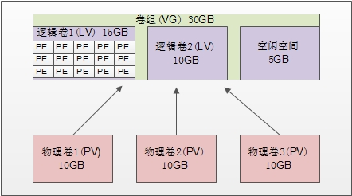

# **  1、简介**

LVM是Logical Volume Manager 的简称，中文就是逻辑卷管理；



- **物理卷（PV,Physical Volume):**就是真正的物理硬盘或分区；

- **卷组（VG，Volume  Group):**将多个物理卷合起来就组成了卷组，组成同一个卷组的物理卷可以是同一个硬盘的不同分区，也可以是不同硬盘上的不同分区。我们可以把卷组想象成一个**逻辑硬盘；**

- **逻辑卷（LV，Logical Volume）:**卷组是一个逻辑硬盘，硬盘必须分区之后才可以使用，这个分区我们称作为逻辑卷。逻辑卷可以格式化和写入数据。**我们可以把逻辑卷看成分区。**

- **物理扩展（PE，Physical Extend）：**PE 是用来保存数据的最小单元，我们的数据实际上都是写入PE当中的，PE的大小也是可以配置的，默认是4MB；

# **2、建立LVM的步骤**

- 首先需要把物理硬盘分成分区，当然也是可以是整块物理硬盘；

- 然后把物理分区建立成物理卷（PV），也可以直接把整块硬盘都建立成物理卷。

- 接下来是把物理卷整合成卷组（VG）。卷组就已经可以动态的调整大小了，可以把物理分区加入卷组，也可以把物理分区从卷组中删除。

- 最后就是把卷组再划分成逻辑卷（LV），当然逻辑卷也可以是直接调整大小的。我们说逻辑卷可以想象**成分区**，所以也需要格式化和挂载；

# **3、物理卷管理**

## **1）、硬盘分区
**

创建方式就是使用 fdisk 交互命令，不过需要注意的是分区的系统 ID 不再是 Linux 默认的分区


ID 号 83 了，

```javascript
root@bogon ~]# fdisk /dev/sdb
..........
命令(输入 m 获取帮助)：p

磁盘 /dev/sdb：21.5 GB, 21474836480 字节，41943040 个扇区
Units = 扇区 of 1 * 512 = 512 bytes
扇区大小(逻辑/物理)：512 字节 / 512 字节
I/O 大小(最小/最佳)：512 字节 / 512 字节
磁盘标签类型：dos
磁盘标识符：0x8ec5acbe

   设备 Boot      Start         End      Blocks   Id  System
/dev/sdb1            2048    10487807     5242880   83  Linux
/dev/sdb2        10487808    41943039    15727616    5  Extended
/dev/sdb5        10489856    14684159     2097152   8e  Linux LVM		
/dev/sdb6        14686208    18880511     2097152   8e  Linux LVM
/dev/sdb7        18882560    23076863     2097152   8e  Linux LVM
```


## **2）、pvctreate建立物理卷**

**(pvcreate,physices-volume-createc物理卷，create，创建）**

```javascript
[root@localhost ~]# pvcreate [设备文件名]
```

- 建立物理卷时，我们说即可以把整块硬盘都建立成物理卷，也可以把某个分区建立成物理卷。如


果要把整块硬盘都建立成物理卷，命令如下


```javascript
[root@localhost ~]# pvcreate /dev/sdb
```

- 在我们的使用中，是要把分区建立成为物理卷，所以执行以下命令：


```javascript
[root@server1 ~]# pvcreate /dev/sdb5
  Physical volume "/dev/sdb5" successfully created.
[root@server1 ~]# pvcreate /dev/sdb6
  Physical volume "/dev/sdb6" successfully created.
[root@server1 ~]# pvcreate /dev/sdb7
  Physical volume "/dev/sdb7" successfully created.
```

## **3）查看物理卷**

- **pvscan(pv:物理卷，scan:扫描，扫描物理卷）
**

```javascript
[root@localhost ~]# pvscan
PV /dev/sdb5 lvm2 [1.01 GiB]
PV /dev/sdb6 lvm2 [1.01 GiB]
PV /dev/sdb7 lvm2 [1.01 GiB]
Total: 3 [3.03 GiB] / in use: 0 [0 ] / in no VG: 3 [3.03 GiB]
```

我们可以看到在我的系统中，/dev/sdb5-7 这三个分区是物理卷。最后一行的意思是：总共 3 个


物理卷[大小] / 使用了 0 个卷[大小] / 空闲 3 个卷[大小]。


- 第二个查询命令是 **pvdisplay**，它可以查看到更详细的物理卷状态，命令如下：

- **pv：物理卷，dispaly:显示；物理卷显示**


```javascript
[root@localhost ~]# pvdisplay
"/dev/sdb5" is a new physical volume of "1.01 GiB"
--- NEW Physical volume ---
PV Name /dev/sdb5 		#PV 名
VG Name 				#属于的 VG 名，还没有分配，所以空白
PV Size 1.01 GiB 		#PV 的大小
Allocatable NO 		#是否已经分配
PE Size 0 				#PE 大小，因为还没有分配，所以 PE 大小也没有指定
Total PE 0 			#PE 总数
Free PE 0 				#空闲 PE 数
Allocated PE 0 		#可分配的 PE 数
PV UUID CEsVz3-f0sD-e1w0-wkHZ-iaLq-O6aV-xtQNTB //PV 的 UUID
```

## **4）pvremove删除物理卷
**

```javascript
[root@localhost ~]# pvremove /dev/sdb7
```

# **4、卷组管理
**

## **1）建立卷组
**

```javascript
[root@localhost ~]# vgcreate [选项] 卷组名 物理卷名
选项：
-s PE 大小：	#(s,size,大小）指定 PE 的大小，单位可以是 MB,GB,TB 等。如果不写默认 PE 大小事 4MB
```

我们

会实验

```javascript
[root@localhost ~]# vgcreate scvg /dev/sdb5 /dev/sdb6
Volume group "scvg" successfully created
```

## **2）、查看卷组
**

查看卷组的命令同样是两个，vgscan 主要是查看系统中是否有卷组，而 vgdisplay 则是查看卷组的详


细状态的。命令如下：

- 


```javascript
[root@localhost ~]# vgscan
Reading all physical volumes. This may take a while...
Found volume group "scvg" using metadata type lvm2
#scvg 的卷组确实存在
```

- 

```javascript
[root@localhost ~]# vgdisplay
--- Volume group ---
VG Name scvg 卷组名
System ID
Format lvm2
Metadata Areas 2
Metadata Sequence No 1
VG Access read/write 卷组访问状态
VG Status resizable 卷组状态
MAX LV 0 最大逻辑卷数
Cur LV 0
Open LV 0
Max PV 0 最大物理卷数
Cur PV 2 当前物理卷数
Act PV 2
VG Size 2.02 GiB 卷组大小
PE Size 8.00 MiB PE 大小
Total PE 258 PE 总数
Alloc PE / Size 0 / 0 已用 PE 数量/大小
Free PE / Size 258 / 2.02 GiB 空闲 PE 数量/大小
VG UUID Fs0dPf-LV7H-0Ir3-rthA-3UxC-LX5c-FLFriJ
```

## **3）vgextend增加卷组容量**

## **extend:扩展
**

```javascript
[root@localhost ~]# vgextend scvg /dev/sdb7
Volume group "scvg" successfully extended
#把/dev/sdb7 物理卷也加入 scvg 卷组
[root@localhost ~]# vgdisplay
--- Volume group ---
VG Name scvg
System ID
Format lvm2
Metadata Areas 3
Metadata Sequence No 2
VG Access read/write
VG Status resizable
MAX LV 0
Cur LV 0
Open LV 0
Max PV 0
Cur PV 3
Act PV 3
VG Size 3.02 GiB 卷组容量增加
PE Size 8.00 MiB
Total PE 387 PE 总数增加
Alloc PE / Size 0 / 0
Free PE / Size 387 / 3.02 GiB
VG UUID Fs0dPf-LV7H-0Ir3-rthA-3UxC-LX5c-FLFriJ
```

## **4）vgreduce减小卷组容量(****杜绝使用****）**

## **reduce:减少
**

```javascript
[root@localhost ~]# vgreduce scvg /dev/sdb7
Removed "/dev/sdb7" from volume group "scvg"
#在卷组中删除/dev/sdb7 物理卷
[root@localhost ~]# vgreduce -a
#删除所有的未使用物理卷
```

## **5）vgremove删除卷组
**

```javascript
[root@localhost ~]# vgremove scvg
Volume group "scvg" successfully removed
```

卷组删除之后，才能删除删除物理卷。还要注意的是 scvg 卷组还没有添加任何的逻辑卷，那如


果拥有了逻辑卷，记得先删除逻辑卷再删除卷组。还记得我刚说的吗？删除就是安装的反过程，每一


步都不能跳过。


# **5、逻辑卷管理 ****(LOGIC-VOLUME)****
**

## **1）、建立逻辑卷**

- 

## **
**

```javascript
[root@localhost ~]# lvcreate [选项] [-n 逻辑卷名] 卷组名
选项：
-L (length,长度)容量：指定逻辑卷大小，单位 MB，GB，TB 等
-l 个数：按照 PE 个数指定逻辑卷大小，这个参数需要换算容量，太麻烦
-n （name,名称）逻辑卷名：指定逻辑卷名
```

- 那我们就建立一个 1.5GB 的 userlv 逻辑卷吧，建立命令如下：


```javascript
[root@localhost ~]# lvcreate -L 1.5G -n userlv scvg
Logical volume "userlv" created
#在 scvg 卷组中建立 1.5GB 的 userlv 逻辑卷
```

- 建立完逻辑卷之后，还要格式化和挂载之后逻辑卷才能正常使用。格式化和挂载命令和操作普通


分区时是一样的，不过需要注意的是逻辑卷的设备文件名是/dev/卷组名/逻辑卷名，如我们的 userlv


的设备文件名就是“/dev/scvg/userlv”,具体命令如下：


```javascript
[root@localhost ~]# mkfs -t ext4 /dev/scvg/userlv
#格式化
[root@localhost ~]# mkdir /disklvm
[root@localhost ~]# mount /dev/scvg/userlv /disklvm/
#建立挂载点，并挂载
[root@localhost ~]# mount
…省略部分输出…
/dev/mapper/scvg-userlv on /disklvm type ext4 (rw)
#已经挂载了
当然如果需要开机自动挂载，也要修改/etc/fstab 文件。
```

## **2）、查看逻辑卷
**

- 同样的查看命令是两个，第一个命令 lvscan 只能看到系统中是否拥有逻辑卷，命令如下：


```javascript
[root@localhost ~]# lvscan
ACTIVE '/dev/scvg/userlv' [1.50 GiB] inherit
#能够看到激活的逻辑卷，大小事 1.5GB
```

- 第二个命令是 lvdisplay 可以看到逻辑卷的详细信息，命令如下：


```javascript
[root@localhost ~]# lvdisplay
--- Logical volume ---
LV Path /dev/scvg/userlv 逻辑卷设备文件名
LV Name userlv 逻辑卷名
VG Name scvg 所属的卷组名
LV UUID 2kyKmn-Nupd-CldB-8ngY-NsI3-b8hV-QeUuna
LV Write Access read/write
LV Creation host, time localhost, 2013-04-18 03:36:39 +0800
LV Status available
# open 1
LV Size 1.50 GiB 逻辑卷大小
Current LE 192
Segments 2
Allocation inherit
Read ahead sectors auto
- currently set to 256
Block device 253:0
```

## **3）lvresize调整逻辑卷大小**

- **
**

```javascript
[root@localhost ~]# lvresize [选项] 逻辑卷设备文件名
选项：
-L 容量：安装容量调整大小，单位 KB，GB,TB 等。使用+代表增加空间，-号代表减少
空间。如果直接写容量，代表设定逻辑卷大小为指定大小。
-l 个数：按照 PE 个数调整逻辑卷大小
```

- 我们先在/disklvm 中建立点文件，一会调整完大小，我们看看数据是否会丢失：


```javascript
[root@localhost ~]# cd /disklvm/
[root@localhost disklvm]# touch testf
[root@localhost disklvm]# mkdir testd
[root@localhost disklvm]# ls
lost+found testd testf
```

- 我们刚刚的 userlv 的大小事 1.5GB，我们的 scvg 中还有 1.5GB 的空闲空间，那么增加我们的


userlv 逻辑卷的大小到 2.5GB 吧：


```javascript
[root@localhost disklvm]# lvresize -L 2.5G /dev/scvg/userlv
Extending logical volume userlv to 2.50 GiB
Logical volume userlv successfully resized
#增加 userlv 逻辑卷的大小到 2.5GB           
#当然命令也可以这样写 [root@localhost disklvm]# lvresize -L +1G /dev/scvg/userlv
[root@localhost disklvm]# lvdisplay
--- Logical volume ---
LV Path /dev/scvg/userlv
LV Name userlv
VG Name scvg
LV UUID 2kyKmn-Nupd-CldB-8ngY-NsI3-b8hV-QeUuna
LV Write Access read/write
LV Creation host, time localhost, 2013-04-18 03:36:39 +0800
LV Status available
# open 1
LV Size 2.50 GiB 大小改变了
Current LE 320
Segments 3
Allocation inherit
Read ahead sectors auto
- currently set to 256
Block device 253:0
```

- 逻辑卷的大小已经改变了，但是好像有些问题啊：


```javascript
[root@localhost disklvm]# df -h /disklvm/
```

文件系统 容量 已用 可用 已用%% 挂载点


/dev/mapper/scvg-userlv 1.5G 35M 1.4G 3% /disklvm


怎么/disklvm 分区的大小还是 1.5GB 啊？刚刚只是逻辑卷的大小改变了，如果需要让分区使用这


个新逻辑卷，我们还要使用 resize2fs 命令来调整分区的大小。不过这里就体现了 LVM 的优势，我们


不需要卸载分区，直接就能调整分区的大小。

```javascript
[root@localhost ~]# resize2fs [选项] [设备文件名] [调整的大小]
选项：
-f： 强制调整
设备文件名：指定调整哪个分区的大小
调整的大小：指定把分区调整到多大，要加 M，G 等单位。如果不加大小，会使用整个
分区
```

- 那么我们已经把逻辑卷调整到了 2.5GB，这时我们就需要把整个逻辑卷都加入/disklvm 分区，命


令如下：


```javascript
[root@localhost ~]# resize2fs /dev/scvg/userlv
resize2fs 1.41.12 (17-May-2010)
Filesystem at /dev/scvg/userlv is mounted on /disklvm; on-line resizing required
old desc_blocks = 1, new_desc_blocks = 1
Performing an on-line/d resize of /dev/scvg/userlv to 655360 (4k) blocks.
The filesystem on /dev/scvg/userlv is now 655360 blocks long.
#已经调整了分区大小
[root@localhost ~]# df -h /disklvm/
文件系统 容量 已用 可用 已用%% 挂载点
/dev/mapper/scvg-userlv 2.5G 35M 2.4G 2% /disklvm
#分区大小已经是 2.5GB 了
[root@localhost ~]# ls /disklvm/
lost+found testd testf
#而且数据并没有丢失
```

Centos7: （centos默认的文件系统是xfs)

resize2fs /dev/scvg/sclv 可能会报错，此时使用

xfs_growfs /dev/scvg/sclv 来从新跳转挂载点的大小

```javascript
[root@server1 ~]# resize2fs /dev/scvg/sclv 
resize2fs 1.42.9 (28-Dec-2013)
resize2fs: Bad magic number in super-block 当尝试打开 /dev/scvg/sclv 时
找不到有效的文件系统超级块.
```

xfs_growfs /dev/scvg/sclv 命令

```javascript
[root@server1 ~]# xfs_growfs  /dev/mapper/scvg-sclv 
meta-data=/dev/mapper/scvg-sclv  isize=512    agcount=4, agsize=196608
         =                       sectsz=512   attr=2, projid32bit=1
         =                       crc=1        finobt=0 spinodes=0
data     =                       bsize=4096   blocks=786432, imaxpct=2
         =                       sunit=0      swidth=0 blks
naming   =version 2              bsize=4096   ascii-ci=0 ftype=1
log      =internal               bsize=4096   blocks=2560, version=2
         =                       sectsz=512   sunit=0 blks, lazy-count
realtime =none                   extsz=4096   blocks=0, rtextents=0
data blocks changed from 786432 to 1048576
```

## **df -hT查看**

```javascript
[root@server1 ~]# df -hT
文件系统                类型      容量  已用  可用 已用% 挂载点
。。。。
/dev/mapper/scvg-sclv   xfs       2.5G   33M  2.5G    1% /disk_sclv
```

## **4）删除逻辑卷
**

```javascript
[root@localhost ~]# lvremove 逻辑卷设备文件名
我们删除 userlv 这个逻辑卷，记得删除时要先卸载。命令如下：
[root@localhost ~]# umount /dev/scvg/userlv
[root@localhost ~]# lvremove /dev/scvg/userlv
```

## 5) lvextend  扩展逻辑卷空间

## 补充说明

**lvextend命令**

### 语法

```bash
lvextend(选项)(参数)
```

### 选项

```bash
-L：指定逻辑卷的大小，单位为“kKmMgGtT”字节；
-l：指定逻辑卷的大小（LE数）。
```

### 参数

逻辑卷：指定要扩展空间的逻辑卷。

### 实例

使用lvextend命令为逻辑卷

```bash
[root@localhost ~]# lvextend -L +100M /dev/vg1000/lvol0    #为了解决增加100M空间
```

输出信息如下：

```bash
Extending logical volume lvol0 to 300.00 MB  
Logical volume lvol0 successfully resized
```

# 6、LVM 快照（创建、合并、删除、扩展）

LVM 快照不应与备份混淆。

## 6.1 快照大小如何工作？它与备份有何不同？

LVM 快照的空间效率非常高，空间效率我的意思是当为具有 10GB 空间的逻辑卷创建快照时，快照将占用非常少的空间（几乎没有），但随着源卷的内容增加快照卷大小也会相应增加。

因此，必须创建快照，但不应将其保存很长时间，否则最终会占用大量空间。

在这种情况下，备份是首选选项，而不是快照。

## 6.2 LVM 快照的空间效率如何？

大量变化 = 空间效率不高

少量更改 = 非常节省空间

重要的提示：

在 LVM 中，我们有一个功能，可以扩展快照大小，但这并不意味着创建快照后修改的任何数据也将恢复，因为快照是在稍后的时间点扩展的。

快照将恢复到拍摄点的状态，拍摄快照后修改的任何数据都将被覆盖。

让我们从一些例子开始

我有以下逻辑卷的设置

```
# lvs
LV        VG     Attr       LSize  Pool Oroirn Data%  Meta%  Move Log Cpy%Sync Convert
data      system -wi-a-----  2.00g  
opt       system -wi-ao----  2.00g
root      system -wi-ao----  2.00g
swap      system -wi-ao----  4.00g
tmp       system -wi-ao---- 12.00g
var       system -wi-ao----  2.00g
```

为了本文，我们将创建“数据”分区的快照。

但在此之前让我们检查我们数据分区的现有内容

我们的逻辑卷挂载在 /data 目录

```
 df -Th /data/
Filesystem              Type  Size  Used Avail Use% Mounted on
/dev/mapper/system-data ext4  2.0G  6.1M  1.8G   1% /data
```

以下内容

```
# ls -l /data/
total 28
drwxr-xr-x 2 root root  4096 Sep 13 03:24 dir1
drwxr-xr-x 2 root root  4096 Sep 13 03:24 dir2
drwxr-xr-x 2 root root  4096 Sep 13 03:24 dir3
-rw-r--r-- 1 root root     0 Sep 13  2015 file1
-rw-r--r-- 1 root root     0 Sep 13  2015 file2
-rw-r--r-- 1 root root     0 Sep 13  2015 file3
drwx------ 2 root root 16384 Sep 13 03:17 lost+found
```

因此，在执行 lvm 快照合并后，预期也是如此。

## 6.3 创建快照

使用以下命令创建快照

```
# lvcreate -L 1G -s -n snap_data /dev/system/data
Using default stripesize 64.00 KiB.
Logical volume "snap_data" created.
#这里
-L means assign LogicalVolume Size   
-s or (--snapshot) means create a snapshot volume  表示创建快照
-n or (--name) means the name of the snapshot logical volume   表示需要被创建快照的逻辑卷的名称
```

最后 (/dev/system/data) 是必须创建其快照的逻辑卷的路径

这里我们正在为 /dev/system/data 逻辑卷创建一个 1G 大小的快照卷（snap_data）

这些快照是读写的，因此我们可以挂载此快照卷并检查数据/内容。

```
# mount /dev/system/snap_data /mnt/
```

检查快照的内容

```
# ls -l /mnt/
total 28
drwxr-xr-x 2 root root  4096 Sep 13 03:24 dir1
drwxr-xr-x 2 root root  4096 Sep 13 03:24 dir2
drwxr-xr-x 2 root root  4096 Sep 13 03:24 dir3
-rw-r--r-- 1 root root     0 Sep 13  2015 file1
-rw-r--r-- 1 root root     0 Sep 13  2015 file2
-rw-r--r-- 1 root root     0 Sep 13  2015 file3
drwx------ 2 root root 16384 Sep 13 03:17 lost+found
```

我们可以获取快照和父逻辑卷的详细信息

```
# lvs /dev/system/snap_data
LV        VG     Attr       LSize Pool Oroirn Data%  Meta%  Move Log Cpy%Sync Convert
snap_data system swi-aos--- 1.00g      data   0.00
```

如我们所见，新的逻辑快照卷在上述信息中可见

重要的提示：

如果我们觉得原始卷将被长时间排除在外并且大量数据将写入源分区，因为快照有可能损坏，请确保快照卷大小始终等于原始卷如果原始卷大小变得大于快照卷大小。

## 6.4 什么是 LVM 大小增长超过快照大小

这里我的快照卷大小是 1G，而实际卷大小是 2G，其中只使用了几 MB

```
# df -h /data/
Filesystem               Size  Used Avail Use% Mounted on
/dev/mapper/system-data   2.0G  6.1M  1.8G   1%  /data
```

让我在 /data 分区中放一些 1G 大小的虚拟内容

```
# dd if=/dev/zero of=/data/dummy_file2 bs=1G count=1 oflag=dsync
1+0 records in
1+0 records out
1073741824 bytes (1.1 GB) copied, 98.5545 s, 10.9 MB/s
```

检查快照状态

```
# lvs
  LV        VG     Attr       LSize  Pool Oroirn Data%  Meta%  Move Log Cpy%Sync Convert
  data      system owi-aos---  2.00g
  mgtserv   system -wi-ao----  2.00g
  opt       system -wi-ao----  2.00g
  root      system -wi-ao----  2.00g
  snap_data system swi-I-s---  1.00g      data   100.00
  swap      system -wi-ao----  4.00g
  tmp       system -wi-ao---- 12.00g
  var       system -wi-ao----  2.00g
```

如我们所见，它显示 100% 的快照大小已被占用，这意味着现在此快照已损坏且无法使用

使用以下命令进一步检查

```
# lvdisplay /dev/system/snap_data
  --- Logical volume --
  LV Path                /dev/system/snap_data
  LV Name                snap_data
  VG Name                system
  LV UUID                NwJSQu-NjIr-7Qn0-Wo0q-ig7d-3apy-eChdWD
  LV Write Access        read/write
  LV Creation host, time nds18-rdssrv, 2015-09-13 04:23:35 -0400
  LV snapshot status     INACTIVE destination for data
  LV Status              available
  # open                 0
  LV Size                2.00 GiB
  Current LE             64
  COW-table size         1.00 GiB
  COW-table LE           32
  Snapshot chunk size    4.00 KiB
  Segments               1
  Allocation             inherit
  Read ahead sectors     auto
  - currently set to     8192
  Block device           253:12
```

检查 dmsetup 状态

```
# dmsetup status
system-var: 0 4194304 linear
system-snap_data: 0 4194304 snapshot Invalid
```

系统日志中快照字符串的 Grep

```
# grep Snapshot /var/log/messages
Sep 13 03:32:19 nds18-rdssrv lvm[12168]: WARNING: Snapshot system-snap_data is now 80.02% full.
Sep 13 03:54:07 nds18-rdssrv lvm[1595]: WARNING: Snapshot system-snap_data is now 83.52% full.
Sep 13 04:29:52 nds18-rdssrv lvm[1606]: WARNING: Snapshot system-snap_data changed state to: Invalid and should be removed.
```

如我们所见，一旦快照大小变满，它将变得无法使用，因此必须将其删除

```
# lvremove -f /dev/system/snap_data  
 Logical volume "snap_data"  successfully removed
```

## 6.5 我们如何避免 LVM 快照损坏

如果原始卷分区大小达到阈值，我们可以选择自动扩展逻辑卷，或者在快照大小变为 100% 占用之前手动扩展快照大小。

说明：

首选自动方法，因为一旦快照卷达到 100% 的空间，快照将被损坏，如上所示。

### 6.5.1 手动扩展快照卷

用于手动扩展快照卷

扩展快照卷之前

```
# lvdisplay /dev/system/snap_data
  --- Logical volume --
  LV Path                /dev/system/snap_data
  LV Name                snap_data
  VG Name                system
  LV UUID                ETHmgE-sgz0-4o7Q-3GDQ-pUy4-CJPo-D3nlIe
  LV Write Access        read/write
  LV Creation host, time nds18-rdssrv, 2015-09-13 05:21:37 -0400
  LV snapshot status     active destination for data
  LV Status              available
  # open                 0
  LV Size                2.00 GiB
  Current LE             64
  COW-table size         1.00 GiB
  COW-table LE           32
  Allocated to snapshot  0.00%
  Snapshot chunk size    4.00 KiB
  Segments               1
  Allocation             inherit
  Read ahead sectors     auto
  - currently set to     8192
  Block device           253:12
```

接下来我们将扩展我们的快照逻辑卷

```
# lvextend -L +1G /dev/system/snap_data
  Size of logical volume system/snap_data changed from 1.00 GiB (32 extents) to 2.00 GiB (64 extents).
  Logical volume system/snap_data successfully resized.
```

扩展快照卷后

```
# lvdisplay /dev/system/snap_data
  --- Logical volume --
  LV Path                /dev/system/snap_data
  LV Name                snap_data
  VG Name                system
  LV UUID                ETHmgE-sgz0-4o7Q-3GDQ-pUy4-CJPo-D3nlIe
  LV Write Access        read/write
  LV Creation host, time nds18-rdssrv, 2015-09-13 05:21:37 -0400
  LV snapshot status     active destination for data
  LV Status              available
  # open                 0
  LV Size                2.00 GiB
  Current LE             64
  COW-table size         2.00 GiB
  COW-table LE           64
  Allocated to snapshot  0.00%
  Snapshot chunk size    4.00 KiB
  Segments               1
  Allocation             inherit
  Read ahead sectors     auto
  - currently set to     8192
  Block device           253:12
```

如我们所见，LVM COW 表大小（写时复制）大小已从 1 Gb 增加到 2 GB

### 6.5.2 自动扩展快照卷

用于自动扩展快照卷

打开以下文件并将 snapshot_autoextend_threshold 值从 100 更改为低于 100 的其他值，将 snapshot_autoextend_percent 更改为我们想要扩展快照卷的值，日志文件中提供了有关此属性的更多详细信息

```
# vim /etc/lvm/lvm.conf
        # Configuration option activation/snapshot_autoextend_threshold.
        # Auto-extend a snapshot when its usage exceeds this percent.
        # Setting this to 100 disables automatic extension.
        # The minimum value is 50 (a smaller value is treated as 50.)
        # Also see snapshot_autoextend_percent.
        # Automatic extension requires dmeventd to be monitoring the LV.
        #
        # Example
        # Using 70% autoextend threshold and 20% autoextend size, when a 1G
        # snapshot exceeds 700M, it is extended to 1.2G, and when it exceeds
        # 840M, it is extended to 1.44G:
        # snapshot_autoextend_threshold = 70
        #
        snapshot_autoextend_threshold = 70
        # Configuration option activation/snapshot_autoextend_percent.
        # Auto-extending a snapshot adds this percent extra space.
        # The amount of additional space added to a snapshot is this
        # percent of its current size.
        #
        # Example
        # Using 70% autoextend threshold and 20% autoextend size, when a 1G
        # snapshot exceeds 700M, it is extended to 1.2G, and when it exceeds
        # 840M, it is extended to 1.44G:
        # snapshot_autoextend_percent = 20
        #
        snapshot_autoextend_percent = 50
```

对于本文，我将使用上述值

接下来我们需要从头开始，这意味着创建一个新的快照卷

```
# lvcreate -L 1G -s -n snap_data /dev/system/data
```

现在让我们再次尝试用超过 1G 的数据填充 /data 分区

第一次尝试我将创建 512MB 的虚拟文件

```
# dd if=/dev/zero of=/data/dummy_file2 bs=512M count=1 oflag=dsync
1+0 records  in
1+0 records out
536870912 bytes (537 MB) copied, 16.3479 s, 32.8 MB/s
```

让我们检查一下快照卷的大小，因为快照卷是 1G，它很容易在不扩展其卷大小的情况下承受这种变化

```
# lvs
  LV        VG     Attr       LSize  Pool Oroirn Data%  Meta%  Move Log Cpy%Sync Convert
  data      system owi-aos---  2.00g
  mgtserv   system -wi-ao----  2.00g
  opt       system -wi-ao----  2.00g
  root      system -wi-ao----  2.00g
  snap_data system swi-a-s---  1.00g      data   50.21
```

接下来让我们再创建一个包含另外 512M 数据的虚拟文件

```
# dd if=/dev/zero of=/data/dummy_file bs=512M count=1 oflag=dsync
1+0 records in
1+0 records out
536870912 bytes (537 MB) copied, 28.1028 s, 19.1 MB/s
```

现在让我们检查 snap_data 的 lvs 状态，因为我们看到卷大小增加到 1.5GB，因为我们已经要求 lvm 在达到阈值时扩展到 50%

```
# lvs
  LV        VG     Attr       LSize  Pool Oroirn Data%  Meta%  Move Log Cpy%Sync Convert
  data      system owi-aos---  2.00g
  mgtserv   system -wi-ao----  2.00g
  opt       system -wi-ao----  2.00g
  root      system -wi-ao----  2.00g
  snap_data system swi-a-s---  1.00g      data   50.21
```

所以这很完美。

但请确保原始数据大小不会增加超过 1.5GB 的 rlse 快照将再次损坏

## 6.6 恢复或者合并或者提交快照

接下来，一旦我们完成，就可以恢复快照了。

重要的提示：

在合并快照之前，请确保原始源处于卸载状态，否则合并将因逻辑卷的挂起激活而推迟。

如果原始源处于挂载状态，以下是这两种情况的示例

要合并快照，请使用以下命令

```
# lvconvert --merge /dev/system/snap_data
Can't merge until oroirn volume is closed.
Merging of snapshot system/snap_data will occur on next activation of system/data.
```

由于 /data 分区处于挂载状态，快照合并失败，要执行此合并，我们必须执行手动 lvm 激活。

卸载“数据”分区

```
# umount /data/
```

取消激活数据分区

```
# lvchange -an  /dev/system/data
```

重新激活一样

```
# lvchange -ay  /dev/system/data
```

现在验证“数据”分区的内容。

```
# ls -l /data/
total 524320
drwxr-xr-x 2 root root      4096 Sep 13 03:24 dir1
drwxr-xr-x 2 root root      4096 Sep 13 03:24 dir2
drwxr-xr-x 2 root root      4096 Sep 13 03:24 dir3
-rw-r--r-- 1 root root         0 Sep 13 03:24 file1
-rw-r--r-- 1 root root         0 Sep 13 03:24 file2
-rw-r--r-- 1 root root         0 Sep 13 03:24 file3
drwx------ 2 root root     16384 Sep 13 03:17 lost+found
```

说明：

如果由于某种原因我们无法执行此重新激活，则此快照合并将在节点下次重新启动期间发生

如果原点处于未安装状态

```
# lvconvert --merge /dev/system/snap_data
  Merging of volume system/snap_data started.
  data: Merged: 33.20%
  data: Merged: 54.44%
  data: Merged: 75.88%
  data: Merged: 98.10%
  data: Merged: 100.00%
```

在另一个终端上，如果我们检查我们可以看到数据分区具有“O”属性，这意味着快照正在与源合并

```
# lvs
  LV        VG     Attr       LSize  Pool Oroirn Data%  Meta%  Move Log Cpy%Sync Convert
  data      system Owi-a-s---  2.00g             49.74
  mgtserv   system -wi-ao----  2.00g
  opt       system -wi-ao----  2.00g
  root      system -wi-ao----  2.00g
  swap      system -wi-ao----  4.00g
  tmp       system -wi-ao---- 12.00g
  var       system -wi-ao----  2.00g
```

到这里就完成了，我们的“数据”分区恢复到原来的状态

```
# ls -l /data/
total 524320
drwxr-xr-x 2 root root      4096 Sep 13 03:24 dir1
drwxr-xr-x 2 root root      4096 Sep 13 03:24 dir2
drwxr-xr-x 2 root root      4096 Sep 13 03:24 dir3
-rw-r--r-- 1 root root         0 Sep 13 03:24 file1
-rw-r--r-- 1 root root         0 Sep 13 03:24 file2
-rw-r--r-- 1 root root         0 Sep 13 03:24 file3
drwx------ 2 root root     16384 Sep 13 03:17 lost+found
```