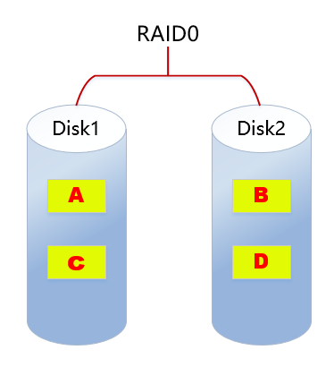
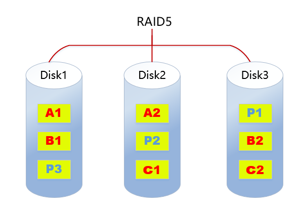

# 1、RAID介绍

RAID(Redundant Array of Independent Disk独立冗余磁盘阵列)技术是加州大学伯克利分校1987年提出，最初是为了组合小的廉价磁盘来代替大的昂贵磁盘，同时希望磁盘失效时不会使对数据的访问受损失而开发出一定水平的数据保护技术。RAD就是一种由多块廉价磁盘构成的冗余阵列，在操作系统下是作为一个独立的大型存储设备出现。RAD可以充分发挥出多块硬盘的优势，可以提升硬盘速度，增大容量，提供容错功能，能够确保数据安全性，易于管理的优点，在任何一块硬盘出现问题的情况下都可以继续工作，不会受到损坏硬盘的影响。

# 2、常见的RAID级别

## 2.1 RAID0

**RAID0特点（类似于条带化）：**

- 至少需要两块磁盘

- 数据条带化分布到磁盘，高的读写性能，100%高存储空间利用率

- 数据没有冗余策略，一块磁盘故障，数据将无法恢复

- 应用场景：

- 对性能要求高但对数据安全性和可靠性要求不高的场景，比如音频、视频等的存储。

## 2.2 RAID1 

**RAID1特点：**

- 至少需要2块磁盘

- 数据镜像备份写到磁盘上（工作盘和镜像盘），可靠性高，磁盘利用率为50%

- 读性能可以，但写性能不佳

- 一块磁盘故障，不会影响数据的读写

- 应用场景：

- 对数据安全可靠要求较高的场景，比如邮件系统、交易系统等。

## 2.3 RAID5

**RAID5特点：**

- 至少需要3块磁盘

- 数据条带化存储在磁盘，读写性能好，磁盘利用率为(n-1)/n

- 以奇偶校验（分散）做数据冗余

- 一块磁盘故障，可根据其他数据块和对应的校验数据重构损坏数据（消耗性能）

- 是目前综合性能最佳的数据保护解决方案

- 兼顾了存储性能、数据安全和存储成本等各方面因素（性价比高）

- 适用于大部分的应用场景

## 2.4 RAID6

**RAID6特点：**

- 至少需要4块磁盘

- 数据条带化存储在磁盘，读取性能好，容错能力强

- 采用双重校验方式保证数据的安全性

- 如果2块磁盘同时故障，可以通过两个校验数据来重建两个磁盘的数据

- 成本要比其他等级高，并且更复杂

- 一般用于对数据安全性要求非常高的场合

## 2.5 RAID10

**RAID10特点：**

- RAID10是raid1+raid0的组合

- 至少需要4块磁盘

- 两块硬盘为一组先做raid1,再将做好raid1的两组做raid0

- 兼顾数据的冗余(raid1镜像)和读写性能(raid0数据条带化)

- 磁盘利用率为50%，成本较高

## 2.6 总结

| 类型 | 读写性能 | 可靠性 | 磁盘利用率 | 成本 | 
| -- | -- | -- | -- | -- |
| RAID0 | 最好 | 最低 | 100% | 较低 | 
| RAID1 | 读正常；写两份数据 | 高 | 50% | 高 | 
| RDIA5 | 读：近似RADI0 | RAID0<RAID5<RAID1 | (n-1)/n | RAID0<RAID5<RAID1 | 
| RAID6 | 读：近似RADI0 | RAID5<RAID6 | RAID6<RAID5 | RAID5<RAID6 | 
| RAID10 | 读：RAID10=RAID0 | 高 | 50% | 最高 | 

# 3、软硬RAID

## 3.1 软RAID

软RAID运行于操作系统底层，将SCS引或者1DE控制器提交上来的物理磁盘，虚拟成虚拟磁盘，再提交给管理。

软件RAID有以下特点：

- 占用内存空间

- 占用CPU资源

- 如果程序或者操作系统故障就无法运行

**总结：**

## 3.2 硬RAID

- 通过硬件来实现RAID功能的就是硬RAID,独立的RAID卡，主板集成的RAID芯片都是硬RAID。RAID卡就是用来实现RAID功能的板卡，通常是由I/O处理器、硬盘控制器、硬盘连接器和缓存等一系列零组件构成的。不同的RAID卡支持的RAID功能不同。支持RAID0、RAID1、RAID4、RAID5、RAID1O不等。

