# 1、MegaCli命令介绍

- MegaCli是一款管理维护硬件RAID软件，可以用来查看raid信息等

- MegaCli 的Media Error Count: 0 Other Error Count: 0 

- Medai Error Count 表示磁盘可能错误，可能是磁盘有坏道，这个值不为0值得注意，数值越大，危险系数越高，

- Other Error Count 表示磁盘可能存在松动，可能需要重新再插入。MegaCli 可以对阵列中所有的磁盘进行检测。

官方文档参考：[http://www.lsi.com/files/docs/techdocs/storage_stand_prod/sas/mr_sas_sw_ug.pdf](http://www.lsi.com/files/docs/techdocs/storage_stand_prod/sas/mr_sas_sw_ug.pdf)

# 2、安装过程

rpm -qa | egrep 'Lib_Utils|MegaCli' //检查是否安装

[https://raw.githubusercontent.com/crazy-zhangcong/tools/master/MegaCli8.07.10.tar.gz](https://raw.githubusercontent.com/crazy-zhangcong/tools/master/MegaCli8.07.10.tar.gz)

```
wget https://raw.githubusercontent.com/crazy-zhangcong/tools/master/MegaCli8.07.10.tar.gz        #下载
rpm -ivh    MegaCli-8.07.14-1.noarch.rpm        #安装MegaCli工具
ln -s /opt/MegaRAID/MegaCli/MegaCli64    /usr/bin/Megacli64        #创建软连接
```

# 3、适配卡配置

## 3.1 查看RAID控制器的数量

```
[root@localhost ~]# MegaCli64 -adpCount  #adpCount,adapter count,适配器（控制器）统计


Controller Count: 1.        #表示只有一个RAID卡。

Exit Code: 0x01
```

## 3.2 查看所有的raid卡信息

```
[root@localhost ~]# MegaCli64 -AdpAllInfo -aAll        #aAll 表示显示所有的raid卡信息，如果只有一个RADI卡，也可以使用-a0 ,表示使用第一个。

Adapter #0                                #0，就是这块Adapter的标记，表示是第一个RAID卡，下面的就是关于这个卡的各方面的信息。

==============================================================================
                    Versions
                ================
Product Name    : PERC H330 Adapter
Serial No       : 08C0648
FW Package Build: 25.5.7.0005
..........
..........
```

## 3.3 查看RAID卡Rebuild参数

```
[root@localhost ~]# MegaCli64 -AdpAllInfo -a0 | grep  -i Rebuild
Rebuild Rate                     : 30%     #重建在IO资源使用中的百分比，默认为30%
Auto Rebuild                     : Enabled
Rebuild Rate                    : Yes
Force Rebuild                           : Yes
```

## 3.3 设置RAID卡的Rebuild参数

```
[root@localhost ~]# MegaCli64 -AdpSetProp {  RebuildRate -60 } -a0

Adapter 0: Set rebuild rate to 60% success.            #设置成功

Exit Code: 0x00
[root@localhost ~]# MegaCli64 -AdpAllInfo -a0 | grep -i Rebuild        #再次查看，设置成功。
Rebuild Rate                     : 60%
Auto Rebuild                     : Enabled
Rebuild Rate                    : Yes
Force Rebuild                           : Yes
```

## 3.4 查看Adapter（控制器）的具体配置

```
[root@localhost ~]# MegaCli64 -CfgDsply -aAll

==============================================================================
Adapter: 0                            #0号控制器,这一行显示的是Adapter的信息，和状态
Product Name: PERC H330 Adapter       #产品名称
Memory: 0MB            
BBU: Absent                            #电池状态，absent，表示没有电池。present，表示有电池。
Serial No: 08C0648                    #序列号
==============================================================================
Number of DISK GROUPS: 1        #总共有1个磁盘组，（一个RAID组）

DISK GROUP: 0                   #0号磁盘组，对应的就是Adapter 0
Number of Spans: 1
SPAN: 0
Span Reference: 0x00
Number of PDs: 2               #物理磁盘个数
Number of VDs: 1
               #虚拟磁盘个数，其实指的就是RAID组的个数
Number of dedicated Hotspares: 0
Virtual Drive Information:
Virtual Drive: 0 (Target Id: 0)
Name                :
RAID Level          : Primary-0, Secondary-0, RAID Level Qualifier-0    #RAID0，就是RAID的级别
Size                : 930.5 GB            #磁盘组的总大小，是几个physical disk 大小之和。
Sector Size         : 512
Is VD emulated      : No
Parity Size         : 0
State               : online           #磁盘组状态，在线状态online,最佳状态（optimal） 如果磁盘组损坏的话，就会变成offline
Strip Size          : 64 KB
Number Of Drives    : 2                   #物理磁盘的个数（physical disk）
Span Depth          : 1
Default Cache Policy: WriteThrough, ReadAheadNone, Direct, No Write Cache if Bad BBU        #默认的，RAID的缓存策略
Current Cache Policy: WriteThrough, ReadAheadNone, Direct, No Write Cache if Bad BBU        #当前的RAID的缓存策略
Default Access Policy: Read/Write
Current Access Policy: Read/Write
Disk Cache Policy   : Disk's Default                
Encryption Type     : None
Default Power Savings Policy: Controller Defined
Current Power Savings Policy: None
Can spin up in 1 minute: No
LD has drives that support T10 power conditions: No
LD's IO profile supports MAX power savings with cached writes: No
Bad Blocks Exist: No
Is VD Cached: No
Physical Disk Information:
Physical Disk: 0
Enclosure Device ID: 32
Slot Number: 1
Drive's position: DiskGroup: 0, Span: 0, Arm: 0
Enclosure position: 1
Device Id: 1
WWN: 5002538fc26208af
Sequence Number: 2
Media Error Count: 0
Other Error Count: 6
Predictive Failure Count: 0
Last Predictive Failure Event Seq Number: 0
PD Type: SATA
```

## 3.5 Raid卡日志保存到文件

```
MegaCli64 -AdpEventLog -GetEvents -f raid.envent.log -a0
```

## 3.5 查看RAID卡日志信息

```
[root@localhost ~]# MegaCli64 -FwTermlog  -dsply -a0 | head

Firmware Term Log Information on controller 0:
ologyChgEvnt: PhysicalPort=0 NumberOfPhys=x08 NumEntries=x01 StartPhy=x4
T10: C0:ExpStatus=x00 PhysicalPort=0 EnclosureHandle=x0001 Expander devHandle=x0000
T10: C0:MPT_DeviceAddRemove : ADDED - phy x04 devHandle x000a parentDevHdl x0001 phyNum x04 slot x03 deviceInfo=x00000881 sasAddr=44332211:4000000 currLR a
T10: C0:DM_DeviceInserted: tempdevId[51], DevHandle[a],enclHandle 1

T10: C0:iopiEvent: MPI2_EVENT_SAS_TOPOLOGY_CHANGE_LIST
T10: C0:DM_HandleTopologyChgEvnt: PhysicalPort=0 NumberOfPhys=x08 NumEntries=x04 StartPhy=x0
T10: C0:ExpStatus=x00 PhysicalPort=0 EnclosureHandle=x0001 Expander devHandle=x0000
```

## 3.6 显示适配器时间

```
[root@localhost ~]# MegaCli64  -adpGetTime -aAll


Adapter 0:
    Date: 01/20/2023
    Time: 01:43:56

Exit Code: 0x00
```

## 3.7 扫描foreign信息

```
[root@kvmhost ~]# MegaCli64 -CfgForeign -Scan -a0
```

## 3.7 清理foreign配置

```
[root@kvmhost ~]# MegaCli64 -cfgforeign -clear -a0
```

## 3.8 Raid 一致性检查

```
禁用一直性 检查
/opt/MegaRAID/MegaCli/MegaCli64 -AdpCcSched -Dsbl -Aall
启用一致性检查，
/opt/MegaRAID/MegaCli/MegaCli64 -AdpCcSched -ModeConc -Aall
查看一直性检查 信息
/opt/MegaRAID/MegaCli/MegaCli64 -AdpCcSched -info -Aall 
```

## 3.9 巡读

```
一 MegaCli -adppr -enblauto  -a0，立即激活
   MegaCli -adppr -enblman -a0 设置成手动模式，需要用MegaCli -adppr  -start –a0 来激活。
二  MegaCli -adppr -info -a0        查看巡读的模式，本次巡读结束与下一次开始巡读的间隔，当前状态等信息。
三  MegaCli  -fwtermlog  -dsply -a0    可以查看巡读的进度
四  MegaCli -adppr -stop -a0 结束巡读，在巡读过程中，多次运用MegaCli -adppr -stop -a0或MegaCli -adppr  -start -a0
                会使叠代数增加，此时可能不能开始或结束巡读，用MegaCli -adppr -dsbl -a0来禁止巡读，重新开始。
五  MegaCli -adppr -setdelay val -a0设置本次巡读结束与下一次巡读开始的时间间隔，默认是168小时，当val=0
            时, 本次巡读结束后，立即开始下一次巡读
六  MegaCli -AdpSetProp -PrCorrectUncfgdAreas -val -a0     巡读时是否纠正媒介错误
七 设置定时巡读 MegaCli -AdpPR -SetStartTime yyyymmdd hh -a0
         yyyymmdd  hh，具体含义如下：20120108  16表示2012年01月08日16点
```

## 3.10 cc校验

```
一  立即开始cc校验,  MegaCli -ldcc -start  -L0 –a0  (L0表示Target ID 为0的raid组)，如果没有完全初始化或后台初始化。The virtual disk has not been initialized.  Running a consistency check may result in inconsistent messages in the log。可以用MegaCli   -ldcc  -start   -force  –L0 –a0强行cc校验。
二  MegaCli -ldcc -progdsply -L0 -a0 显示当前cc校验的进度。
三  MegaCli -ldcc -abort  -L0 -a0   关掉当前的cc校验
四 计划cc校验
      1 如果模式为disable，(MegaCli -adpccsched -info -a0来查看)，则下一次开始时间为07/28/2135, 02:00:00，状态为 Stopped，延期为168个小时。
      2 只有模式为Sequential和Concurrent模式时，才可以设定定期时间，所以要首先设定模式
          MegaCli -adpccsched -modeconc -a0或MegaCli -adpccsched -modeseq -a0，然后设定开始时间，MegaCli  -adpccsched  setstarttime 20101122  18-a0，
          设置本次cc校验结束和下次cc校验开始的时间间隔，MegaCli -adpccsched  -setdelay 2 -a0。
     3 如果模式为Sequential时，所有虚拟磁盘组顺序进行cc校验
     4 如果模式为Concurrent时，所有虚拟磁盘组同时进行cc校验
五  MegaCli -AdpCcSched -dsbl -a0 禁止计划cc校验
六  MegaCli -adpsetprop  -AbortCCOnError -1 -a0 设置错误发生时放弃cc校验
七 查看cc校验的事件日志，MegaCli -AdpEventLog -GetCCIncon  –f filename  –L0  –a0
八 如果设置延期时间为0，本次cc校验结束后，下一次cc校验会立即开始
```

## 3.11 快速初始化和完全初始化 

```
一 MegaCli -LDInit  -start –L0  -a0               快速初始化
二 MegaCli -LDInit  -start  -full –L0 -a0        完全初始化
三 MegaCli -LDInit  -progdsply   -L0 -a0        显示初始化的进度
四 MegaCli -LDInit  -abort  -L0  -a0               结束完全初始化
五 快速初始化值是往raid组的前8M和后8M写0
```

## 3.12 后台初始化

```
一   禁止后台初始化                   MegaCli  -LDBI  -dsbl  -L0  -a0
二   结束正在进行的后台初始化 MegaCli  -LDBI  -abort  -L0  -a0
三   查看后台初始化的设置        MegaCli  -LDBI  -getsetting  -L0  -a0
四   显示后台初始化进度           MegaCli  -LDBI  -progdsply -L0 -a0
五   Raid5 需要5个数据盘才可以后台初始化(5个盘中不包含热备盘)
六   后台初始化是创建raid后5分钟开始的(好像有时不是这样的)
七   后台初始化和cc校验不同的地方是，后台初始化可以自动开始
八   改变后台初始化率时，需要停止后台初始化，否则没有效果
```

## 3.13 copybak 

```
一     开启或禁用copyback， MegaCli -AdpSetProp –CopyBackDsbl  -0 -a0 (开启)
二     显示copyback设置情况  MegaCli –AdpGetProp  -CopyBackDsbl  –a0
三     当设置copyback为enable时，拔出坏盘，换上一个UNCONF的新盘，先用热备盘进行重建，然后
进行copyback操作，如果copyback为disable时，不进行copyback操作，可以设定copyback为enable，然
后用MegaCli -PDCpyBk -Start -PhysDrv[E0:S0,E1:S1] –a0开始copyback操作，其中[E0：S0]是raid组中
的磁盘(源盘)，而[E1：S1]不是raid组中的磁盘(目的盘)
四    MegaCli -AdpGetProp SMARTCpyBkEnbl -a0 当某个盘出现第一个smart错误时，可以在这个盘和
热备盘之间进行copyback操作，热备盘做为目的盘，完成了copyback操作时，smart错误盘才标记为
failed状态。
五 如果在copyback时，raid组删除，目的盘回到热备盘状态或Unconfigured Good
```

## 3.14 日志

```
 一    查看所有的information日志，MegaCli -adpalilog -a0
二     查看固件调试日志(固件终端日志)MegaCli -fwtermlog -dsply -a0
三     查看raid卡日志 MegaCli -adpeventlog -getevents -f filename -a0
四     清除日志MegaCli -AdpEventLog -Clear –a0
```

## 3.15 级别迁移

```
MegaCli -cfgldadd -r0[117:1,117:3,117:11]  -a0 ,建立了三个盘的raid 0，
增加一个盘[117:14],转换到raid5， MegaCli -ldrecon -start -r5 -add -physdrv[117:14] -l0 -a0
    在迁移过程中，转换前的raid的一个盘下线，转换前raid的所有盘都下线
    支持的类型 RAID 0 to RAID 1，RAID 0 to RAID 5，RAID 0 to RAID 6，
        RAID 1 to RAID 0，RAID 1 to RAID 5，RAID 1 to RAID 6，RAID 5 to RAID 0，
        RAID 5 to RAID 6，RAID 6 to RAID 0，RAID 6 to RAID 5
```

## 3.16 升级

```
一    从低版本到高版本升级MegaCli  -adpfwflash  -f  x.rom  -a0
二    从高版本到低版本降级MegaCli  -adpfwflash  -f  x.rom -noverchk  -a0
 加上noverchk忽略版本的检查，升级以后需要重启才生效
```

## 3.17 连接方式

```
一     Raid对内有两个接口，即connector0和connector1。得到连接器的状态MegaCli  -adpgetconnectormode -connector0 -a0
二     如果连接器的模式为internal时，jbod的磁盘全部看不到，如果连接器的模式为external时，主柜上的磁盘全部看不到
```

## 3.18 外来配置

```
一     MegaCli -cfgforeign -scan -a0       扫描外来配置的个数
二     MegaCli -cfgforeign -preview -a0 查看当前的磁盘在normal时的位置
三     MegaCli -cfgforeign -import -a0   来导入配置，恢复虚拟磁盘组
四     MegaCli -cfgforeign -clear -a0     清除外来配置
五     MegaCli -cfgforeign -dsply -a0    显示出现外来配置(磁盘插入的顺序)的过程
```

## 3.19  物理磁盘处理

```
一    MegaCli -PDMakeGood -PhysDrv[E0:S0]  –a0磁盘的状态由FAULTY变成CONF
二    磁盘上线 MegaCli -PDOnline  -PhysDrv[E0:S0,E1:S1,...]  –a0
磁盘下线 MegaCli -PDOffline  -PhysDrv[E0:S0,E1:S1,...]    –a0 (failed状态的盘可以下线)，然后用MegaCli -pdmarkmissing -physdrv[E0:S0]  -a0让磁盘踢盘，让其他的UNCONF状态的磁盘来替代这个盘MegaCli -PdReplaceMissing -physdrv[E0:S0] -arrayA, -rowB -a0
三      MegaCli -PdPrpRmv -physdrv[E0:S0] –a0此时磁盘处于Spun down状态，如果用此磁盘来建立raid，则磁盘的状态自动变成Spun Up
四     MegaCli -pdclear  -start  -physdrv[E:S]  -a0                                清除单个磁盘
五     MegaCli -AdpSetProp –DsblSpinDownHSP -val –a0               设置热备盘的节电策略
六     MegaCli -AdpSetProp –EnblSpinDownUnConfigDrvs -val –a0 设置空闲盘的节电策略
七     MegaCli -PDList –a0                                                               获取所有磁盘的详细信息
八     MegaCli -pdInfo -PhysDrv[E0:S0] –a0                                      获取单个盘的详细信息
```

## 3.20 Adpsetprop 设置属性

```
一　 RebuildRate ，PatrolReadRate，BgiRate，CCRate，ReconRate，表示进行重建，巡读，后台初始化，cc校验，扩容等所占有的系统资源率，提高速度
二　  CoercionMode(强制模式)，分成三种形式，None，128M，1G，当为1G时，每个磁盘比没有设置的时减少了1G的空间。
三　  PredFailPollInterval，轮询预测失败的时间间隔。Predictive Failure Count就是smart错误
四　  MaintainPdFailHistoryEnbl 保存坏盘的历史记录。当为enable时，当一个盘掉线并重新上线。需要清除配置信息，添加为热备盘才可以重建当为disable时。当一个盘掉线并重新上线，自动重建
五      MegaCli -AdpSetProp ClusterEnable  -0 -a0 设置Cluster模式，目前不支持，只能设置为disbale
六      MegaCli -AdpSetProp -EnableJBOD -1  -a0 设置jbod模式，针对raid0有效，对单个盘读写，即先写第一个盘，写满了在写第二个盘。MegaCli -PDMakeJBOD -physdrv[E0:S0,E1:S1]  -a0 可以设置jbod模式(目前不支持)
七      MegaCli -AdpSetProp ExposeEnclDevicesEnbl -1 -a0，               让设备驱动暴露enclosure devices
```

## 3.21 NCQ

```
一　  显示NCQ的设置情况   MegaCli -adpgetprop  -NCQdsply -a0
二　 设置开启NCQ              MegaCli -adpsetprop -NCQenbl -a0
三　 关闭NCQ                     MegaCli -adpsetprop -NCQdsbl -a0
Native Command Queuing (NCQ)对硬盘的读写命令的顺序进行优化。带NCQ技术的硬盘在接到读写指令后，
会根据指令对访问地址进行重新排序。比如根据指令，硬盘需要访问330扇区、980扇区、340扇区，由于数据在磁盘上分布位置不同，
普通硬盘只会按部就班地依次访问。而NCQ硬盘对指令进行优化排列之后，就可以先读取330扇区，接着读取340扇区，然后再读取980扇区。
这样做的好处就是减少了磁头臂来回移动的时间，使数据读取更有效，同时有效地延长了硬盘的使用寿命。
```

## 3.22 重建

```
一    MegaCli  -pdrbld  -progdsply  -physdrv[E:S]  -a0   查看重建的进度
二    MegaCli  -AdpSetProp  RebuildRate  -val  -a0     调快重建的速度
三    MegaCli  -AdpAutoRbld -Enbl -a0  设置自动重建，当一个盘坏掉时，热备盘可以自动重建，代替坏的盘
四    MegaCli -PDRbld -Start -PhysDrv [E0:S0] -a0 手动开始重建，E0:S0表示坏的盘
```

## 3.21 恢复出厂设置

```
一     MegaCli  -AdpFacDefSet –a0              恢复出厂的默认配置
```

## 3.22 告警

```
一    MegaCli  -AdpSetProp  -AlarmSilence –a0  临时关闭，重启又变成开启
二    MegaCli  -AdpSetProp  -AlarmDsbl  –a0    永久关闭，重启后还是关闭
三    MegaCli  -AdpSetProp  -Alarmenbl  –a0    开启
四    MegaCli  -AdpgetProp  -Alarmdsply  –a0   查看告警的状态
```

## 3.23 配置相关

```
一    MegaCli  -CfgDsply    -a0                      可以查看一组磁盘上的多个raid的配置
二    MegaCli  -CfgSave    -f filename  -a0     保存配置文件
三    MegaCli  -CfgRestore  -f filename  -a0   导入配置文件
Raid组的配置文件放在最后，放在每个磁盘的最后512M，主要包含数据从哪里开始写的配置和用来Migration 的swap文件
四    MegaCli  -AdpSetProp -AutoEnhancedImportEnbl -a0  启动时恢复外来配置
五    MegaCli  -AdpSetVerify -f fileName -a0                       验证配置文件和文件的内容
```

## 3.24 Raid卡相关

```
一   MegaCli  -adpallinfo -a0            查看raid的配置信息
二    MegaCli  -adpShutDown  -a0       关闭raid卡
三    MegaCli  -adpGetTime    -a0       获取raid的时间
四    MegaCli  -AdpDiag  val  -a0       对raid进行诊断
五    MegaCli  -AdpSetProp –LoadBalanceMode  -val –a0 设置负载均衡
Raid卡对终端设备采用多路径访问，一半的设备通过一条路径，另一半的设备通过另一条路径，一条途径有盘插入和移除时，启动负载平衡，避免设备有重用
六    MegaCli  –adpCount                                  获取raid卡的个数
七    MegaCli  -AdpGetPciInfo  -a0                     获取pci信息
八    MegaCli  -AdpSetProp DisableOCR -val -a0 Raid卡的在线重置，fw重置raid卡控制器芯片
九    MegaCli  -ShowSummary -f filename -a0 显示raid卡，系统等的一些简单信息
十     MegaCli  -PhyErrorCounters  -a0 显示每个phy的错误数
 
```

## 3.25 Enclosure的信息

```
一   MegaCli -encinfo -a0      查看机柜的相关信息
二   MegaCli -encstatus -a0    查看机柜的状态
```

## 3.26 BIOS相关

```
一　 MegaCli  –AdpBIOS  –BE  –a0 在启动时要按任意键才可以启动这种情况设置这个参数。但是首先要确保bios处于enable状态。
    通过MegaCli  -AdpBIOS  -dsply -a0可以查看。如果不是，先用MegaCli  -AdpBIOS  -enbl -a0来设置
二　 MegaCli –AdpBootDrive  -set  -L0  -a0  把当前的Raid组做为启动
 
```

## 3.27 背板相关

```
一   MegaCli -AdpSetProp -AutoDetectBackPlaneDsbl -val  –a0如果背板disable时，会自动的去检测背板
```

## 3.27 启动时上电

```
一    MegaCli  -AdpSetProp SpinupDriveCount  -val -a0 设置一次上电的磁盘的个数
二    MegaCli  -AdpSetProp SpinupDelay  -val  -a0    设置上电的延迟时间
```

## 3.28 刷新缓存

```
一  MegaCli -AdpCacheFlush –a0                                   刷新raid卡缓存
二  MegaCli -AdpSetProp CacheFlushInterval –val –a0  刷缓存的时间间隔
```

## 3.29 电池告警

```
一     MegaCli  -AdpSetProp BatWarnDsbl -val -a0 电池告警
```

## 3.30 纠错码相关

```
一     MegaCli  -AdpSetProp EccBucketSize -val -a0 设置纠错码漏桶的字节数
```

# 4、磁盘配置

## 4.1 查看连接RAID卡的全部硬盘详细信息

```
[root@localhost ~]# MegaCli64 -PDList -a0    #PD,Pyhsical Disk 物理磁盘

Adapter #0

Enclosure Device ID: 32
Slot Number: 1
Drive's position: DiskGroup: 0, Span: 0, Arm: 0
Enclosure position: 1
Device Id: 1
WWN: 5002538fc26208af
Sequence Number: 5
Media Error Count: 0                #
Other Error Count: 6
                #
Predictive Failure Count: 0
Last Predictive Failure Event Seq Number: 0
PD Type: SATA

Raw Size: 465.761 GB [0x3a386030 Sectors]
Non Coerced Size: 465.261 GB [0x3a286030 Sectors]
Coerced Size: 465.25 GB [0x3a280000 Sectors]
Sector Size:  512
Logical Sector Size:  512
Physical Sector Size:  512
Firmware state: Online, Spun Up
Device Firmware Level: 2B6Q
Shield Counter: 0
Successful diagnostics completion on :  N/A
SAS Address(0): 0x4433221107000000
Connected Port Number: 2(path0)
Inquiry Data: S6PZNM0T619803L     Samsung SSD 870 EVO 500GB               SVT02B6Q
FDE Capable: Capable
FDE Enable: Disable
Secured: Unsecured
Locked: Unlocked
Needs EKM Attention: No
Foreign State: None
Device Speed: 6.0Gb/s
Link Speed: 6.0Gb/s
Media Type: Solid State Device
Drive:  Not Certified
Drive Temperature :25C (77.00 F)
PI Eligibility:  No
Drive is formatted for PI information:  No
PI: No PI
Drive's NCQ setting : N/A
Port-0 :
Port status: Active
Port's Linkspeed: 6.0Gb/s
Drive has flagged a S.M.A.R.T alert : No
```

这里会拿到很多有用的信息：

1、Slot Number：slot号，应该跟机器外观上的标识一致。如果机器上有多块盘，直接告诉现场工程师slot X的硬盘有问题，工程师就会直接换盘。

2、Inquiry Data: 这里是磁盘的序列号，跟磁盘标签上一致。磁盘标签需要拔盘才能看到，按slot拔盘看到磁盘的序列号应该跟Inquiry Data一致。

3、Firmware state: 这里能看到磁盘的状态，Online是我们期望看到的最好状态，除此之外还有 Unconfigured Offline Failed等等，大多表达一个悲伤的事实：你要加班报修/修复他们了。。。

4、需要特别关注这几个指标：Media Error / Other Error / Predictive Failure Count / Last Predictive Failure Event Seq Number 都有可能不是0。这意味着磁盘虽然能用但已经不再可靠，很有可能存在坏簇、坏道之类的问题，必须尽快换掉这块盘。如果坚持使用，那磁盘就离彻底坏掉不远了。网上流传的说法是前3个Count越大代表磁盘状态越差，实际并不是这样，以下2个截图就可以说明。

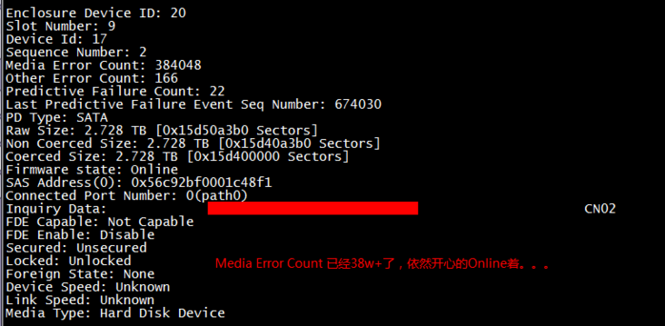

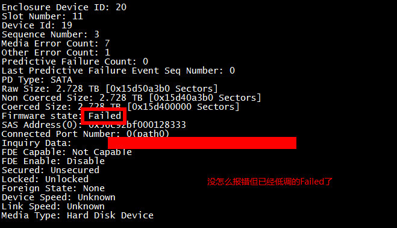

为这个问题专门与服务器RAID卡磁盘厂家沟通，得到的反馈是：

查到之前的资料，Medium error、other error数值的绝对值，不能直接反应硬盘的状态。

根据与RAID卡、硬盘厂家的沟通，建议做法是监控Predictive Failure 的数值，不为零说明硬盘有问题。另外，如果硬盘failed，也可以直接报修。

Predictive Failure Count

指令：storcli /c0/eall/sall show all

监控关键字Predictive Failure Count，标准为不能大于0，若有计数，将对应的硬盘换掉；

Predictive Failure中已经涵盖media error，而且比media error的范围更广、更全面。

硬盘的 SMART 子系统已经具备一套完整的算法来评估硬盘的健康状况

SMART 子系统算法会参考硬盘运行时各个方面的参数，media error 是其中一项

SMART 对于 media error 的评估是基于单位时间增长数来计算的

当 SMART 子系统中任何一个评估项达到对应的阈值时，硬盘会报告 Sense Code: 01 5D 00 (FAILURE PREDICTION THRESHOLD EXCEEDED)

遵循 SCSI 协议标准的 host (OS SCSI 子系统，SAS 控制器， RAID 卡等) 可以正确解析出该 Sense Code

综上，由于 media error 已经被硬盘 SMART 子系统所涵盖，并且会依据 SCSI 协议标准上报 predictive failure，所有硬盘部分只需要在Raid卡下监控Predictive Failure就好，标准为不能大于0。

> **所以如果要监控某个物理磁盘的健康状态，可以直接去监控 Predictive Failure Count 的数值，如果为0，表示磁盘状态良好，如果不为0，表示磁盘已经不可靠了，有损坏的风险。**


## 4.2 磁盘信息过滤

由于磁盘信息较多，所以可以根据自己的需求来过滤得到自己想要的信息

MegaLic64 -PDList -a0 | grep -Ei "(Enclosure Device|Slot Number|Raw Size|Firmware state)" --粗过滤

```
[root@localhost ~]# MegaCli64 -PDList -a0 | grep -Ei "Enclosure Device|Slot Number|Raw Size|Firmware state"
Enclosure Device ID: 32
Slot Number: 0
Raw Size: 931.512 GB [0x74706db0 Sectors]
Firmware state: JBOD
Enclosure Device ID: 32
Slot Number: 1
Raw Size: 465.761 GB [0x3a386030 Sectors]
Firmware state: Online, Spun Up
Enclosure Device ID: 32
Slot Number: 2
Raw Size: 465.761 GB [0x3a386030 Sectors]
Firmware state: Online, Spun Up
Enclosure Device ID: 32
Slot Number: 3
Raw Size: 465.761 GB [0x3a386030 Sectors]
Firmware state: Online, Spun Up
```

## 4.3 获取指定的磁盘信息

MegaLic  -pdInfo -PhysDrv[32:1] -a0

N表示raid卡编号，0表示第一块raid卡；All表示所有的的raid卡；E和S代表Enclosure Device 和Slot Number

```
[root@localhost ~]# MegaCli64 -pdInfo -PhysDrv[32:1] -a0

Enclosure Device ID: 32
Slot Number: 1
Drive's position: DiskGroup: 0, Span: 0, Arm: 0
Enclosure position: 1
Device Id: 1
WWN: 5002538fc26208af
Sequence Number: 2
Media Error Count: 0
Other Error Count: 6
Predictive Failure Count: 0
Last Predictive Failure Event Seq Number: 0
PD Type: SATA

Raw Size: 465.761 GB [0x3a386030 Sectors]
Non Coerced Size: 465.261 GB [0x3a286030 Sectors]
Coerced Size: 465.25 GB [0x3a280000 Sectors]
Sector Size:  512
Logical Sector Size:  512
Physical Sector Size:  512
Firmware state: Online, Spun Up
Device Firmware Level: 2B6Q
Shield Counter: 0
Successful diagnostics completion on :  N/A
SAS Address(0): 0x4433221107000000
Connected Port Number: 2(path0)
Inquiry Data: S6PZNM0T619803L     Samsung SSD 870 EVO 500GB               SVT02B6Q
FDE Capable: Capable
FDE Enable: Disable
Secured: Unsecured
Locked: Unlocked
Needs EKM Attention: No
Foreign State: None
Device Speed: 6.0Gb/s
Link Speed: 6.0Gb/s
Media Type: Solid State Device
Drive:  Not Certified
Drive Temperature :25C (77.00 F)
PI Eligibility:  No
Drive is formatted for PI information:  No
PI: No PI
Drive's NCQ setting : N/A
Port-0 :
Port status: Active
Port's Linkspeed: 6.0Gb/s
Drive has flagged a S.M.A.R.T alert : No


```

## 4.4 磁盘上线和下线

MegaCli -PDOffline/PDOnline -PhysDrv[32:1] -a0

```
[root@localhost ~]# MegaCli64 -PDOffline  -PhysDrv[32:1] -a0   #将32:1 这块盘下线

Adapter: 0: EnclId-32 SlotId-1 state changed to OffLine.

Exit Code: 0x00

[root@localhost ~]# MegaCli64 -pdInfo -Physdrv[32:1] -a0 | grep  -i "Firmware state"        #查看状态，确实为下线状态
Firmware state: Offline
[root@localhost ~]# MegaCli64 -PDOnline -PhysDrv[32:1] -a0    #将32：1 这快盘上线

EnclId-32 SlotId-1 state changed to OnLine.

Exit Code: 0x00
[root@localhost ~]# MegaCli64 -pdInfo -PhysDrv[32:1] -a0 | grep -i "Firmware state" -a0        #查看状态，变为了在线状态
Firmware state: Online, Spun Up
```

## 4.5 磁盘点灯

```
 MegaCli64  -PDLocate start -PhysDrv[32:1] -a0            #点亮32：1 这块盘，-physdrv[32:1] 使用小写也可以

Adapter: 0: Device at EnclId-32 SlotId-1  -- PD Locate Start Command was successfully sent to Firmware

Exit Code: 0x00
[root@localhost ~]# MegaCli64 -PDLocate stop -PhysDrv[32:1] -a0    #关灯

Adapter: 0: Device at EnclId-32 SlotId-1  -- PD Locate Stop Command was successfully sent to Firmware

Exit Code: 0x00
```

## 4.6 强制重构

```
[root@localhost ~]# MegaCli64 -PDRbld -Start -PhysDrv[32:4] -a0
```

## 4.7 查看磁盘重构进度

```
[root@localhost ~]# MegaCli64 -PDRbld -ShowProg -PhysDrv [32:4] -a0
```

## 4.8 查看丢失的物理设备信息

```
[root@localhost ~]# MegaCli64 -PdGetMissing -a0
# Adapter 0 - Missing Physical drives
# No. Array Row Size Expected
# 0 2 0 476416 MB
# Exit Code: 0x00
```

## 4.9 替换丢失的物理设备信息

```
[root@localhost ~]# MegaCli64 -PdReplaceMissing -PhysDrv[32:4] -array2,row0 -a0
```

## 4.10 Unconfigured(bad)-good

```
[root@localhost ~]# MegaCli64 -PDMakeGood -PhysDrv[0:3] [-force] -a0 

Adapter: 0: EnclId-0 SlotId-3 state changed to Unconfigured-Good.

Exit Code: 0x00
```

## 4.11 to JBOD 改变磁盘状态为JBOD

```
[root@localhost ~]# MegaCli64 -PDmakeJBOD -physDRv[32:3] -a0
```

## 4.12 获取磁盘的数量

```
[root@kvmhost ~]# MegaCli64 -PDGetNum -a0 //在raid卡0 上有13块硬盘
Number of Physical Drives on Adapter 0: 13
```

# 5、RAID组基础配置

## 5.1 查看raid组信息

MegaCli -LDInfo -LALl -aAll		

- LD  :virtaul Drive ，虚拟驱动，指的就是raid组，一个raid组对应着一个虚拟驱动（LD）

- -LAll  :level 0,指的是raid的等级，表示所有的等级 

- -L0 : 就表示raid0

MegaCli64 -LdPdinfo -a0

```
[root@localhost ~]# MegaCli64 -LDInfo -lAll -a0


Adapter 0 -- Virtual Drive Information:
Virtual Drive: 0 (Target Id: 0)
Name                :
RAID Level          : Primary-0, Secondary-0, RAID Level Qualifier-0
Size                : 1.362 TB
Sector Size         : 512
Is VD emulated      : No
Parity Size         : 0
State               : Optimal
Strip Size          : 64 KB
Number Of Drives    : 3
Span Depth          : 1
Default Cache Policy: WriteThrough, ReadAheadNone, Direct, No Write Cache if Bad BBU
Current Cache Policy: WriteThrough, ReadAheadNone, Direct, No Write Cache if Bad BBU
Default Access Policy: Read/Write
Current Access Policy: Read/Write
Disk Cache Policy   : Disk's Default
Encryption Type     : None
Default Power Savings Policy: Controller Defined
Current Power Savings Policy: None
Can spin up in 1 minute: No
LD has drives that support T10 power conditions: No
LD's IO profile supports MAX power savings with cached writes: No
Bad Blocks Exist: No
Is VD Cached: No


Exit Code: 0x00
```

## 5.2 创建RAID组

MegaCli64 -CfgLdAdd -r(0|1|5) [E:S,E:S,.....] -aN

N表示raid卡编号，0表示第一块raid卡；ALL表示所有的raid卡 ；E和S代表Enclosure Device和Slot Number

```
[root@localhost ~]# MegaCli64 -CfgLDAdd -r0 [32:1,32:2,32:3] -a0

Adapter 0: Created VD 0

Adapter 0: Configured the Adapter!!

Exit Code: 0x00
[root@localhost ~]# lsblk
NAME   MAJ:MIN RM   SIZE RO TYPE MOUNTPOINT
sda      8:0    0 931.5G  0 disk
├─sda1   8:1    0     1G  0 part /boot/efi
├─sda2   8:2    0 748.5G  0 part /home
├─sda3   8:3    0   100G  0 part /opt
├─sda4   8:4    0    50G  0 part /
└─sda5   8:5    0    32G  0 part [SWAP]
sdb      8:16   0   1.4T  0 disk                #sdb就是刚才创建的新的额RAID的组对应的逻辑磁盘，后面就可以对这个盘进行格式化和挂载操作了
```

**debug:**

> **如果抛出异常：**
> **  ****The specified physical disk does not have the appropriate attributes to complete**
> **  the requested command.**
> **需要执行一下命令：**
> **   megacli -PDMakeGood -Physdrv [E:S,.........] -force -a0**


```
[root@ns-ceph-208205 ~]# Megacli64  -CfgLdAdd -r5 [32:2,32:3,32:4,32:5,32:6,32:7,32:8,32:9,32:10,32:11] -a0
Adapter 0: Created VD 1
Adapter 0: Configured the Adapter!!
Exit Code: 0x00
```

## 5.3 删除RAID组

```
[root@localhost ~]# MegaCli64 -CfgLdDel -L0 -a0　　　＃Ｌ指的是虚拟磁盘的编号不是ｒａｉｄ的级别

Adapter 0: Deleted Virtual Drive-0(target id-0)

Exit Code: 0x00
```

## 5.4 修改RAID组属性

### 5.4.1 MegaCli -DLGetProp -Cache -L0 -a0   #获取当前chache属性

```
[root@localhost ~]# MegaCli64 -LDGetProp -Cache -L0 -a0

Adapter 0-VD 0(target id: 0): Cache Policy:WriteThrough, ReadAheadNone, Direct, No Write Cache if bad BBU

Exit Code: 0x00
[root@localhost ~]# MegaCli64 -LDinfo -L0 -aAll | grep -i "Cache Policy"        #查看默认和当前的cache策略
Default Cache Policy: WriteThrough, ReadAheadNone, Direct, No Write Cache if Bad BBU    #默认的
Current Cache Policy: WriteThrough, ReadAheadNone, Direct, No Write Cache if Bad BBU    #当前的
```

- 缓存策略解释：

```
WriteBack:        （WB）写缓存策略
WriteThrough:    （WT，默认）直接写入磁盘，不适用RAID卡缓存。
 
ReadAheadNone:    （NORA，默认）不开启预读
ReadAhead:        开启预读，在读操作的时候，预先把后面顺序的数据载入raid卡缓存，在顺序读的环境中能提供很好的性能，
                    但是在随机读的环境中反而降低读的性能（适合文件系统，不适合数据库系统）
ReadAdaptive:     自适应预读，在缓存和I/O空闲时选择预读，默认策略。
 
Direct:    （默认）读操作不缓存到RAID卡缓存。
Cached:    读操作缓存到RAID卡缓存。
缩写  ###################
WT (WriteThrough）        默认
WB (WriteBack)
NORA (ReadAheadNone)        默认
RA (ReadAhead)
ADRA (ReadAdaptive)
Cached
Direct
```

 

- 如果BBU(电池)出现问题是否启用WriteCache

```
No Write Cache if Bad BBU:    （默认）如果BBU出现问题不使用WriteCache，从WriteBack自动切换到WriteThrough，默认配置。
Write Cache OK if Bad BBU:    如果BBU出现问题仍启用WriteCache,这种配置是非常不安全的，除非是有UPS或者双电源的情况下。
```

### 5.4.2 修改属性 

- 此操作需要在RAID卡有电池或者，电池状态良好的时候执行。

- 如果RAID卡没有电池，使用默认就好了

MegaCli64 -LDSetProp WT -L0 -a0　　  

MegaCli64 -LDSetProp RA -L0 -a0

MegaCli64 -LDSetProp Cached -L0 -a0

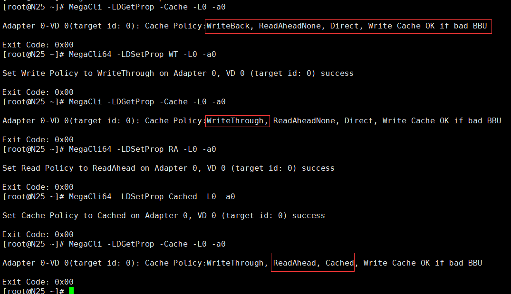

## 5.5 清除RAID配置（慎用）

```
MegaCli -CfgClr [-Force] -aN|-a0,1,2|-aALL
```

## 5.6 获取RAID组的个数

```
[root@kvmhost ~]# MegaCli64 -LDGetNum -a0 //查看逻辑卷个数，如下有两个逻辑卷
Number of Virtual Drives Configured on Adapter 0: 2
Exit Code: 0x02
```

# 6、RAID组扩展配置

- 扩容过程中无法新建RAID组

- 扩容过程中无法对其与RAID组扩容

### 6.1 启动扩容程序

   MegaCli -LDRecon -Start -r0 -Add --PhysDrv[32:3] -L0 -a0

```
[root@localhost ~]# MegaCli -LDRecon -Start -r0 -Add --PhysDrv[32:3] -L0 -a0
Start Reconstrucytion of Virtual Drive Success.        #出现这个不代表已经扩容成功，而是后台启动扩容程序成功。
Exit Code: 0x00
```

### 6.2 查看扩容那个进度

```
# 1、打印当前的扩容进度
[root@localhost ~]# MegaCli64 -LDRecon -ShowProg -L0 -a0        #扩容速度可能会比较慢，请多等一会

Reconstruction on VD #0 (target id #0) Completed 23% in 15 Minutes.        #已经完成23%

Exit Code: 0x00
#2、动态显示扩容进度
[root@localhost ~]# MegaCli64 -LDRecon -ProgDsply -L0 -a0        #按ESC建退出
 Progress of Virtual Drives...

  Virtual Drive #              Percent Complete                       Time Elps
          0         ##############*********28 %*********************** 00:18:39

    Press <ESC> key to quit...
```

**debug**

- 扩容完成之后，使用lsblk 或者 fdisk -l 命令查看磁盘信息，发现并没有大小没有发生改变。

- 需要使用resize2fs或者xfs_growfs命令更新一下文件系统的大小，如果你还没有格式化文件系统，使用任意命令就行。

```
[root@localhost ~]# lsblk  
NAME        MAJ:MIN RM   SIZE RO TYPE MOUNTPOINT
......
/dev/sdb      8:16   0 930.5G  0 disk
[root@localhost ~]# resize2fs /dev/sdb        #因为并没有格式化文件系统，所以会有以下报错，但是不影响，因为disk已经发生了改变。
resize2fs 1.42.9 (28-Dec-2013)
Resizing the filesystem on /dev/sdb to 365887488 (4k) blocks.
resize2fs: Can't read a block bitmap while trying to resize /dev/sdb
Please run 'e2fsck -fy /dev/sdb' to fix the filesystem
after the aborted resize operation.
[root@localhost ~]# lsblk
NAME   MAJ:MIN RM   SIZE RO TYPE MOUNTPOINT
.......
sdb      8:16   0   1.4T  0 disk    #磁盘大小发生了改变
```

# 7、RAID组热备配置

## 7.1 添加全局热备

添加的热备盘，必须是没有被添加到RAID组里面的。

```
[root@localhost ~]# MegaCli64 -PDHSP -set -physdrv[32:3] -a0            #设置[32:3] 作为热备盘

Adapter: 0: Set Physical Drive at EnclId-32 SlotId-3 as Hot Spare Success.    #添加成功

Exit Code: 0x00
[root@localhost ~]# MegaCli64 -PDInfo -PhysDrv[32:3]  -a0 | grep "Firmware state"       #查看磁盘装状态，变为了Hotspare
Firmware state: Hotspare, Spun Up
```

- 测试，故意下线一个盘，然后查看热备盘的动作

```
[root@localhost ~]# MegaCli64  -PDOffline -Physdrv[32:1] -a0        #下线其中一块盘

Adapter: 0: EnclId-32 SlotId-1 state changed to OffLine.

Exit Code: 0x00
[root@localhost ~]# MegaCli64 -PDInfo -physdrv[32:1] -a0 | grep "Firmware state"    #查看状态，为下线状态
Firmware state: Offline
```

- 再次查看热备盘的状态，热备盘进入了Rebuild状态（重构状态）

> **如果热备盘还是Hotspare状态，可以等五六分钟再看看，有没有变化。**
> **如果一直是Hotspare状态，可以检查一下有没有热备卡。**


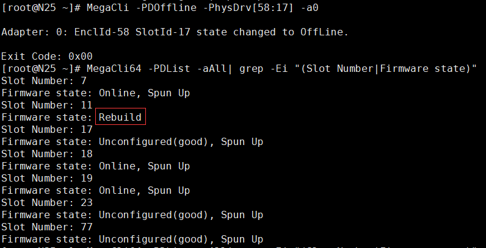

MegaCli64 -PDRbld -ShowProg -PhysDrv[E:S] -aALL

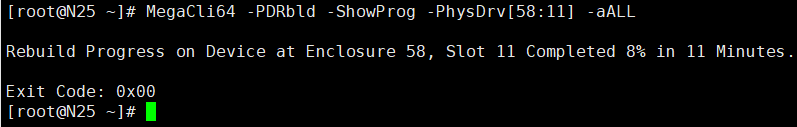

MegaCli64 -PDRbld -ProgDsply -PhysDrv[E:S] -aALL

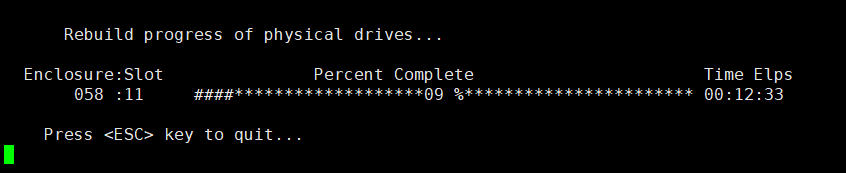

## 7.2 局部热备

在创建时添加局部热备

MegaCli64 -CfgLdAdd -r1 [58:7,58:11] -Hsp[58:17] -a0

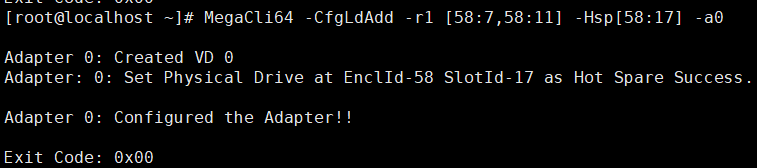

查看RAID组信息：

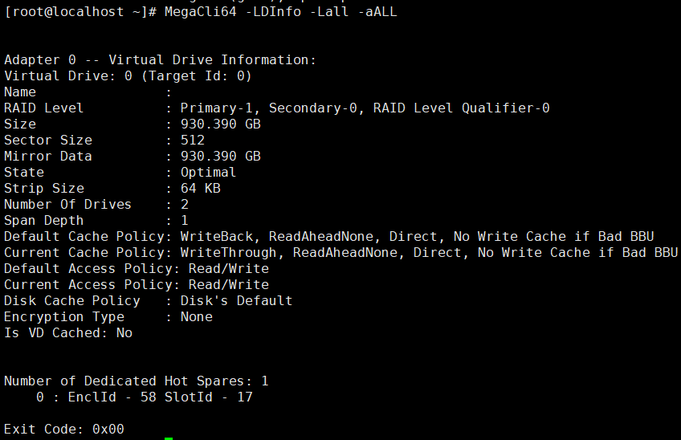

然后再添加一块全局热备

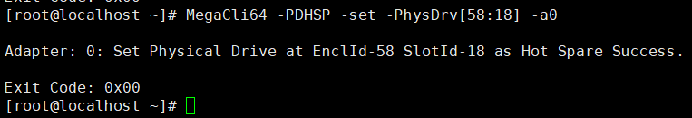

准备工作完毕！现在下线成员盘，下线之后局部热备替换到成员组

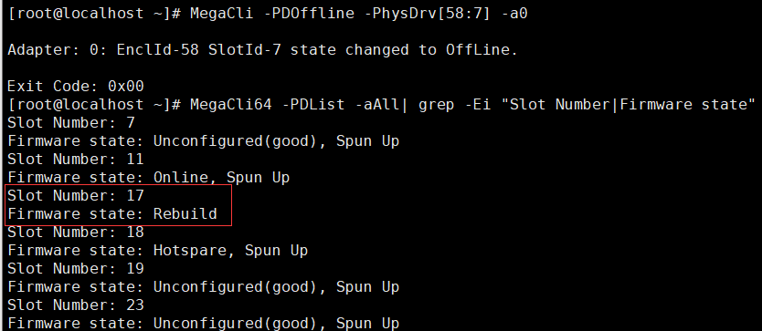

RAID组状态也变为降级

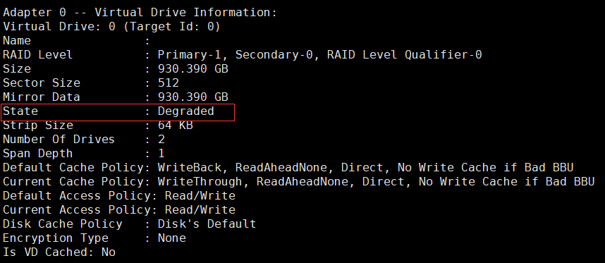

rebuild的时间也很长，但此期间可以创建新的RAID组

等待ing~~~~~~~~~~

此时另一块盘也可以下线，不过下线rebuild就凉凉了…… 

 

第二种是创建成功之后，给特定RAID组添加热备盘

MegaCli64 -CfgLdAdd -r5 [58:7,58:11,58:17] -a0

MegaCli64 -CfgLdAdd -r1 [58:19,58:23] -a0

首先创建两个RAID组，然后把热备添加到第二个RAID组里（局部热备可以同时添加到多个RAID组）

局部热备里的Array计算比较麻烦，这里就要用到上面提到的DG，要按DG的排序累加，一直累加到要添加热备的VD（要添加热备的VD也要计算）。

1. 默认设Array为-1。

2. 如果是RAID0,1,5,6，则Array加1。

3. 如果是RAID10,50，则Array加2。

4. 如果是RAID0,1,5,6，则返回Array最后计算的值。

5. 如果是RAID10,50，则返回Array-1,Array。

MegaCli64 -PDHSP -set -Dedicated [-Array1] -PhysDrv[58:18] -a0

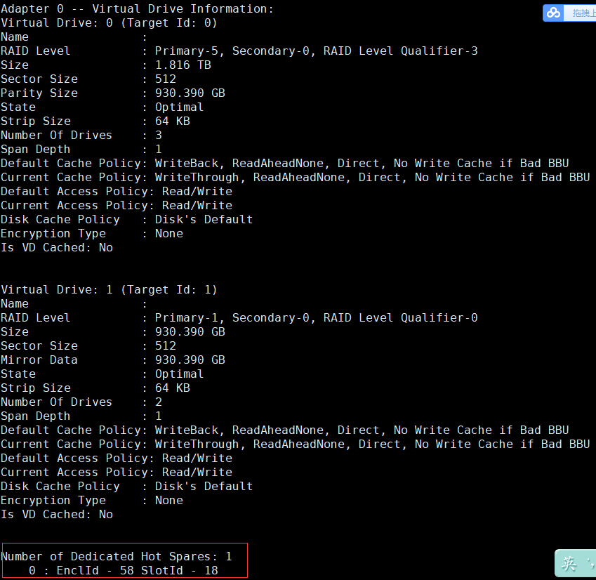

## 7.3 删除热备

```
[root@localhost ~]# MegaCli64 -PDHSP -Rmv -PhysDrv[1:5] -a0
```

# 9、查看电池信息

- /opt/MegaRAID/MegaCli/MegaCli64 -AdpBbuCmd -GetBbuStatus -aALL |grep ‘Charger Status’ 【查看充电状态】

- /opt/MegaRAID/MegaCli/MegaCli64 -AdpBbuCmd -GetBbuStatus -aALL【显示BBU状态信息】

- /opt/MegaRAID/MegaCli/MegaCli64 -AdpBbuCmd -GetBbuCapacityInfo -aALL【显示BBU容量信息】

- /opt/MegaRAID/MegaCli/MegaCli64 -AdpBbuCmd -GetBbuDesignInfo -aALL 【显示BBU设计参数】

- /opt/MegaRAID/MegaCli/MegaCli64 -AdpBbuCmd -GetBbuProperties -aALL 【显示当前BBU属性】

```
查看电池状态信息(Display BBU Status Information)
MegaCli -AdpBbuCmd -GetBbuStatus -aN|-a0,1,2|-aALL
MegaCli -AdpBbuCmd -GetBbuStatus -aALL
查看电池容量（Display BBU Capacity Information）
MegaCli -AdpBbuCmd -GetBbuCapacityInfo -aN|-a0,1,2|-aALL
MegaCli -AdpBbuCmd -GetBbuCapacityInfo –aALL
查看电池设计参数(Display BBU Design Parameters)
MegaCli -AdpBbuCmd -GetBbuDesignInfo -aN|-a0,1,2|-aALL
MegaCli -AdpBbuCmd -GetBbuDesignInfo –aALL
查看电池属性（Display Current BBU Properties）
MegaCli -AdpBbuCmd -GetBbuProperties -aN|-a0,1,2|-aALL
MegaCli -AdpBbuCmd -GetBbuProperties –aALL
设置电池为学习模式为循环模式（Start BBU Learning Cycle）
Description Starts the learning cycle on the BBU.
No parameter is needed for this option.
MegaCli -AdpBbuCmd -BbuLearn -aN|-a0,1,2|-aALL
```

# 10、常见问题处理

1.     Firmwarestate:Unconfigured(good), Spun down解决方法：

重新热拔插指定硬盘，该状态会变成Firmware state:Unconfigured(good), Spun Up

创建raid后磁盘状态也会由Spun down变成SpunUp

 

2.     Firmware state: Unconfigured(bad)解决办法：

MegaCli64 -PDMakeGood -PhysDrv[E:S] -a0 固件状态会由Unconfigured(bad)变成Unconfigured(good), Spun Up

# MegaCli64 -PDMakeGood -PhysDrv[252:7] -a0

 

3.     Firmware state: failed解决办法：

出现failed状态的硬盘大多已损坏，建议更换（或报修）；但可以强制上线。

强制上线步骤如下：

可以先将磁盘下线。 # MegaCli64 -PDOffline-PhysDrv[E:S] -a0

然后再上线。        # MegaCli64 -PDOnline -PhysDrv[E:S] -a0

 

4.     以下状态的解决办法：

Foreign State: Foreign

Foreign Secure: Drive is notsecured by a foreign lock key

办法一：可以清除恢复状态（慎用）

# MegaCli64 -CfgForeign -Clear -a0

办法二：导入配置，恢复虚拟磁盘组

# MegaCli64 -CfgForeign -import -a0

 

5.     如何定位设备/dev/sd*由哪些磁盘组成并点亮指定硬盘。

 udevadm info -q path -n /dev/sda

可以看出设备/dev/sda是raid下的Virtual Drive: 0

然后确定Virtual Drive: 0是由哪些磁盘组成，并点亮磁盘

MegaCli64 -ldpdinfo -a0|grep -Ei "(Virtual Drive:|RAID Level|^Size|Enclosure Device|Slot Number)"

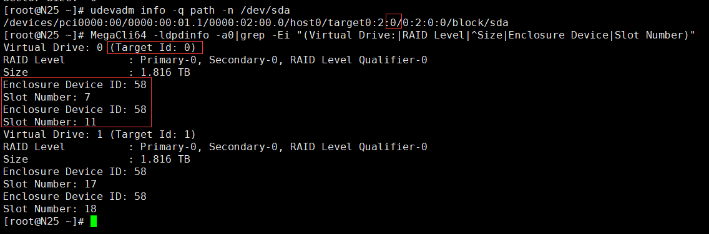