# 1、RAID技术

- RAID是一种把多块独立的硬盘（物理硬盘）按不同的方式组合起来形成一个硬盘组（逻辑硬盘），从而提供比单个硬盘更高的存储性能和提供数据备份技术。

- RAID全称Redundant Array of Independent Disks；即独立磁盘冗余阵列。

- RAID优势：容量易扩展、分块提高性能、可用性提高及可靠性提高。

- RAID级别，不同的RAID级别代表着不同的性能、数据安全性和存储成本。

- RAID常用级别：RAID0、RAID1、RAID10、RAID5、RAID6。

- RAID级别

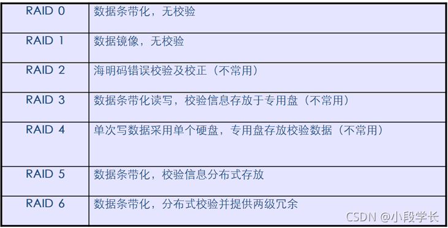

# 2、RAID出现原因 

## 2.1 可靠性

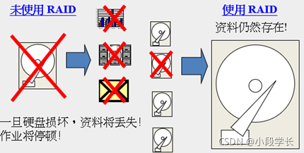

## 2.2 提高容量

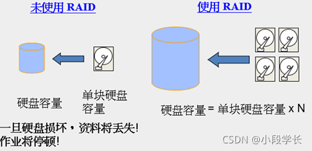

## 2.3 提升速度

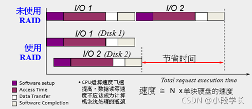

# 3、RAID基本概念

## 3.1 条带

大数据块写入RAID时会被分成多个数据块并行写入多块硬盘，这些大小一致的数据块就称为条带。同时数据读取时会并行从多块硬盘读取条带数据，最后完整输出。

条带无疑会大幅度提升整体读写效率。

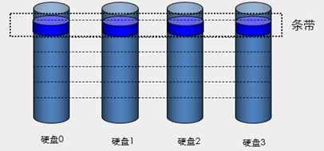

## 3.2 校验

两个数字之间的XOR运算定义是：

1 XOR 1 = 0

1 XOR 0 = 1

0 XOR 1 = 1

0 XOR 0 = 0

数据A0和A1通过异或运算进行奇偶校验得到校验位P

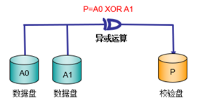

## 3.3 重构（重建）

某块硬盘出现故障后，一旦将其更换为正常硬盘，RAID便会通过其他硬盘数据计算出坏盘上原有的数据，再将数据重建回新添硬盘上。

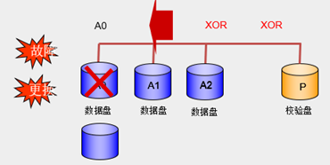

## 3.4 RAID热备盘-HotSpare

热备份是在建立RAID磁盘阵列系统的时候，将其中一磁盘指定为热备磁盘，此热备磁盘在平常并不操作，当阵列中某一磁盘发生故障时，热备磁盘便取代故障磁盘，并自动将故障磁盘的数据重构在热备磁盘上。

- 热备盘分为：全局热备盘和局部热备盘

- 全局热备盘：针对整个磁盘阵列，对阵列中所有RAID组起作用。

- 局部热备盘：只针对某一RAID组起作用。

因为反应快速，加上快取内存减少了磁盘的存取，所以数据重构很快即可完成，对系统的性能影响不大。

对于要求不停机的大型数据处理中心或控制中心而言，热备份更是一项重要的功能，因为可避免晚间或无人守护时发生磁盘故障所引起的种种不便。

## 3.5 热备与重构

在线操作特性

系统中需设置一个热添加的备份盘或用一个新的替代磁盘替代故障磁盘

当满足以下条件时开始数据自动重构

有一个热备份盘存在

独立于故障磁盘的所有磁盘都配置为冗余阵列(RAID1,3,5,0+1)

所有的操作都是在不中断系统操作的情况下进行的

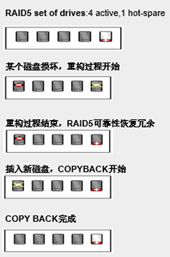

## 3.6 物理卷与逻辑卷

RAID由几块硬盘（物理卷）组成

RAID可以多个硬盘按照指定容量创建一个或多个逻辑卷，便通过LUN（Logic Unit Number）来标识。一个逻辑卷对于主机来说就是一块硬盘（物理卷）

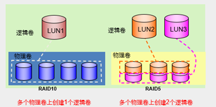

# 4、RAID0 条带存储（Striping）

- **原理**：又称数据分条，即把数据分成若干相等大小的小块，并把它们写到阵列上不同的硬盘上，这种技术又称“Stripping”（即将数据条带化），RAID0在读写时是以并行的方式对各硬盘同时进行操作。

- **优点**：磁盘空间利用率最高，在所有的级别中，RAID 0的速度是最快的

- **缺点**：无冗余功能，如果一个磁盘损坏，则所有的数据都无法使用，不适合关键业务

- **应用：**媒体编辑，图像编辑，需要高带宽的应用

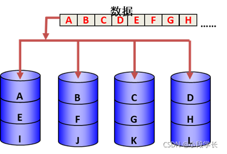

# 5、RAID1 镜像/双工

- **原理**：即每个工作盘都有一个镜像盘，每次写数据时必须同时写入镜像盘，读数据时只从工作盘读出，一旦工作盘发生故障立即转入镜像盘，从镜像盘中读出数据。当更换故障盘后，数据可以重构，恢复工作盘正确数据。

- **优点:**数据安全性相对其它RAID级，是最好的

- **缺点:**磁盘利用率只有50%，是所有RAID上磁盘利用率最低的一个级别。

- **应用:**财务,金融,需要高数据可用性的应用

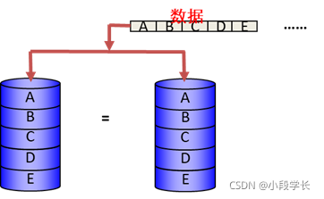

# 6、RAID3  (条带分布+专用盘校验)

- **原理：**使用至少三块硬盘配置，在其中的一块硬盘上存贮专用的校验数据，当某块硬盘出现故障时，其它硬盘可以通过校验数据将有故障的硬盘的数据重新恢复出来。

- **特点：**数据以位或字节的方式存于各盘（分散记录在组内相同扇区的各个硬盘上）

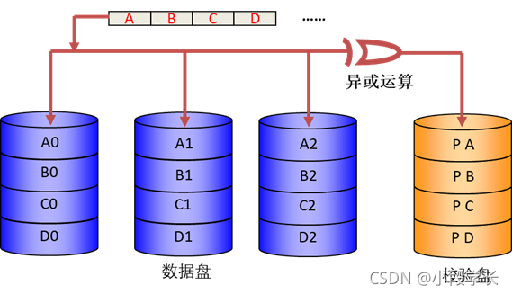

- **优点：**高可用性，磁盘利用率较高(N-1)，并行I/O传输，顺序读性能较高

- **缺点**：校验盘成为性能瓶颈，每次读写牵动整个组，每次只能完成一次I/O

- **应用**：流媒体服务器，图像编辑，视频编辑

# 7、RAID5（条带技术+分布式校验）

RAID 5与RAID 3机制类似，但校验数据均匀分布在各数据硬盘上，RAID成员硬盘上同时保存数据和校验信息，数据块和对应的校验信息保存在不同硬盘上。RAID 5是最常用的RAID方式之一。

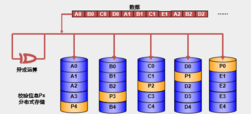

# 8、RIAD6 （Double parity drive） 高级数据保护

**特点**

**优点**

**缺点**

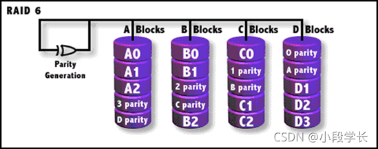

RAID 6 是带有两个独立分布式奇偶校验方案的独立数据硬盘（Independent data disks with two independent distributed parity schemes）。广义上讲，能够允许两个硬盘同时失效的RAID级别统称为RAID 6，狭义上讲，特指Intel的RAID P+Q技术。硬盘空间利用率为(N-2)/N，N为RAID6阵列硬盘总数

- RAID 6技术：目前RAID 6还没有统一的标准，各家公司的实现方式都有所不同：

- RAID P+Q：INTEL和HDS公司

- RAID DP： NetApp公司

- RAID ADG：HP公司

# 9、RAID P+Q

RAID6 P+Q会根据公式计算出P和Q的值，当有两个数据同时丢失时，仍可以计算出原数据。

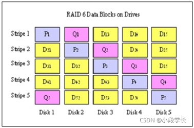

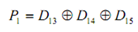

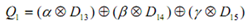

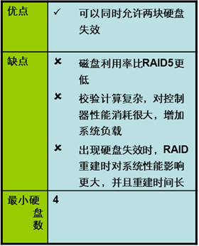

# 10、RAID组合级别——RAID10

RAID 10是将镜像和条带进行两级组合的RAID级别，第一级是RAID1镜像对，第二级为RAID 0。RAID10也是一种应用比较广泛的RAID级别。

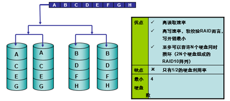

# 11、RAID组合级别——RAID 0+1

RAID 0+1是将条带和镜像进行两级组合的RAID级别，第一级是RAID 0，第二级为RAID 1。一般来说，RAID 0+1的失效概率要比RAID 10大，不过无硬盘故障下，RAID 0+1的读取速度要比RAID 10快。

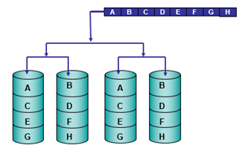

**不同等级RAID效率对比**

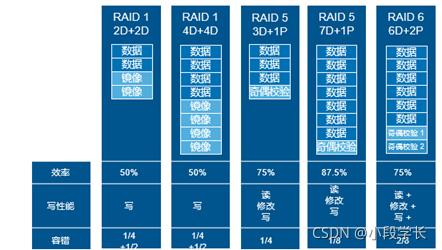

# 12、RAID与LUN关系

RAID由几个硬盘组成 ，从整体上看相当于一个物理卷在物理卷的基础上可以按照指定容量创建一个或多个逻辑卷，通过LUN（Logic Unit Number）来标识

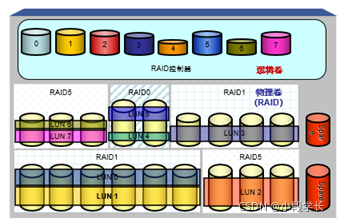

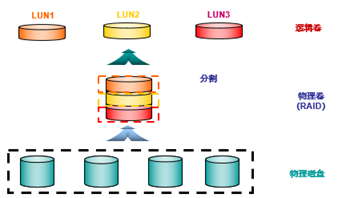

# 13、LUN masking & LUN Mapping

服务器只要连接到存储的控制器，就有可能看到所有的LUN资源，但是磁盘阵列不可能只为某一个服务器来使用，必须屏蔽主机使用某部分LUN资源。这个管制分为两类：一部分就是LUN mapping，类似于绿色通道，就是保证服务器能看到某部分存储资源，一部分就是LUN masking，类似于警戒线，就是保证服务器只可访问给它分配的存储资源。

实现LUN masking和LUN mapping有三种方法：

- 基于存储控制器来设置

- 基于存储交换机来设置

- 基于服务器OS来设置。

LUN masking是指LUN与主机HBA卡的WWN地址绑定，与主机HBA卡建立一对一或多对一的连接和访问关系。无论主机跳线到同一个Fabric（无zone设置)的哪一个端口上，主机都能识别到相同的LUN。

在非共享的应用系统中，一般在卷和主机建立一（主机）对多（卷）的关系，不同业务类型的工作站分别访问不同的LUN。在共享式的应用系统中，一般采用多（主机）对一（卷）关系。

LUN Mapping是LUN与存储设备的主机端口进行绑定，服务器连接不同的主机端口时所能访问的LUN不同。

当系统无FC交换机，主机与存储设备的主机端口直连时，通过LUN Mapping实现起来LUN分区非常方便。当所有主机端口都连接到同一个FABRIC时，就需要与 FC switch的ZONE结合起来一起使用。

# 14、MPIO冗余多路径

- Multipath I/O (多路径)

在计算机存储技术里多路径提供了容错和性能提高，服务器与存储设备之间有多条物理路径通道，通过总线、控制器、交换设备来连接。

如果其中1个控制器，端口或交换设备故障，那操作系统就会自动切换I/O路径到冗余的控制器为应用程序使用，但这样可能会增加延迟。

**一些多路径软件可以利用冗余的路径提高性能，例如:**

Dynamic load balancing 动态负载均衡

Traffic shaping 流量控制

Automatic path management 自动路径管理

Dynamic reconfiguration 动态设置

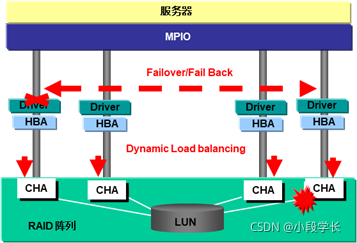

# 15、RAID组建方式

## 15.1 Software RAID

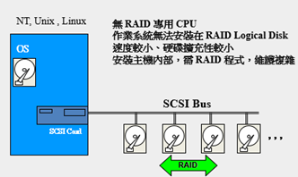

## 15.2 RAID Card

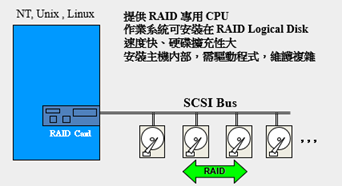

## 15.3 RAID Controller

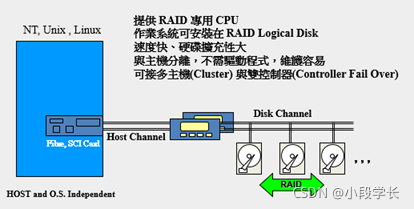

# 16、RAID 优点

- 硬盘容错 ( fault tolerance)

- 提高 I/O处理速度 ( high performance )

- 提升传输速率 ( fast data transfer )

- 提高资料使用率 ( high availability )

- 维护方便 ( easy maintenance )