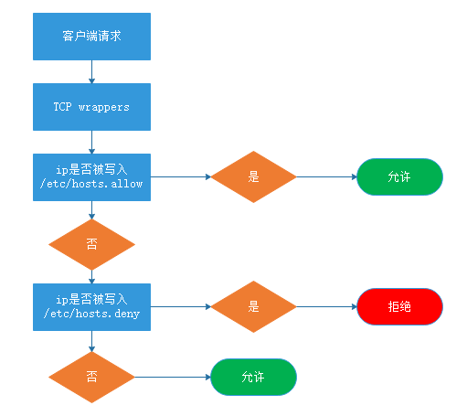

# 1、 TCP Wrappers 简介


  TCP_Wrappers是一个工作在第四层（传输层）的的安全工具，对有状态连接（TCP）的特定服务进行安全检测并实现访
问控制，界定方式是凡是调用libwrap.so库文件的的程序就可以受TCP_Wrappers的安全控制。它的主要功能就是控制
谁可以访问，常见的程序有rpcbind、vsftpd、sshd，telnet。


判断方式：


```javascript
1. 查看对应服务命令所在位置
which sshd
2. 查看指定命令执行时是否调用libwrap.so文件
ldd /usr/sbin/sshd | grep libwrap.so
```

# 例1：查看sshd服务是否调用libwrap.so库文件

```javascript
[root@server ~]# which sshd
/usr/sbin/sshd
[root@server ~]# ldd /usr/sbin/sshd  | grep libwrap.so           #ldd 服务命令路径，查询服务所调用的库文件
	libwrap.so.0 => /lib64/libwrap.so.0 (0x00007f49e43ba000)      #调用了
[root@server ~]# 
```


---

# 2、TCP Wrappers 工作原理


以ssh为例，每当有ssh的连接请求时，先读取系统管理员所设置的访问控制文件，符合要求，则会把这次连接原封不


动的转给ssh进程，由ssh完成后续工作；如果这次连接发起的ip不符合访问控制文件中的设置，则会中断连接请求，


拒绝提供ssh服务。





- 1.优先查看 hosts.allow,匹配即停止


- 2.允许个别，拒绝所有：hosts.allow 文件添加允许的策略，hosts.deny 文件添加 all


- 3.拒绝个别，允许所有：hosts.allow 文件为空，hosts.deny 文件添加单个拒绝的策略


---


# 3、 TCP Wrappers 的使用


TCP_Wrappers的使用主要是依靠两个配置文件/etc/hosts.allow, /etc/hosts.deny，以此实现访问控制，默认情况下，


/etc/hosts.allow，/etc/hosts.deny什么都没有添加，此时没有限制


配置文件编写规则 ：


```javascript
service_list@host: client_list
service _list ： 是程序（服务）的列表，可以是多个，多个时，使用，隔开
@host ：	      设置允许或禁止他人从自己的哪个网口进入。这一项不写，就代表全部
clien t_list ：  是访问者的地址，如果需要控制的用户较多，可以使用空格或，隔开
格式如下：
    基于IP地址： 192.168.88.1 192.168.88.
    基于主机名： www.atguigu.com .atguigu.com 较少用
    基于网络/掩码： 192.168.0.0/255.255.255.0

    内置ACL：ALL(所有主机)、LOCAL(本地主机)
```

## 实验案例 ：


## 1）拒绝单个 IP 使用 ssh 远程连接：


```javascript
配置文件：
hosts.allow：空着
hosts.deny：sshd:192.168.88.20
```

- 修改配置文件: vi  /etc/hosts.deny

```javascript
[root@server ~]# vi /etc/hosts.deny 

#
# hosts.deny    This file contains access rules which are used to
#               deny connections to network services that either use
#               the tcp_wrappers library or that have been
#               started through a tcp_wrappers-enabled xinetd.
#
#               The rules in this file can also be set up in
#               /etc/hosts.allow with a 'deny' option instead.
#
#               See 'man 5 hosts_options' and 'man 5 hosts_access'
#               for information on rule syntax.
#               See 'man tcpd' for information on tcp_wrappers

sshd:192.168.1.105   

```

- 登录测试：ssh root@192.168.1.106

```javascript
[root@client ~]# ssh 192.168.1.106
ssh_exchange_identification: read: Connection reset by peer       #登录失败，测试成功
```


### 2）拒绝某一网段使用 ssh 远程连接：


```javascript
hosts.allow：空着
hosts.deny：sshd:192.168.88.
```

- 修改配置文件：vi  /etc/hosts.deny

```javascript
[root@server ~]# vi /etc/hosts.deny 

#
# hosts.deny    This file contains access rules which are used to
#               deny connections to network services that either use
#               the tcp_wrappers library or that have been
#               started through a tcp_wrappers-enabled xinetd.
#
#               The rules in this file can also be set up in
#               /etc/hosts.allow with a 'deny' option instead.
#
#               See 'man 5 hosts_options' and 'man 5 hosts_access'
#               for information on rule syntax.
#               See 'man tcpd' for information on tcp_wrappers

sshd:192.168.1.        
```

- 连接测试： ssh root@192.168.1.106

```javascript
[root@client ~]# ssh root@192.168.1.106
ssh_exchange_identification: read: Connection reset by peer
```

### 3）仅允许某一 IP 使用 ssh 远程连接：


```javascript
hosts.allow：sshd:192.168.88.20
hosts.deny：sshd:ALL
```

- 修改白名单：vi  /etc/hosts.allow

```javascript
[root@server ~]# vi /etc/hosts.allow 

# hosts.allow   This file contains access rules which are used to
#               allow or deny connections to network services that
#               either use the tcp_wrappers library or that have been
#               started through a tcp_wrappers-enabled xinetd.
#
#               See 'man 5 hosts_options' and 'man 5 hosts_access'
#               for information on rule syntax.
#               See 'man tcpd' for information on tcp_wrappers
#

sshd:192.168.1.103             #真实机IP     

```

- 修改黑名单： vi /etc/hosts/deny

```javascript
[root@server ~]# vi /etc/hosts.deny 


# hosts.deny    This file contains access rules which are used to
#               deny connections to network services that either use
#               the tcp_wrappers library or that have been
#               started through a tcp_wrappers-enabled xinetd.
#
#               The rules in this file can also be set up in
#               /etc/hosts.allow with a 'deny' option instead.
#
#               See 'man 5 hosts_options' and 'man 5 hosts_access'
#               for information on rule syntax.
#               See 'man tcpd' for information on tcp_wrappers

sshd:ALL        #禁止所有
```

- 真实机登录测试：

```javascript
[C:\~]$ ssh root@192.168.1.106


Connecting to 192.168.1.106:22...
Connection established.
To escape to local shell, press 'Ctrl+Alt+]'.

Last login: Tue Aug 17 08:20:26 2021 from 192.168.1.105
[root@server ~]#                                              #登录成功，测试成功

```

- 虚拟机登录测试：

```javascript
[root@client ~]# ssh root@192.168.1.106
ssh_exchange_identification: read: Connection reset by peer         #登录失败，测试成功
```


