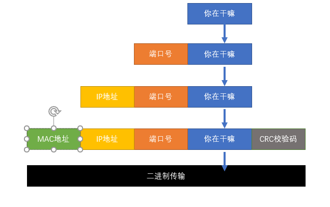

**SO组织定义的OSI七层网络模型**


- 物理层：

物理层负责最后将信息

eg：RJ45等将数据转化成0和1；

- 数据链路层:

数据链路层通过物理网络链路?供数据传输。不同的数据链路层定义了不同的网络和协 议特征,其中

包括

可以简单的理解为：规定了0和1的分包形式，确定了网络数据包的形式；

- 网络层

网络层负责在

可以理解为，此处需要确定计算机的位置，怎么确定？IPv4，IPv6！

- 传输层

传输层向高层?提供可靠的

可以理解为：每一个应用程序都会在网卡注册一个端口号，该层就是端口与端口的通信！常用的（TCP／IP）协议；

- 会话层

会话层建立、管理和终止表示层与实体之间的通信会话；

建立一个连接（自动的手机信息、自动的网络寻址）;

- 表示层:

表示层提供多种功能用于应用层数据编码和转化,以确保以一个系统应用层发送的信息 可以被另一

个系统应用层识别;

可以理解为：解决不同系统之间的通信，eg：Linux下的QQ和Windows下的QQ可以通信；

- 应用层:

OSI 的应用层协议包括文件的传输、访问及管理协议(FTAM) ,以及文件虚拟终端协议(VIP)和公用管

理系统信息(CMIP)等;

规定数据的传输协议；

# **1、物理层1**

- 不管通过什么样的介质，将信息的二进制能够传递到另外一个节点，这个过程就是物理层

- 物理层定义了一系列传输介质的电气标准，这个是弱电工程师关心的

- RJ45俗称水晶头

- T568B

- 线序标准，目前市场上绝大多数网线是这个标准

- 橙白 橙 绿白 蓝 蓝白 绿 棕白 棕

- T568A

- SFP

- SFP看拉环颜色

- LC连接器，进出分开

- SC连接器，单根纤进出

# 2、数据链路层

- 封装成帧、差别检错、透明传输

- 将物理层传递过来的**二进制的信号内容进行翻译**，翻译的结果被**称为数据帧**

- 以太网传递的最终形式是二进制，以太网卡都会内置处理芯片，用来处理最初的112个二进制

- 前48位是目的地MAC地址（媒体访问控制，相当于网卡的身份证号码）

- 之后的48位是发送者的MAC地址

- 之后的16位，表示数据包的类型

- 0x0800，ipv4数据报文

- 0x80dd，ipv6报文

- 打开cmd，输入ipconfig/all，可以查看Windows所有网卡的MAC地址

- MAC地址

- 前24位是组织唯一标识符，可以看出来网卡的品质

- 物理层被认为是不可靠的，有可能接触不良，有可能是电测干扰，有可能闪电风暴。。。

- 数据链路层通**过CRC循环冗余校验生成校验码**，放在数据包最后的**FCS，**用来保证数据正确，

如果错误则丢弃

# 3、网络层

- **路由，寻址功能**

- 当计算机从网卡后获得后续数据是ipv4之后，就以ipv4的格式去理解后续的内容

- 需要注意的关键内容如下

- protocol

- 17：UDP	

- 6：TCP

- 源与目的ip地址

- **mac地址比作为身份证号**，那么**ip地址就是当前你所处的位置**，快递小哥通过你的位置

- 找到你，通过你的身份证确认你

# 4、传输层

**端对端的连接**

- 当计算机现在已经确定这个数据就是给我的之后，就需要判断这个数据是什么业务

- 需要注意的关键内容

- **源目的端口号**

- 范围是1-65535

- 默认情况下，所有端口都是关闭的，当有程序需要网络通信的时候，就会选择一个端口号占用

- 正常情况下，电脑上大多数软件端口号是随机的，因为不需要被访问，只需要回复

- 有些服务是需要被访问的，所以这些访问需要占据固定的众所周知的端口号

- 在电脑上的c:\windows\system32\dreivers\etc\service文件中保存着windows主动访问其他

主机时候默认使用的端口号

```
http       80/tcp
ftp       20/tcp 21/tcp
mstsc     3389/tcp 3389udp
dns       54/tcp 53/udp
telnet   23/tcp
ssh     22/tcp
```

- 在cmd中输入netstat -ano可以查看ip地址、端口号、进程号对应的关系

# 5、应用层

产生用户数据，为用户提供用户交互的接口

# **6、数据封装**



- 数据从产生到传递到目的地的过程中会经历好几个过程，每个过程都负责加工自己这部分的内容，类似于工厂流水线

- 目前我们只需要有个最基本的概念：

- IP地址是用来标识网络中位置的，比如你在江苏省xxx市xxx路xxx号

- MAC地址是每个网络设备的唯一ID，比如你的身份证号码

- 如果想要发送数据，必须(暂且认为必须)同时拥有IP和MAC地址

- Linux的网络管理基础部分就是需要大家掌握IP地址的配置

**数据解封装的过程和数据封装过程正好相反，数据封装是由发送者执行，数据解封装是由接收者执行**

# **7、数据报文**


