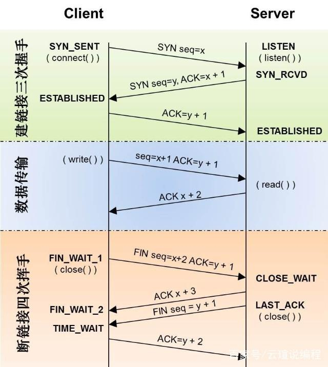
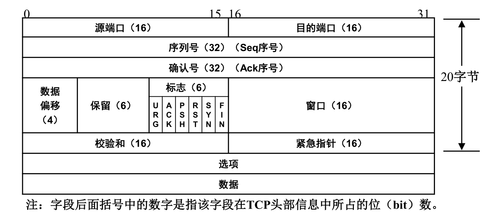
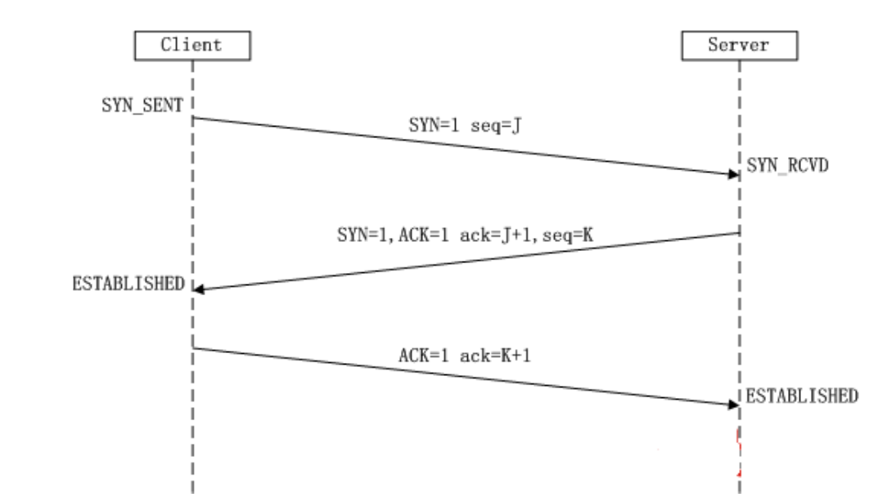
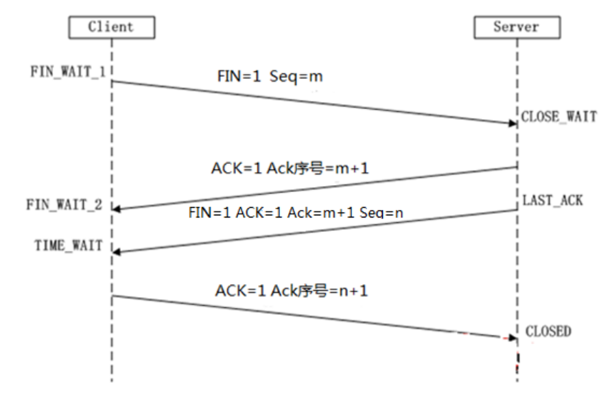

# **一、TCP/UDP**

1-65535

- tcp全称传输控制协议，传输层用来保障数据的可靠传输，并且携带基本的端口号

- 可靠的协议，可以知道数据丢失和差错的信息



- udp全称用户数据报文协议，只携带了基本的端口号

- 尽力而为的协议，无法获知数据的接受情况

# **二、传输层协议**

• TCP协议（传输控制协议）：可靠的，面向连接的传输协议

• UDP协议（用户数据报协议）：不可靠的，面向无连接的传输协议

## **1）TCP协议数据格式**



## **2）TCP包头作用**

• 序列号： Seq（Sequence）序号，占32位，用来标识从TCP源端向目的端发送的字节流，发起方发送数据时对此进行标记。

• 确认号： Ack（序号，占32位，只有ACK标志位为1时，确认序号字段才有效，Ack=Seq+1。

• 标志位： 共6个，即URG、ACK、PSH、RST、SYN、FIN等，具体含义如下：

```
 URG：    紧急指针（urgent pointer）有效。
 ACK：    确认序号有效。
 PSH：    接收方应该尽快将这个报文交给应用层。
 RST：    重置连接。
 SYN：    发起一个新连接。 SYN是Synchronize的缩写，意为同步。
 FIN：    释放一个连接。
```

## **3）TCP三次握手**



- **第一次握手：**Client将标志位SYN置为1，随机产生一个值seq=J，并将该数

据包发送给Server，Client进入SYN_SENT状态，等待Server确认。

- ** 第二次握手：**Server收到数据包后由标志位SYN=1知道Client请求建立连接，

Server将标志位SYN和ACK都置为1，ack 序号J+1，随机产生一个值seq=K，

并将该数据包发送给Client以确认连接请求，Server进入SYN_RCVD状态。

- **第三次握手：**Client收到确认后，检查ack序号是否为J+1，标志位ACK是否

为1，如果正确则将标志位ACK置为1，ack序号=K+1，并将该数据包发送给

Server；Server检查ack序号是否为K+1，ACK是否为1，如果正确则连接建

立成功，Client和Server进入ESTABLISHED（

Client与Server之间可以开始传输数据了

## **4）TCP四次挥手**



- **第一次挥手**：Client发送一个标志位为FIN包，Seq序号=m，用来关闭

Client到Server的数据传送，Client进入FIN_WAIT_1状态。

- **第二次挥手：**Server收到标志位FIN包后，发送一个标志位ACK给Client，

Ack确认序号为m+1，Server进入CLOSE_WAIT状态。

- **第三次挥手：**Server发送一个标志位FIN=1,ACK=1，Seq序号=n，Ack确认号

=m+1，用来关闭Server到Client的数据传送，Server进入LAST_ACK状态。

- **第四次挥手**：Client收到FIN后，Client进入TIME_WAIT状态，接着发送一

个ACK标志给Server，Ack确认序号=n+1，Server进入CLOSED状态，完成四

次挥手。

# **三、类似面试题**

• 简述TCP包头的内容？

• 简述TCP四次挥手的过程？