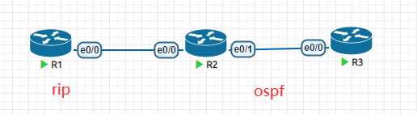

**路由重发步概念**

- 是可以将不同的自治系统他们之间的路由信息j进行交换

- 从一种协议到另外一种协议

- 同一种协议的不同实例

- 路由重发是针对外部的，自身的路由器不会有变化

**拓扑**



```
R2#sh ip route  
  1.0.0.0/24 is subnetted, 1 subnets
R    1.1.1.0 [120/1] via 192.168.12.1, 00:00:15, Ethernet0/0
  2.0.0.0/8 is variably subnetted, 2 subnets, 2 masks
C    2.2.2.0/24 is directly connected, Loopback0
L    2.2.2.2/32 is directly connected, Loopback0
  3.0.0.0/32 is subnetted, 1 subnets
O    3.3.3.3 [110/11] via 192.168.23.3, 00:02:40, Ethernet0/1
  192.168.12.0/24 is variably subnetted, 2 subnets, 2 masks
C    192.168.12.0/24 is directly connected, Ethernet0/0
L    192.168.12.2/32 is directly connected, Ethernet0/0
  192.168.23.0/24 is variably subnetted, 2 subnets, 2 masks
C    192.168.23.0/24 is directly connected, Ethernet0/1
L    192.168.23.2/32 is directly connected, Ethernet0/1
R1#sh ip route
    1.0.0.0/8 is variably subnetted, 2 subnets, 2 masks
C    1.1.1.0/24 is directly connected, Loopback0
L    1.1.1.1/32 is directly connected, Loopback0
  192.168.12.0/24 is variably subnetted, 2 subnets, 2 masks
C    192.168.12.0/24 is directly connected, Ethernet0/0
L    192.168.12.1/32 is directly connected, Ethernet0/0
R3#sh ip route
2.0.0.0/32 is subnetted, 1 subnets
O    2.2.2.2 [110/11] via 192.168.23.2, 00:00:12, Ethernet0/0
  3.0.0.0/8 is variably subnetted, 2 subnets, 2 masks
C    3.3.3.0/24 is directly connected, Loopback0
L    3.3.3.3/32 is directly connected, Loopback0
  192.168.23.0/24 is variably subnetted, 2 subnets, 2 masks
C    192.168.23.0/24 is directly connected, Ethernet0/0
L    192.168.23.3/32 is directly connected, Ethernet0/0
做双向重发步
R2(config-if-range)#router rip
R2(config-router)#ver 2
R2(config-router)#redistribute ospf 1 metric 5
R2(config-router)#router ospf 1
R2(config-router)#redistribute rip subnets
再次坚持路由表
R1#sh ip route
  1.0.0.0/8 is variably subnetted, 2 subnets, 2 masks
C    1.1.1.0/24 is directly connected, Loopback0
L    1.1.1.1/32 is directly connected, Loopback0
  2.0.0.0/24 is subnetted, 1 subnets
R    2.2.2.0 [120/5] via 192.168.12.2, 00:00:28, Ethernet0/0
  3.0.0.0/32 is subnetted, 1 subnets
R    3.3.3.3 [120/5] via 192.168.12.2, 00:00:28, Ethernet0/0
  192.168.12.0/24 is variably subnetted, 2 subnets, 2 masks
C    192.168.12.0/24 is directly connected, Ethernet0/0
L    192.168.12.1/32 is directly connected, Ethernet0/0
R   192.168.23.0/24 [120/5] via 192.168.12.2, 00:00:28, Ethernet0/0
R2#sh ip route
  1.0.0.0/24 is subnetted, 1 subnets
R    1.1.1.0 [120/1] via 192.168.12.1, 00:00:24, Ethernet0/0
  2.0.0.0/8 is variably subnetted, 2 subnets, 2 masks
C    2.2.2.0/24 is directly connected, Loopback0
L    2.2.2.2/32 is directly connected, Loopback0
  3.0.0.0/32 is subnetted, 1 subnets
O    3.3.3.3 [110/11] via 192.168.23.3, 00:07:58, Ethernet0/1
  192.168.12.0/24 is variably subnetted, 2 subnets, 2 masks
C    192.168.12.0/24 is directly connected, Ethernet0/0
L    192.168.12.2/32 is directly connected, Ethernet0/0
  192.168.23.0/24 is variably subnetted, 2 subnets, 2 masks
C    192.168.23.0/24 is directly connected, Ethernet0/1
L    192.168.23.2/32 is directly connected, Ethernet0/1
R3# sh ip route
  1.0.0.0/24 is subnetted, 1 subnets
O E2   1.1.1.0 [110/20] via 192.168.23.2, 00:02:30, Ethernet0/0
  2.0.0.0/32 is subnetted, 1 subnets
O    2.2.2.2 [110/11] via 192.168.23.2, 00:04:10, Ethernet0/0
    3.0.0.0/8 is variably subnetted, 2 subnets, 2 masks
C    3.3.3.0/24 is directly connected, Loopback0
L    3.3.3.3/32 is directly connected, Loopback0
O E2 192.168.12.0/24 [110/20] via 192.168.23.2, 00:02:30, Ethernet0/0
  192.168.23.0/24 is variably subnetted, 2 subnets, 2 masks
C    192.168.23.0/24 is directly connected, Ethernet0/0
L    192.168.23.3/32 is directly connected, Ethernet0/0
```