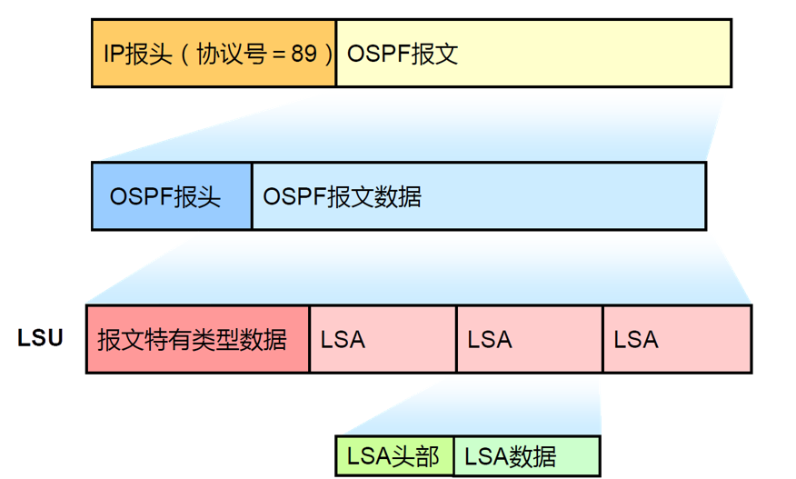
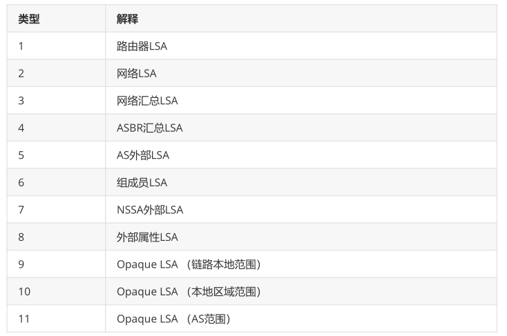
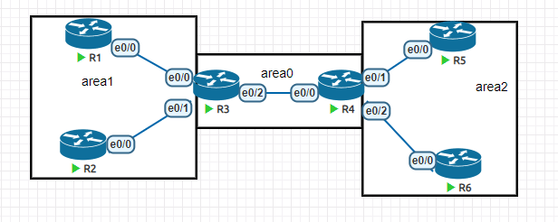
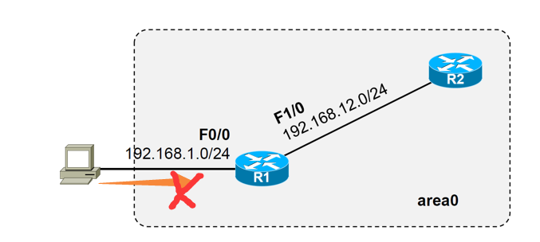
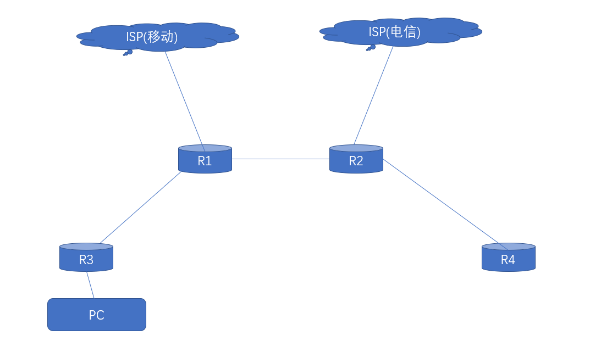

# 1、什么是LSA

LSA（链路状态广播）是链接状态协议使用的一个分组，它包括有关邻居和通道成本的信息。 LSA

被路由器接收用于维护它们的路由选择表。 LSA: Link-State Advertisement。



# 2、LSA类型



## 1类LSA

- 每个路由器针对它所在的区域产生LSA1，描述区域内部与路由器直连的链路的信息（包括链路类型，Cost等） ；

- LSA1只允许在本区域内洪泛，不允许跨越ABR；

- LSA中会标识路由器是否是ABR(B比特置位),ASBR（E比特置位）或者是Virtual-link（V比特置位）

的端点的身份信息；

```
R1#sh ip ospf database
     OSPF Router with ID (1.1.1.1) (Process ID 1)
Router Link States (Area 0)
Link ID     ADV Router   Age     Seq#    Checksum Link count
1.1.1.1     1.1.1.1     88     0x80000005 0x006F8C 3
2.2.2.2     2.2.2.2     89     0x80000006 0x000BE6 3
```

- Link ID：链路ID，可以理解为目的地

- ADV Router：链路来自哪一个路由器

- Age：是计时器

- Seq：序列号，初始值为 0x80000001，每收到一次数据包更新一次这个数值会+1， 加到0x8fffffff

达到最大，下一次变为 0x80000000，ospf认为0x80000000是不可用的

- Checksum：校验和

## 2类LSA

- 描述TransNet（包括Broadcast和NBMA网络）网络信息；

- 由DR生成，描述其在该网络上连接的所有路由器以及网段掩码信息，以及这个MA所属的路由器；

- LSA类型2只在本区域Area内洪泛，不允许跨越ABR；

- Network LSA ID是DR进行宣告的那个接口的IP地址

- Network LSA 中没有COST字段

```
R1#sh ip ospf database network 
     OSPF Router with ID (1.1.1.1) (Process ID 1)
Net Link States (Area 0)
LS age: 148
Options: (No TOS-capability, DC)
LS Type: Network Links
Link State ID: 192.168.12.3 (address of Designated Router)
Advertising Router: 3.3.3.3
LS Seq Number: 80000002
Checksum: 0x1484
Length: 36
Network Mask: /24
Attached Router: 3.3.3.3
Attached Router: 1.1.1.1
Attached Router: 2.2.2.2
```

- 通过LSA1，LSA2在区域内洪泛,使区域内每个路由器的LSDB达到同步，计算生成标识为“O”的路

由，解决区域内部的通信问题。

## 3类LSA

- 由ABR生成，实际上这就就是将区域内部的Type1 Type2的信息收集起来以路由子网的形式扩散出

去,是Summay LSA中Summay的含义（注意这里的summary与路由汇总没有关系）

- Type 3 的链路状态ID是目的网络地址。

- 如果—台ABR路由器在与它本身相连的区域内有多条路由可以到达目的地,那么它将只会始发单一的

一条网络汇总LSA到骨干区域,而且这条网络汇总LSA是上述多条路由中代价最低的。

- ABR收到来自同区域其它ABR传来的Type 3 LSA后重新生成新的Type3 LSA（Advertising Router改

为自己）然后继续在整个OSPF系统内扩散

```
R1#show ip ospf database summary
     OSPF Router with ID (1.1.1.1) (Process ID 1)
Summary Net Link States (Area 0)
LS age: 145
Options: (No TOS-capability, DC, Upward)
LS Type: Summary Links(Network)
Link State ID: 5.5.5.5 (summary Network Number)
Advertising Router: 2.2.2.2
LS Seq Number: 80000001
Checksum: 0xD441
Length: 28
Network Mask: /32
MTID: 0 Metric: 11
LS age: 186
Options: (No TOS-capability, DC, Upward)
LS Type: Summary Links(Network)
Link State ID: 192.168.25.0 (summary Network Number)
Advertising Router: 2.2.2.2
LS Seq Number: 80000001
Checksum: 0xEBBC
Length: 28
Network Mask: /24
MTID: 0 Metric: 10
```

## 4类LSA

- ASBR Summary LSA由ABR生成，用于描述ABR能够到达的ASBR它的链路状态，链路状态ID为目

的ASBR的RID。

```
R5#sh ip ospf database asbr-summary
     OSPF Router with ID (5.5.5.5) (Process ID 1)
Summary ASB Link States (Area 1)
LS age: 318
Options: (No TOS-capability, DC, Upward)
LS Type: Summary Links(AS Boundary Router)
Link State ID: 1.1.1.1 (AS Boundary Router address)
Advertising Router: 2.2.2.2
LS Seq Number: 80000001
Checksum: 0x75B0
Length: 28
Network Mask: /0
MTID: 0 Metric: 10
```

## 5类LSA

- Autonomous System External LSA由ASBR生成用于描述OSPF自治域系统外的目标网段信息，链

路状态ID是目的地址的IP网络号。

- 外部路由通过重发布，引入OSPF路由域，相应信息(路由条目)由ASBR以LSA5的形式生成然后进入OSPF路由域

- OE2 开销= 外部开销；

- OE1 开销= 外部开销+ 内部开销；

```
R5#sh ip ospf database external
     OSPF Router with ID (5.5.5.5) (Process ID 1)
Type-5 AS External Link States
LS age: 71
Options: (No TOS-capability, DC, Upward)
LS Type: AS External Link
Link State ID: 0.0.0.0 (External Network Number )
Advertising Router: 1.1.1.1
LS Seq Number: 80000002
Checksum: 0xA9E8
Length: 36
Network Mask: /0
Metric Type: 1 (Comparable directly to link state metric)
MTID: 0
Metric: 666
Forward Address: 0.0.0.0
External Route Tag: 1
```

### **四类和五类的理解**

- 四类LSA告诉你怎么到达ASBR，由ABR产生

- 五类LSA告诉你具体外部有哪些路由可以走，由ASBR产生

## 7类LSA

- NSSA中的外部LSA NSSA External LSA

- 在NSSA(非完全存根区域)not-so-stubby area中ASBR针对外部网络产生类似于LSA5的LSA类型7,

- 链路ID是外部网路地址

- LSA类型7只能在NSSA区域中洪泛，到达NSSA区域ABR后，NSSA ABR将其转换成LSA类型5外部路

由，传播到Area 0，从而传播到整个OSPF路由域

- 生成路由缺省用ON2表示，也可指定为ON1；

```
R2#sh ip ospf database nssa-external
     OSPF Router with ID (2.2.2.2) (Process ID 1)
Type-7 AS External Link States (Area 1)
LS age: 493
Options: (No TOS-capability, Type 7/5 translation, DC, Upward)
LS Type: AS External Link
Link State ID: 100.100.100.0 (External Network Number )
Advertising Router: 1.1.1.1
LS Seq Number: 80000002
Checksum: 0x4719
Length: 36
Network Mask: /24
Metric Type: 2 (Larger than any link state path)
MTID: 0
Metric: 20
Forward Address: 1.1.1.1
External Route Tag: 0
```

# 3、特殊区域

**拓扑**



# 4、stub area

- 随着大量的5类LSA进入ospf区域，OSPF Database会变得庞大，同时路由表的外部地址也会增

大。这会占用路由器大量的资源。

- 解决这个问题的办法是：让Area内部的路由器不记录任何AS外部的地址，而使用ABR作为默认网

关，有一条指向ABR的默认路由。

- 这种方式我们把它叫做stub area。

- 配置

- router ospf 2

- area 1 stub

- 在区域二里涉及到的所有路由器使用上述命令

## 1）没有配置末梢节点之前的路由表

```
R6#sh ip route 
O*E2 0.0.0.0/0 [110/1] via 192.168.46.4, 00:00:03, Ethernet0/0
  1.0.0.0/32 is subnetted, 1 subnets
O IA   1.1.1.1 [110/31] via 192.168.46.4, 00:08:01, Ethernet0/0
  2.0.0.0/32 is subnetted, 1 subnets
O IA   2.2.2.2 [110/31] via 192.168.46.4, 00:08:01, Ethernet0/0
  3.0.0.0/32 is subnetted, 1 subnets
O IA   3.3.3.3 [110/21] via 192.168.46.4, 00:08:01, Ethernet0/0
  4.0.0.0/32 is subnetted, 1 subnets
O IA   4.4.4.4 [110/11] via 192.168.46.4, 00:08:01, Ethernet0/0
  5.0.0.0/32 is subnetted, 1 subnets
O    5.5.5.5 [110/21] via 192.168.46.4, 00:08:01, Ethernet0/0
  6.0.0.0/8 is variably subnetted, 2 subnets, 2 masks
C    6.6.6.0/24 is directly connected, Loopback0
L    6.6.6.6/32 is directly connected, Loopback0
O IA 192.168.13.0/24 [110/30] via 192.168.46.4, 00:08:01, Ethernet0/0
O IA 192.168.23.0/24 [110/30] via 192.168.46.4, 00:08:01, Ethernet0/0
O IA 192.168.34.0/24 [110/20] via 192.168.46.4, 00:08:01, Ethernet0/0
O   192.168.45.0/24 [110/20] via 192.168.46.4, 00:08:01, Ethernet0/0
  192.168.46.0/24 is variably subnetted, 2 subnets, 2 masks
C    192.168.46.0/24 is directly connected, Ethernet0/0
L    192.168.46.6/32 is directly connected, Ethernet0/0
```

## 2)配置了末梢节点之后的路由表

```
R6#sh ip route
O*IA 0.0.0.0/0 [110/11] via 192.168.46.4, 00:00:14, Ethernet0/0
  1.0.0.0/32 is subnetted, 1 subnets
O IA   1.1.1.1 [110/31] via 192.168.46.4, 00:00:24, Ethernet0/0
  2.0.0.0/32 is subnetted, 1 subnets
O IA   2.2.2.2 [110/31] via 192.168.46.4, 00:00:24, Ethernet0/0
  3.0.0.0/32 is subnetted, 1 subnets
O IA   3.3.3.3 [110/21] via 192.168.46.4, 00:00:24, Ethernet0/0
  4.0.0.0/32 is subnetted, 1 subnets
O IA   4.4.4.4 [110/11] via 192.168.46.4, 00:00:24, Ethernet0/0
  5.0.0.0/32 is subnetted, 1 subnets
O    5.5.5.5 [110/21] via 192.168.46.4, 00:00:24, Ethernet0/0
  6.0.0.0/8 is variably subnetted, 2 subnets, 2 masks
C    6.6.6.0/24 is directly connected, Loopback0
L    6.6.6.6/32 is directly connected, Loopback0
O IA 192.168.13.0/24 [110/30] via 192.168.46.4, 00:00:24, Ethernet0/0
O IA 192.168.23.0/24 [110/30] via 192.168.46.4, 00:00:24, Ethernet0/0
O IA 192.168.34.0/24 [110/20] via 192.168.46.4, 00:00:24, Ethernet0/0
O   192.168.45.0/24 [110/20] via 192.168.46.4, 00:00:24, Ethernet0/0
  192.168.46.0/24 is variably subnetted, 2 subnets, 2 masks
C    192.168.46.0/24 is directly connected, Ethernet0/0
L    192.168.46.6/32 is directly connected, Ethernet0/0
R6#
```

# 5、totally stub area

- 有时仅仅不学习外部路由仍然不能够满足需求，路由表和ospf的数据库依然非常庞大，这个时候可

以连ospf的其他区域的路由也不学习

- 只学习本区域的路由，以及有一条指向ABR的默认路由

- 配置与stub不同的是在ABR上配置area 2 stub no-summary

- totally stub area的路由表

```
R6#sh ip route
O*IA 0.0.0.0/0 [110/11] via 192.168.46.4, 00:08:11, Ethernet0/0
  5.0.0.0/32 is subnetted, 1 subnets
O    5.5.5.5 [110/21] via 192.168.46.4, 00:08:21, Ethernet0/0
  6.0.0.0/8 is variably subnetted, 2 subnets, 2 masks
C    6.6.6.0/24 is directly connected, Loopback0
L    6.6.6.6/32 is directly connected, Loopback0
O   192.168.45.0/24 [110/20] via 192.168.46.4, 00:08:21, Ethernet0/0
  192.168.46.0/24 is variably subnetted, 2 subnets, 2 masks
C    192.168.46.0/24 is directly connected, Ethernet0/0
L    192.168.46.6/32 is directly connected, Ethernet0/0
只有本区域的路由和一条默认路由
```

# 6、NSSA area

- 当我们把区域配置成末梢区域时，有时候有特例想要加入一些外部路由，这个时候nssa允许存在

ASBR通过7类LSA的方式将外部路由引入本区域，不会自动注入默认路由

- 不会学习外部路由

- 会学习其他区域路由

- 可以学习ASBR注入的外部路由

- 没有注入默认路由

- 配置

- 在区域内所有路由器配置以下命令

- router ospf 1

- area 1 nssa

## 1)配置NSSA之前的路由表

```
R1#sh ip route
O*E2 0.0.0.0/0 [110/1] via 192.168.13.3, 00:25:07, Ethernet0/0
  1.0.0.0/8 is variably subnetted, 2 subnets, 2 masks
C    1.1.1.0/24 is directly connected, Loopback0
L    1.1.1.1/32 is directly connected, Loopback0
  2.0.0.0/32 is subnetted, 1 subnets
O    2.2.2.2 [110/21] via 192.168.13.3, 00:34:31, Ethernet0/0
  3.0.0.0/32 is subnetted, 1 subnets
O IA   3.3.3.3 [110/11] via 192.168.13.3, 00:34:51, Ethernet0/0
  4.0.0.0/32 is subnetted, 1 subnets
O IA   4.4.4.4 [110/21] via 192.168.13.3, 00:34:06, Ethernet0/0
  5.0.0.0/32 is subnetted, 1 subnets
O IA   5.5.5.5 [110/31] via 192.168.13.3, 00:14:17, Ethernet0/0
  6.0.0.0/32 is subnetted, 1 subnets
O IA   6.6.6.6 [110/31] via 192.168.13.3, 00:14:17, Ethernet0/0
  192.168.13.0/24 is variably subnetted, 2 subnets, 2 masks
C    192.168.13.0/24 is directly connected, Ethernet0/0
L    192.168.13.1/32 is directly connected, Ethernet0/0
O   192.168.23.0/24 [110/20] via 192.168.13.3, 00:34:51, Ethernet0/0
O IA 192.168.34.0/24 [110/20] via 192.168.13.3, 00:34:51, Ethernet0/0
O IA 192.168.45.0/24 [110/30] via 192.168.13.3, 00:21:45, Ethernet0/0
O IA 192.168.46.0/24 [110/30] via 192.168.13.3, 00:33:39, Ethernet0/0
```

## 2)配置成NSSA区域之后的路由表

```
R1#sh ip route
  1.0.0.0/8 is variably subnetted, 2 subnets, 2 masks
C    1.1.1.0/24 is directly connected, Loopback0
L    1.1.1.1/32 is directly connected, Loopback0
  2.0.0.0/32 is subnetted, 1 subnets
O    2.2.2.2 [110/21] via 192.168.13.3, 00:00:02, Ethernet0/0
  3.0.0.0/32 is subnetted, 1 subnets
O IA   3.3.3.3 [110/11] via 192.168.13.3, 00:00:12, Ethernet0/0
  4.0.0.0/32 is subnetted, 1 subnets
O IA   4.4.4.4 [110/21] via 192.168.13.3, 00:00:12, Ethernet0/0
  5.0.0.0/32 is subnetted, 1 subnets
O IA   5.5.5.5 [110/31] via 192.168.13.3, 00:00:12, Ethernet0/0
  6.0.0.0/32 is subnetted, 1 subnets
O IA   6.6.6.6 [110/31] via 192.168.13.3, 00:00:12, Ethernet0/0
  192.168.13.0/24 is variably subnetted, 2 subnets, 2 masks
O N2   100.100.100.0 [110/20] via 192.168.23.3, 00:00:19, Ethernet0/0
C    192.168.13.0/24 is directly connected, Ethernet0/0
L    192.168.13.1/32 is directly connected, Ethernet0/0
O   192.168.23.0/24 [110/20] via 192.168.13.3, 00:00:12, Ethernet0/0
O IA 192.168.34.0/24 [110/20] via 192.168.13.3, 00:00:12, Ethernet0/0
O IA 192.168.45.0/24 [110/30] via 192.168.13.3, 00:00:12, Ethernet0/0
O IA 192.168.46.0/24 [110/30] via 192.168.13.3, 00:00:12, Ethernet0/0
```

# 7、Totally NSSA area

- 不会学习外部路由

- 不会学习其他区域路由

- 可以学习ASBR注入的外部路由

- 会自动注入默认路由

- 配置：与nssa不同的是在ABR上配置以下命令

- router ospf 1

- area 1 nssa no-summary

```
R2#sh ip route
O*IA 0.0.0.0/0 [110/11] via 192.168.23.3, 00:01:04, Ethernet0/0
  1.0.0.0/32 is subnetted, 1 subnets
O    1.1.1.1 [110/21] via 192.168.23.3, 00:00:44, Ethernet0/0
  2.0.0.0/8 is variably subnetted, 2 subnets, 2 masks
C    2.2.2.0/24 is directly connected, Loopback0
L    2.2.2.2/32 is directly connected, Loopback0
  100.0.0.0/24 is subnetted, 1 subnets
O N2   100.100.100.0 [110/20] via 192.168.23.3, 00:00:44, Ethernet0/0
O   192.168.13.0/24 [110/20] via 192.168.23.3, 00:09:01, Ethernet0/0
  192.168.23.0/24 is variably subnetted, 2 subnets, 2 masks
C    192.168.23.0/24 is directly connected, Ethernet0/0
L    192.168.23.2/32 is directly connected, Ethernet0/0
```

# 8、Passive-interface（被动接口）

- 当有某台设备或者服务器与外网相连，那么当这台设备被黑客攻击成功后，黑客则可以利用ospf的

特性破坏内部网络，为了解决这种问题提出被动接口的概念

- 配置

- router ospf 1

- passive-interface 接口



# 9、默认路由的注入

- 解决的问题是所有ospf区域内的设备均可以到达网关

- 支持多台路由器宣告默认路由

- 配置

- router ospf 1

- default-information originate always metric-type [宣告类型] metric [度量值]

- 类型1是会累加ospf内部开销，类型2不会累加内部开销

