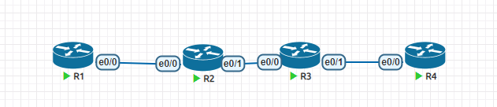

**汇总路由**

# 1、针对OSPF区域内进行汇总

- R2 R3在区域0， R4在区域1

- R4 上有三个环回接口地址为10.1.x.1/24， 并且将他们加入到ospf当中

- 汇总路由不能针对本区域进行汇总

- 只能汇总由自己产生的明细

- 配置

- router ospf 1

- area 1 range 10.1.0.0 255.255.0.0

# 2、针对外部区域进行汇总

- 在R1上有三个环回接口地址为172.16.x.x/24，并且通过重发布的方式引入外部路由

- 汇总命令在ASBR上配置

- 配置

- router ospf 1

- summary address 172.16.0.0 255.255.0.0

# 3、抑制区域内部路由明细

- 有时候内部的一些隐私的服务器或者设备并不希望被其他区域学习到，则可以使用抑制路由明细的方式

- 配置

- router ospf 1

- area 1 range 10.1.2.2 255.255.255.255 not-advertise

## 1）抑制外部区域路由明细

- 配置

- router ospf 1

- summary-address 172.16.2.0 255.255.255.0 not-advertise