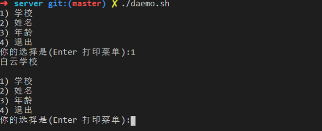

# 1、select 命令生成菜单

```shell

#!/bin/bash

set -u


function is_in {         #判断某个元素是否在一个迭代对象中         
        local var=$1
        shift
        for item in $@
        do
                if [ "$item" == "$var"  ];then
                        return 0        #存在返回0
                fi
        done
        return 1            #不存在返回1
}


function fun1 {
        echo "hello"
}

function fun2 {
        echo "world"
}

##########################main#####################
declare -A menu
menu=(                        #菜单，定义好的函数。直接加入这个数组即可
        [a]=fun1
        [b]=fun2
        [quit]="exit 0"
)

PS3="你的选择是(enter打印菜单)："
select input in ${!menu[*]}
do
        is_in "$input" ${!menu[*]}
        if [ "$?" -eq 0  ];then
                ${menu[$input]}
        else
                echo "不存在该选项"
        fi

done

```

# 2、 menu.sh 自定义菜单（推荐）

```shell
#!/bin/bash
set -u
function name {
    echo "张三"
}
function age {
    echo "18岁"
}
function school {
    echo "白云学校"
}
function quit {
    exit 0
}
menu=(
    "姓名=name"     #姓名 是菜单上需要显示的字样，后面是需要调用的函数 
    "年龄=age"
    "学校=school"
    "退出=quit"
)
function print_menu {
    #$1:  是菜单的具体信息，不可以省略
    #$2:  当前菜单的说明，不可以省略
    #$3:  当前菜单运行在主程序中还是在函数中，如果是函数中，使用return退出。如果是主程序使用exit退出。 默认是函数。
    local menu=($1)
    set +u
        local is_sub=${3-"sub"}
    set -u
    while true
    echo -e  "$2\n"
    do
        for ((i=0;i<${#menu[*]};i++))
        do  
            local index
            let index=i+1
            echo "$index) $(echo ${menu[$i]}|cut -d '=' -f1)"
        done
        while true
        do
            echo -n "你的选择是(Enter 打印菜单):"
            local opt 
            read  opt 
            if [ "$opt" == "q" ];then
                [ "$is_sub" == "sub" ] && return 0 || exit 0    
            fi  
            if [[ "$opt" =~ ^[0-9]+$ && "$opt" -ge 1 && "$opt" -le ${#menu[*]} ]];then
                let opt--
                res=$(echo ${menu[$opt]}| cut -d "=" -f2)
                $res
                break
            fi
            [ "$opt" == "" ]&&continue
            echo "错误的选项"
        done
        echo
    done
}


print_menu  "${menu[*]}" "###############主菜单###################" "main"
```

- 运行结果

