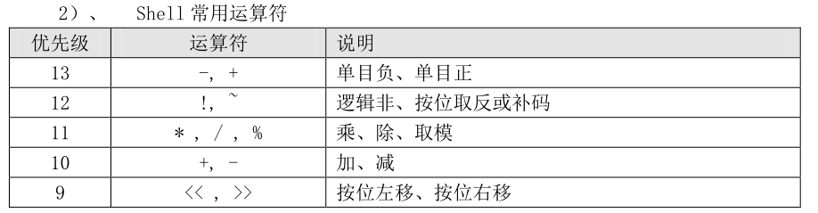
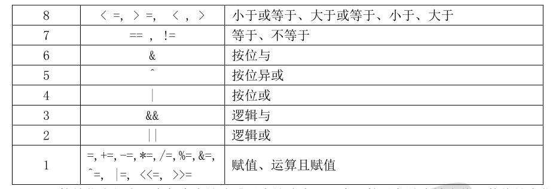

# **1、使用expr或let数值运算工具**

要想进行数值运算的第二种方法是使用 expr 命令，这种命令就没有 declare 命令复杂了。命令

如下：

```javascript
[root@localhost ~]# aa=11
[root@localhost ~]# bb=22
#给变量 aa 和变量 bb 赋值
[root@localhost ~]# dd=$(expr $aa + $bb)
#dd 的值是 aa 和 bb 的和。注意“+”号左右两侧必须有空格

[root@localhost ~]# echo $dd
33
```

# **2、 let 命令和 expr 命令基本类似，都是 Linux 中的运算命令，命令格式如下：
**

```javascript
[root@localhost ~]# aa=11
[root@localhost ~]# bb=22
#给变量 aa 和变量 bb 赋值
[root@localhost ~]# let ee=$aa+$bb
[root@localhost ~]# echo $ee
33
#变量 ee 的值是 aa 和 bb 的和
[root@localhost ~]# n=20
#定义变量 n
[root@localhost ~]# let n+=1
#变量 n 的值等于变量本身再加 1
[root@localhost ~]# echo $n
21
```

expr 命令和 let 命令大家可以按照习惯使用，不过 let 命令对格式要求要比 expr 命令宽松，所

以推荐使用 let 命令进行数值运算。

# **3、使用“$((运算式))”或“$[运算式]”方式运算（****推荐使用）****
**

其实这是一种方式“$(())”和“$[]”这两种括号按照个人习惯使用即可。命令如下：

```javascript
[root@localhost ~]# aa=11
[root@localhost ~]# bb=22
[root@localhost ~]# ff=$(( $aa+$bb ))
[root@localhost ~]# echo $ff
33
#变量 ff 的值是 aa 和 bb 的和
[root@localhost ~]# gg=$[ $aa+$bb ]
[root@localhost ~]# echo $gg
33
#变量 gg 的值是 aa 和 bb 的和
```

这三种数值运算方式，大家可以按照自己的习惯来进行使用。不过我们推荐使用“$((运算式))”

的方式

# **4、shell 常用运算符**





**运算符优先级表明在每个表达式或子表达式中哪一个运算对象首先被求值，数值越大优先级越
**

**高，具有较高优先级级别的运算符先于较低级别的运算符进行求值运算。**

# **5、四则运算例子：**

```javascript
#!/bin/bash


read -t 30 -p "please input a num1:" num1
read -t 30 -p "please input a num2:" num2
read    -t 30 -p "please input a operation [+-*/]" oper

[ "$oper" == "+" ] && echo "$(($num1 + $num2))" && exit
[ "$oper" == "-" ] && echo "$(($num1 - $num2))" && exit
[ "$oper" == "*" ] && echo "$(($num1 * $num2))\n" && exit

echo “符号错误“
[root@bogon test]# vi count.sh 
[root@bogon test]# 
[root@bogon test]# ./count.sh 
please input a num1:50
please input a num2:30
please input a operation [+-*/]+
80
[root@bogon test]# 

```

# 6、bc

算术操作精密运算工具

## 补充说明

**bc命令**

### 语法

```bash
bc(选项)(参数)
```

### 选项

```bash
-i：强制进入交互式模式；
-l：定义使用的标准数学库；
-w：对POSIX bc的扩展给出警告信息；
-q：不打印正常的GNU bc环境信息；
-v：显示指令版本信息；
-h：显示指令的帮助信息。
```

### 参数

文件：指定包含计算任务的文件。

### 实例

算术操作高级运算bc命令它可以执行浮点运算和一些高级函数：

```bash
echo "1.212*3" | bc 
3.636
```

设定小数精度（数值范围）

```bash
echo "scale=2;3/8" | bc
0.37
```

参数

进制转换

```bash
#!/bin/bash
abc=192
echo "obase=2;$abc" | bc
```

执行结果为：11000000，这是用bc将十进制转换成二进制。

```bash
#!/bin/bash
abc=11000000
echo "obase=10;ibase=2;$abc" | bc
```

执行结果为：192，这是用bc将二进制转换为十进制。

计算平方和平方根：

```bash
echo "10^10" | bc
echo "sqrt(100)" | bc
```