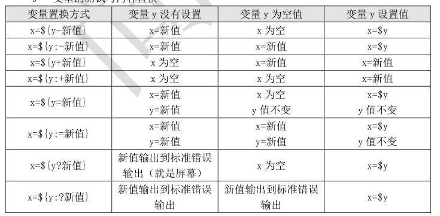

# **x=${y-new}  :y有值包括空值，x=y;否则x=new;**



## **例子：**

```javascript
[root@bogon test]# echo ${z-new}
new
[root@bogon test]# z=1
[root@bogon test]# echo ${z-new}
1
[root@bogon test]# z=""
[root@bogon test]# echo ${z-new}

[root@bogon test]# 
```