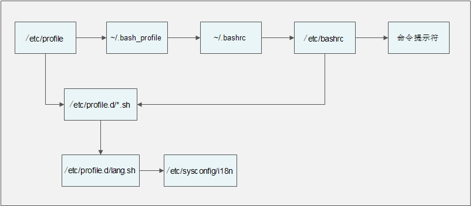

# 1 source 命令

```
[root@localhost ~]# source 配置文件
或
[root@localhost ~]# . 配置文件
```

# 2 环境变量配置文件

## 1）、 登录时生效的环境变量配置文件

在 Linux 系统登录时主要生效的环境变量配置文件有以下五个：

```
 /etc/profile
 /etc/profile.d/.sh
 ~/.bash_profile
 ~/.bashrc
 /etc/bashrc
```

环境变量配置文件调用过程



-  在用户登录过程先调用/etc/profile 文件，在这个环境变量配置文件中会定义这些默认环境变量：

-  USER 变量：根据登录的用户，给这个变量赋值（就是让 USER 变量的值是当前用户）。

-  LOGNAME 变量：根据 USER 变量的值，给这个变量赋值。

-  MAIL 变量：根据登录的用户，定义用户的邮箱为/var/spool/mail/用户名。

-  PATH 变量：根据登录用户的 UID 是否为 0，判断 PATH 变量是否包含/sbin、/usr/sbin和/usr/local/sbin 这三个系统命令目录。

-  HOSTNAME 变量：更加主机名，给这个变量赋值。

-  HISTSIZE 变量：定义历史命令的保存条数。

-  umask：定义 umask 默认权限。注意/etc/profile 文件中的 umask 权限是在“有用户登录过程（也就是输入了用户名和密码）”时才会效。

-  调用/etc/profile.d/*.sh 文件，也就是调用/etc/profile.d/目录下所有以.sh 结尾的文件。

-  由/etc/profile 文件调用/etc/profile.d/**.sh **文件这个目录中所有以.sh 结尾的文件都会被/etc/profile 文件调用，这里最常用的就是lang.sh      文件，而这个文件又会调用/etc/sysconfig/i18n 文件。/etc/sysconfig/i18n 这个文件眼熟吗？就是我们前面讲过的默认语系配置文件啊。

-  由/etc/profile 文件调用~/.bash_profile 文件~/.bash_profile 文件就没有那么复杂了，这个文件主要实现了两个功能：

-  调用了~/.bashrc 文件。

-  在 PATH 变量后面加入了“:$HOME/bin”这个目录。那也就是说，如果我们在自己的家目录中建立 bin 目录，然后把自己的脚本放入“~/bin”目录，就可以直接执行脚本，而不用通过目录执行了。

-  由~/.bash_profile 文件调用~/.bashrc 文件，在~/.bashrc 文件中主要实现了：

-  定义默认别名，所以超哥把自己定义的别名也放入了这个文件。

-  调用/etc/bashrc

-  由~/.bashrc 调用了/etc/bashrc 文件在/etc/bashrc 文件中主要定义了这些内容：

-  PS1 变量：也就是用户的提示符，如果我们想要永久修改提示符，就要在这个文件中修改

-  umask：定义 umask 默认权限。这个文件中定义的 umask 是针对“没有登录过程（也就是不需要输入用户名和密码时，比如从一个终端切换到另一个终端，或进入子 Shell）”时生效的。如果是“有用户登录过程”，则是/etc/profile 文件中的 umask 生效。

-  PATH 变量：会给 PATH 变量追加值，当然也是在“没有登录过程”时才生效。

-  调用/etc/profile.d/.sh 文件，这也是在“没有用户登录过程”是才调用。在“有用户登录过程”时，/etc/profile.d/*.sh 文件已经被/etc/profile 文件调用过了。

这样这五个环境变量配置文件会被依次调用，那么如果是我们自己定义的环境变量应该放入哪个

文件呢？如果你的修改是打算对所有用户生效的，那么可以放入/etc/profile 环境变量配置文件；如

果你的修改只是给自己使用的，那么可以放入~/.bash_profile 或~/.bashrc 这两个配置文件中的任一个。

可是如果我们误删除了这些环境变量，比如删除了/etc/bashrc 文件，或删除了~/.bashrc 文件，

那么这些文件中配置就会失效（~/.bashrc 文件会调用/etc/bashrc 文件）。那么我们的提示符就会

变成：

-bash-4.1#

## 2）、 注销时生效的环境变量配置文件

在用户退出登录时，只会调用一个环境变量配置文件，就是~/.bash_logout。这个文件默认没有

写入任何内容，可是如果我们希望再退出登录时执行一些操作，比如清除历史命令，备份某些数据，

就可以把命令写入这个文件。

## 3）、 其他配置文件

还有一些环节变量配置文件，最常见的就是~/bash_history 文件，也就是历史命令保存文件。这

个文件已经讲过了，这里我们只是把它归入环境变量配置文件小节而已。

# 3 Shell 登录信息

## 1)、 /etc/issue

我们在登录tty1-tty6这六个本地终端时，会有几行的欢迎界面。这些欢迎信息是保存在哪里的？

可以修改吗？当然可以修改，这些欢迎信息是保存在/etc/issue 文件中，我们查看下这个文件：

```
[root@localhost ~]# cat /etc/issue
CentOS release 6.8 (Final)
Kernel \r on an \m
```

可以支持的转义符我们可以通过 man agetty 命令查询，在表中我们列出常见的转义符作用：

```
转义符 	    作 用
\d         显示当前系统日期
\s         显示操作系统名称
\l         显示登录的终端号，这个比较常用。
\m         显示硬件体系结构，如 i386、i686 等
\n         显示主机名
\o         显示域名
\r         显示内核版本
\t         显示当前系统时间
\u         显示当前登录用户的序列号
```

## 2)、 /etc/issue.net

/etc/issue 

远程登录）需要显示欢迎信息，则需要配置/etc/issue.net 这个文件了。使用这个文件时由两点需要

注意：

-  首先，在/etc/issue 文件中支持的转义符，在/etc/issue.net 文件中不能使用。

-  其次，ssh 远程登录是否显示/etc/issue.net 文件中的欢迎信息，是由 ssh 的配置文件决定的。

如果我们需要 ssh 远程登录可以查看/etc/issue.net 的欢迎信息，那么首先需要修改 ssh 的配置

```
文件/etc/ssh/sshd_config，加入如下内容：
[root@localhost ~]# cat /etc/ssh/sshd_config
…省略部分输出…
no default banner path
#Banner none
Banner /etc/issue.net
…省略部分输出…
```

这样在 ssh 远程登录时，也可以显示欢迎信息，只是不再可以识别“\d”和“\l”等信息了

## 3)、 /etc/motd

/etc/motd文件中也是显示欢迎信息的，这个文件和/etc/issue及/etc/issue.net文件的区别是：

/etc/issue 及/etc/issue.net 是在用户登录之前显示欢迎信息，而/etc/motd 是在用户输入用户名和

密码，正确登录之后显示欢迎信息。在/etc/motd 文件中的欢迎信息，不论是本地登录，还是远程登

录都可以显示。

# 4 定义 Bash 快捷键

```
[root@localhost ~]# stty -a
#查询所有的快捷键
```

那么这些快捷键可以更改吗？可以啊，只要执行：

```
[root@localhost ~]# stty 关键字 快捷键
例如：
[root@localhost ~]# stty intr ^p
#定义 ctrl+p 快捷键为强制终止，“^”字符只要手工输入即可
[root@localhost ~]# stty -a
speed 38400 baud; rows 21; columns 104; line = 0;
intr = ^P; quit = ^; erase = ^?; kill = ^U; eof = ^D; eol = <undef>; eol2 = <undef>; swtch
= <undef>;
start = ^Q; stop = ^S; susp = ^Z; rprnt = ^R; werase = ^W; lnext = ^V; flush = ^O; min =
1; time = 0;
#强制终止变成了 ctrl+p 快捷键
```