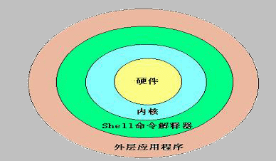

# 1、什么是shell？




# 2、shell 的分类


| Shell的分类 | 易学性 | 可移植性 | 编程性 | 快捷性 |
| - | - | - | - | - |
| Bourne Shell (sh） | 容易 | 好 | 较差 | 较差 |
| Korn Shell(ksh) | 较难 | 较好 | 好 | 较好 |
| Bourne Again(Bash) | 难 | 较好 | 好 | 好 |
| POSIX Shell（psh) | 较难 | 好 | 好 | 较好 |
| C Shell（csh) | 较难 | 差 | 较好 | 较好 |
| TC Shell（tcsh) | 难 | 差 | 好 | 好 |


Shell 的两种主要语法类型有 Bourne 和 C，这两种语法彼此不兼容。Bourne 家族主要包括 sh、


ksh、Bash、psh、zsh；C 家族主要包括：csh、tcsh （Bash 和 zsh 在不同程度上支持 csh 的语法）。


我们可以通过/etc/shells 文件来查询 Linux 支持的 Shell。命令如下：


```javascript
[root@localhost ~]# vi /etc/shells
/bin/sh
/bin/Bash
/sbin/nologin
/bin/tcsh
/bin/csh
```

