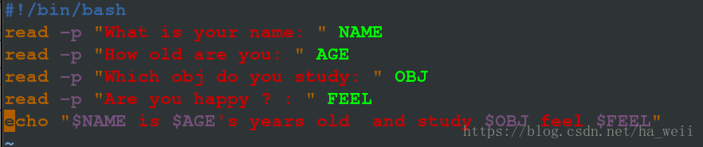
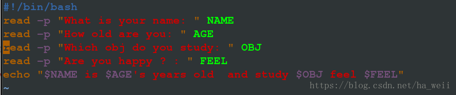
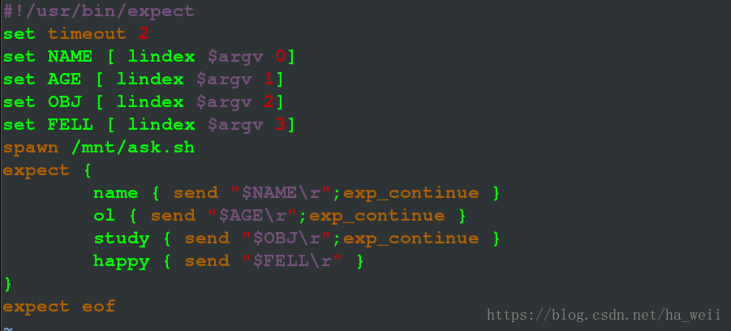
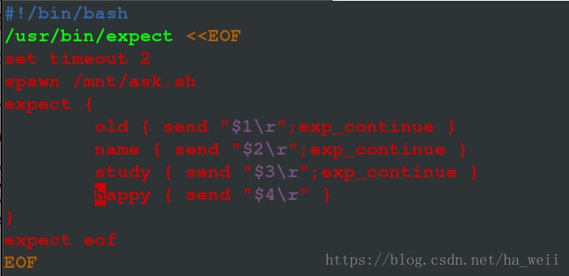
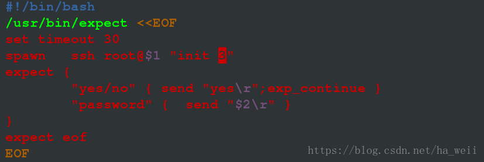
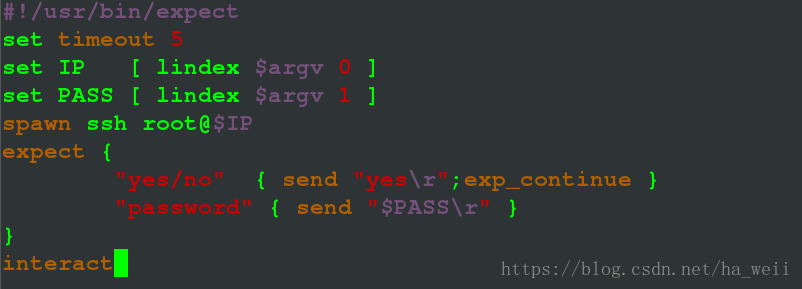
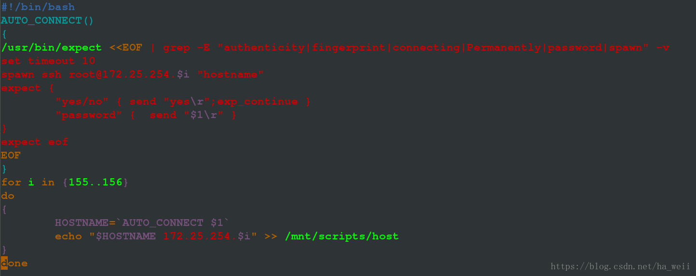
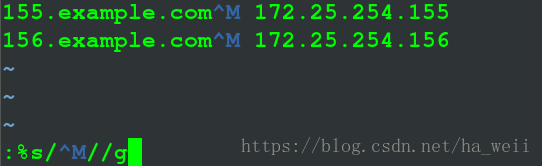

# 1，概述

- expect 是自动应答命令，用于交互式命令的自动执行

- spawn 是 expect 中的监控程序,运行后会监控命令提出的交互问题

- send发送问题答案给交互命令

- "\r"表示回车

- exp_continue 表示当问题不存在时继续回答下面的问题

- expect eof 表示问题回答完毕退出 expect 环境

- interact  表示问题回答完毕留在交互界面 这个一般用在ssh连接里面，自动连接上了可以保持ssh的环境

- set NAME [ lindex $argv n ] 定义变量 n从0开始，set NAME [ lindex $argv 0 ] 和脚本里面$1类似

注意：

- 1，使用expect时要下载工具yum install expect.x86_64

- 2，expect不是脚本，不能使用脚本的那些命令

- 3，使用expect的文件后缀为.exp，幻数为#!/usr/bin/expect ，用expect而不是sh调用

- 4，如果.exp文件里面调用了.sh脚本，注意给脚本可执行权限

- 5，expect {   } 里面的关键字只要不重复九行，但是顺序不能变，因为每一个关键字对应一个答案，每一个答案对应一个问题。

# 2，shell编程

示例；建立ask.sh问题脚本，answer.exp自动应答，答案已知



```
[root@localhost mnt]# sh ask.sh
What is your name: minz
How old are you: 6
Which obj do you study: linux
Are you happy ? : happy
minz is 6's years old  and study linux feel happy
```

```
#!/usr/bin/expect                     注意幻数
#####这一行也可以设定等待时间如果执行错误，等待多长时间set timeout 2 等待2秒
spawn /mnt/ask.sh                     spawn是监控程序，监控/mnt/ask.sh执行之后的交互问题
expect {                              注意变量的定义方法
name { send "minz\r";exp_continue }       name是关键字，就是第一个问题what is your name的一个关键字
换成其他的也行，只要不和下面的重复，minz就是这个问题的答案，\r就是敲回车，由于下面还有问题需要回答，所以执行exp_continue
old { send "6\r";exp_continue }
study { send "linux\r";exp_continue }
happy { send "happy\r" }          happy是Are you happy? 问题的关键字，happy是问题的答案，由于问题到此结束，所以不用写exp_continue
}
expect eof     表示回答完毕问题，退出expect环境
```

测试：

```
[root@localhost mnt]# chmod +x /mnt/ask.sh   ###调用了脚本，所以要加上可执行权限
[root@localhost mnt]# expect answer.exp      ###注意是expect调用.exp文件
spawn /mnt/ask.sh
What is your name: minz
How old are you: 6
Which obj do you study: linux
Are you happy ? : happy
minz is 6's years old  and study linux feel happy ###自动应答生效
```

成功！！！

示例：示例；建立ask.sh问题脚本，answer.exp自动应答，答案跟在.exp后面





注意：1，调用的脚本要加上可执行权限！！！

2，set NAME [ lindex $argv 0]  表示把.exp之后的第一个参数给NAME这个值，set AGE [ lindex $argv 1]   表示把.exp之后的第二个参数给AGE这个值

3，name { send "$NAME\r";exp_continue }  这里$NAME是调用NAME这个参数的值，与脚本里面用法类似，表示把NAME这个值作为答案给关键字是name的这个问题

测试：

```
[root@localhost mnt]# expect answer.exp   不加任何参数
spawn /mnt/ask.sh
What is your name:
How old are you:
Which obj do you study:
Are you happy ? :
is 's years old  and study  feel
[root@localhost mnt]# expect answer.exp haha 1 html sad   带上参数
spawn /mnt/ask.sh
What is your name: haha
How old are you: 1
Which obj do you study: html
Are you happy ? : sad
haha is 1's years old  and study html feel sad
```

示例：在上一个问题的基础上，把.exp文件改为.sh文件，并且可以执行（用EOF导入）

修改幻数 > EOF标准输入重定向 >  修改后缀 > 删除expect变量 > 修改变量



测试：

```
[root@localhost mnt]# mv answer.exp answer.sh    修改后缀
[root@localhost mnt]# sh answer.sh   不带参数
spawn /mnt/ask.sh
What is your name:
How old are you:
Which obj do you study:
Are you happy ? :
is 's years old  and study  feel
[root@localhost mnt]# sh answer.sh tom 2 java bad  带参数
spawn /mnt/ask.sh
What is your name: 2
How old are you: tom
Which obj do you study: java
Are you happy ? : bad
2 is tom's years old  and study java feel bad
```

成功！！！

示例：写一个auto_connect.sh，要求脚本后面跟ip 和 密码，登陆该主机



注意：1，这两个关键字中“yes/no”是当我们第一次连接别的主机时，~/.ssh/known_hosts没有记录信息，所以会询问，这个一定要写上，我们第二次连接时，虽然不用输入yes，写上不影响第二次连接的使用

2，set timeout 30 是延长等待时间，如果不写这个，连接时间如果稍长，就会误以为失败。

3，init 3是为了进入文本编辑模式，因为这个脚本无论是expect eof 还是interect执行脚本之后，都无法在连接的主机上面执行命令，会卡住，Iinit 3只是为了证明登陆成功，也可以输入hostname，显示值。

测试：

```
[root@localhost scripts]# sh auto_connect.sh 172.25.254.156 redhat
spawn ssh root@172.25.254.156
root@172.25.254.156's password:
Last login: Sun Jun 24 21:26:36 2018 from www.westos.com
[root@156 ~]#     ###此时执行命令会卡住
```

拓展：



注意：1，这个文件以.exp结尾，不是脚本，但是如果是interact模式，那么登陆上可以执行命令，expect eof模式下则会卡住

2，注意以expect调用

测试

```
[root@localhost scripts]# expect auto_connect.exp 172.25.254.156 redhat
spawn ssh root@172.25.254.156
root@172.25.254.156's password:
Last login: Sun Jun 24 21:38:59 2018 from www.westos.com
[root@156 ~]# ls        ###可以执行命令
anaconda-ks.cfg  Downloads                   gropu  Pictures  rht-ks-post.log  Templates
Desktop          file                        group  PM        rht-ks-pre.log   Videos
Documents        foundation-config-post.log  Music  Public    software
```

示例：写一个脚本，导出指定主机的域名和ip（已知密码，主机ssh都可访问）



注意：1，做过滤时在<<EOF后面做也行，HOSTNAME=AUTO_CONNECT $1后面也行

2，在linux系统中，文字换行默认加\n  在windows中，文字换行默认加\n\r   在unix系统中，文字换行默认加\r

由于grep是unix中的命令，所以会加\r，用sh -x auto_connect.sh redha  可以看见每行后面都加了\r

测试：

```
[root@example100 scripts]# sh -x auto_connect.sh redhat
for i in '{155..156}'
++ AUTO_CONNECT redhat
++ grep -E 'authenticity|fingerprint|connecting|Permanently|password|spawn' -v
++ /usr/bin/expect
HOSTNAME=$'155.example.com\r'      #####这里被加上了\r
172.25.254.155'ple.com
for i in '{155..156}'
++ AUTO_CONNECT redhat
++ /usr/bin/expect
++ grep -E 'authenticity|fingerprint|connecting|Permanently|password|spawn' -v
HOSTNAME=$'156.example.com\r'      #####这里被加上了\r
172.25.254.156'ple.com
[root@example100 scripts]# cat /mnt/scripts/host
172.25.254.155
172.25.254.156
```

注意：这里虽然采集到了，看起来只有ip，没有域名，但是vim查看



需要进行后期全局替换处理，ctrl+v ctrl+m =^M

！！！直接在脚本中修改，写入全局替换


再次测试：

```
[root@example100 scripts]# > /mnt/scripts/host
[root@example100 scripts]# sh auto_connect.sh redhat
[root@example100 scripts]# cat /mnt/scripts/host
155.example.com 172.25.254.155
156.example.com 172.25.254.156
```

成功！！！