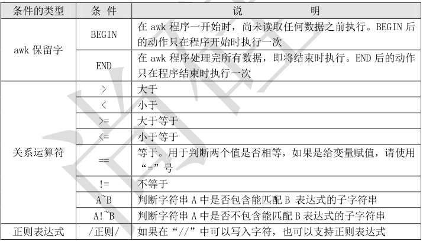
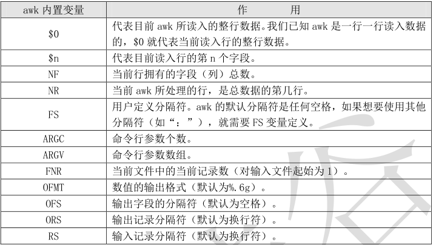

# **1、awk 的基本用法**

-  

```javascript
[root@localhost ~]# awk ‘条件 1{动作 1} 条件 2{动作 2}…’ 文件名
条件（Pattern）：
一般使用关系表达式作为条件。这些关系表达式非常多，具体参考表 12-3 所示，例如：
x > 10 判断变量 x 是否大于 10
x == y 判断变量 x 是否等于变量 y
A ~ B 判断字符串 A 中是否包含能匹配 B 表达式的子字符串
A !~ B 判断字符串 A 中是否不包含能匹配 B 表达式的子字符串
动作（Action）：
格式化输出
流程控制语句
```

- ** cat  test1**

```javascript
[root@bogon ~]# cat test1
ID	Name	PHP	Linux	MySql	Average
1	Lg	82	95	86	87.66
2	Sc	74	96	87	85.88
3	TG	99	83	93	91.66
```

- **awk '{ print $2 "\t" $6}'  test1**

```javascript
[root@bogon ~]#  awk '{ print $2 "\t" $6}'  test1
Name	Average
Lg	    87.66
Sc	    85.88
TG	    91.66

```

# **2、awk的条件**



## ** 1）BEGIN
**

BEGIN 是 awk 的保留字，是一种特殊的条件类型。BEGIN 的执行时机是“在 awk 程序一开始时，

尚未读取任何数据之前执行”。一旦 BEGIN 后的动作执行一次，当 awk 开始从文件中读入数据，BEGIN

的条件就不再成立，所以 BEGIN 定义的动作只能被执行一次。例如：

```javascript
[root@localhost ~]# awk 'BEGIN{printf "This is a transcript \n" }
{printf $2 "\t" $6 "\n"}' student.txt
#awk 命令只要检测不到完整的单引号不会执行，所以这个命令的换行不用加入“\”,就是一行命令
#这里定义了两个动作
#第一个动作使用 BEGIN 条件，所以会在读入文件数据前打印“这是一张成绩单”（只会执行一次）

#第二个动作会打印文件的第二字段和第六字段
```

## **2） END
**

END 也是 awk 保留字，不过刚好和 BEGIN 相反。END 是在 awk 程序处理完所有数据，即将结束时

执行。END 后的动作只在程序结束时执行一次。例如：

```javascript
[root@localhost ~]# awk 'END{printf "The End \n" }
{printf $2 "\t" $6 "\n"}' student.txt
#在输出结尾输入“The End”，这并不是文档本身的内容，而且只会执行一次
```

## ** 3）关系运算符
**

举几个例子看看关系运算符。假设我想看看平均成绩大于等于 87 分的学员是谁，就可以这样输

入命令：

例子 1：

```javascript
[root@localhost ~]# cat student.txt | grep -v Name | \
awk '$6 >= 87 {printf $2 "\n" }'
#使用 cat 输出文件内容，用 grep 取反包含“Name”的行
#判断第六字段（平均成绩）大于等于 87 分的行，如果判断式成立，则打第六列（学员名）
```

## **4）加入了条件之后，只有条件成立动作才会执行，如果条件不满足，则动作则不运行。**

通过这个实
验，大家可以发现，虽然 awk 是列提取命令，但是也要按行来读入的。这个命令的执行过程是这样的：

- 1） 如果有 BEGIN 条件，则先执行 BEGIN 定义的动作

- 2） 如果没有 BEGIN 条件，则读入第一行，把第一行的数据依次赋予$0、$1、$2 等变量。其中$0

代表此行的整体数据，$1 代表第一字段，$2 代表第二字段。

- 2） 依据条件类型判断动作是否执行。如果条件符合，则执行动作，否则读入下一行数据。如果

没有条件，则每行都执行动作。

- 3） 读入下一行数据，重复执行以上步骤。

再举个例子，如果我想看看 Sc 用户的平均成绩呢：

例子 2：

```javascript
[root@localhost ~]# awk '$2 ~ /Sc/ {printf $6 "\n"}' student.txt
#如果第二字段中输入包含有“Sc”字符，则打印第六字段数据
85.66
```

这里要注意在 awk 中，使用“//”包含的字符串，awk 命令才会查找。也就是说字符串必须用“//”

包含，awk 命令才能正确识别。

## **5）正则表达式
**

如果要想让 awk 识别字符串，必须使用“//”包含，例如：

例子 1：

```javascript
[root@localhost ~]# awk '/Liming/ {print}' student.txt
#打印 Liming 的成绩
```

当使用 df 命令查看分区使用情况是，如果我只想查看真正的系统分区的使用状况，而不想查看

光盘和临时分区的使用状况，则可以：

例子 2：

```javascript
[root@localhost ~]# df -h | awk '/sda[0-9]/ {printf $1 "\t" $5 "\n"} '
#查询包含有 sda 数字的行，并打印第一字段和第五字段
```

# **3、awk内置变量**



- 

```javascript
[root@localhost ~]# cat /etc/passwd | grep "/bin/bash" | \
awk '{FS=":"} {printf $1 "\t" $3 "\n"}'
#查询可以登录的用户的用户名和 UID
```

这里“：”分隔符生效了，可是第一行却没有起作用，原来我们忘记了“BEGIN”条件，那么再

来试试：

```javascript
[root@localhost ~]# cat /etc/passwd | grep "/bin/bash" | \
awk 'BEGIN {FS=":"} {printf $1 "\t" $3 "\n"}'
[root@localhost ~]# cat /etc/passwd | grep "/bin/bash" | \
awk 'BEGIN {FS=":"} {printf $1 "\t" $3 "\t 行号：" NR "\t 字段数：" NF "\n"}'
#解释下 awk 命令
#开始执行{分隔符是“：”} {输出第一字段和第三字段 输出行号（NR 值） 字段数（NF 值）}
root 0 行号：1 字段数：7
user1 501 行号：2 字段数：7
```

如果我只想看看 sshd 这个伪用户的相关信息，则可以这样使用：

```javascript
[root@localhost ~]# cat /etc/passwd | \
awk 'BEGIN {FS=":"} $1=="sshd" {printf $1 "\t" $3 "\t 行号："NR "\t 字 段数："F "\n"}'
#可以看到 sshd 伪用户的 UID 是 74，是/etc/passwd 文件的第 28 行，此行有 7 个字段
```

# **4、 awk 流程控制
**

我们再来利用下 student.txt 文件做个练习，后面的使用比较复杂，我们再看看这个文件的内容：

```javascript
[root@localhost ~]# cat student.txt
ID Name PHP Linux MySQL Average
1 Liming 82 95 86 87.66

2 Sc 74 96 87 85.66
3 Tg 99 83 93 91.66
```

我们先来看看该如何在 awk 中定义变量与调用变量的值。假设我想统计 PHP 成绩的总分，那么就

应该这样：

```javascript
[root@localhost ~]# awk 'NR==2{php1=$3}
NR==3{php2=$3}
NR==4{php3=$3;totle=php1+php2+php3;print "totle php is " totle}' student.txt
#统计 PHP 成绩的总分
```

我们解释下这个命令。“NR==2{php1=$3}”（条件是 NR==2，动作是 php1=$3）这句话是指如果
输入数据是第二行（第一行是标题行），就把第二行的第三字段的值赋予变量“php1”。
“NR==3{php2=$3}”这句话是指如果输入数据是第三行，就把第三行的第三字段的值赋予变量“php2”。
“NR==4{php3=$3;totle=php1+php2+php3;print "totle php is " totle}”（“NR==4”是条件，后
面{}中的都是动作）这句话是指如果输入数据是第四行，就把第四行的第三字段的值赋予变量“php3”；
然后定义变量 totle 的值是“php1+php2+php3”；然后输出“totle php is”关键字，后面加变量 totle
的值。
在 awk 编程中，因为命令语句非常长，在输入格式时需要注意以下内容：

-  多个条件{动作}可以用空格分割，也可以用回车分割。

-  在一个动作中，如果需要执行多个命令，需要用“；”分割，或用回车分割。

-  在 awk 中，变量的赋值与调用都不需要加入“$”符。

-  条件中判断两个值是否相同，请使用“==”，以便和变量赋值进行区分。

- ~ 正则匹配：awk '$2~ "hello" {print $2}'

在看看该如何实现流程控制，假设如果 Linux 成绩大于 90，就是一个好男人（学 PHP 的表示压力

很大！）：

```javascript
[root@localhost ~]# awk '{if (NR>=2)
{if ($4>90) printf $2 " is a good man!\n"}}' student.txt
#程序中有两个 if 判断，第一个判断行号大于 2，第二个判断 Linux 成绩大于 90 分
Liming is a good man!
Sc is a good man!
```

其实在 awk 中 if 判断语句，完全可以直接利用 awk 自带的条件来取代，刚刚的脚本可以改写成

这样：

```javascript
[root@localhost ~]# awk ' NR>=2 {test=$4}
test>90 {printf $2 " is a good man!\n"}' student.txt
#先判断行号如果大于 2，就把第四字段赋予变量 test
#在判断如果 test 的值大于 90 分，就打印好男人
Liming is a good man!
Sc is a good man!
```

# **5****、 awk 函数
**

- 

- awk 编程也允许在编程时使用函数，在本小节我们讲讲 awk 的自定义函数。awk 函数的定义方法

如下：

```javascript
function 函数名（参数列表）{
函数体
}
```

- 

- 我们定义一个简单的函数，使用函数来打印 student.txt 的学员姓名和平均成绩，应该这样来写



函数：

```javascript
[root@localhost ~]# awk 'function test(a,b) { printf a "\t" b "\n" }'
#定义函数 test，包含两个参数，函数体的内容是输出这两个参数的值
{ test($2,$6) } ' student.txt
#调用函数 test，并向两个参数传递值。
Name   Average
Liming 87.66
Sc     85.66
Tg     91.66
```

# **6、 awk 中调用脚本
**

对于小的单行程序来说，将脚本作为命令行自变量传递给 awk 是非常简单的，而对于多行程序就

比较难处理。当程序是多行的时候，使用外部脚本是很适合的。首先在外部文件中写好脚本，然后可

以使用 awk 的-f 选项，使其读入脚本并且执行。

例如，我们可以先编写一个 awk 脚本：

```javascript
[root@localhost ~]# vi pass.awk
BEGIN {FS=":"}
{ print $1 "\t" $3}
然后可以使用“-f”选项来调用这个脚本：
[root@localhost ~]# awk -f pass.awk /etc/passwd
root 0
bin 1
daemon 2
…省略部分输出…
```