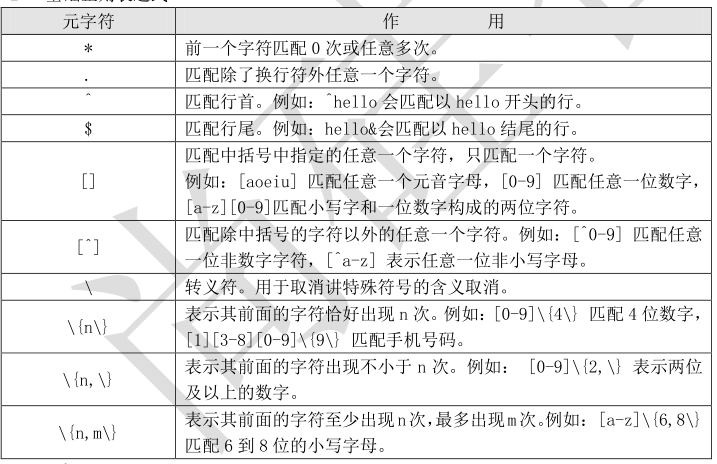
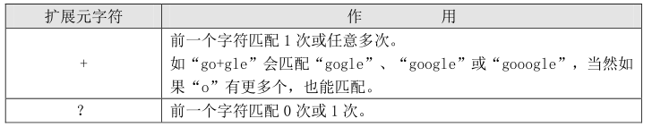
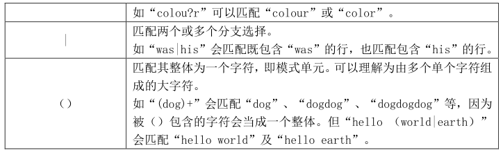

# **1、基础正则**

# **
**

还记得我们在上一章说过正则表达式和通配符的区别（正则表达式用来在文件中匹配符合条件的
字符串，通配符用来匹配符合条件的文件名）吗？其实这种区别只在 Shell 当中适用，因为用来在文
件当中搜索字符串的命令，如 grep、awk、sed 等命令可以支持正则表达式，而在系统当中搜索文件
的命令，如 ls、find、cp 这些命令不支持正则表达式，所以只能使用 shell 自己的通配符来进行匹
配了。



## **1）、 练习文件建立
**

```javascript
[root@localhost ~]# vi test_rule.txt
Mr. Li Ming said:
he was the most honest man.
123despise him.

But since Mr. shen Chao came,
he never saaaid those words.
5555nice!
because,actuaaaally,
Mr. Shen Chao is the most honest man
Later,Mr. Li ming soid his hot body.
```

## **2）、 “*”前一个字符匹配 0 次，或任意多次**

- **
**

```javascript
[root@localhost ~]# grep "a*" test_rule.txt
Mr. Li Ming said:
he was the most honest man.
123despise him.
But since Mr. shen Chao came,
he never saaaid those words.
5555nice!
because,actuaaaally,
Mr. Shen Chao is the most honest man
Later,Mr. Li ming soid his hot body.
```

- 如果这样写正则表达式“aa*”代表这行字符串一定要有一个 a，但是后面有没有 a 都可以。也就是说
会匹配至少包含有一个 a 的行：

```javascript
[root@localhost ~]# grep "aa*" test_rule.txt
Mr. Li Ming sa aid:
he wa as the most honest ma an.
But since Mr. shen Cha ao ca ame,
he never s aaaid those words.
beca ause,actu aaaally,
Mr. Shen Cha ao is the most honest ma an
La ater,Mr. Li ming soid his hot body
```

- 如果正则表达式是“aaa*”，则会匹配最少包含两个连续 a 的字符串，如：

```javascript
[root@localhost ~]# grep "aaa*" test_rule.txt
he never s aaaid those words.
because,actu aaaally,
如果正则表达式是“aaaaa*”，则会匹配最少包含四个个连续 a 的字符串，如：
[root@localhost ~]# grep "aaaaa*" test_rule.txt
because,actuaaaally,
```

- 当然如果再多写一个 a，如“aaaaaa*”就不能从这篇文档中匹配任何内容了，因为我们这篇文档
中 a 最多的单词“actuaaaally”只有四个个连续的 a，而“aaaaaa*”会匹配最少五个连续的 a。



## **3）、 “.” 匹配除了换行符外任意一个字符
**

```javascript
正则表达式“.”只能匹配一个字符，这个字符可以是任意字符，举个例子：
[root@localhost ~]# grep "s..d" test_rule.txt
Mr. Li Ming said:
Later,Mr. Li ming soid his hot body.
#“s..d”会匹配在 s 和 d 这两个字母之间一定有两个字符的单词
[root@localhost ~]# grep "s.*d" test_rule.txt
Mr. Li Ming said:
he never saaaid those words.
Later,Mr. Li ming soid his hot body.
#最后一句话比较有意思，匹配的是“ soid his hot bod”
[root@localhost ~]# grep ".*" test_rule.txt
```

## **4)、 “^”匹配行首，“$”匹配行尾
**

“^”代表匹配行首，比如“^M”会匹配以大写“M”开头的行：

```javascript
[root@localhost ~]# grep "^M" test_rule.txt
M Mr. Li Ming said:
M Mr. Shen Chao is the most honest man
“$”代表匹配行尾，如果“n$”会匹配以小写“n”结尾的行：
[root@localhost ~]# grep "n$" test_rule.txt
Mr. Shen Chao is the most honest man
而“^$”则会匹配空白行：
[root@localhost ~]# grep -n "^$" test_rule.txt
```

## **5）、 “[]” 匹配中括号中指定的任意一个字符，只匹配一个字符
**

“[]”会匹配中括号中指定任意一个字符，注意只能匹配一个字符。比如[ao]要不会匹配一个 a
字符，要不会匹配一个 o 字符：

```javascript
[root@localhost ~]# grep "s[ao]id" test_rule.txt
```

而“[0-9]”会匹配任意一个数字，如：

```javascript
[root@localhost ~]# grep "[0-9]" test_rule.txt
```

而“[A-Z]”则会匹配一个大写字母，如：

```javascript
[root@localhost ~]# grep "[A-Z]" test_rule.txt
```

如果正则是“^[a-z]”代表匹配用小写字母开头的行：

```javascript
[root@localhost ~]# grep "^[a-z]" test_rule.txt
```

## **6）“[^]” 匹配除中括号的字符以外的任意一个字符
**

```
[root@localhost ~]# grep "^[^a-z]" test_rule.txt
```

而“^[^a-zA-Z]”则会匹配不用字母开头的行：

[root@localhost ~]# grep "^[^a-zA-Z]" test_rule.txt



## **7）、 “\” 转义符
**

```
[root@localhost ~]# grep "\.$" test_rule.txt
```

## **8）、 “\{n\}”表示其前面的字符恰好出现 n 次
**

```
[root@localhost ~]# grep "a\{3\}" test_rule.txt
```

上面的两行都包含三个连续的 a，所以都会匹配。但是如果先要只显示三个连续的 a，可以这样

来写正则：

```
[root@localhost ~]# grep "[su]a\{3\}[il]" test_rule.txt
```

如果正则是“[0-9]\{3\}”则会匹配包含连续的三个数字的字符串：

```
[root@localhost ~]# grep "[0-9]\{3\}" test_rule.txt
```

虽然“5555”有四个连续的数字，但是包含三个连续的数字，所以也是可以列出的。可是这样不
能体现出来“[0-9]\{3\}”只能匹配三个连续的数字，而不能匹配四个连续的数字。那么正则就应该
这样来写“^[0-9]\{3\}[a-z]”:

```javascript
[root@localhost ~]# grep "^[0-9]\{3\}[a-z]" test_rule.txt
1 1 23despise him.
#只匹配用连续三个数字开头的行
```

## **9）、 “\{n,\}”表示其前面的字符出现不小于 n 次
**

“\{n,\}”会匹配前面的字符出现最少 n 次。比如“zo\{3,\}m”这个正则就会匹配用 z 开头，m
结尾，中间最少有三个 o 的字符串。那么“^[0-9]\{3,\}[a-z]”这个正则就能匹配最少用连续三个
数字开头的字符串：

```
[root@localhost ~]# grep "^[0-9]\{3,\}[a-z]" test_rule.txt
```

而“[su]a\{3，\}[il]”正则则会匹配在字母 s 或 u 和 i 或 l 之间，最少出现三个连续的 a 的字
符串：

```javascript
[root@localhost ~]# grep "[su]a\{3,\}[il]" test_rule.txt
10）“\{n,m\}”匹配其前面的字符至少出现 n 次，最多出现 m 次
[root@localhost ~]# grep "sa\{1,3\}i" test_rule.txt
#匹配在字母 s 和字母 i 之间有最少一个 a，最多三个 a
[root@localhost ~]# grep "sa\{2,3\}i" test_rule.txt
#匹配在字母 s 和字母 i 之间有最少两个 a，最多三个 a
```

# **2、扩展正则**

熟悉正则表达式的童鞋应该很疑惑，在正则表达式中应该还可以支持一些元字符，比如“+”“？”
，“|”，“（）”。其实 Linux 是支持这些元字符的，只是 grep 命令默认不支持而已。如果要想支持这
些元字符，必须使用 egrep 命令或 grep -E 选项，所以我们又把这些元字符称作扩展元字符。
如果查询 grep 的帮助，对 egrep 的说明就是和 grep -E 选项一样的命令，所以我们可以把两个
命令当做别名来对待。通过表 12-2 来看看 Shell 中支持的扩展元字符：



